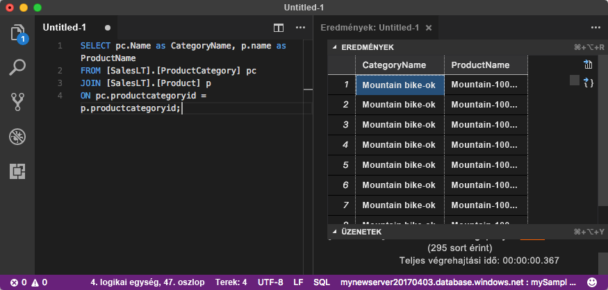

# <a name="quickstart-use-visual-studio-code-to-connect-and-query-an-azure-sql-database"></a>Gyors útmutató: A Visual Studio Code használatával csatlakozhat, és Azure SQL Database-adatbázis lekérdezéséhez

[A Visual Studio Code](https://code.visualstudio.com/docs) van egy grafikus Kódszerkesztő Linux, macOS és Windows. Támogatja a bővítményeket, beleértve a [mssql bővítményt](https://aka.ms/mssql-marketplace) a Microsoft SQL Server, az Azure SQL Database és az SQL Data Warehouse lekérdezéséhez. Ez a rövid útmutató bemutatja a Visual Studio Code egy Azure SQL Database-adatbázishoz csatlakozhat, és futtassa a Transact-SQL-utasítások használatával lekérdezni, beszúrni, frissítése és adatok törlése.

## <a name="prerequisites"></a>Előfeltételek

Az oktatóanyag elvégzéséhez a következőkre lesz szüksége:

[!INCLUDE [prerequisites-create-db](../../includes/sql-database-connect-query-prerequisites-create-db-includes.md)]

#### <a name="install-visual-studio-code"></a>A Visual Studio Code telepítése

Győződjön meg arról, hogy telepítette a legújabb [Visual Studio Code](https://code.visualstudio.com/Download) és betölti a [mssql bővítményt](https://aka.ms/mssql-marketplace). Az mssql bővítmény telepítésével kapcsolatos útmutatásért lásd: [VS Code telepítését](https://docs.microsoft.com/sql/linux/sql-server-linux-develop-use-vscode#install-vs-code) és [a Visual Studio Code mssql ](https://marketplace.visualstudio.com/items?itemName=ms-mssql.mssql). 

## <a name="configure-visual-studio-code"></a>A Visual Studio Code konfigurálása 

### <a name="mac-os"></a>**Mac OS**
MacOS rendszeren, akkor telepítenie kell OpenSSL, amely előfeltétele a .net Core, hogy mssql bővítményt használ. Nyissa meg a terminált, és adja meg az alábbi parancsokat a **brew** és az **OpenSSL** telepítéséhez. 

```bash
ruby -e "$(curl -fsSL https://raw.githubusercontent.com/Homebrew/install/master/install)"
brew update
brew install openssl
mkdir -p /usr/local/lib
ln -s /usr/local/opt/openssl/lib/libcrypto.1.0.0.dylib /usr/local/lib/
ln -s /usr/local/opt/openssl/lib/libssl.1.0.0.dylib /usr/local/lib/
```

### <a name="linux-ubuntu"></a>**Linux (Ubuntu)**

Nincs szükség különleges konfigurációra.

### <a name="windows"></a>**Windows**

Nincs szükség különleges konfigurációra.

## <a name="sql-server-connection-information"></a>Az SQL-kiszolgáló kapcsolatadatai

[!INCLUDE [prerequisites-server-connection-info](../../includes/sql-database-connect-query-prerequisites-server-connection-info-includes.md)]

## <a name="set-language-mode-to-sql"></a>A nyelvmód SQL értékre állítása

A Visual Studio Code-ban a nyelvmód beállítása **SQL** mssql-parancsok és a T-SQL IntelliSense engedélyezéséhez.

1. Nyisson meg egy új Visual Studio Code-ablakot. 

2. Nyomja meg **CTRL**+**N**. Megnyílik egy új egyszerű szöveges fájlt. 

3. Válassza ki **egyszerű szöveges** az állapotsor jobb alsó sarkában található.

4. Az a **nyelvmód kiválasztása** legördülő menüben, amely megnyílik, válassza ki **SQL**. 

## <a name="connect-to-your-database"></a>Csatlakozás az adatbázishoz

A Visual Studio Code segítségével kapcsolatot hozhat létre az Azure SQL Database-kiszolgálóval.

> [!IMPORTANT]
> A folytatás előtt győződjön meg arról, hogy rendelkezik-e a kiszolgáló és a bejelentkezési adatait, készen áll-e. Ha elkezdi beírni a csatlakozási profil információit, ha módosítja a fókuszt a Visual Studio Code-ból, akkor indítsa újra a profil létrehozásához.
>

1. A Visual Studio Code-ban nyomja le a **Ctrl + Shift + P** (vagy **F1**) a Parancskatalógus megnyitásához.

2. Válassza ki **MS SQL: Csatlakozás** nyomja le az ENTER **Enter**.

3. Válassza ki **kapcsolati profil létrehozása**.

4. Kövesse az utasításokat követve adja meg az új profil kapcsolati tulajdonságait. Egyes értékek kiválasztása után nyomja le az ENTER **Enter** folytatásához. 

   | Tulajdonság       | Ajánlott érték | Leírás |
   | ------------ | ------------------ | ------------------------------------------------- | 
   | **Kiszolgálónév** | A teljes kiszolgálónév | Hasonló: **mynewserver20170313.database.windows.net**. |
   | **Adatbázis neve** | mySampleDatabase | Az adatbázis való csatlakozáshoz. |
   | **Hitelesítés** | SQL-bejelentkezés| Ez az oktatóanyag az SQL-hitelesítést használ. |
   | **Felhasználónév** | Felhasználónév | A kiszolgálói rendszergazdai fiókkal, a kiszolgáló létrehozásához használt felhasználónév. |
   | **Jelszó (SQL-bejelentkezés)** | Jelszó | A kiszolgáló létrehozásához használt, a kiszolgálói rendszergazdai fiók jelszava. |
   | **Menti a jelszót?** | Igen vagy Nem | Válassza ki **Igen** Ha nem szeretné, hogy minden alkalommal, amikor adja meg a jelszót. |
   | **Adja meg a profil kívánt nevét** | Egy profilnév, például **mySampleProfile** | A mentett profil felgyorsítja a csatlakozást a későbbi bejelentkezések során. | 

   Ha ez sikeres, megjelenik egy értesítés, a profil létrehozásáról és arról tájékoztatja.

## <a name="query-data"></a>Adatok lekérdezése

Használja a következő [kiválasztása](https://msdn.microsoft.com/library/ms189499.aspx) kategóriánként az első 20 terméket a lekérdezést Transact-SQL utasítást.

1. A szerkesztő ablakban illessze be a következő SQL-lekérdezést.

   ```sql
   SELECT pc.Name as CategoryName, p.name as ProductName
   FROM [SalesLT].[ProductCategory] pc
   JOIN [SalesLT].[Product] p
   ON pc.productcategoryid = p.productcategoryid;
   ```

2. Nyomja meg **Ctrl**+**Shift**+**E** hajtsa végre a lekérdezést, és az eredményeket megjeleníteni a `Product` és `ProductCategory` táblákat.

    

## <a name="insert-data"></a>Adat beszúrása

Használja a következő [BESZÚRÁSA](https://msdn.microsoft.com/library/ms174335.aspx) Transact-SQL utasítást az új termék hozzáadása a `SalesLT.Product` tábla.

1. Ehhez cserélje le az előző lekérdezést.

   ```sql
   INSERT INTO [SalesLT].[Product]
           ( [Name]
           , [ProductNumber]
           , [Color]
           , [ProductCategoryID]
           , [StandardCost]
           , [ListPrice]
           , [SellStartDate]
           )
     VALUES
           ('myNewProduct'
           ,123456789
           ,'NewColor'
           ,1
           ,100
           ,100
           ,GETDATE() );
   ```

2. Nyomja meg **Ctrl**+**Shift**+**E** az új sor beszúrásához a `Product` tábla.

## <a name="update-data"></a>Adatok frissítése

Használja a következő [frissítése](https://msdn.microsoft.com/library/ms177523.aspx) Transact-SQL utasítást a hozzáadott termék frissítése.

1. Cserélje le az előző lekérdezés erre:

   ```sql
   UPDATE [SalesLT].[Product]
   SET [ListPrice] = 125
   WHERE Name = 'myNewProduct';
   ```

2. Nyomja meg **Ctrl**+**Shift**+**E** egy megadott sorának frissítéséhez a `Product` tábla.

## <a name="delete-data"></a>Adat törlése

Használja a következő [törlése](https://docs.microsoft.com/sql/t-sql/statements/delete-transact-sql) Transact-SQL utasítást az új termék eltávolítása.

1. Cserélje le az előző lekérdezés erre:

   ```sql
   DELETE FROM [SalesLT].[Product]
   WHERE Name = 'myNewProduct';
   ```

2. Nyomja meg **Ctrl**+**Shift**+**E** egy megadott sorának törléséhez a `Product` tábla.

## <a name="next-steps"></a>További lépések

- Csatlakozás és lekérdezés az SQL Server Management Studio használatával: [a rövid útmutató: SQL Server Management Studio használatával csatlakozhat egy Azure SQL Database és a lekérdezés adatokhoz](sql-database-connect-query-ssms.md).
- Csatlakozás és lekérdezés az Azure portal használatával: [a rövid útmutató: Az Azure Portalon az SQL-Lekérdezésszerkesztő használatával csatlakozhat és kérdezhet le adatokat](sql-database-connect-query-portal.md).
- Az MSDN magazin Visual Studio Code használatáról szóló cikkéhez lásd az [Adatbázis IDE létrehozása az MSSQL bővítménnyel blogbejegyzést](https://msdn.microsoft.com/magazine/mt809115).
