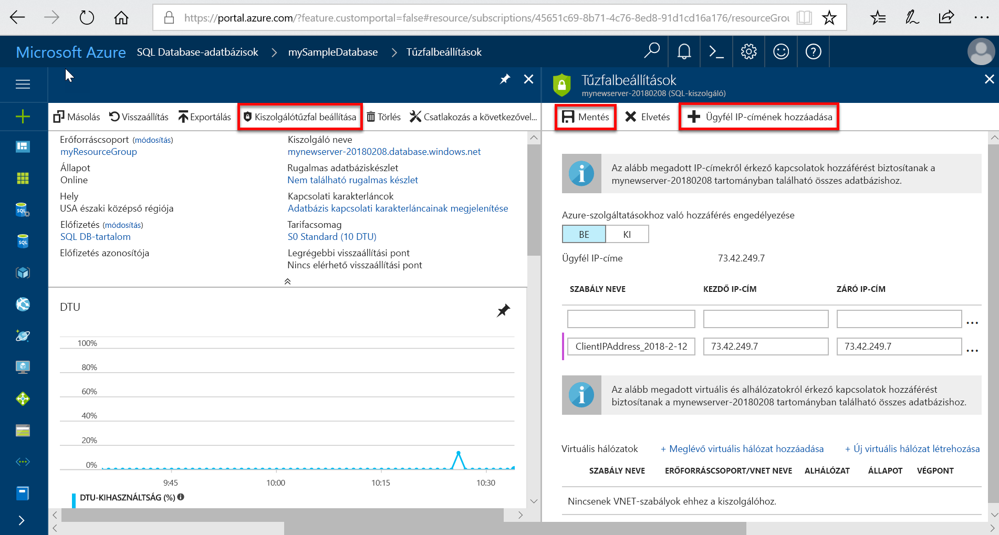

# <a name="azure-sql-database-and-sql-data-warehouse-ip-firewall-rules"></a>Az Azure SQL Database és az SQL Data Warehouse IP tűzfalszabályok

A Microsoft Azure [SQL Database](sql-database-technical-overview.md) és [SQL Data Warehouse](../sql-data-warehouse/sql-data-warehouse-overview-what-is.md) adja meg az Azure és egyéb internetalapú alkalmazások relációsadatbázis-szolgáltatás. Az adatok védelme érdekében a tűzfalak mindaddig megakadályozzák az adatbázis-kiszolgáló elérését, amíg meg nem adja, hogy mely számítógépek rendelkeznek ehhez engedéllyel. A tűzfal biztosítja az adatbázisokhoz való hozzáférést az egyes kérések kiindulási IP-címe alapján.

> [!NOTE]
> Ez a cikk az Azure SQL-kiszolgálóhoz, és az SQL Database és az SQL Data Warehouse-adatbázisok az Azure SQL-kiszolgálón létrehozott vonatkozik. Az egyszerűség kedvéért a jelen témakörben az SQL Database és az SQL Data Warehouse megnevezése egyaránt SQL Database.
> [!IMPORTANT]
> Ebben a cikkben leírtak *nem* a alkalmazni **Azure SQL Database felügyelt példányába**. További információt a következő [, a felügyelt példányhoz kapcsolódva](sql-database-managed-instance-connect-app.md) bővebben a hálózati konfiguráció szükséges.

## <a name="virtual-network-rules-as-alternatives-to-ip-rules"></a>A virtuális hálózati szabályok alternatív IP-szabályok

IP-szabályokat, valamint a tűzfal is kezeli *virtuális hálózati szabályok*. A virtuális hálózati szabályok a virtuális hálózati Szolgáltatásvégpontok alapulnak. A virtuális hálózati szabályok bizonyos esetekben IP-szabályok használata előnyösebb lehet. További tudnivalókért lásd: [virtuális hálózati Szolgáltatásvégpontok és szabályok az Azure SQL Database](sql-database-vnet-service-endpoint-rule-overview.md).

## <a name="overview"></a>Áttekintés

Kezdetben az Azure SQL-kiszolgáló összes hozzáférését blokkolja az SQL Database-tűzfalon. Adatbázis-kiszolgáló eléréséhez egy vagy több kiszolgálószintű IP-tűzfalszabályainak, amelyek lehetővé teszik az Azure SQL Serverhez való hozzáférést kell adnia. IP-tűzfalszabályainak használatával adja meg az internetről, melyik IP-címtartományok engedélyezettek, valamint e is megkísérelheti az Azure-alkalmazások az Azure SQL Serverhez való kapcsolódáshoz.

Ha az Azure SQL Serveren csak egyetlen adatbázishoz szeretne hozzáférést biztosítani, akkor az adott adatbázishoz egy adatbázisszintű szabályt kell létrehoznia. Adjon meg egy IP-címtartományt az adatbázis IP-tűzfalszabály, amely meghaladja a megadott IP-kiszolgálószintű tűzfalszabályt az IP-címtartományt, és győződjön meg arról, hogy az ügyfél IP-címe az adatbázisszintű szabályban megadott tartományon belülre essen.

> [!IMPORTANT]
> Az SQL Data Warehouse csak kiszolgálószintű IP-tűzfalszabályainak támogatja, és nem támogatja az IP-tűzfalszabályainak adatbázisszintű.

Az internetről és az Azure-ból érkező kapcsolódási kísérleteknek először át kell jutniuk a tűzfalon, mielőtt elérnék az Azure SQL Servert vagy az SQL Database-t, ahogyan az a következő ábrán látható:

   ![A tűzfal-konfigurációt bemutató ábra.][1]

- **Kiszolgálószintű IP-tűzfalszabályainak:**

  Ezek a szabályok hozzáférést biztosítanak ügyfelek számára a teljes Azure SQL Serverhez, azaz lévő összes adatbázis SQL-adatbázis ugyanazon a kiszolgálón. Ezek a szabályok a **fő** adatbázisban vannak tárolva. Kiszolgálószintű IP-tűzfalszabályainak konfigurálható a portálon vagy Transact-SQL-utasítások használatával. Szeretne létrehozni kiszolgálószintű az Azure Portalon vagy a PowerShell használata IP-tűzfalszabályainak, az előfizetés tulajdonosa vagy az előfizetés közreműködői kell lennie. Hozzon létre egy kiszolgálószintű IP tűzfalszabályt a Transact-SQL használatával, meg kell csatlakoznia kell az SQL Database-példány a kiszolgálószintű fő bejelentkezéssel vagy az Azure Active Directory-rendszergazdaként (Ez azt jelenti, egy IP-kiszolgálószintű tűzfalszabályt először létre kell hozni a egy a felhasználó Azure-szintű engedélyekkel).

- **Adatbázisszintű IP-tűzfalszabályainak:**

  Ezek a szabályok hozzáférést biztosítanak ügyfelek számára az egyazon SQL Database-kiszolgálón található bizonyos (biztonságos) adatbázisokhoz. Ezek a szabályok az egyes adatbázisok hozhat létre (beleértve a **fő** adatbázis) és az egyes adatbázisokban tárolódnak. Adatbázisszintű IP-tűzfalszabályainak főadatbázisra és a felhasználói adatbázisok csak is létrehozhatók és kezelhetők a Transact-SQL-utasítások használatával, és csak az első kiszolgálószintű tűzfalszabály konfigurálása után. Az adatbázisszintű IP-tűzfalszabály, amely kívül esik a tartományon a megadott IP-kiszolgálószintű tűzfalszabályt az IP-címtartományt ad meg, ha csak az adatbázis-szintű tartományában IP-címek rendelkező ügyfelek hozzáférhessen az adatbázishoz. Legfeljebb 128 adatbázisszintű IP-tűzfalszabályainak adatbázis rendelkezhet. Adatbázisszintű IP-tűzfalszabályainak konfigurálásával kapcsolatos további információkért tekintse meg később a jelen példában című cikket, és tekintse meg [sp_set_database_firewall_rule (Azure SQL Database)](https://msdn.microsoft.com/library/dn270010.aspx).

### <a name="recommendation"></a>Ajánlás

Microsoft adatbázisszintű IP-tűzfalszabályainak, amikor csak lehetséges, a biztonságot, és az adatbázis hordozhatóságának használatát javasolja. Használja kiszolgálószintű IP-tűzfalszabályainak rendszergazdák, ha sok olyan adatbázisokat, amelyek azonos hozzáférési követelményt, és nem szeretne időt, minden adatbázisnak külön-külön konfigurálása.

> [!IMPORTANT]
> Windows Azure SQL Database legfeljebb 128 IP-tűzfalszabályainak támogat.
> [!NOTE]
> Az üzletmenet folytonossága és a hordozható adatbázisok közötti kapcsolatról [a vészhelyreállítás hitelesítési követelményeit](sql-database-geo-replication-security-config.md)ismertető cikkből tájékozódhat.

### <a name="connecting-from-the-internet"></a>Csatlakozás az internetről

Amikor egy számítógép megpróbál csatlakozni az adatbázis-kiszolgálóhoz az internetről, a tűzfal először ellenőrzi az adatbázisszintű IP-tűzfalszabályainak, a kapcsolati kérésben szereplő adatbázisra vonatkozóan a kérés eredeti IP-címét:

- Ha a kérés IP-címe az adatbázisszintű IP-tűzfalszabályainak megadott tartományok egyikében, a csatlakozást a szabályt tartalmazó SQL-adatbázis.
- Ha a kérés IP-címe nem található az adatbázisszintű IP-tűzfalszabály megadott tartományok egyikében, a rendszer ellenőrzi a kiszolgálószintű IP-tűzfalszabályainak. Ha a kérés IP-címe a kiszolgálószintű IP-tűzfalszabályainak megadott tartományok egyikében, engedélyezi a csatlakozást. Kiszolgálószintű IP-tűzfalszabályainak vonatkoznak az összes SQL-adatbázisok az Azure SQL-kiszolgálón.  
- Ha a kérés IP-címe nem található a tartományok megadott bármely az adatbázisszintű vagy kiszolgálószintű IP-tűzfalszabályainak, a kapcsolódási kérelem sikertelen lesz.

> [!NOTE]
> Ha a helyi számítógépről szeretné elérni az Azure SQL Database-t, akkor ellenőrizze, hogy a hálózaton és a helyi számítógépen lévő tűzfal engedélyezi-e a kimenő kommunikációt az 1433-as TCP-porton keresztül.

### <a name="connecting-from-azure"></a>Csatlakozás az Azure-ból

Annak engedélyezéséhez, hogy az Azure-alkalmazások csatlakozhassanak az Azure SQL Serverhez, engedélyezni kell az Azure-kapcsolatokat. Amikor egy Azure-alkalmazás megkísérel csatlakozni az adatbázis-kiszolgálóhoz, a tűzfal ellenőrzi, hogy az Azure-kapcsolatok engedélyezve vannak-e. Kezdő és záró egyenlő 0.0.0.0 címet tartalmazó tűzfalbeállítás jelzi, hogy az Azure-kapcsolatok engedélyezettek. Ha a csatlakozási kísérlet nem engedélyezett, a kérés nem éri el az Azure SQL Database-kiszolgálót.

> [!IMPORTANT]
> Ez a beállítás konfigurálja a tűzfalat arra, hogy engedélyezzen minden, az Azure felől érkező kapcsolatot, beleértve a más ügyfelek előfizetéseiből érkező kapcsolatokat is. Ezen beállítás kiválasztásakor győződjön meg arról, hogy a bejelentkezési és felhasználói engedélyei a hozzáféréseket az arra jogosult felhasználókra korlátozzák.

## <a name="creating-and-managing-ip-firewall-rules"></a>Létrehozása és kezelése az IP-tűzfalszabályainak

Az első kiszolgálószintű tűzfalbeállítás hozható létre a [az Azure portal](https://portal.azure.com/) vagy programozott módon [Azure PowerShell-lel](https://docs.microsoft.com/powershell/module/azurerm.sql), [Azure CLI-vel](/cli/azure/sql/server/firewall-rule#az-sql-server-firewall-rule-create), vagy a [ REST API-val](https://docs.microsoft.com/rest/api/sql/firewallrules/createorupdate). További kiszolgálószintű IP-tűzfalszabályainak hozhatók létre, és ezekkel a módszerekkel, felügyelt és a Transact-SQL.

> [!IMPORTANT]
> Adatbázisszintű IP-tűzfalszabályainak csak hozhatók létre és kezeli a Transact-SQL használatával.

A teljesítmény javítása érdekében a kiszolgálószintű IP-tűzfalszabályainak átmenetileg gyorsítótárazza a rendszer az adatbázis szintjén. A gyorsítótár frissítésével kapcsolatban lásd: [DBCC FLUSHAUTHCACHE](https://msdn.microsoft.com/library/mt627793.aspx).

> [!TIP]
> Használhat [SQL Database naplózási szolgáltatásával](sql-database-auditing.md) kiszolgálószintű és adatbázisszintű tűzfalszabályokkal módosítások naplózását.

## <a name="manage-ip-firewall-rules-using-the-azure-portal"></a>Az Azure portal használatával IP-tűzfalszabályainak kezelése

IP-kiszolgálószintű tűzfalszabály beállítása az Azure Portalon, vagy megnyithatja az Áttekintés oldal az Azure SQL database vagy az Áttekintés oldal az SQL Database-kiszolgáló.

> [!TIP]
> Foglalkozó oktatóanyagért lásd: [létrehozása az Azure portal használatával adatbázis](sql-database-single-database-get-started.md).

### <a name="from-database-overview-page"></a>Az adatbázis áttekintő oldala

1. Állítsa be egy IP-kiszolgálószintű tűzfalszabályt az adatbázis áttekintő oldala, kattintson a **kiszolgálótűzfal beállítása** az eszköztáron az alábbi képen látható módon: Megnyílik az SQL Database kiszolgálóhoz tartozó **Tűzfalbeállítások** oldal.

      

2. Kattintson a **ügyfél IP-cím hozzáadása** gombra az eszköztárban, a számítógép IP-cím hozzáadásához jelenleg használ, és kattintson a **mentése**. Egy IP-kiszolgálószintű tűzfalszabályt az aktuális IP-címhez jön létre.

      

### <a name="from-server-overview-page"></a>A kiszolgáló Áttekintés lapján

Megnyílik a kiszolgáló áttekintő oldala, amelyen látható a teljes kiszolgálónév (például **mynewserver20170403.database.windows.net**) és a további lehetőségeket biztosít.

1. Kattintson a kiszolgáló Áttekintés lapján adja meg a kiszolgálói szintű szabályt, **tűzfal** a bal oldali menüben, a beállítások:

2. Kattintson a **ügyfél IP-cím hozzáadása** gombra az eszköztárban, a számítógép IP-cím hozzáadásához jelenleg használ, és kattintson a **mentése**. Egy IP-kiszolgálószintű tűzfalszabályt az aktuális IP-címhez jön létre.

## <a name="manage-ip-firewall-rules-using-transact-sql"></a>IP-tűzfalszabályok a Transact-SQL használatával kezelése

| Katalógusnézet vagy tárolt eljárás | Szint | Leírás |
| --- | --- | --- |
| [sys.firewall_rules](https://msdn.microsoft.com/library/dn269980.aspx) |Kiszolgáló |Az aktuális kiszolgálószintű IP tűzfalszabályok megjelenítése |
| [sp_set_firewall_rule](https://msdn.microsoft.com/library/dn270017.aspx) |Kiszolgáló |Létrehozza vagy frissíti a kiszolgálói szintű IP-tűzfalszabályainak |
| [sp_delete_firewall_rule](https://msdn.microsoft.com/library/dn270024.aspx) |Kiszolgáló |Eltávolítja a kiszolgálói szintű IP-tűzfalszabályainak |
| [sys.database_firewall_rules](https://msdn.microsoft.com/library/dn269982.aspx) |Adatbázis |Az aktuális adatbázisszintű IP tűzfalszabályok megjelenítése |
| [sp_set_database_firewall_rule](https://msdn.microsoft.com/library/dn270010.aspx) |Adatbázis |Létrehozza vagy frissíti az adatbázisszintű IP-tűzfalszabályainak |
| [sp_delete_database_firewall_rule](https://msdn.microsoft.com/library/dn270030.aspx) |Adatbázisok |Eltávolítja és adatbázisszintű tűzfalszabályok IP |

Az alábbi példák tekintse át a meglévő szabályokat, egy IP-címtartományt a Contoso kiszolgálón engedélyezni és egy IP-tűzfalszabály törlése:

```sql
SELECT * FROM sys.firewall_rules ORDER BY name;
```

Ezután adjon meg egy IP-kiszolgálószintű tűzfalszabályt.

```sql
EXECUTE sp_set_firewall_rule @name = N'ContosoFirewallRule',
   @start_ip_address = '192.168.1.1', @end_ip_address = '192.168.1.10'
```

IP-kiszolgálószintű tűzfalszabály törléséhez futtassa az sp_delete_firewall_rule tárolt eljárást. A következő példa a ContosoFirewallRule nevű szabályt törli:

```sql
EXECUTE sp_delete_firewall_rule @name = N'ContosoFirewallRule'
```

## <a name="manage-server-level-ip-firewall-rules-using-azure-powershell"></a>Kiszolgálószintű Azure PowerShell-lel IP-tűzfalszabályainak kezelése

| Parancsmag | Szint | Leírás |
| --- | --- | --- |
| [Get-AzureRmSqlServerFirewallRule](/powershell/module/azurerm.sql/get-azurermsqlserverfirewallrule) |Kiszolgáló |Az aktuális kiszolgálószintű IP-tűzfalszabályainak beolvasása |
| [New-AzureRmSqlServerFirewallRule](/powershell/module/azurerm.sql/new-azurermsqlserverfirewallrule) |Kiszolgáló |Létrehoz egy új kiszolgálószintű IP-tűzfalszabály |
| [Set-AzureRmSqlServerFirewallRule](/powershell/module/azurerm.sql/set-azurermsqlserverfirewallrule) |Kiszolgáló |Meglévő kiszolgálószintű IP tűzfalszabály tulajdonságainak frissítése |
| [Remove-AzureRmSqlServerFirewallRule](/powershell/module/azurerm.sql/remove-azurermsqlserverfirewallrule) |Kiszolgáló |Eltávolítja a kiszolgálói szintű IP-tűzfalszabályainak |

Az alábbi mintakód egy kiszolgálószintű IP-tűzfalszabály PowerShell-lel:

```powershell
New-AzureRmSqlServerFirewallRule -ResourceGroupName "myResourceGroup" `
    -ServerName $servername `
    -FirewallRuleName "AllowSome" -StartIpAddress "0.0.0.0" -EndIpAddress "0.0.0.0"
```

> [!TIP]
> PowerShell példák a környezetében, a rövid útmutató: [DB létrehozása – PowerShell](sql-database-powershell-samples.md) és [egy önálló adatbázis létrehozása és konfigurálása egy SQL Database kiszolgálószintű IP-tűzfalszabály PowerShell-lel](scripts/sql-database-create-and-configure-database-powershell.md)

## <a name="manage-server-level-ip-firewall-rules-using-azure-cli"></a>Kiszolgálószintű Azure CLI-vel IP-tűzfalszabályainak kezelése

| Parancsmag | Szint | Leírás |
| --- | --- | --- |
|[az sql server firewall-rule létrehozása](/cli/azure/sql/server/firewall-rule#az-sql-server-firewall-rule-create)|Kiszolgáló|A kiszolgáló IP-tűzfalszabály létrehozása|
|[az sql server firewall-rule list](/cli/azure/sql/server/firewall-rule#az-sql-server-firewall-rule-list)|Kiszolgáló|Felsorolja egy kiszolgáló IP-tűzfalszabályainak|
|[az sql server firewall-rule show](/cli/azure/sql/server/firewall-rule#az-sql-server-firewall-rule-show)|Kiszolgáló|Egy IP-tűzfalszabály részleteinek megjelenítése|
|[az sql server firewall-rule update](/cli/azure/sql/server/firewall-rule##az-sql-server-firewall-rule-update)|Kiszolgáló|Frissíti egy IP-tűzfalszabály|
|[az sql server firewall-rule delete](/cli/azure/sql/server/firewall-rule#az-sql-server-firewall-rule-delete)|Kiszolgáló|Töröl egy IP-tűzfalszabály|

Az alábbi példa egy kiszolgálószintű IP tűzfalszabályt az Azure CLI használatával állítja be:

```azurecli-interactive
az sql server firewall-rule create --resource-group myResourceGroup --server $servername \
-n AllowYourIp --start-ip-address 0.0.0.0 --end-ip-address 0.0.0.0
```

> [!TIP]
> Azure CLI-vel a környezetében, a gyors üzembe helyezési, találhat példát [DB létrehozása – Azure CLI-vel](sql-database-cli-samples.md) és [egy önálló adatbázis létrehozása és a egy az Azure CLI használatával az SQL Database IP-tűzfalszabály konfigurálása](scripts/sql-database-create-and-configure-database-cli.md)

## <a name="manage-server-level-ip-firewall-rules-using-rest-api"></a>Kiszolgálói szintű REST API-val IP-tűzfalszabályainak kezelése

| API | Szint | Leírás |
| --- | --- | --- |
| [List Firewall Rules](https://docs.microsoft.com/rest/api/sql/firewallrules/listbyserver) |Kiszolgáló |Az aktuális kiszolgálószintű IP tűzfalszabályok megjelenítése |
| [Tűzfalszabály létrehozása vagy frissítése](https://docs.microsoft.com/rest/api/sql/firewallrules/createorupdate) |Kiszolgáló |Létrehozza vagy frissíti a kiszolgálói szintű IP-tűzfalszabályainak |
| [Tűzfalszabály törlése](https://docs.microsoft.com/rest/api/sql/firewallrules/delete) |Kiszolgáló |Eltávolítja a kiszolgálói szintű IP-tűzfalszabályainak |
| [Tűzfal-szabályok beolvasása](https://docs.microsoft.com/rest/api/sql/firewallrules/get) | Kiszolgáló | Kiszolgálószintű IP-tűzfalszabályainak beolvasása |

## <a name="server-level-ip-firewall-rule-versus-a-database-level-ip-firewall-rule"></a>Kiszolgálószintű IP-tűzfalszabály és a egy adatbázisszintű IP-tűzfalszabály

K. Egy adatbázis felhasználói lehet egy másik adatbázisból elszigetelt?
Ha igen, hozzáférést adatbázisszintű IP-tűzfalszabályainak használatával. Ezzel elkerülhető a kiszolgálószintű IP-tűzfalszabályainak, amelyek lehetővé teszik az összes adatbázis, a védelem mélysége csökkenti a tűzfalon keresztüli hozzáférés használatával.

K. Szükség van az IP-címet a felhasználók összes adatbázishoz hozzáférést?
Kiszolgálószintű IP-tűzfalszabályainak használatával konfigurálnia kell az IP-tűzfalszabályainak hányszor csökkenthető.

K. A személy vagy csoport konfigurálása az IP-tűzfalszabályainak csak van hozzáférése az Azure portal, PowerShell vagy a REST API használatával?
Kiszolgálószintű IP-tűzfalszabályainak kell használnia. Adatbázisszintű IP-tűzfalszabályainak csak Transact-SQL használatával konfigurálható.  

K. Az olyan személyt vagy csapatot varázslónak nem használhatják fel az adatbázis szintjén magas szintű engedéllyel rendelkező IP-tűzfalszabályainak?
Kiszolgálószintű IP-tűzfalszabályainak használja. Adatbázisszintű Transact-SQL használatával IP-tűzfalszabályainak konfigurálása szükséges `CONTROL DATABASE` engedéllyel az adatbázis szintjén.  

K. Központilag kezelése az IP-tűzfalszabályainak sokak számára az olyan személyt vagy csapatot konfigurálása vagy az IP-tűzfalszabályainak naplózás van (például 100 db) adatbázisok?
Ez a beállítás attól függ, az igények és a környezet. Lehet, hogy a kiszolgálói szintű IP-tűzfalszabályainak konfigurálása egyszerűbb, de a parancsfájl-kezelési konfigurálható szabályok az adatbázis szintjén. És még akkor is, ha kiszolgálói szintű IP-tűzfalszabályainak használja, szükség lehet naplózását az adatbázisszintű IP-tűzfalszabályainak, hogy a felhasználók `CONTROL` engedéllyel hozott létre adatbázisszintű IP-tűzfalszabályainak.

K. Használható a kiszolgálószintű és adatbázisszintű is IP-tűzfalszabályainak vegyesen?
Igen. Néhány felhasználó, például a rendszergazdákat kiszolgálószintű IP-tűzfalszabályainak igényelhet. Más felhasználókkal, például egy adatbázis-alkalmazást, előfordulhat, hogy kell adatbázisszintű IP-tűzfalszabályainak.

## <a name="troubleshooting-the-database-firewall"></a>Az adatbázistűzfal hibaelhárítása

A következő szempontokat vegye figyelembe, ha a Microsoft Azure SQL Database szolgáltatáshoz való hozzáférése nem a várt módon működik:

- **Helyi tűzfal konfigurációja:**

  A számítógép férjenek hozzá az Azure SQL Database, szükség lehet hozzon létre egy tűzfalkivételt a számítógépén az 1433-as TCP-porton. Ha az Azure-felhő határain belül létesít kapcsolatokat, előfordulhat, hogy további portokat is meg kell nyitnia. További információkért lásd: a **SQL-adatbázis: Portjaival** szakaszában [az ADO.NET 4.5 és az SQL Database 1433-Ason túli](sql-database-develop-direct-route-ports-adonet-v12.md).

- **Hálózati címfordítás (NAT):**

  NAT miatt a számítógépe által az Azure SQL adatbázishoz való csatlakozáshoz használt IP-cím nem feltétlenül azonos az IP-cím látható a számítógép IP-konfigurációs beállításokat. A számítógép által az Azure-hoz való csatlakozáshoz használt IP-cím megtekintéséhez jelentkezzen be a portálra, és lépjen az adatbázist futtató kiszolgáló **Konfigurálás** lapjára. Az **Engedélyezett IP-címek** szakasz alatt jelenik meg az **Ügyfél aktuális IP-címe**. Kattintson a **Hozzáadás** lehetőségre az **Engedélyezett IP-címek** között, ha szeretné engedélyezni a számítógép számára a kiszolgáló elérését.

- **Az engedélyezési lista módosításai nem lépnek érvénybe még:**

  Akár öt perces késleltetés a Azure SQL Database-tűzfal konfigurálásának életbelépéséhez módosítások lehet.

- **A bejelentkezés nem engedélyezett, vagy helytelen jelszó lett megadva:**

  Ha egy bejelentkezés nem rendelkezik engedélyekkel az Azure SQL Database-kiszolgálón, vagy a jelszó helytelen, a rendszer megtagadja az Azure SQL Database-kiszolgálóhoz. Egy tűzfalbeállítás létrehozása lehetővé teszi az ügyfelek számára a kiszolgálóhoz való csatlakozás megkísérlését, azonban minden egyes ügyfélnek meg kell adnia a szükséges biztonsági hitelesítő adatokat. A bejelentkezések előkészítésével kapcsolatos további információkért lásd: [kezelése adatbázisok, bejelentkezések és felhasználók az Azure SQL Database](sql-database-manage-logins.md).

- **Dinamikus IP-cím:**

  Ha internetkapcsolat és a dinamikus IP-címkezelés és problémákat okoz a tűzfalon, próbálkozzon az alábbi megoldások valamelyikét:
  
  - Az internetszolgáltató (ISP) kérjen a, az Azure SQL Database-kiszolgáló eléréséhez használt ügyfélszámítógépeihez társított IP-címtartományt, és adja hozzá az IP-címtartományt, egy IP-tűzfalszabály.
  - Első statikus IP-címkezelés helyette az ügyfélszámítógépek számára, és adja hozzá az IP-címeket, IP-tűzfalszabályainak.

## <a name="next-steps"></a>További lépések

- Gyors üzembe helyezési IP-kiszolgálószintű tűzfalszabály létrehozásához, lásd: [hozzon létre egy Azure SQL database](sql-database-single-database-get-started.md).
- Ha nyílt forráskódú vagy külső alkalmazásokból szeretne kapcsolódni az Azure SQL Database-hez, lásd az [SQL Database gyors üzembe helyezési ügyfélkódmintáival](https://msdn.microsoft.com/library/azure/ee336282.aspx) foglalkozó cikket.
- A további portok megnyitásához szükséges információkért lásd: a **SQL-adatbázis: Portjaival** szakaszában [az ADO.NET 4.5 és az SQL Database 1433-Ason túli](sql-database-develop-direct-route-ports-adonet-v12.md)
- Azure SQL Database biztonsági áttekintését lásd: [az adatbázis biztonságossá tétele](sql-database-security-overview.md)

<!--Image references-->
[1]: ./media/sql-database-firewall-configure/sqldb-firewall-1.png
