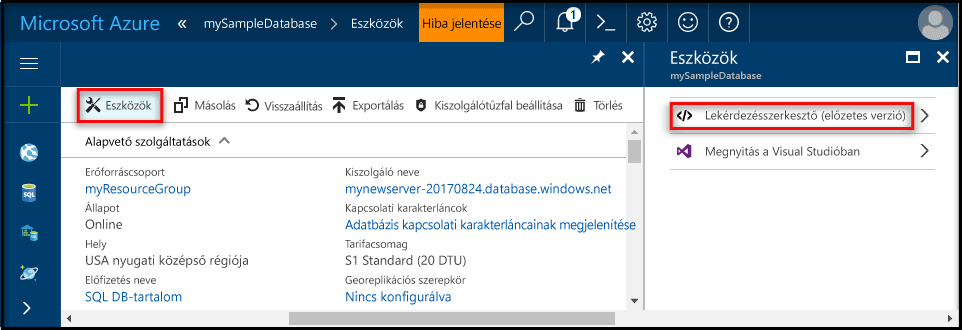
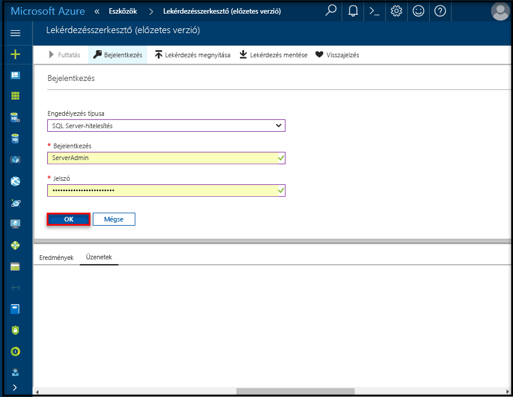

# <a name="create-an-azure-sql-database-in-the-azure-portal"></a>Azure SQL Database létrehozása az Azure Portalon

Ez a rövid útmutató végigvezeti azon, hogyan hozhat létre SQL Database adatbázist az Azure-ban. Az Azure SQL Database egy adatbázis-szolgáltatási ajánlat, amellyel magas rendelkezésre állású SQL Server-adatbázisokat futtathat és méretezhet a felhőben. Ez a rövid útmutató bemutatja, hogyan teheti meg az SQL Database adatbázisok létrehozásának első lépéseit az Azure Portalon.

Ha nem rendelkezik Azure-előfizetéssel, első lépésként mindössze néhány perc alatt létrehozhat egy [ingyenes](https://azure.microsoft.com/free/) fiókot.

## <a name="log-in-to-the-azure-portal"></a>Jelentkezzen be az Azure portálra.

Jelentkezzen be az [Azure portálra](https://portal.azure.com/).

## <a name="create-a-sql-database"></a>SQL-adatbázis létrehozása

Az Azure SQL-adatbázis [számítási és tárolási erőforrások](sql-database-service-tiers.md) egy meghatározott készletével együtt jön létre. Az adatbázis egy [Azure-erőforráscsoporton](../azure-resource-manager/resource-group-overview.md) belül egy [Azure SQL Database logikai kiszolgálón](sql-database-features.md) jön létre. 

Kövesse az alábbi lépéseket az Adventure Works LT mintaadatokat tartalmazó SQL-adatbázis létrehozásához. 

1. Kattintson az Azure Portal bal felső sarkában található **Új** gombra.

2. Az **Új** panelen válassza az **Adatbázisok** lehetőséget, majd az **Adatbázisok** panelen válassza az **SQL Database** lehetőséget.

   

3. Töltse ki az SQL Database űrlapját a következő információkkal az előző képen látható módon:   

   | Beállítás       | Ajánlott érték | Leírás | 
   | ------------ | ------------------ | ------------------------------------------------- | 
   | **Adatbázis neve** | mySampleDatabase | Az érvényes adatbázisnevekkel kapcsolatban lásd az [adatbázis-azonosítókat](https://docs.microsoft.com/en-us/sql/relational-databases/databases/database-identifiers) ismertető cikket. | 
   | **Előfizetés** | Az Ön előfizetése  | Az előfizetései részleteivel kapcsolatban lásd az [előfizetéseket](https://account.windowsazure.com/Subscriptions) ismertető cikket. |
   | **Erőforráscsoport**  | myResourceGroup | Az érvényes erőforráscsoport-nevekkel kapcsolatban lásd az [elnevezési szabályokat és korlátozásokat](https://docs.microsoft.com/azure/architecture/best-practices/naming-conventions) ismertető cikket. |
   | **Forrás forrása** | Minta (AdventureWorksLT) | Betölti az AdventureWorksLT sémát és adatokat az új adatbázisba. |

   > [!IMPORTANT]
   > Az űrlapon a mintaadatbázist kell kiválasztania, mivel a rövid útmutató hátralévő részében ezt használjuk majd.
   > 

4. Töltse ki az SQL-kiszolgáló (logikai kiszolgáló) űrlapját a következő adatokkal az előző képen látható módon:   

   | Beállítás       | Ajánlott érték | Leírás | 
   | ------------ | ------------------ | ------------------------------------------------- | 
   | **Kiszolgálónév** | Bármely globálisan egyedi név | Az érvényes kiszolgálónevekkel kapcsolatban lásd az [elnevezési szabályokat és korlátozásokat](https://docs.microsoft.com/azure/architecture/best-practices/naming-conventions) ismertető cikket. | 
   | **Kiszolgálói rendszergazdai bejelentkezés** | Bármely érvényes név | Az érvényes bejelentkezési nevekkel kapcsolatban lásd az [adatbázis-azonosítókat](https://docs.microsoft.com/en-us/sql/relational-databases/databases/database-identifiers) ismertető cikket. |
   | **Jelszó** | Bármely érvényes jelszó | A jelszónak legalább 8 karakter hosszúságúnak kell lennie, és tartalmaznia kell karaktereket a következő kategóriák közül legalább háromból: nagybetűs karakterek, kisbetűs karakterek, számjegyek és nem alfanumerikus karakterek. |
   | **Előfizetés** | Az Ön előfizetése | Az előfizetései részleteivel kapcsolatban lásd az [előfizetéseket](https://account.windowsazure.com/Subscriptions) ismertető cikket. |
   | **Erőforráscsoport** | myResourceGroup | Az érvényes erőforráscsoport-nevekkel kapcsolatban lásd az [elnevezési szabályokat és korlátozásokat](https://docs.microsoft.com/azure/architecture/best-practices/naming-conventions) ismertető cikket. |
   | **Hely** | Bármely érvényes hely | A régiókkal kapcsolatos információkért lásd [az Azure régióit](https://azure.microsoft.com/regions/) ismertető cikket. |

   > [!IMPORTANT]
   > A kiszolgáló itt megadott rendszergazdai bejelentkezési nevét és jelszavát kell majd használnia a rövid útmutató későbbi szakaszaiban a kiszolgálóra és az adatbázisaira való bejelentkezéshez. Jegyezze meg vagy jegyezze fel ezt az információt későbbi használatra. 
   >  

   

5. Miután végzett az űrlappal, kattintson a **Kiválasztás** gombra.

6. Kattintson a **Tarifacsomag** parancsra az új adatbázis szolgáltatás- és teljesítményszintjének megadásához. A csúszka használatával állítson be **20 DTU** egységet, illetve **250** GB tárhelyet. További információ a DTU-król: [Mi a DTU?](sql-database-what-is-a-dtu.md)

   

7. A DTU-mennyiség kiválasztását követően kattintson az **Alkalmaz** gombra.  

8. Most, hogy kitöltötte az SQL Database űrlapját, kattintson a **Létrehozás** gombra az adatbázis létrehozásához. Az üzembe helyezés eltarthat néhány percig. 

9. Az eszköztáron kattintson az **Értesítések** parancsra az üzembe helyezési folyamat megfigyeléséhez.

   

## <a name="create-a-server-level-firewall-rule"></a>Kiszolgálószintű tűzfalszabály létrehozása

Az SQL Database szolgáltatás egy tűzfalat hoz létre a kiszolgáló szintjén, amely megakadályozza, hogy a külső alkalmazások és eszközök csatlakozzanak a kiszolgálóhoz vagy a kiszolgálón lévő adatbázisokhoz, kivéve, ha létrehoz tűzfalszabályt, hogy adott IP-címek számára megnyissa a tűzfalat. A következő lépésekkel hozzon létre egy [kiszolgálószintű SQL Database-tűzfalszabályt](sql-database-firewall-configure.md) az ügyfél IP-címéhez, és engedélyezze a külső kapcsolatokat csak az Ön IP-címéhez az SQL Database-tűzfalon keresztül. 

> [!NOTE]
> Az SQL Database az 1433-as porton kommunikál. Ha vállalati hálózaton belülről próbál csatlakozni, elképzelhető, hogy a hálózati tűzfal nem engedélyezi a kimenő forgalmat az 1433-as porton keresztül. Ebben az esetben nem tud csatlakozni az Azure SQL Database-kiszolgálóhoz, ha az informatikai részleg nem nyitja meg az 1433-as portot.
>

1. Az üzembe helyezés befejezése után kattintson az **SQL-adatbázisok** elemre a bal oldali menüben, majd kattintson a **mySampleDatabase** adatbázisra az **SQL-adatbázisok** lapon. Megnyílik az adatbázis áttekintő oldala, amelyen látható a teljes kiszolgálónév (például: **mynewserver20170313.database.windows.net**), valamint a további konfigurálható beállítások. Későbbi felhasználás céljára másolja ki ezt a teljes kiszolgálónevet.

   > [!IMPORTANT]
   > A későbbi rövid útmutatók során szüksége lesz erre a teljes kiszolgálónévre a kiszolgálóhoz és az adatbázisokhoz való csatlakozáshoz.
   > 

    

2. Kattintson a **Kiszolgálótűzfal beállítása** lehetőségre az eszköztáron az előző képen látható módon. Megnyílik az SQL Database kiszolgálóhoz tartozó **Tűzfalbeállítások** oldal. 

    

3. Az eszköztár **Ügyfél IP-címének hozzáadása** elemére kattintva vegye fel aktuális IP-címét egy új tűzfalszabályba. A tűzfalszabály az 1433-as portot egy egyedi IP-cím vagy egy IP-címtartomány számára nyithatja meg.

4. Kattintson a **Save** (Mentés) gombra. A rendszer létrehoz egy kiszolgálószintű tűzfalszabályt az aktuális IP-címhez, és megnyitja az 1433-as portot a logikai kiszolgálón.

    

4. Kattintson az **OK** gombra, majd zárja be a **Tűzfalbeállítások** lapot.

Mostantól csatlakozhat az SQL Database-kiszolgálóhoz és annak adatbázisaihoz erről az IP-címről az SQL Server Management Studióval vagy más választott eszközzel, az előzőekben létrehozott kiszolgálói rendszergazdai fiókkal.

> [!IMPORTANT]
> Alapértelmezés szerint az összes Azure-szolgáltatás számára engedélyezett a hozzáférés az SQL Database tűzfalán keresztül. Kattintson a **KI** gombra ezen az oldalon az összes Azure-szolgáltatás hozzáférésének letiltásához.
>

## <a name="query-the-sql-database"></a>Az SQL-adatbázis lekérdezése

Most, miután létrehozott egy mintaadatbázist az Azure-ban, az Azure Portalon található beépített lekérdezési eszközzel ellenőrizzük, hogy tud-e csatlakozni az adatbázishoz, és le tudja-e kérdezni az adatokat. 

1. Az adatbázishoz tartozó SQL Database oldalon kattintson az **Eszközök** elemre az eszköztárban. Megnyílik az **Eszközök** lap.

    

2. Kattintson a **Lekérdezésszerkesztő (előzetes verzió)** lehetőségre, kattintson az **Előzetes verziójú szolgáltatás feltételei** jelölőnégyzetre, majd az **OK** gombra. Megnyílik a Lekérdezésszerkesztő lapja.

3. Kattintson a **Bejelentkezés** elemre, majd amikor a rendszer kéri, válassza ki az **SQL Server-hitelesítés** lehetőséget, és adja meg a kiszolgáló korábban létrehozott rendszergazdai bejelentkezési nevét és jelszavát.

    

4. A bejelentkezéshez kattintson az **OK** gombra.

5. A hitelesítés után írja be a következő lekérdezést a lekérdezésszerkesztő panelén.

   ```sql
   SELECT TOP 20 pc.Name as CategoryName, p.name as ProductName
   FROM SalesLT.ProductCategory pc
   JOIN SalesLT.Product p
   ON pc.productcategoryid = p.productcategoryid;
   ```

6. Kattintson a **Futtatás** gombra, majd tekintse át a lekérdezési eredményeket az **Eredmények** ablaktáblán.

   

7. Zárja be a **Lekérdezésszerkesztő** lapot és az **Eszközök** lapot.

## <a name="clean-up-resources"></a>Az erőforrások eltávolítása

Ha ezekre az erőforrásokra már nincs szüksége más útmutatókhoz/oktatóanyagokhoz (lásd [Következő lépések](#next-steps)), az alábbiak szerint törölheti azokat:


1. Az Azure Portal bal oldali menüjében kattintson az **Erőforráscsoportok** lehetőségre, majd kattintson a **myResourceGroup** elemre. 
2. Az erőforráscsoport oldalán kattintson a **Törlés** elemre, írja be a **myResourceGroup** szöveget a szövegmezőbe, majd kattintson a **Törlés** gombra.

## <a name="next-steps"></a>Következő lépések

Most, hogy rendelkezik egy adatbázissal, csatlakoztathatja a kedvenc eszközeit, és lekérdezéseket hajthat végre velük. További információkért válassza ki az eszközt az alábbiak közül:

- [SQL Server Management Studio](sql-database-connect-query-ssms.md)
- [Visual Studio Code](sql-database-connect-query-vscode.md)
- [.NET](sql-database-connect-query-dotnet.md)
- [PHP](sql-database-connect-query-php.md)
- [Node.js](sql-database-connect-query-nodejs.md)
- [Java](sql-database-connect-query-java.md)
- [Python](sql-database-connect-query-python.md)
- [Ruby](sql-database-connect-query-ruby.md)

