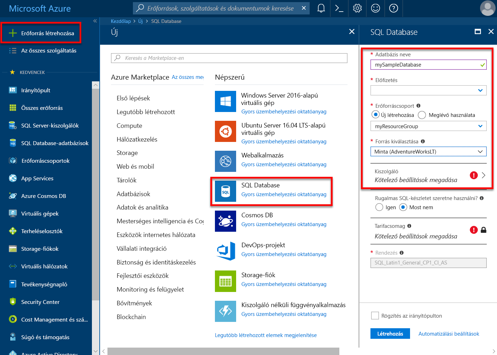
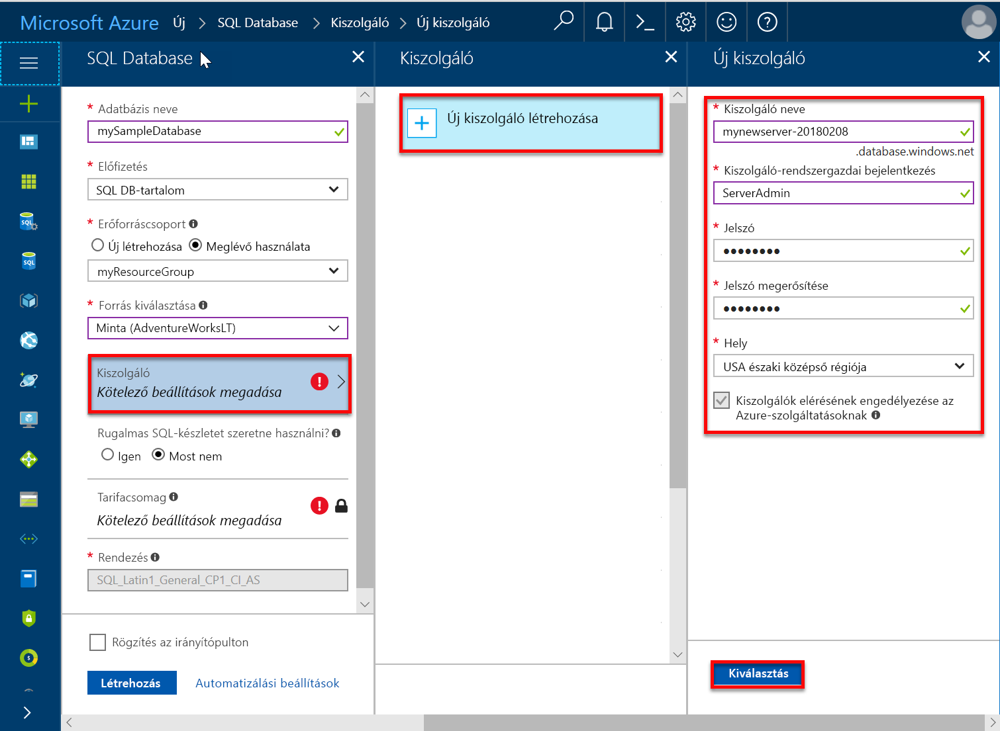
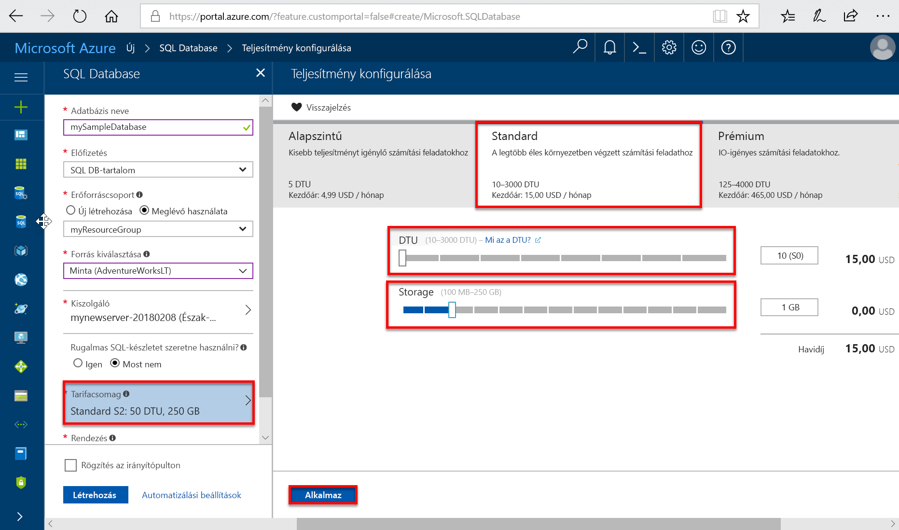
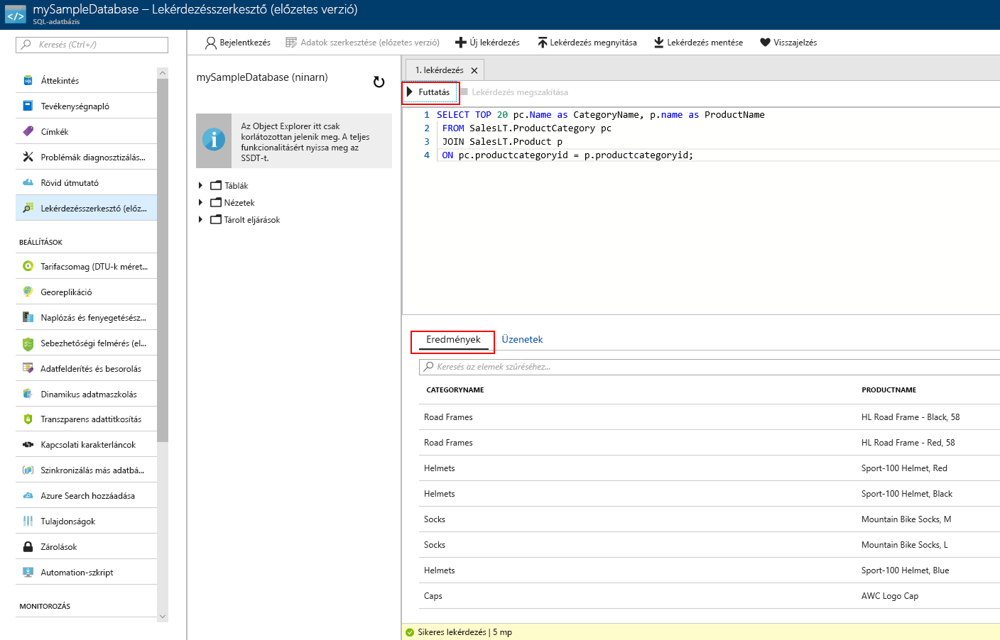

# <a name="create-an-azure-sql-database-in-the-azure-portal"></a>Azure SQL Database létrehozása az Azure Portalon

Ez a rövid útmutató végigvezeti azon, hogyan hozhat létre SQL-adatbázist az Azure-ban a [DTU-alapú vásárlási modell](sql-database-service-tiers-dtu.md) segítségével. Az Azure SQL Database egy adatbázis-szolgáltatási ajánlat, amellyel magas rendelkezésre állású SQL Server-adatbázisokat futtathat és méretezhet a felhőben. Ez a rövid útmutató bemutatja, hogyan teheti meg az SQL Database-adatbázisok létrehozásának első lépéseit az Azure Portalon.

Ha nem rendelkezik Azure-előfizetéssel, első lépésként mindössze néhány perc alatt létrehozhat egy [ingyenes](https://azure.microsoft.com/free/) fiókot.

  >[!NOTE]
  >Ez az oktatóanyag a DTU-alapú vásárlási modellt használja, de a [vCore-alapú vásárlási modell (előzetes verzió)](sql-database-service-tiers-vcore.md) szintén elérhető.

## <a name="log-in-to-the-azure-portal"></a>Bejelentkezés az Azure Portalra

Jelentkezzen be az [Azure portálra](https://portal.azure.com/).

## <a name="create-a-sql-database"></a>SQL-adatbázis létrehozása

Az Azure SQL-adatbázis [számítási és tárolási erőforrások](sql-database-service-tiers-dtu.md) egy meghatározott készletével együtt jön létre. Az adatbázis egy [Azure-erőforráscsoporton](../azure-resource-manager/resource-group-overview.md) belül egy [Azure SQL Database logikai kiszolgálón](sql-database-features.md) jön létre.

Kövesse az alábbi lépéseket az Adventure Works LT mintaadatokat tartalmazó SQL-adatbázis létrehozásához.

1. Kattintson az Azure Portal bal felső sarkában található **Erőforrás létrehozása** gombra.

2. Az **Új** oldalon válassza az **Adatbázisok** lehetőséget, majd az **Új** oldal **SQL Database** területén válassza a **Létrehozás** lehetőséget.

   

3. Töltse ki az SQL Database űrlapját a következő információkkal az előző képen látható módon:   

   | Beállítás       | Ajánlott érték | Leírás |
   | ------------ | ------------------ | ------------------------------------------------- |
   | **Adatbázis neve** | mySampleDatabase | Az érvényes adatbázisnevekkel kapcsolatban lásd az [adatbázis-azonosítókat](https://docs.microsoft.com/sql/relational-databases/databases/database-identifiers) ismertető cikket. |
   | **Előfizetés** | Az Ön előfizetése  | Az előfizetései részleteivel kapcsolatban lásd az [előfizetéseket](https://account.windowsazure.com/Subscriptions) ismertető cikket. |
   | **Erőforráscsoport**  | myResourceGroup | Az érvényes erőforráscsoport-nevekkel kapcsolatban lásd az [elnevezési szabályokat és korlátozásokat](https://docs.microsoft.com/azure/architecture/best-practices/naming-conventions) ismertető cikket. |
   | **Forrás kiválasztása** | Minta (AdventureWorksLT) | Betölti az AdventureWorksLT sémát és adatokat az új adatbázisba. |

   > [!IMPORTANT]
   > Az űrlapon a mintaadatbázist kell kiválasztania, mivel a rövid útmutató hátralévő részében ezt használjuk majd.
   >

4. A **Server** (Kiszolgáló) területen kattintson a **Configure required settings** (Kötelező beállítások konfigurálása) elemre, majd töltse ki az SQL-kiszolgáló (logikai kiszolgáló) űrlapját a következő adatokkal a következő képen látható módon:   

   | Beállítás       | Ajánlott érték | Leírás |
   | ------------ | ------------------ | ------------------------------------------------- |
   | **Kiszolgálónév** | Bármely globálisan egyedi név | Az érvényes kiszolgálónevekkel kapcsolatban lásd az [elnevezési szabályokat és korlátozásokat](https://docs.microsoft.com/azure/architecture/best-practices/naming-conventions) ismertető cikket. |
   | **Kiszolgálói rendszergazdai bejelentkezés** | Bármely érvényes név | Az érvényes bejelentkezési nevekkel kapcsolatban lásd az [adatbázis-azonosítókat](https://docs.microsoft.com/sql/relational-databases/databases/database-identifiers) ismertető cikket. |
   | **Jelszó** | Bármely érvényes jelszó | A jelszónak legalább 8 karakter hosszúságúnak kell lennie, és tartalmaznia kell karaktereket a következő kategóriák közül legalább háromból: nagybetűs karakterek, kisbetűs karakterek, számjegyek és nem alfanumerikus karakterek. |
   | **Előfizetés** | Az Ön előfizetése | Az előfizetései részleteivel kapcsolatban lásd az [előfizetéseket](https://account.windowsazure.com/Subscriptions) ismertető cikket. |
   | **Erőforráscsoport** | myResourceGroup | Az érvényes erőforráscsoport-nevekkel kapcsolatban lásd az [elnevezési szabályokat és korlátozásokat](https://docs.microsoft.com/azure/architecture/best-practices/naming-conventions) ismertető cikket. |
   | **Hely** | Bármely érvényes hely | A régiókkal kapcsolatos információkért lásd [az Azure régióit](https://azure.microsoft.com/regions/) ismertető cikket. |

   > [!IMPORTANT]
   > A kiszolgáló itt megadott rendszergazdai bejelentkezési nevét és jelszavát kell majd használnia a rövid útmutató későbbi szakaszaiban a kiszolgálóra és az adatbázisaira való bejelentkezéshez. Jegyezze meg vagy jegyezze fel ezt az információt későbbi használatra.
   >  

   

5. Miután végzett az űrlappal, kattintson a **Kiválasztás** gombra.

6. Kattintson a **Tarifacsomag** parancsra a szolgáltatásszint, a DTU-szám és a tárterületméret megadásához. Fedezze fel a DTU-k és a tárterület mennyiségének az egyes szolgáltatásszinteken elérhető lehetséges beállításait.

   > [!IMPORTANT]
   > - A szolgáltatási keretbe foglaltnál nagyobb tárterületek előzetes verzióban érhetők el, és további költségek vonatkoznak rájuk. Részletes információ: [SQL Database – Díjszabás](https://azure.microsoft.com/pricing/details/sql-database/).
   >- Az 1 TB-ot meghaladó Prémium szintű tárterület jelenleg az összes régióban elérhető, kivéve a következőket: Egyesült Királyság északi régiója, USA nyugati középső régiója, Egyesült Királyság 2. déli régiója, Kelet-Kína, USA Védelmi Minisztériuma – Középső régió, Közép-Németország, USA Védelmi Minisztériuma – Keleti régió, USA-beli államigazgatás délnyugati régiója, USA-beli államigazgatás déli középső régiója, Északkelet-Németország, Észak-Kína és USA-beli államigazgatás keleti régiója. A jövőben az elérhetőség köre bővülni fog. Más régiókban a Prémium szinthez tartozó tárterület maximuma 1 TB. Lásd: [P11–P15 – Aktuális korlátozások](sql-database-dtu-resource-limits.md#single-database-limitations-of-p11-and-p15-when-the-maximum-size-greater-than-1-tb).  
   >

7. Ehhez a rövid útmutatóhoz válassza a **Standard** szolgáltatásszintet, majd a csúszkával válassza ki a **10 DTU (S0)** egységet, illetve **1** GB tárhelyet.

   

8. A **Kiegészítő tárterület** beállítás használatához el kell fogadnia az előzetes verziójú szolgáltatás feltételeit.

   > [!IMPORTANT]
   > - A szolgáltatási keretbe foglaltnál nagyobb tárterületek előzetes verzióban érhetők el, és további költségek vonatkoznak rájuk. Részletes információ: [SQL Database – Díjszabás](https://azure.microsoft.com/pricing/details/sql-database/).
   >
   > - Az 1 TB-ot meghaladó Prémium szintű tárterület jelenleg az összes régióban elérhető, kivéve a következőket: Egyesült Királyság északi régiója, USA nyugati középső régiója, Egyesült Királyság 2. déli régiója, Kelet-Kína, USA Védelmi Minisztériuma – Középső régió, Közép-Németország, USA Védelmi Minisztériuma – Keleti régió, USA-beli államigazgatás délnyugati régiója, USA-beli államigazgatás déli középső régiója, Északkelet-Németország, Észak-Kína és USA-beli államigazgatás keleti régiója. A jövőben az elérhetőség köre bővülni fog. Más régiókban a Prémium szinthez tartozó tárterület maximuma 1 TB. Lásd: [P11–P15 – Aktuális korlátozások](sql-database-dtu-resource-limits.md#single-database-limitations-of-p11-and-p15-when-the-maximum-size-greater-than-1-tb).  
   >

9. A kiszolgálószint, a DTU-szám és a tárterületméret kiválasztása után kattintson az **Alkalmaz** gombra.  

10. Most, hogy kitöltötte az SQL Database űrlapját, kattintson a **Létrehozás** gombra az adatbázis létrehozásához. Az üzembe helyezés eltarthat néhány percig.

11. Az eszköztáron kattintson az **Értesítések** parancsra az üzembe helyezési folyamat megfigyeléséhez.

     

## <a name="create-a-server-level-firewall-rule"></a>Kiszolgálószintű tűzfalszabály létrehozása

Az SQL Database szolgáltatás egy tűzfalat hoz létre a kiszolgáló szintjén, amely megakadályozza, hogy a külső alkalmazások és eszközök csatlakozzanak a kiszolgálóhoz vagy a kiszolgálón lévő adatbázisokhoz, kivéve, ha létrehoz tűzfalszabályt, hogy adott IP-címek számára megnyissa a tűzfalat. A következő lépésekkel hozzon létre egy [kiszolgálószintű SQL Database-tűzfalszabályt](sql-database-firewall-configure.md) az ügyfél IP-címéhez, és engedélyezze a külső kapcsolatokat csak az Ön IP-címéhez az SQL Database-tűzfalon keresztül.

> [!NOTE]
> Az SQL Database az 1433-as porton kommunikál. Ha vállalati hálózaton belülről próbál csatlakozni, elképzelhető, hogy a hálózati tűzfal nem engedélyezi a kimenő forgalmat az 1433-as porton keresztül. Ebben az esetben nem tud csatlakozni az Azure SQL Database-kiszolgálóhoz, ha az informatikai részleg nem nyitja meg az 1433-as portot.
>

1. Az üzembe helyezés befejezése után kattintson az **SQL-adatbázisok** elemre a bal oldali menüben, majd kattintson a **mySampleDatabase** adatbázisra az **SQL-adatbázisok** lapon. Megnyílik az adatbázis áttekintő oldala, amelyen látható a teljes kiszolgálónév (például: **mynewserver-20170824.database.windows.net**), valamint a további konfigurálható beállítások.

2. Másolja ezt a teljes kiszolgálónevet, mert a későbbi rövid útmutatók során szüksége lesz rá a kiszolgálóhoz és az adatbázisokhoz való csatlakozáshoz.

   

3. Kattintson a **Kiszolgálótűzfal beállítása** lehetőségre az eszköztáron az előző képen látható módon. Megnyílik az SQL Database kiszolgálóhoz tartozó **Tűzfalbeállítások** oldal.

   

4. Az eszköztár **Ügyfél IP-címének hozzáadása** elemére kattintva vegye fel aktuális IP-címét egy új tűzfalszabályba. A tűzfalszabály az 1433-as portot egy egyedi IP-cím vagy egy IP-címtartomány számára nyithatja meg.

5. Kattintson a **Save** (Mentés) gombra. A rendszer létrehoz egy kiszolgálószintű tűzfalszabályt az aktuális IP-címhez, és megnyitja az 1433-as portot a logikai kiszolgálón.

6. Kattintson az **OK** gombra, majd zárja be a **Tűzfalbeállítások** lapot.

Mostantól csatlakozhat az SQL Database-kiszolgálóhoz és annak adatbázisaihoz erről az IP-címről az SQL Server Management Studióval vagy más választott eszközzel, az előzőekben létrehozott kiszolgálói rendszergazdai fiókkal.

> [!IMPORTANT]
> Alapértelmezés szerint az összes Azure-szolgáltatás számára engedélyezett a hozzáférés az SQL Database tűzfalán keresztül. Kattintson a **KI** gombra ezen az oldalon az összes Azure-szolgáltatás hozzáférésének letiltásához.
>

## <a name="query-the-sql-database"></a>Az SQL-adatbázis lekérdezése

Most, miután létrehozott egy mintaadatbázist az Azure-ban, az Azure Portalon található beépített lekérdezési eszközzel ellenőrizzük, hogy tud-e csatlakozni az adatbázishoz, és le tudja-e kérdezni az adatokat.

1. Az adatbázishoz tartozó SQL Database oldalon kattintson a **Lekérdezésszerkesztő (előzetes verzió)** elemre a bal oldali menüben, majd kattintson a **Bejelentkezés** gombra.

   

2. Válassza az SQL Server-hitelesítést, adja meg a szükséges bejelentkezési adatokat, és kattintson az **OK** gombra a bejelentkezéshez.

3. Miután hitelesítette magát a **kiszolgáló rendszergazdájaként**, írja be a következő lekérdezést a lekérdezésszerkesztő panelén.

   ```sql
   SELECT TOP 20 pc.Name as CategoryName, p.name as ProductName
   FROM SalesLT.ProductCategory pc
   JOIN SalesLT.Product p
   ON pc.productcategoryid = p.productcategoryid;
   ```

4. Kattintson a **Futtatás** gombra, majd tekintse át a lekérdezési eredményeket az **Eredmények** ablaktáblán.

   

5. Zárja be a **Lekérdezésszerkesztő** lapot, majd kattintson az **OK** gombra a nem mentett szerkesztések elvetéséhez.

## <a name="clean-up-resources"></a>Az erőforrások eltávolítása

Mentse ezeket az erőforrásokat, ha a [Következő lépésekre](#next-steps) szeretne lépni, és meg szeretné tudni, hogyan milyen módokon csatlakozhat az adatbázishoz és végezhet róla lekérdezéseket. Ha azonban törölni szeretné a rövid útmutató során létrehozott erőforrásokat, végezze el a következő lépéseket.


1. Az Azure Portal bal oldali menüjében kattintson az **Erőforráscsoportok** lehetőségre, majd kattintson a **myResourceGroup** elemre.
2. Az erőforráscsoport oldalán kattintson a **Törlés** elemre, írja be a **myResourceGroup** szöveget a szövegmezőbe, majd kattintson a **Törlés** gombra.

## <a name="next-steps"></a>További lépések

- Most, hogy rendelkezik egy adatbázissal, [csatlakoztathatja a kedvenc eszközeinek vagy nyelveinek egyikét, és lekérdezéseket hajthat végre velük](sql-database-connect-query.md). 
- Az első adatbázis megtervezésével, a táblák létrehozásával és az adatok beszúrásával kapcsolatos információkért tekintse meg az alábbi oktatóanyagok egyikét:
 - [Az első Azure SQL-adatbázis megtervezése SSMS használatával](sql-database-design-first-database.md)
  - [Azure SQL-adatbázis megtervezése, és kapcsolódás C# és ADO.NET használatával](sql-database-design-first-database-csharp.md)
