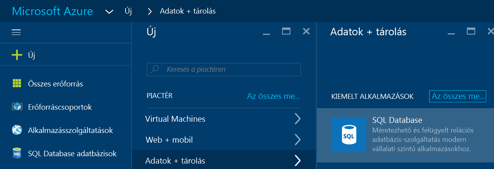
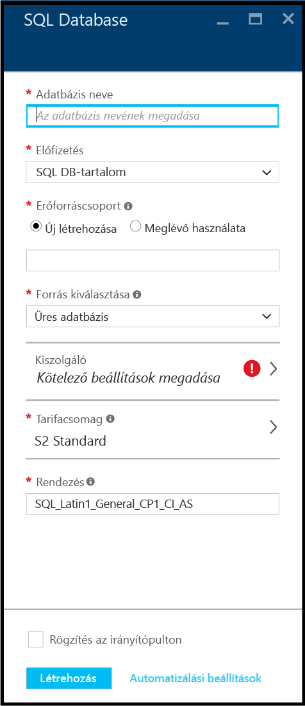
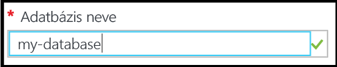
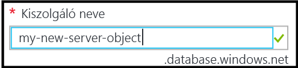
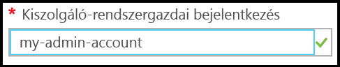
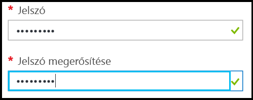
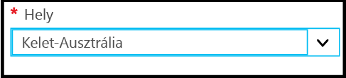
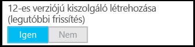
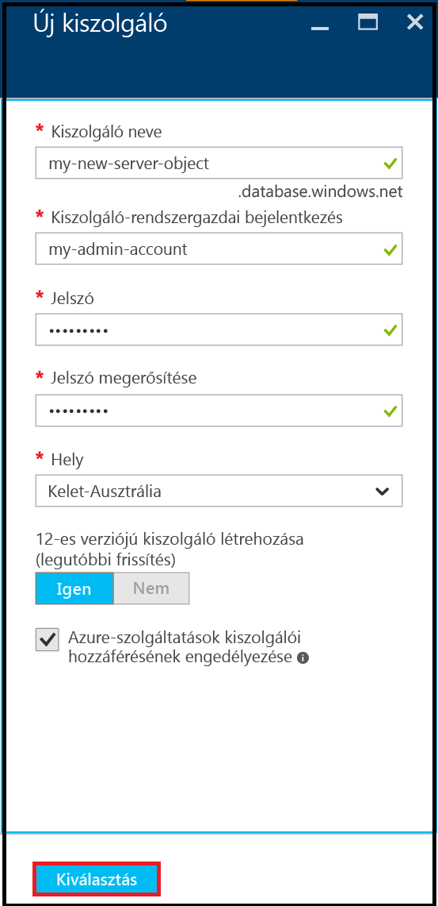
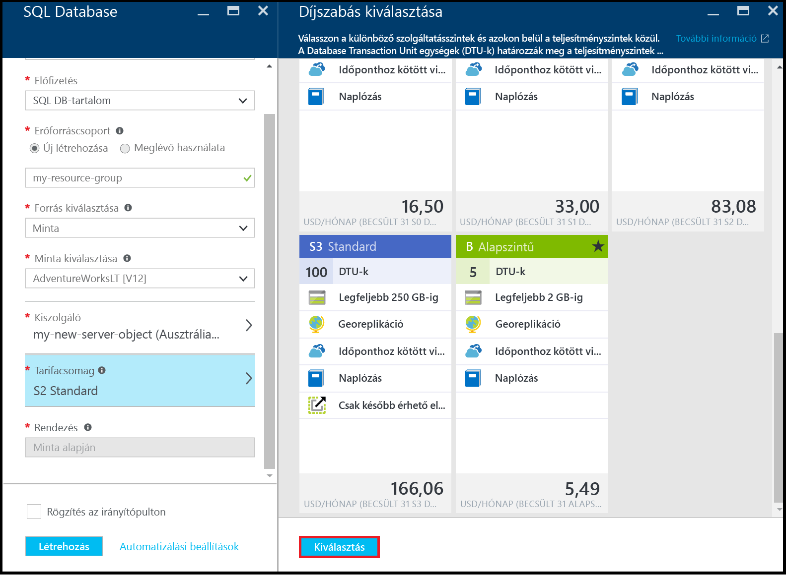

# Oktatóanyag az SQL Database használatához: SQL Database-adatbázis létrehozása pillanatok alatt az Azure Portalon
> [!div class="op_single_selector"]
> * [Azure Portal](sql-database-get-started.md)
> * [C#](sql-database-get-started-csharp.md)
> * [PowerShell](sql-database-get-started-powershell.md)
> 
> 

Ez az oktatóanyag bemutatja, hogyan hozhatja létre a következőket az Azure Portal használatával:

* Azure SQL Database-adatbázis létrehozása mintaadatokkal.
* Kiszolgálószintű tűzfalszabály egyetlen IP-cím vagy IP-címek tartománya számára.

Ugyanezen feladatokat [C#](sql-database-get-started-csharp.md) nyelven vagy a [PowerShell](sql-database-get-started-powershell.md) segítségével is végrehajthatja.

[!INCLUDE [Login](../../includes/azure-getting-started-portal-login.md)]

## Az első SQL Database-adatbázis létrehozása
1. Ha jelenleg nem csatlakozik, jelentkezzen be az [Azure Portalra](http://portal.azure.com).
2. Kattintson az **Új**, majd az **Adatok + tárolás** elemre, és keresse meg az **SQL Database** elemet.
   
    
3. Kattintson az **SQL Database** elemre az SQL Database panel megnyitásához. A panel tartalma az előfizetések és a meglévő objektumok (pl. meglévő kiszolgálók) számától függően eltérő lehet.
   
    
4. Az **Adatbázis neve** szövegbeviteli mezőben adjon nevet az első adatbázisának – pl. „my-database” (saját adatbázis). Zöld pipa jelzi, hogy érvényes nevet adott meg.
   
    
5. Ha több előfizetéssel rendelkezik, válasszon egyet.
6. Az **Erőforráscsoport** területen kattintson az **Új létrehozása** elemre, majd adjon nevet az első erőforráscsoportjának – pl. „my-resource-group” (saját erőforráscsoport). Zöld pipa jelzi, hogy érvényes nevet adott meg.
   
    
7. A **Forrás kiválasztása** területen kattintson a **Minta** elemre, majd a **Minta kiválasztása** területen kattintson az **AdventureWorksLT [V12]** elemre.
   
    
8. A **Kiszolgáló** területen kattintson a **Kötelező beállítások konfigurálása** elemre.
   
    
9. A Kiszolgáló panelen kattintson az **Új kiszolgáló létrehozása** elemre. Az Azure SQL Database-adatbázisok egy kiszolgálóobjektumban jönnek létre, amely lehet új vagy meglévő kiszolgáló.
   
    
10. Tekintse át az **Új kiszolgáló** panelt, hogy megismerje, milyen adatokat kell megadnia az új kiszolgálóhoz.
    
    
11. A **Kiszolgáló neve** szövegbeviteli mezőben adjon nevet az első kiszolgálójának – pl. „my-new-server-object” (új saját kiszolgálóobjektum). Zöld pipa jelzi, hogy érvényes nevet adott meg.
    
    
12. A **Kiszolgáló rendszergazdájának felhasználóneve** területen adjon meg egy felhasználónevet a kiszolgálóhoz tartozó rendszergazdai bejelentkezéshez, pl. „my-admin-account” (saját rendszergazdai fiók). Az ilyen bejelentkezést kiszolgálószintű bejelentkezésnek nevezik. Zöld pipa jelzi, hogy érvényes nevet adott meg.
    
    
13. A **Jelszó** és a **Jelszó megerősítése** területen adjon meg egy jelszót a kiszolgálószintű bejelentkezési fiókhoz – pl."p@ssw0rd1".Zöld pipa jelzi, hogy érvényes jelszót adott meg.
    
    
14. A **Hely** területen válasszon a tartózkodási helyének megfelelő adatközpontot – pl. „Kelet-Ausztrália”.
    
    
15. Vegye figyelembe, hogy a **12-es verziójú kiszolgáló létrehozása (legújabb frissítés) területen csak az Azure SQL-kiszolgáló aktuális verziójának létrehozására van lehetősége.
    
    
16. Vegye figyelembe, hogy alapértelmezés szerint az **Azure-szolgáltatások kiszolgálói hozzáférésének engedélyezése** jelölőnégyzet be van jelölve, és itt nem módosítható. Ez egy speciális beállítás. Ezt a beállítást a kiszolgálóobjektumhoz tartozó kiszolgálói tűzfal beállításaiban módosíthatja, bár ez a legtöbb esetben nem szükséges.
    
    
17. Az Új kiszolgáló panelen tekintse át választásait, majd kattintson a **Kiválasztás** elemre az új kiszolgáló kiválasztásához az új adatbázis számára.
    
    
18. Az SQL Database panel **Tarifacsomag** területén kattintson az**S2 Standard**, majd a **Basic** elemre a legkevésbé költséges tarifacsomag kiválasztásához az első adatbázisa számára. Később bármikor módosíthatja a tarifacsomagot.
    
    
19. Az SQL Database panelen tekintse át választásait, majd kattintson a **Létrehozás** elemre az első kiszolgálója és adatbázisa létrehozásához. Megtörténik a megadott értékek hitelesítése, és megkezdődik az üzembe helyezés.
    
    
20. A portál eszköztárán kattintson az **Értesítések** elemre az üzembe helyezés állapotának ellenőrzéséhez.
    
    

> [!IMPORTANT]
> Ha az üzembe helyezés befejeződött, a rendszer létrehozza az új Azure SQL-kiszolgálót és -adatbázist az Azure-ban. Addig nem csatlakozhat az új kiszolgálóhoz vagy adatbázishoz az SQL Server-eszközökkel, amíg létre nem hoz egy tűzfalszabályt a kiszolgálóhoz, amely megnyitja az SQL Database-tűzfalat az Azure-on kívülről származó kapcsolatok esetén.
> 
> 

[!INCLUDE [Create server firewall rule](../../includes/sql-database-create-new-server-firewall-portal.md)]

## Következő lépések
Miután áttanulmányozta az SQL Database oktatóanyagát, és létrehozott egy adatbázist mintaadatokkal, feltárhatja az adatokat a megszokott eszközökkel.

* Ha jártas a Transact-SQL és az SQL Server Management Studio (SSMS) használatában, olvassa el a [Connect and query a SQL database with SSMS](sql-database-connect-query-ssms.md) (SQL-adatbázishoz való kapcsolódás és lekérdezés az SSMS használatával) című cikket.
* Ha munkája során az Excelt használja, olvassa el a [Connect to a SQL database in Azure with Excel](sql-database-connect-excel.md) (SQL-adatbázishoz való kapcsolódás az Azure-ban az Excellel) című cikket.
* Ha készen áll a kódolás elkezdésére, válasszon programozási nyelvet a [Connection libraries for SQL Database and SQL Server](sql-database-libraries.md) (Adatkapcsolattárak az SQL Database-hez és az SQL Serverhez) című cikk alapján.
* Ha át szeretné helyezni helyszíni SQL Server-adatbázisait az Azure-ba, olvassa el a [Migrating a database to SQL Database](sql-database-cloud-migrate.md) (Adatbázis áttelepítése az SQL Database-be) című cikket.
* Ha a BCP parancssori eszköz használatával szeretne adatokat betölteni egy CSV-fájlból egy új táblába, olvassa el a [Loading data into SQL Database from a CSV file using BCP](sql-database-load-from-csv-with-bcp.md) (Adatok betöltése az SQL Database-be CSV-fájlból a BCP használatával) című cikket.
* Ha további információkat szeretne megtudni az Azure SQL Database biztonságával kapcsolatban, olvassa el a [Getting started with security](sql-database-get-started-security.md) (Ismerkedés az adatbázis-biztonsággal) című cikket.

## További források
[Mi az SQL Database?](sql-database-technical-overview.md)

<!--HONumber=Nov16_HO2-->

