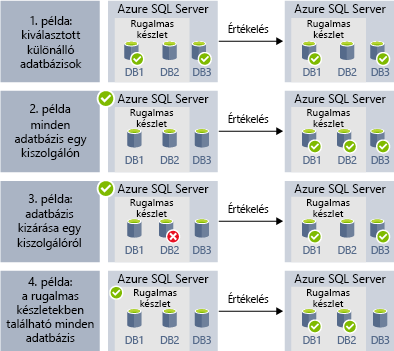
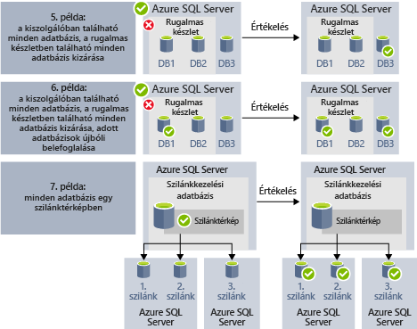

# <a name="automate-management-tasks-using-database-jobs"></a>Adatbázis-feladatok használata a felügyeleti feladatok automatizálása

Az Azure SQL Database lehetővé teszi, hogy hozhat létre, és sikerült rendszeres időközönként hajtható végre T-SQL-lekérdezések futtatása és karbantartási feladatok végrehajtása egy vagy több adatbázis feladatok ütemezését. Minden feladat végrehajtási állapotának naplózza, és a műveletek is automatikusan újrapróbálkozik, bármilyen hiba esetén.
Megadhatja a céladatbázis vagy -csoportok az Azure SQL Database-adatbázisok, ahol a feladat lesz végrehajtva, és a feladat futtatása is ütemterveket.
Egy feladat a feladat történő céladatbázis kezeli. Ön is definiálása, karbantartása és Transact-SQL szkriptek hajtható végre, egy Azure SQL Database-adatbázisok csoport közötti megőrzése.

Nincsenek számos forgatókönyv feladat automation használhatja:

- Felügyeleti feladatok automatizálása és ütemezése majd minden hétköznap futtatása után óránként, stb.
  - Üzembe helyezhet sémamódosításokat, kezelheti a hitelesítő adatokat, teljesítményadatokat vagy bérlői (ügyfél-) telemetriát gyűjthet.
  - (Minden adatbázis közös információk) referenciaadatok frissítése, adatok betöltése az Azure Blob storage-ból.
  - Az indexek újraépítésével javíthatja a lekérdezési teljesítményt. Úgy konfigurálhatja a feladatokat, hogy a rendszer egy adott adatbázis-gyűjteményen rendszeres időközönként hajtsa őket végre, például csúcsidőn kívül.
  - A lekérdezési adatokat az adatbázis-készletekből folyamatosan egy központi táblába gyűjtheti. A teljesítménylekérdezések folyamatosan végrehajthatók, illetve konfigurálhatók úgy, hogy további végrehajtandó feladatokat indítsanak el.
- Adatokat gyűjthet jelentéskészítéshez
  - Összesítheti az Azure SQL Database-adatbázisok egy gyűjteményéből származó adatokat egy céltáblában.
  - Olyan hosszabban futó adatfeldolgozási lekérdezéseket hajthat végre nagy adatbáziskészleteken, amilyen például az ügyfél-telemetria gyűjtése. A rendszer az eredményeket egyetlen céltáblában gyűjti össze a további elemzéshez.
- Adatmozgást
 - Feladatok létrehozására, amelyek más adatbázisok az adatbázisokban végzett módosítások replikálása, vagy a távoli adatbázisokhoz végzett frissítések gyűjtését, és a alkalmazni megváltozott az adatbázisban.
 - Feladatok létrehozására, amelyek vagy az adatbázisokat, SQL Server Integration Services (SSIS) használatával az adatok betöltéséhez.

A következő feladat ütemezési technológiákat az Azure SQL Database-ben érhetők el:

- **SQL-ügynök feladatait** vannak a klasszikus és az élesben tesztelt SQL Server-feladatok ütemezését összetevő, amely a felügyelt példány érhető el. SQL-ügynök feladatait az önálló adatbázisok nem érhetők el.
- **Elastic Database-feladatok** feladatütemezés szolgáltatása, amely végrehajtja a egyéni feladatokat egy vagy több Azure SQL-adatbázis.

Fontos megjegyezni, hogy az SQL Agent közötti különbségek néhány (elérhető a helyszíni és SQL Database felügyelt példányain részeként), és az adatbázis feladatügynök (az önálló adatbázisok az Azure SQL database és az SQL Data Warehouse-adatbázisok számára érhető el).

|  |Rugalmas feladatok  |SQL Agent |
|---------|---------|---------|
|Hatókör     |  Tetszőleges számú Azure SQL-adatbázis és/vagy Data Warehouse egy Azure-felhőben, amely feladatügynökként működik. Tárolók különböző SQL Database kiszolgálók, az előfizetések, illetve régiókban is lehetnek. <br><br>A célcsoportok állhatnak egyedi adatbázisokból vagy adattárházakból, illetve egy kiszolgáló, készlet vagy szegmenstérkép összes adatbázisából (a feladat futásidejében dinamikusan számba véve). | Minden egyes adatbázis az SQL agent, ugyanazon SQL Server-példányon. |
|Támogatott API-k és eszközök     |  Portál, PowerShell, T-SQL, Azure Resource Manager      |   T-SQL, SQL Server Management Studio (SSMS)     |

## <a name="sql-agent-jobs"></a>SQL-ügynök feladatait

SQL-ügynök feladatait megadott sorozata, a T-SQL szkripteket az adatbázison. Feladatok segítségével meghatározhatja egy felügyeleti feladat futtatása egy vagy több alkalommal és figyelemmel kísérni a sikeres vagy sikertelen lehet.
Egy feladat több távoli kiszolgálón vagy egy helyi kiszolgálón futtatható. Az SQL Agent-feladat egy belső adatbázis-kezelő összetevő, amely a felügyelt példány szolgáltatáson belül hajtja végre.
SQL-ügynök feladatait számos fő fogalmak szerepelnek:

- **Feladat lépései** egy vagy több olyan lépéseket, amelyek a feladat belül kell végrehajtani. A feladat lépéseinek meghatározhatja az újrapróbálkozási stratégiát és az eseményekből eredő műveleteket történjen, ha a feladat lépésének sikeres vagy sikertelen.
- **Ütemezések** határozza meg, a feladat végrehajtása esetén.
- **Értesítések** lehetővé teszi olyan szabályok, amelyek értesítése e-mailek keresztül operátorok, a feladat befejezése után a rendszer.

### <a name="job-steps"></a>Feladat lépései

Az SQL Agent-feladat lépésekre, amelyek az SQL Agent végrehajtható műveletek sorrendje. Minden lépése rendelkezik a következő lépés, amely kell hajtható végre, ha a lépés sikeres vagy sikertelen, hiba esetén az újrapróbálkozások számát.
Az SQL Agent lehetővé teszi, hogy a feladat lépései a Transact-SQL feladatlépést, amely végrehajt egy Transact-SQL kötegben az adatbázison, vagy az operációs rendszer parancs/PowerShell lépéseket, amelyekkel végrehajtható egyéni operációsrendszer-parancsfájl például különböző típusainak létrehozásáról, az SSIS feladat lépésekkel engedélyezheti, hogy az adatok betöltése SSIS modullal, vagy [replikációs](sql-database-managed-instance-transactional-replication.md) lépéseket, amelyek a változásokat az adatbázisból, más adatbázisokkal teheti közzé.

[Tranzakciós replikáció](sql-database-managed-instance-transactional-replication.md) adatbázismotor-funkció, amely lehetővé teszi, hogy egy adott adatbázis egy vagy több táblát a módosítások közzététele, közzététel és kioszthatja az előfizetői adatbázis. A módosítások közzététele a következő SQL-ügynök feladatot lépés típusú használatával lett megvalósítva:

- Replikálásitranzakciónapló-olvasó.
- Snapshot.
- A terjesztőn.

Feladat lépései más típusú jelenleg nem támogatottak, többek között:

- Egyesítéses replikálási feladat lépésének nem támogatott.
- Üzenetsor-olvasó nem támogatott.
- Analysis Services nem támogatottak.

### <a name="job-schedules"></a>Feladatütemezések

Ütemezés szerint meghatározza, hogy a feladat futtatásakor. Több feladat is az azonos ütemezés szerint fut, és ugyanazt a feladatot több ütemezés is vonatkoznak.
Ütemezés szerint határozhatja meg az az idő, amikor a feladat fut, az alábbi feltételek:

- Minden alkalommal, amikor Instance újraindul (vagy SQL Server-ügynök indulásakor). Feladat minden feladatátvétel után aktiválódik.
- Egyszer, egy adott dátummal és időponttal, amely hasznos a késleltetett végrehajtását néhány feladatot.
- Ismétlődő ütemezés szerint.

> [!Note]
> Felügyelt példány jelenleg nem teszi lehetővé feladat indításához, ha a példány "Inaktív".

### <a name="job-notifications"></a>Feladatértesítések

SQL-ügynök feladatot lehetővé teszi az értesítések küldése, ha a feladat sikeresen befejeződik, vagy sikertelen volt. Értesítő e-mailen keresztül fogadhat.

Először kell állítsa be az e-mail-fiókot az e-mail értesítések küldéséhez, majd hozzárendeléséhez a fióknak az e-mail-profil neve használandó `AzureManagedInstance_dbmail_profile`, ahogy az alábbi példában látható:

```sql
-- Create a Database Mail account
EXECUTE msdb.dbo.sysmail_add_account_sp
    @account_name = 'SQL Agent Account',
    @description = 'Mail account for Azure SQL Managed Instance SQL Agent system.',
    @email_address = '$(loginEmail)',
    @display_name = 'SQL Agent Account',
    @mailserver_name = '$(mailserver)' ,
    @username = '$(loginEmail)' ,  
    @password = '$(password)' 

-- Create a Database Mail profile
EXECUTE msdb.dbo.sysmail_add_profile_sp
    @profile_name = 'AzureManagedInstance_dbmail_profile',
    @description = 'E-mail profile used for messages sent by Managed Instance SQL Agent.' ;

-- Add the account to the profile
EXECUTE msdb.dbo.sysmail_add_profileaccount_sp
    @profile_name = 'AzureManagedInstance_dbmail_profile',
    @account_name = 'SQL Agent Account',
    @sequence_number = 1;
```

Akkor is engedélyeznie kell az adatbázisbeli levelezés, a felügyelt példány:

```sql
GO
EXEC sp_configure 'show advanced options', 1;  
GO  
RECONFIGURE;  
GO  
EXEC sp_configure 'Database Mail XPs', 1;  
GO  
RECONFIGURE 
```

Operátor, hogy hiba történt az SQL Agent feladatokkal értesítheti. Az operátornak feladata, hogy egy vagy több felügyelt példányok karbantartásához határozza meg a kapcsolattartási adatokat. Egy ideig egy egyéni operátor feladatai vannak hozzárendelve.
Több felügyelt példányt vagy SQL Server-kiszolgálók rendszerekben számos egyéni felhasználók oszthatnak meg operátor feladataikat. Az operátornak nem tartalmaz információt a biztonsági, és a egy rendszerbiztonsági tag nem határoznak meg.

Az alábbi példában látható ssms-t vagy a Transact-SQL parancsfájl használatával hozhat létre:

```sql
EXEC msdb.dbo.sp_add_operator 
    @name=N'Mihajlo Pupun', 
        @enabled=1, 
        @email_address=N'mihajlo.pupin@contoso.com'
```

Minden olyan feladat módosíthatja, és rendelje hozzá az e-mailen keresztül kap értesítést, ha a feladat befejeződik, sikertelen vagy sikeres ssms-t vagy a következő Transact-SQL parancsfájl használatával operátor:

```sql
EXEC msdb.dbo.sp_update_job @job_name=N'Load data using SSIS', 
        @notify_level_email=3,                        -- Options are: 1 on succeed, 2 on failure, 3 on complete
        @notify_email_operator_name=N'Mihajlo Pupun'
```

### <a name="sql-agent-job-limitations"></a>Az SQL Agent feladat korlátozások

A felügyelt példány az SQL Server által biztosított SQL Agent funkcióit nem támogatottak:
- SQL-Ügyfélügynök-beállítások csak olvashatók. Az eljárás `sp_set_agent_properties` nem támogatja a felügyelt példányhoz.
- Az ügynök engedélyezése vagy letiltása jelenleg nem támogatott a felügyelt példányhoz. SQL-ügynök mindig fut-e.
- Részlegesen támogatott értesítések
 - Személyi hívó nem támogatott.
 - NetSend nem támogatott.
 - Riasztások nem még nem támogatottak.
- Proxyk nem támogatottak.
- Eseménynapló nem támogatott.

Az SQL Server Agent kapcsolatos információkért lásd: [SQL Server Agent](https://docs.microsoft.com/sql/ssms/agent/sql-server-agent).

## <a name="elastic-database-jobs"></a>Rugalmas adatbázis-feladatok

**Rugalmas adatbázis-feladatok** segítségével egy vagy több T-SQL-szkriptet párhuzamosan, nagy számú adatbázison, ütemezve vagy igény szerint futtathat.

**Adatbázisok bármilyen kombinációján futtathat feladatokat**: egy vagy több különálló adatbázison, egy kiszolgáló összes adatbázisán, egy rugalmas készletben található összes adatbázison vagy egy szegmenstérképen – ráadásul a további rugalmasság érdekében adott adatbázisokat is bevonhat vagy kizárhat. **A feladatok több kiszolgálón, több készleten, vagy akár különböző előfizetésekhez tartozó adatbázisokon is futtathatók.** A kiszolgálókat és készleteket a rendszer futásidőben dinamikusan veszi számba, ezért a feladatok az összes olyan adatbázison futnak, amelyek a célcsoportban a végrehajtáskor megtalálhatók.

Az alábbi képen egy feladatügynök látható, amely különböző típusú célcsoportokon hajt végre feladatokat:


### <a name="elastic-job-components"></a>Rugalmas feladat összetevői

|Összetevő  | Leírás (további részletek a táblázat alatt találhatók) |
|---------|---------|
|[**Rugalmas feladat ügynöke**](#elastic-job-agent) |  Az az Azure-erőforrás, amelyet a feladatok futtatására és kezelésére hoz létre.   |
|[**Feladat-adatbázis**](#job-database)    |    A feladatügynök által a feladatadatok, a feladatdefiníciók és egyebek tárolására használt Azure SQL Database.      |
|[**Célcsoport**](#target-group)      |  Azon kiszolgálók, készletek, adatbázisok és szegmenstérképek, amelyeken egy feladatot kíván futtatni.       |
|[**Feladat**](#job)  |  Már egy feladat egységek, amelyek áll, amelyek egy vagy több [lépéseket feladat](#job-step). A feladatlépések meghatározzák a futtatandó T-SQL-szkriptet, valamint a szkript végrehajtásához szükséges egyéb részleteket.  |


#### <a name="elastic-job-agent"></a>Rugalmas feladat ügynöke

A rugalmasfeladat-ügynök a feladatok létrehozásához, futtatásához és kezeléséhez használt Azure-erőforrás. A rugalmasfeladat-ügynök egy Azure-erőforrás, amelyet a portálon hozhat létre (a [PowerShell](elastic-jobs-powershell.md) és a REST is támogatott). 

**Rugalmasfeladat-ügynök** létrehozásához szükség van egy meglévő SQL-adatbázisra. Az ügynök [*feladat-adatbázisként*](#job-database) konfigurálja a meglévő adatbázist.

A rugalmasfeladat-ügynök használata ingyenes. A feladat-adatbázis díjszabása megegyezik bármely más SQL-adatbáziséval.

#### <a name="job-database"></a>Feladat-adatbázis

A *feladat-adatbázis* feladatok meghatározására, valamint a feladat-végrehajtások állapotának és előzményeinek nyomon követésére szolgál. A *feladat-adatbázis* emellett az ügynökmetaadatok, a naplók, az eredmények és a feladatdefiníciók tárolására is szolgál, valamint számos hasznos tárolt eljárást és más adatbázis-objektumokat tartalmaz a feladatok T-SQL használatával történő létrehozásához, futtatásához és kezeléséhez.

A jelenlegi előzetes verzióban egy meglévő (S0 vagy magasabb szintű) Azure SQL Database szükséges a rugalmasfeladat-ügynök létrehozásához.

A *feladat-adatbázisnak* nem kell feltétlenül újnak lennie, azonban fontos, hogy üres legyen, és S0 vagy magasabb szolgáltatásszinten működjön. A *feladat-adatbázis* javasolt szolgáltatásszintje S1 vagy magasabb, ez azonban függ a feladat(ok) teljesítményigényétől, a feladatlépések számától, valamint feladatok futtatásának számától és gyakoriságától. Például egy S0 szintű adatbázis elegendő lehet egy óránként mindössze néhány feladatot futtató feladatügynök számára, percenként futtatott feladatok esetén azonban előfordulhat, hogy ez a teljesítmény nem elegendő, és érdemes magasabb szolgáltatásszintet választani.


##### <a name="job-database-permissions"></a>Feladat-adatbázis engedélyei

Feladatügynök létrehozásakor a séma, a táblák és a *jobs_reader* nevű szerepkör a *feladat-adatbázisban* jön létre. A szerepkör a következő engedéllyel jön létre, és célja, hogy részletesebb hozzáférés-vezérlést biztosítson a rendszergazdák számára a feladatok monitorozásához:


|Szerepkörnév  |'jobs' sémaengedélyek  |'jobs_internal' sémaengedélyek  |
|---------|---------|---------|
|**jobs_reader**     |    SELECT     |    None     |

> [!IMPORTANT]
> Mielőtt adatbázis-rendszergazdaként hozzáférést biztosítana a *feladat-adatbázishoz*, fontolja meg a lehetséges biztonsági következményeket. A feladatok létrehozásához és szerkesztéséhez szükséges engedélyekkel rendelkező rosszindulatú felhasználó létrehozhat vagy szerkeszthet egy olyan feladatot, amely tárolt hitelesítő adattal csatlakozik a rosszindulatú felhasználó által vezérelt adatbázishoz, ezáltal a felhasználó meghatározhatja a hitelesítő adathoz tartozó jelszót.


#### <a name="target-group"></a>Célcsoport

A *célcsoport* határozza meg az azokat az adatbázisokat, amelyeket az adott feladatlépés végre lesz hajtva. A célcsoport tetszőleges számban és kombinációban tartalmazhatja a következőket:

- **SQL Database-kiszolgáló** -van adva egy kiszolgáló, a kiszolgáló a feladat végrehajtásának időpontjában meglévő összes adatbázis-e a csoport része. A master adatbázis hitelesítő adatait meg kell adni ahhoz, hogy a csoportot a rendszer a feladat végrehajtása előtt számba vegye és frissítse.
- **Rugalmas készlet** – Ha meg van adva egy rugalmas készlet, a feladat végrehajtásának időpontjában a rugalmas készletben található összes adatbázis a csoport tagja lesz. Kiszolgáló esetén a master adatbázis hitelesítő adatait meg kell adni ahhoz, hogy a csoport a feladat futtatása előtt frissíthető legyen.
- **Önálló adatbázis** – adjon meg egy vagy több egyedi adatbázist, amelyet a csoport részévé kíván tenni.
- **Szegmenstérkép** – egy szegmenstérkép adatbázisai.

> [!TIP]
> A feladat végrehajtásakor a *dinamikus számbavételezés* újra kiértékeli a célcsoportokban található adatbázisokat, amelyek kiszolgálókat és készletet is tartalmaznak. A dinamikus számbavételezéssel biztosítható, hogy **a feladatok a feladat végrehajtásakor a kiszolgálón vagy a készletben létező összes adatbázison fussanak**. Az adatbázisok listájának futásidőben történő ismételt kiértékelése különösen hasznos olyan esetekben, amikor a készlet- vagy a kiszolgálótagság gyakran változik.

A készletek és az önálló adatbázisok megadhatók úgy, hogy a csoport részét képezzék vagy ki legyenek zárva a csoportból. Ez lehetővé teszi, hogy az adatbázisok tetszőleges kombinációjából hozzon létre céladatbázist. Hozzáadhat például egy kiszolgálót egy céladatbázishoz, miközben kizárja egy rugalmas készlet egyes adatbázisait (vagy egy egész rugalmas készletet).

A célcsoportok több előfizetésből és több régióból származó adatbázisokat is tartalmazhatnak. Vegye figyelembe, hogy a régiók közötti végrehajtás magasabb késéssel jár, mint a régión belüli.

Az alábbi példákban az látható, hogyan történik a különböző célcsoport-meghatározások dinamikus számba vétele a feladat végrehajtásának pillanatában, a feladat által futtatandó adatbázisok megadásához:



Az **1. példában** olyan célcsoport szerepel, amely egyedi adatbázisok listáját tartalmazza. Ha egy feladatlépést e célcsoport használatával hajt végre, akkor a szóban forgó műveletet a rendszer az összes adatbázison elvégzi.<br>
A **2. példában** olyan célcsoport szerepel, amely célhelyként egy Azure SQL Server-kiszolgálót tartalmaz. Ha egy feladatlépést e célcsoport használatával hajt végre, akkor a kiszolgáló dinamikus számba vételével a rendszer képes a kiszolgálón aktuálisan megtalálható adatbázisok listájának összeállítására. A szóban forgó műveletet a rendszer az összes adatbázison elvégzi.<br>
A **3. példában** a *2. példában* lévőhöz hasonló célcsoport szerepel, amelyből viszont egy adott adatbázis ki van zárva. A szóban forgó műveletet a rendszer *nem* végzi el a kizárt adatbázison.<br>
A **4. példában** olyan célcsoport szerepel, amely célhelyként egy rugalmas készletet tartalmaz. A *2. példához* hasonlóan a feladat futtatása során a készlet dinamikus számba vételével a rendszer képes a készletben lévő adatbázisok listájának összeállítására.
<br><br>




Az **5. példában** és a **6. példában** olyan speciális forgatókönyvek szerepelnek, ahol Azure SQL Server-kiszolgálók, rugalmas készletek és adatbázisok kombinálásával foglalunk bele vagy zárunk ki szabályokat.<br>
A **7. példa** azt mutatja be, hogy a feladat futtatása során a szilánkleképezésben szereplő szilánkok is kiértékelhetők.

#### <a name="job"></a>Feladat

A *feladatok* ütemezetten vagy egyszeri feladatként végrehajtható munkaegységek. Egy feladat egy vagy több *feladatlépésből* áll.

##### <a name="job-step"></a>Feladatlépés

Minden feladatlépés meghatároz egy végrehajtandó T-SQL-szkriptet, egy vagy több célcsoportot, amelyen a T-SQL-szkript futtatható és a feladatügynök számára a céladatbázishoz történő csatlakozáshoz szükséges hitelesítő adatokat. Minden feladatlépés testreszabható időtúllépési és újrapróbálkozási szabályzattal és választhatóan megadható kimeneti paraméterekkel rendelkezik.

#### <a name="job-output"></a>Feladat kimenete

A feladatok lépéseinek eredménye részletesen rögzítve lesz az egyes adatbázisokon, a szkript kimenete pedig a megadott táblában. Megadhat egy adatbázist a feladat által visszaadott adatok tárolásához.

#### <a name="job-history"></a>Feladatelőzmények

A feladatok futtatásának előzményeit a rendszer a *feladat-adatbázisban* tárolja. A rendszertisztítási feladat törli a 45 napnál régebbi végrehajtási előzményeket. A 45 napnál nem régebbi előzmények törléséhez hívja meg az **sp_purge_history** tárolt eljárást a *feladat-adatbázisban*.

### <a name="agent-performance-capacity-and-limitations"></a>Az ügynök teljesítménye, kapacitása és korlátai

A rugalmas feladatok minimális számítási erőforrást használnak, amíg a hosszan futó feladatok befejezésére várakoznak.

Az adatbázisok célcsoportjának méretétől és az adott feladat kívánt végrehajtási idejétől (az egyidejű feldolgozók számától) függően az ügynök különböző mértékű számítási kapacitást és teljesítményt igényel a *feladat-adatbázis* részéről (több cél és több feladat esetén nagyobb számítási kapacitás szükséges).

Jelenleg az előzetes verzió 100 feladat egyidejű futtatására képes.

#### <a name="prevent-jobs-from-reducing-target-database-performance"></a>A feladatok a céladatbázis teljesítményét csökkentő hatásának megakadályozása

Ha szeretné elkerülni, hogy az erőforrások túlterheltek legyenek egy rugalmas SQL-készlet adatbázisain történő feladatvégrehajtás közben, akkor a feladatok esetén konfigurálhatja, hogy azok egyszerre legfeljebb hány adatbázison futhatnak.

## <a name="next-steps"></a>További lépések

- [Mi az SQL Server Agent](https://docs.microsoft.com/sql/ssms/agent/sql-server-agent) 
- [Útmutató a rugalmas feladatok létrehozása és kezelése](elastic-jobs-overview.md) 
- [Rugalmas feladatok létrehozása és kezelése a PowerShell használatával](elastic-jobs-powershell.md) 
- [Rugalmas feladatok létrehozása és kezelése a Transact-SQL (T-SQL) használatával](elastic-jobs-tsql.md) 
