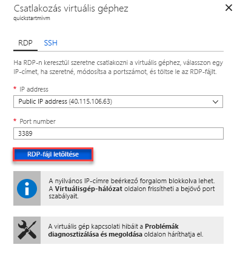

# Gyors útmutató: Azure-beli virtuális gép csatlakozni egy Azure SQL Database felügyelt példányába konfigurálása

Ez a rövid útmutató bemutatja, hogyan szeretne csatlakozni egy Azure SQL Database felügyelt példányába SQL Server Management Studio (SSMS) használatával egy Azure virtuális gép konfigurálása. A rövid útmutató, amely egy pont – hely kapcsolattal a helyszíni ügyfélszámítógépről összekapcsolása, lásd: [pont – hely kapcsolat konfigurálása](sql-database-managed-instance-configure-p2s.md) 

## Előfeltételek

Kiindulási pontként használja ez a rövid útmutató az ebben a rövid útmutatóban létrehozott erőforrásokat: [létrehoz egy felügyelt példányt](sql-database-managed-instance-get-started.md).

## Jelentkezzen be az Azure Portalra

Jelentkezzen be az [Azure Portalra](https://portal.azure.com/).

## Hozzon létre egy új alhálózatot a felügyelt példány virtuális hálózaton

Az alábbi lépéseket egy új alhálózatot létrehozni a felügyelt példány virtuális hálózat egy Azure virtuális gép számára a felügyelt példányhoz való csatlakozáshoz. A felügyelt példány alhálózatára felügyelt példányok dedikált, és más erőforrások (például az Azure Virtual Machines) az alhálózat nem hozható létre. 

1. Nyissa meg az erőforráscsoport a felügyelt példány, amelyet a [létrehoz egy felügyelt példányt](sql-database-managed-instance-get-started.md) rövid, és válassza ki a virtuális hálózatot a felügyelt példány, és kattintson a **alhálózatok**.

   

2. Kattintson a **+** melletti jelentkezzen **alhálózati** hozhat létre egy új alhálózatot.

   

3. Töltse ki az űrlapot a szükséges információkat, az alábbi táblázatban szereplő információk segítségével:

   | Beállítás| Ajánlott érték | Leírás |
   | ---------------- | ----------------- | ----------- | 
   | **Name (Név)** | Bármely érvényes név|Az érvényes nevekkel kapcsolatban lásd az [elnevezési szabályokat és korlátozásokat](https://docs.microsoft.com/azure/architecture/best-practices/naming-conventions) ismertető cikket.|
   | **Címtartomány (CIDR-blokk)** | Érvénytelen tartomány | Az alapértelmezett érték: jó az ebben a rövid útmutatóban.|
   | **Hálózati biztonsági csoport** | None | Az alapértelmezett érték: jó az ebben a rövid útmutatóban.|
   | **Útvonaltábla** | None | Az alapértelmezett érték: jó az ebben a rövid útmutatóban.|
   | ** Szolgáltatásvégpontokat ** | 0 kijelölt | Az alapértelmezett érték: jó az ebben a rövid útmutatóban.|
   | **Alhálózat delegálás** | None | Az alapértelmezett érték: jó az ebben a rövid útmutatóban.|
 
   

4. Kattintson a **OK** ilyen további alhálózat a felügyelt példány virtuális hálózat létrehozásához.

## Virtuális gép létrehozása a VNet új alhálózatában

A következő lépések bemutatják, hogyan hozhat létre egy virtuális gépet az új alhálózat a felügyelt példányhoz való csatlakozáshoz. 

## Az Azure virtuális gép előkészítése

SQL felügyelt példánya a privát virtuális hálózat el van helyezve, mivel szüksége egy Azure virtuális gép létrehozása néhány telepített SQL ügyfél eszköz, például az SQL Server Management Studio vagy az Azure Data Studio csatlakozhat a felügyelt példányhoz, és hajtsa végre a lekérdezéseket. Ez a rövid útmutató az SQL Server Management Studiót használja.

Az ügyfél virtuális gép létrehozása az összes szükséges eszközökkel legegyszerűbben az Azure Resource Manager-sablonok használatára.

1. Kattintson a következő gombra a virtuális ügyfélszámítógép létrehozásához és telepítéséhez SQL Server Management Studio (Győződjön meg arról, hogy meg vannak bejelentkezve az Azure Portalra egy új böngészőlapon):

    

2. Töltse ki az űrlapot a szükséges információkat, az alábbi táblázatban szereplő információk segítségével:

   | Beállítás| Ajánlott érték | Leírás |
   | ---------------- | ----------------- | ----------- |
   | **Előfizetés** | Egy érvényes előfizetést | Egy olyan előfizetést, amelyben új erőforrások létrehozásához szükséges engedéllyel rendelkezik kell lennie. |
   | **Erőforráscsoport** |A megadott erőforráscsoport az [felügyelt példány létrehozása](sql-database-managed-instance-get-started.md) rövid.|Ez az erőforráscsoport, amelyben a virtuális hálózaton található kell lennie.|
   | **Hely** | Az erőforráscsoport helyét | Ezt az értéket a kiválasztott erőforráscsoportba tartozó alapján van feltöltve | 
   | **A virtuális gép neve**  | Bármely érvényes név | Az érvényes nevekkel kapcsolatban lásd az [elnevezési szabályokat és korlátozásokat](https://docs.microsoft.com/azure/architecture/best-practices/naming-conventions) ismertető cikket.|
   |**Rendszergazdai felhasználónév**|Bármely érvényes felhasználónév|Az érvényes nevekkel kapcsolatban lásd az [elnevezési szabályokat és korlátozásokat](https://docs.microsoft.com/azure/architecture/best-practices/naming-conventions) ismertető cikket. Ne használja a „serveradmin” szerepkört, mert ez egy lefoglalt, kiszolgáló szintű szerepkör.| 
   |**Jelszó**|Bármely érvényes jelszó|A jelszónak legalább 12 karakter hosszúságúnak kell lennie, [az összetettségre vonatkozó követelmények teljesülése mellett](../virtual-machines/windows/faq.md#what-are-the-password-requirements-when-creating-a-vm).|
   | **Virtuális gép mérete** | Bármely érvényes mérete | Ez a sablon az alapértelmezett ** Standard_B2s is elegendő ehhez a gyors útmutatóhoz. |
   | **Hely**|[resourceGroup () .location].| Ez az érték nem módosítható |
   | **Virtuális hálózat neve**|Az előzőleg kiválasztott hely|A régiókkal kapcsolatos információkért lásd [az Azure régióit](https://azure.microsoft.com/regions/) ismertető cikket.|
   | **Alhálózat neve**|Az alhálózatot, amelyet az előző eljárásban létrehozott neve| Ne adja meg az alhálózatot, amelyben létrehozta a felügyelt példány|
   | **összetevők helye** | [.properties.templateLink.uri a központi telepítés ()]  Ez az érték nem módosítható |
   | **összetevők hely Sas-jogkivonat** | Hagyja üresen | Ez az érték nem módosítható |

   

   Ha a javasolt virtuális hálózat neve és az alapértelmezett alhálózat, a használt [a felügyelt példány létrehozása](sql-database-managed-instance-get-started.md), nem kell módosítani az utolsó két paramétert. Ellenkező esetben módosítsa ezeket az értékeket a hálózati környezet beállítása során megadott értékeket.

3. Válassza ki a **elfogadom a fenti feltételeket** jelölőnégyzetet.
4. Kattintson a **beszerzési** a hálózat az Azure virtuális gép üzembe helyezéséhez.
5. Kattintson az **Értesítések** ikonra az üzembe helyezés állapotának megtekintéséhez.
   
   Csak akkor folytassa az Azure virtuális gépen jön létre. 

## Csatlakozás virtuális géphez

Az alábbi lépések bemutatják, hogyan csatlakozhat az újonnan létrehozott virtuális géphez távoli asztali kapcsolattal.

1. Ha az üzembe helyezés elkészült, lépjen a virtuális gép erőforráshoz.

      

2. Kattintson a **Connect** (Csatlakozás) gombra. 
   
   Remote Desktop Protocol fájlt (.rdp-fájlt) űrlap jelenik meg a virtuális gép nyilvános IP-cím és port számát. 

     

3. Kattintson a **RDP-fájl letöltése**.
 
   > [!NOTE]
   > Az SSH segítségével kapcsolódni a virtuális Géphez.

4. Zárja be a **csatlakozhat a virtuális gép** űrlap.
5. Nyissa meg az RDP-fájlt a virtuális géphez való csatlakozáshoz. 
6. Amikor a rendszer kéri, kattintson a **Csatlakozás** gombra. Mac rendszerben szüksége van egy RDP-kliensre, mint például a Mac App Store áruházban elérhető [távoli asztali ügyfélre](https://itunes.apple.com/us/app/microsoft-remote-desktop/id715768417?mt=12).

6. Írja be a virtuális gép létrehozásakor megadott felhasználónevet és jelszót, majd kattintson az **OK** gombra.

7. A bejelentkezés során egy figyelmeztetés jelenhet meg a tanúsítvánnyal kapcsolatban. A csatlakozás folytatásához kattintson az **Igen** vagy **Folytatás** gombra.

A Kiszolgálókezelő irányítópultján csatlakozva van a virtuális géphez.

## Csatlakozhat a felügyelt példányhoz az SSMS használatával

1. A virtuális gépen nyissa meg az SQL Server Management Studio (SSMS).
 
   Megnyitni, mert a konfigurálás befejezéséhez, mivel ez az ssms-ben elindult első alkalommal kell néhány percet vesz igénybe.
2. Az a **kapcsolódás a kiszolgálóhoz** párbeszédpanelen adja meg a teljes **állomásnév** a felügyelt példány az **kiszolgálónév** jelölje ki **SQL Server Hitelesítési**, adja meg a felhasználónevét és jelszavát, és kattintson **Connect**.

      

A csatlakozás után megtekintheti a rendszer- és felhasználói adatbázisokat a Databases (Adatbázisok) csomóponton, valamint különféle objektumokat a Security (Biztonság), Server Objects (Kiszolgálóobjektumok), Replication (Replikáció), Management (Felügyelet), SQL Server Agent és XEvent Profiler csomópontokon.

## További lépések

- A rövid útmutató, amely egy pont – hely kapcsolattal a helyszíni ügyfélszámítógépről összekapcsolása, lásd: [pont – hely kapcsolat konfigurálása](sql-database-managed-instance-configure-p2s.md).
- Az alkalmazások csatlakozási lehetőségeinek áttekintéséért lásd: [Alkalmazások csatlakoztatása felügyelt példányhoz](sql-database-managed-instance-connect-app.md).
- Ha vissza kíván állítani egy meglévő SQL-adatbázist egy felügyelt példányra, használhatja az [Azure Database Migration Services (DMS) migrálásához](../dms/tutorial-sql-server-to-managed-instance.md) szolgáltatást, amellyel a visszaállítás egy adatbázis biztonságimásolat-fájljából történik, vagy a [T-SQL RESTORE parancsot](sql-database-managed-instance-get-started-restore.md), amellyel egy adatbázis biztonságimásolat-fájljából végezhet visszaállítást.
