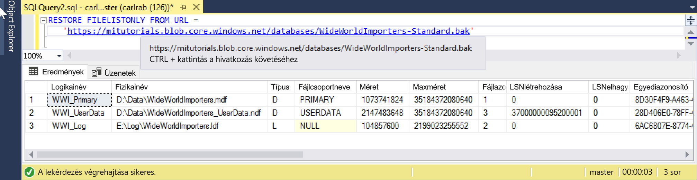

# <a name="restore-a-database-backup-to-an-azure-sql-database-managed-instance"></a>Adatbázis biztonsági másolatának visszaállítása egy felügyelt Azure SQL Database-példányon

Ez az rövid útmutató bemutatja, hogyan állíthatja vissza egy adatbázis az Azure Blob Storage-ban tárolt biztonsági másolatát a felügyelt példányon a Wide World Importers – Standard biztonságimásolat-fájllal. Ehhez a módszerhez egy ideig le kell állítani a szolgáltatást. 

> [!VIDEO https://www.youtube.com/embed/RxWYojo_Y3Q]

Az Azure Database Migration Service migráláshoz való használatát a [felügyelt példány DMS használatával történő migrálását](../dms/tutorial-sql-server-to-managed-instance.md) bemutató oktatóanyag ismerteti. A különféle migrálási módszerekről lásd: [SQL Server-példány migrálása felügyelt Azure SQL Database-példányra](sql-database-managed-instance-migrate.md).

## <a name="prerequisites"></a>Előfeltételek

Ez a rövid útmutató:
- Az alábbi, jelen rövid útmutatóban létrehozott forrásokat használja kiindulási pontként:[Felügyelt példány létrehozása](sql-database-managed-instance-get-started.md).
- Az [SQL Server Management Studio](https://docs.microsoft.com/sql/ssms/sql-server-management-studio-ssms) legújabb verziójának meglétét igényli a helyi ügyfélszámítógépen
- A felügyelt példánnyal való kapcsolatot igényel az SQL Server Management Studio használatával. Az összekapcsolhatósági lehetőségekkel kapcsolatban lásd a következő rövid útmutatókat:
  - [Csatlakozás Azure SQL Database felügyelt példányhoz egy Azure virtuális gépről](sql-database-managed-instance-configure-vm.md)
  - [Csatlakozás Azure SQL Database felügyelt példányhoz helyszíni számítógépről pont-hely típusú kapcsolat használatával](sql-database-managed-instance-configure-p2s.md).
- Előre definiált Azure Blob Storage-fiókot használ, amely tartalmazza a Wide World Importers - Standard biztonságimásolat-fájlt (a következő helyről letöltve: https://github.com/Microsoft/sql-server-samples/releases/download/wide-world-importers-v1.0/WideWorldImporters-Standard.bak).

> [!NOTE]
> További információ az SQL Server-adatbázisok az Azure Blob Storage és a közös hozzáférésű jogosultságkód (SAS) használatával történő biztonsági mentéséről és visszaállításáról: [SQL Server biztonsági mentése URL-címre](sql-database-managed-instance-get-started-restore.md).

## <a name="restore-the-wide-world-importers-database-from-a-backup-file"></a>A Wide World Importers-adatbázis visszaállítása biztonsági mentési fájlból

Az SSMS segítségével az alábbi lépéseket követve állítsa vissza a Wide World Importers-adatbázist a felügyelt példányon a biztonsági mentési fájlból.

1. Nyissa meg az SQL Server Management Studiót (SSMS), és csatlakozzon a felügyelt példányhoz.
2. Az SSMS-ben nyisson meg egy új lekérdezési ablakot.
3. A következő szkripttel hozza létre a hitelesítő adatokat a felügyelt példányban az előre konfigurált tárfiókot és SAS-kulcsot használva.

   ```sql
   CREATE CREDENTIAL [https://mitutorials.blob.core.windows.net/databases] 
   WITH IDENTITY = 'SHARED ACCESS SIGNATURE'
   , SECRET = 'sv=2017-11-09&ss=bfqt&srt=sco&sp=rwdlacup&se=2028-09-06T02:52:55Z&st=2018-09-04T18:52:55Z&spr=https&sig=WOTiM%2FS4GVF%2FEEs9DGQR9Im0W%2BwndxW2CQ7%2B5fHd7Is%3D' 
   ```

    

    > [!NOTE]
    > Mindig távolítsa el az első **?** karaktert a generált SAS-kulcsból.
  
3. A következő szkripttel ellenőrizze az SAS-hitelesítő adat és a biztonsági másolat érvényességét. Ehhez adja meg a biztonsági mentési fájlt tartalmazó tároló URL-címét:

   ```sql
   RESTORE FILELISTONLY FROM URL = 
      'https://mitutorials.blob.core.windows.net/databases/WideWorldImporters-Standard.bak'
   ```

    

4. A következő szkripttel állítsa vissza a Wide World Importers-adatbázist egy biztonsági mentési fájlból. Ehhez adja meg a biztonsági mentési fájlt tartalmazó tároló URL-címét:

   ```sql
   RESTORE DATABASE [Wide World Importers] FROM URL =
     'https://mitutorials.blob.core.windows.net/databases/WideWorldImporters-Standard.bak'
   ```

    

5. A visszaállítás állapotának nyomon követéséhez futtassa az alábbi lekérdezést egy új lekérdezési munkamenetben:

   ```sql
   SELECT session_id as SPID, command, a.text AS Query, start_time, percent_complete
      , dateadd(second,estimated_completion_time/1000, getdate()) as estimated_completion_time 
   FROM sys.dm_exec_requests r 
   CROSS APPLY sys.dm_exec_sql_text(r.sql_handle) a 
   WHERE r.command in ('BACKUP DATABASE','RESTORE DATABASE')`
   ```

6. Ha a visszaállítás elkészült, tekintse meg az Object Explorerben. 

## <a name="next-steps"></a>További lépések

- Az URL-címre történő biztonsági mentés hibaelhárításához lásd: [SQL Server-alapú biztonsági mentés URL-címre: ajánlott eljárások és hibaelhárítás](https://docs.microsoft.com/sql/relational-databases/backup-restore/sql-server-backup-to-url-best-practices-and-troubleshooting).
- Az alkalmazások csatlakozási lehetőségeinek áttekintéséért lásd: [Alkalmazások csatlakoztatása egy felügyelt példányhoz](sql-database-managed-instance-connect-app.md).
- A lekérdezések végrehajtásával kapcsolatban kedvenc eszközeinek vagy nyelveinek egyikét használva lásd: [kapcsolódás és lekérdezés](sql-database-connect-query.md).
