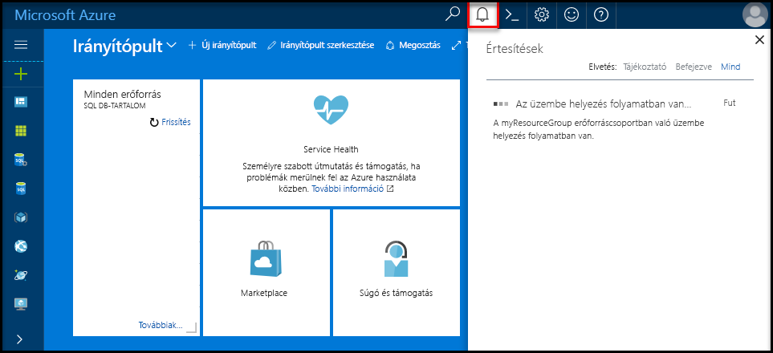
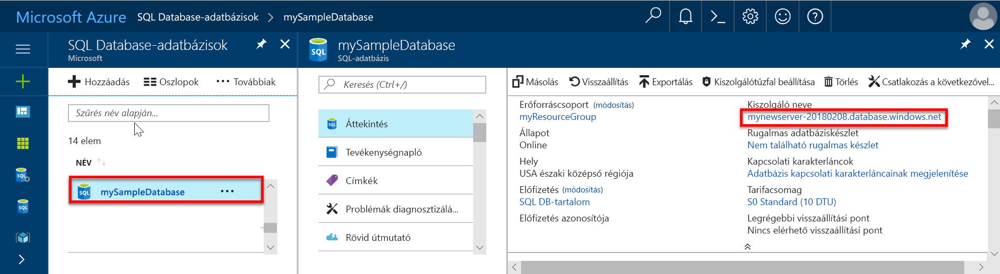
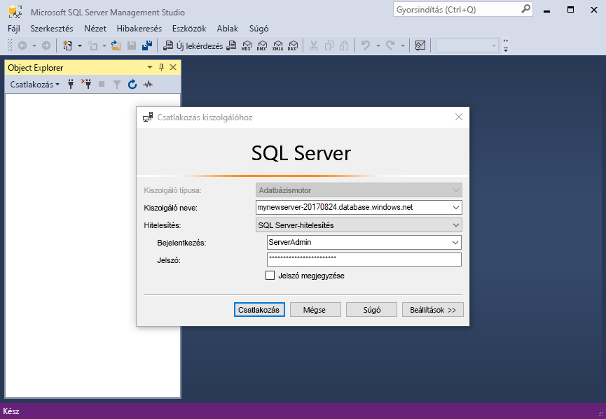
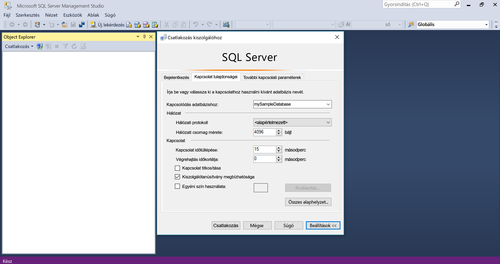
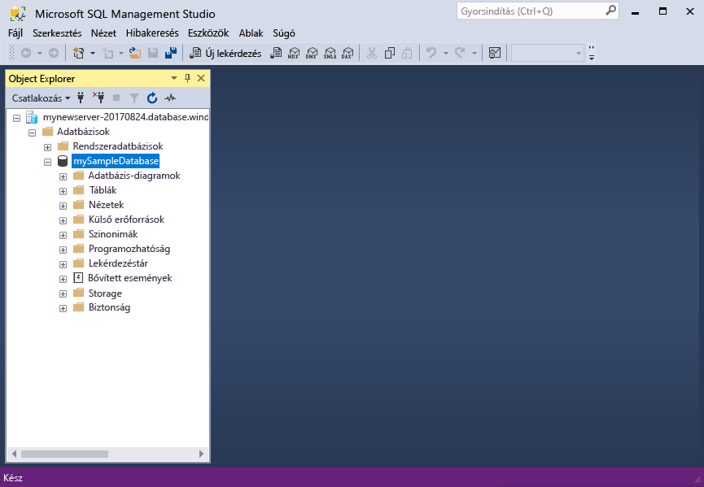

# <a name="migrate-your-sql-server-database-to-azure-sql-database-using-dma"></a>SQL Server-adatbázis migrálása az Azure SQL Database-be a DMA használatával

Az SQL Server-adatbázis önálló Azure SQL Database-adatbázisba való áthelyezéséhez csak létre kell hoznia egy üres SQL-adatbázist az Azure-ban, majd a [Data Migration Assistant](https://www.microsoft.com/download/details.aspx?id=53595) (DMA) segítségével importálnia kell az adatbázist az Azure-ba. További migrálási lehetőségekért lásd: [Adatbázis migrálása az Azure SQL Database-be](sql-database-cloud-migrate.md).

> [!IMPORTANT]
> A felügyelt Azure SQL Database-példányba való migráláshoz lásd: [Migrálás SQL Serverről egy felügyelt példányba](sql-database-managed-instance-migrate.md)

Eben az oktatóanyagban az alábbiakkal fog megismerkedni:

> [!div class="checklist"]
> * Üres Azure SQL-adatbázis létrehozása az Azure Portalon (egy új vagy meglévő Azure SQL Database-kiszolgáló használatával)
> * Kiszolgálószintű tűzfal létrehozása az Azure Portalon (ha korábban még nem lett létrehozva)
> * A [Data Migration Assistant](https://www.microsoft.com/download/details.aspx?id=53595) (DMA) használata SQL Server-adatbázis importálásához üres Azure SQL-adatbázisba 
> * Az [SQL Server Management Studio](https://docs.microsoft.com/sql/ssms/download-sql-server-management-studio-ssms) (SSMS) szolgáltatás használata adatbázisok tulajdonságainak módosításához.

Ha nem rendelkezik Azure-előfizetéssel, [hozzon létre egy ingyenes fiókot](https://azure.microsoft.com/free/) a feladatok megkezdése előtt.

## <a name="prerequisites"></a>Előfeltételek

Az oktatóanyag teljesítéséhez meg kell felelnie az alábbi előfeltételeknek:

- Telepítette az [SQL Server Management Studio](https://docs.microsoft.com/sql/ssms/download-sql-server-management-studio-ssms) (SSMS) legújabb verzióját.  
- Telepítette a [Data Migration Assistant](https://www.microsoft.com/download/details.aspx?id=53595) (DMA) legújabb verzióját.
- Azonosított egy adatbázist, amelybe telepíthet, és rendelkezik hozzáféréssel az adatbázishoz. Ez az oktatóanyag a [SQL Server 2008R2 AdventureWorks OLTP adatbázist](https://msftdbprodsamples.codeplex.com/releases/view/59211) használja a SQL Server 2008R2-es vagy újabb példányán, de bármilyen adatbázist használhat. A kompatibilitási problémák megoldásához használja a [SQL Server Data Tools](https://docs.microsoft.com/sql/ssdt/download-sql-server-data-tools-ssdt) szolgáltatást

## <a name="log-in-to-the-azure-portal"></a>Bejelentkezés az Azure Portalra

Jelentkezzen be az [Azure Portalra](https://portal.azure.com/).

## <a name="create-a-blank-sql-database"></a>Üres SQL-adatbázis létrehozása

Az Azure SQL-adatbázis [számítási és tárolási erőforrások](sql-database-service-tiers-dtu.md) egy meghatározott készletével együtt jön létre. Az adatbázis egy [Azure-erőforráscsoporton](../azure-resource-manager/resource-group-overview.md) belül egy [Azure SQL Database logikai kiszolgálón](sql-database-features.md) jön létre. 

Kövesse az alábbi lépéseket egy üres SQL-adatbázis létrehozásához. 

1. Kattintson az Azure Portal bal felső sarkában található **Erőforrás létrehozása** gombra.

2. Az **Új** oldalon válassza az **Adatbázisok** lehetőséget, majd az **Új** oldal **SQL Database** területén válassza a **Létrehozás** lehetőséget.

   

3. Töltse ki az SQL Database űrlapját a következő információkkal az előző képen látható módon:   

   | Beállítás       | Ajánlott érték | Leírás | 
   | ------------ | ------------------ | ------------------------------------------------- | 
   | **Adatbázis neve** | mySampleDatabase | Az érvényes adatbázisnevekkel kapcsolatban lásd az [adatbázis-azonosítókat](https://docs.microsoft.com/sql/relational-databases/databases/database-identifiers) ismertető cikket. | 
   | **Előfizetés** | Az Ön előfizetése  | Az előfizetései részleteivel kapcsolatban lásd az [előfizetéseket](https://account.windowsazure.com/Subscriptions) ismertető cikket. |
   | **Erőforráscsoport** | myResourceGroup | Az érvényes erőforráscsoport-nevekkel kapcsolatban lásd az [elnevezési szabályokat és korlátozásokat](https://docs.microsoft.com/azure/architecture/best-practices/naming-conventions) ismertető cikket. |
   | **Forrás kiválasztása** | Üres adatbázis | Meghatározza, hogy egy üres adatbázist kell létrehozni. |

4. Kattintson a **Kiszolgáló** lehetőségre új kiszolgáló létrehozásához és konfigurálásához az új adatbázis számára. Adja meg az alábbi adatokat az **Új kiszolgálóűrlapon**: 

   | Beállítás       | Ajánlott érték | Leírás | 
   | ------------ | ------------------ | ------------------------------------------------- | 
   | **Kiszolgálónév** | Bármely globálisan egyedi név | Az érvényes kiszolgálónevekkel kapcsolatban lásd az [elnevezési szabályokat és korlátozásokat](https://docs.microsoft.com/azure/architecture/best-practices/naming-conventions) ismertető cikket. | 
   | **Kiszolgálói rendszergazdai bejelentkezés** | Bármely érvényes név | Az érvényes bejelentkezési nevekkel kapcsolatban lásd az [adatbázis-azonosítókat](https://docs.microsoft.com/sql/relational-databases/databases/database-identifiers) ismertető cikket.|
   | **Jelszó** | Bármely érvényes jelszó | A jelszónak legalább nyolc karakter hosszúságúnak kell lennie, és tartalmaznia kell karaktereket a következő kategóriák közül legalább háromból: nagybetűs karakterek, kisbetűs karakterek, számjegyek és nem alfanumerikus karakterek. |
   | **Hely** | Bármely érvényes hely | A régiókkal kapcsolatos információkért lásd [az Azure régióit](https://azure.microsoft.com/regions/) ismertető cikket. |

   

5. Kattintson a **Kiválasztás** gombra.

6. Kattintson a **Tarifacsomag** parancsra a szolgáltatásszint, a DTU-szám és a tárterületméret megadásához. Fedezze fel a DTU-k számára és a tárterületre vonatkozó, egyes szolgáltatásszinteken elérhető lehetőségeket. 

7. Ebben az oktatóanyagban válassza a **Standard** szolgáltatásszintet, majd a csúszkával állítson be **100 DTU (S3)** egységet, illetve **400** GB tárhelyet.

   

8. A **Kiegészítő tárterület** beállítás használatához el kell fogadnia az előzetes verziójú szolgáltatás feltételeit. 

   > [!IMPORTANT]
   > Az 1 TB-ot meghaladó Prémium szintű tárterület az összes régióban elérhető, kivéve a következőket: USA nyugati középső régiója, Kelet-Kína, US DoD – középső régió, US Gov Iowa, Közép-Németország, US DoD – keleti régió, US Gov délnyugati régió, Északkelet-Németország, Észak-Kína. Más régiókban a Prémium szinthez tartozó tárterület maximuma 1 TB. Lásd: [P11–P15 – Aktuális korlátozások]( sql-database-dtu-resource-limits-single-databases.md#single-database-limitations-of-p11-and-p15-when-the-maximum-size-greater-than-1-tb).  

9. A kiszolgálószint, a DTU-szám és a tárterületméret kiválasztása után kattintson az **Alkalmaz** gombra.  

10. Válasszon **rendezést** az üres adatbázis számára (ebben az oktatóanyagban használja az alapértelmezett értéket). A rendezésekkel kapcsolatos további információkért lásd: [Rendezések](https://docs.microsoft.com/sql/t-sql/statements/collations)

11. Most, hogy kitöltötte az SQL Database űrlapját, kattintson a **Létrehozás** gombra az adatbázis létrehozásához. Az üzembe helyezés eltarthat néhány percig. 

12. Az eszköztáron kattintson az **Értesítések** parancsra az üzembe helyezési folyamat megfigyeléséhez.
    
     

## <a name="create-a-server-level-firewall-rule"></a>Kiszolgálószintű tűzfalszabály létrehozása

Az SQL Database szolgáltatás egy tűzfalat hoz létre a kiszolgáló szintjén, amely megakadályozza, hogy a külső alkalmazások és eszközök csatlakozzanak a kiszolgálóhoz vagy a kiszolgálón lévő adatbázisokhoz, kivéve, ha létrehoz tűzfalszabályt, hogy adott IP-címek számára megnyissa a tűzfalat. A következő lépésekkel hozzon létre egy [kiszolgálószintű SQL Database-tűzfalszabályt](sql-database-firewall-configure.md) az ügyfél IP-címéhez, és engedélyezze a külső kapcsolatokat csak az Ön IP-címéhez az SQL Database-tűzfalon keresztül. 

> [!NOTE]
> Az SQL Database az 1433-as porton kommunikál. Ha vállalati hálózaton belülről próbál csatlakozni, elképzelhető, hogy a hálózati tűzfal nem engedélyezi a kimenő forgalmat az 1433-as porton keresztül. Ebben az esetben nem tud csatlakozni az Azure SQL Database-kiszolgálóhoz, ha az informatikai részleg nem nyitja meg az 1433-as portot.
>

1. Az üzembe helyezés befejezése után kattintson az **SQL-adatbázisok** elemre a bal oldali menüben, majd kattintson a **mySampleDatabase** adatbázisra az **SQL-adatbázisok** lapon. Megnyílik az adatbázis áttekintő oldala, amelyen látható a teljes kiszolgálónév (például: **mynewserver-20170824.database.windows.net**), valamint a további konfigurálható beállítások. 

2. Másolja ezt a teljes kiszolgálónevet, mert a későbbi rövid útmutatók során szüksége lesz rá a kiszolgálóhoz és az adatbázisokhoz való csatlakozáshoz. 

    

3. Kattintson a **Kiszolgálótűzfal beállítása** lehetőségre az eszköztáron. Megnyílik az SQL Database kiszolgálóhoz tartozó **Tűzfalbeállítások** oldal. 

    

4. Az eszköztár **Ügyfél IP-címének hozzáadása** elemére kattintva vegye fel aktuális IP-címét egy új tűzfalszabályba. A tűzfalszabály az 1433-as portot egy egyedi IP-cím vagy egy IP-címtartomány számára nyithatja meg.

5. Kattintson a **Save** (Mentés) gombra. A rendszer létrehoz egy kiszolgálószintű tűzfalszabályt az aktuális IP-címhez, és megnyitja az 1433-as portot a logikai kiszolgálón.

6. Kattintson az **OK** gombra, majd zárja be a **Tűzfalbeállítások** lapot.

Mostantól csatlakozhat az SQL Database-kiszolgálóhoz és annak adatbázisaihoz erről az IP-címről az SQL Server Management Studióval, a Data Migration Assistanttel, vagy más választott eszközzel, az előző folyamatban létrehozott kiszolgálói rendszergazdai fiókkal.

> [!IMPORTANT]
> Alapértelmezés szerint az összes Azure-szolgáltatás számára engedélyezett a hozzáférés az SQL Database tűzfalán keresztül. Kattintson a **KI** gombra ezen az oldalon az összes Azure-szolgáltatás hozzáférésének letiltásához.

## <a name="sql-server-connection-information"></a>Az SQL-kiszolgáló kapcsolatadatai

Kérje le az Azure SQL Database kiszolgáló teljes kiszolgálónevét az Azure Portalon. Használja a teljes kiszolgálónevet az Azure SQL-kiszolgálóhoz történő csatlakozáshoz ügyféloldali eszközök, például a Data Migration Assistant és az SQL Server Management Studio segítségével.

1. Jelentkezzen be az [Azure Portalra](https://portal.azure.com/).
2. Válassza az **SQL-adatbázisok** elemet a bal oldali menüben, majd kattintson az új adatbázisra az **SQL-adatbázisok** oldalon. 
3. Az Azure Portalon az adatbázishoz tartozó lap **Alapvető erőforrások** ablaktábláján keresse meg, majd másolja ki a **Kiszolgáló nevét**.

   

## <a name="migrate-your-database"></a>Adatbázis migrálása

Az alábbi lépések követésével a **[Data Migration Assistant](https://www.microsoft.com/download/details.aspx?id=53595)** segítségével felmérheti, készen áll-e az adatbázis az Azure SQL Database-be történő migrálásra, és befejezheti a migrálást.

1. Nyissa meg a **Data Migration Assistant** szolgáltatást. Futtathatja a DMA-t minden olyan számítógépen, amely kapcsolódik az internethez és a migrálni kívánt adatbázist tartalmazó SQL Server-példányhoz. Nem kell telepítenie arra a számítógépre, amelyen a migrálni kívánt SQL Server-példány található. Az előző folyamatban létrehozott tűzfalszabálynak arra a számítógépre kell vonatkoznia, amelyen a Data Migration Assistant szolgáltatást futtatja.

     

2. A bal oldali menüben kattintson az **+ Új** lehetőségre egy **Felmérés** projekt létrehozásához. Adja meg a kért értékeket, és kattintson a **Létrehozás** gombra:

   | Beállítás      | Ajánlott érték | Leírás | 
   | ------------ | ------------------ | ------------------------------------------------- | 
   | Projekt típusa | Migrálás | Adatbázis felmérése migráláshoz, vagy felmérés és migrálás ugyanabban a munkafolyamatban |
   |Projektnév|Migrálási útmutató| Leíró név |
   |Forráskiszolgáló típusa| SQL Server | Jelenleg ez az egyetlen támogatott forrás |
   |Célkiszolgáló típusa| Azure SQL Database| Választási lehetőségek: Azure SQL Database, SQL Server, SQL Server Azure-beli virtuális gépeken |
   |Migrálási hatókör| Séma és adatok| Választási lehetőségek: séma és adatok, csak séma, csak adatok |
   
   

3.  A **Forrás kiválasztása** lapon töltse ki a kért értékeket, majd kattintson a **Csatlakozás** elemre:

    | Beállítás      | Ajánlott érték | Leírás | 
    | ------------ | ------------------ | ------------------------------------------------- | 
    | Kiszolgálónév | Kiszolgálónév vagy IP-cím | Kiszolgálónév vagy IP-cím |
    | Hitelesítés típusa | Előnyben részesített hitelesítési típus| Választási lehetőségek: Windows-hitelesítés, SQL Server-hitelesítés, Active Directory beépített hitelesítés, Active Directory jelszavas hitelesítés |
    | Felhasználónév | Az Ön bejelentkezési neve | Bejelentkezési nevének rendelkeznie kell **KISZOLGÁLÓ VEZÉRLÉSE** engedélyekkel |
    | Jelszó| Az Ön jelszava | Az Ön jelszava |
    | Kapcsolat tulajdonságai| Válassza a **Kapcsolat titkosítása** és a **Megbízhatósági kiszolgáló tanúsítványa** lehetőségeket a környezetének megfelelően. | Válassza ki a kiszolgálóhoz való csatlakozásnak megfelelő tulajdonságokat |

    

5. Válasszon a forráskiszolgálóról egy önálló adatbázist, amelyet át kíván telepíteni az Azure SQL Database-be, majd kattintson a **Tovább** gombra. Ebben az oktatóanyagban egyetlen adatbázis található.

6. A **Cél kiválasztása** lapon töltse ki a kért értékeket, majd kattintson a **Csatlakozás** elemre:

    | Beállítás      | Ajánlott érték | Leírás | 
    | ------------ | ------------------ | ------------------------------------------------- | 
    | Kiszolgálónév | A teljes Azure Database-kiszolgálónév | Az előző folyamatban használt teljes Azure Database-kiszolgálónév |
    | Hitelesítés típusa | SQL Server-hitelesítés | Az oktatóanyag írásának pillanatában az SQL Server-hitelesítés az egyetlen lehetőség, de az Azure SQL Database támogatja az Active Directory beépített hitelesítést és az Active Directory jelszavas hitelesítést is |
    | Felhasználónév | Az Ön bejelentkezési neve | Bejelentkezési nevének rendelkeznie kell a forrásadatbázisra vonatkozó **ADATBÁZIS VEZÉRLÉSE** engedélyekkel |
    | Jelszó| Az Ön jelszava | Az Ön jelszava |
    | Kapcsolat tulajdonságai| Válassza a **Kapcsolat titkosítása** és a **Megbízhatósági kiszolgáló tanúsítványa** lehetőségeket a környezetének megfelelően. | Válassza ki a kiszolgálóhoz való csatlakozásnak megfelelő tulajdonságokat |

    

7. Válassza ki az adatbázist az előző folyamatban létrehozott célkiszolgálóról, és kattintson a **Tovább** gombra a forrásadatbázis sémaértékelési folyamatának elindításához. Ebben az oktatóanyagban egyetlen adatbázis található. Az adatbázis kompatibilitási szintje 140-re van állítva, amely az összes új Azure SQL Database-beli adatbázis alapértelmezett kompatibilitási szintje.

   > [!IMPORTANT] 
   > Miután migrálta az adatbázist az Azure SQL Database-be, működtetheti az adatbázist egy meghatározott kompatibilitási szinten a visszamenőleges kompatibilitás céljából. Az adatbázis meghatározott kompatibilitási szinten való működtetésének következményeivel és lehetőségeivel kapcsolatos további információkért lásd: [ADATBÁZIS kompatibilitási szintjének MÓDOSÍTÁSA](https://docs.microsoft.com/sql/t-sql/statements/alter-database-transact-sql-compatibility-level). A kompatibilitási szintekkel kapcsolatos további adatbázisszintű beállításokról itt talál információt: [ADATBÁZISHOZ KÖTŐDŐ KONFIGURÁCIÓ MÓDOSÍTÁSA](https://docs.microsoft.com/sql/t-sql/statements/alter-database-scoped-configuration-transact-sql).
   >

8. Miután a forrásadatbázis sémaértékelő folyamata befejeződött, a **Select objects** (Objektumok kiválasztása) lapon tekintse át a migrálni kívánt objektumokat, valamint a hibás objektumokat. Tekintse át például a **dbo.uspSearchCandidateResumes** objektumot, figyelve a **SERVERPROPERTY('LCID')** viselkedésváltozásokra, és a **HumanResourcesJobCandidate** objektumot, figyelve a teljes szöveges keresési változásokra. 

   > [!IMPORTANT] 
   > Az adatbázis és az alkalmazás tervezésétől függően a forrásadatbázis migrálásakor előfordulhat, hogy módosítania kell az adatbázist és/vagy az alkalmazást a migrálást követően (és néhány esetben azt megelőzően is). A Transact-SQL migrálást esetlegesen befolyásoló eltéréseivel kapcsolatos tudnivalókat lásd: [Transact-SQL különbségek feloldása az SQL Database-be végzett migrálások során](sql-database-transact-sql-information.md).

     

9. Kattintson a **Generate SQL script** (SQL-szkript létrehozása) elemre a sémaobjektumok szkripteléséhez a forrásadatbázisban. 
10. Tekintse át a létrehozott szkriptet, és szükség szerint kattintson a **Next issue** (Következő probléma) elemre az azonosított értékelési problémák és javaslatok áttekintéséhez. Teljes szöveges keresés esetében például frissítéskor a javaslat az alkalmazások tesztelése a teljes szöveges funkciók kihasználásával. Mentheti vagy másolhatja a szkriptet.

     

11. Kattintson a **Deploy schema** (Séma üzembe helyezése) elemre, és figyelje meg a séma migrálási folyamatát.

     

12. Miután a séma migrálása befejeződött, tekintse át az eredményeket, és ha nem talált hibát, kattintson a **Migrate data** (Adatok migrálása) elemre.
13. A **Select tables** (Táblák kiválasztása) lapon tekintse át a migrálásra kiválasztott táblákat, majd kattintson a **Start data migration** (Adatok migrálásának indítása) elemre.

     

14. Figyelje meg a migrálási folyamatot.

     

## <a name="connect-to-the-database-with-ssms"></a>Kapcsolódás az adatbázishoz SSMS segítségével

Az [SQL Server Management Studio](https://docs.microsoft.com/sql/ssms/sql-server-management-studio-ssms) segítségével hozzon létre kapcsolatot az Azure SQL Database-kiszolgálóval.

1. Nyissa meg az SQL Server Management Studiót.

2. A **Connect to Server** (Kapcsolódás a kiszolgálóhoz) párbeszédpanelen adja meg a következő adatokat:

   | Beállítás       | Ajánlott érték | Leírás | 
   | ------------ | ------------------ | ------------------------------------------------- | 
   | Kiszolgáló típusa | Adatbázismotor | Kötelezően megadandó érték |
   | Kiszolgálónév | A teljes kiszolgálónév | A névnek a következőhöz hasonlónak kell lennie: **mynewserver20170824.database.windows.net**. |
   | Hitelesítés | SQL Server-hitelesítés | Az SQL-hitelesítés az egyetlen hitelesítési típus, amelyet ebben az oktatóanyagban konfiguráltunk. |
   | Bejelentkezés | A kiszolgálói rendszergazdai fiók | Ez az a fiók, amely a kiszolgáló létrehozásakor lett megadva. |
   | Jelszó | A kiszolgálói rendszergazdai fiók jelszava | Ezt a jelszót adta meg a kiszolgáló létrehozásakor. |

   

3. A **Connect to server** (Kapcsolódás a kiszolgálóhoz) párbeszédpanelen kattintson az **Options** (Beállítások) elemre. A **Connect to database** (Csatlakozás az adatbázishoz) szakaszban adja meg a következőt: **mySampleDatabase** az adatbázishoz való csatlakozáshoz.

     

4. Kattintson a **Connect** (Csatlakozás) gombra. Megnyílik az Object Explorer ablak az SSMS-ben. 

5. Az Object Explorerben bontsa ki a **Database** (Adatbázisok), majd a **mySampleDatabese** csomópontot a mintaadatbázisban található objektumok megtekintéséhez.

     

## <a name="change-database-properties"></a>Adatbázis tulajdonságainak módosítása

Most módosíthatja a szolgáltatásszintet, a számítási méret és a kompatibilitási szint az SQL Server Management Studióval. Az importálási fázisban azt javasoljuk, hogy egy magasabb szolgáltatási szintre való importálásához, vagy számítási méret a legjobb teljesítmény érdekében, de alacsonyabbra az importálás befejeztével pénzt takaríthat meg, amíg készen áll az importált adatbázis aktív használatára. A kompatibilitási szint módosítása jobb teljesítményt eredményezhet, és hozzáférést nyújthat az Azure SQL Database szolgáltatás legújabb képességeihez. Egy régebbi adatbázis migrálásakor az adatbázis kompatibilitási szintje az a legalacsonyabb támogatott szint, amely kompatibilis a migrált adatbázissal. További információkért lásd: [Továbbfejlesztett lekérdezési teljesítmény 130-as kompatibilitási szinttel az Azure SQL Database-ben](sql-database-compatibility-level-query-performance-130.md).

1. Az Object Explorerben kattintson a jobb gombbal a **mySampleDatabase** adatbázisra, majd kattintson az **Új lekérdezés** elemre. Megnyílik egy, az adatbázishoz csatlakoztatott lekérdezési ablak.

2. Hajtsa végre a következő parancsot, ha szeretné a szolgáltatási rétegben **Standard** és a számítási méret **S1**.

    ```sql
    ALTER DATABASE mySampleDatabase 
    MODIFY 
        (
        EDITION = 'Standard'
        , MAXSIZE = 250 GB
        , SERVICE_OBJECTIVE = 'S1'
    );
    ```

## <a name="next-steps"></a>További lépések 
Ez az oktatóanyag a következőket mutatta be:

> * Üres Azure SQL-adatbázis létrehozása az Azure Portalon 
> * Kiszolgálószintű tűzfal létrehozása az Azure Portalon 
> * A [Data Migration Assistant](https://www.microsoft.com/download/details.aspx?id=53595) (DMA) használata SQL Server-adatbázis importálásához üres Azure SQL-adatbázisba 
> * Az [SQL Server Management Studio](https://docs.microsoft.com/sql/ssms/download-sql-server-management-studio-ssms) (SSMS) szolgáltatás használata adatbázisok tulajdonságainak módosításához.

A következő oktatóanyag azt mutatja be, hogyan gondoskodhat az adatbázis védelméről.

> [!div class="nextstepaction"]
> [Az Azure SQL-adatbázis védelme](sql-database-security-tutorial.md).


