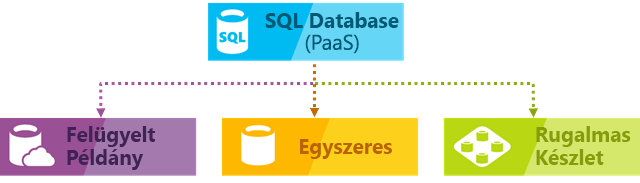
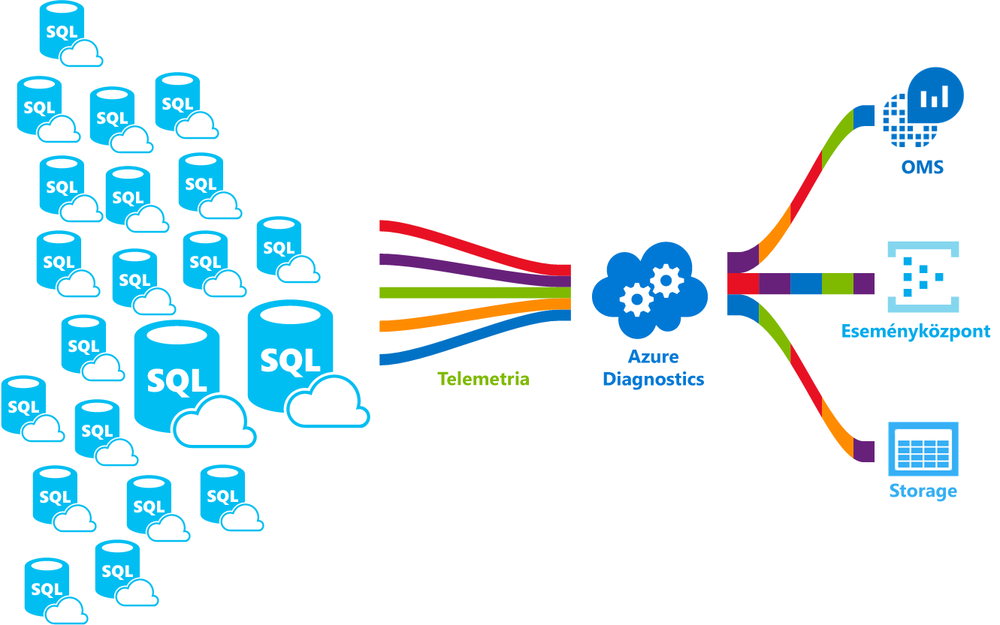

# Az Azure SQL Database szolgáltatásban

Az SQL Database általános célú, felügyelt relációsadatbázis-szolgáltatás a Microsoft Azure-ban, amely egyebek mellett relációs, JSON-, térbeli és XML-struktúrákat is támogat. Az SQL Database dinamikusan skálázható teljesítményt nyújt két különböző vásárlási modellen belül ([vCore-alapú vásárlási modell ](sql-database-service-tiers-vcore.md) vagy [DTU-alapú vásárlási modell](sql-database-service-tiers-dtu.md)). Az SQL Database emellett olyan lehetőségeket kínál, mint az [oszlopcentrikus indexelés](https://docs.microsoft.com/sql/relational-databases/indexes/columnstore-indexes-overview) a kivételes mélységű elemzéshez és jelentéskészítéshez, illetve a [memóriabeli OLTP](sql-database-in-memory.md) a rendkívül nagy teljesítményű tranzakciófeldolgozáshoz. A Microsoft zökkenőmentesen kezeli az SQL kódbázis karbantartását és frissítését, és teljesen átveszi az alapul szolgáló infrastruktúra kezelését.

Az Azure SQL Database az alábbi lehetőségeket kínálja az Azure SQL-adatbázisok üzembe helyezésére:

- Egy logikai kiszolgáló által felügyelt önálló, saját erőforráskészlettel rendelkező adatbázisként
- Készletezett adatbázisként egy [rugalmas készletben](sql-database-elastic-pool.md) egy logikai kiszolgálón keresztül felügyelt közös erőforráskészlettel
- Más néven adatbázis-egy gyűjtemény része egy [felügyelt példány](sql-database-managed-instance.md) , amely tartalmazza a rendszer és a felhasználói adatbázisok és erőforrások olyan készletét megosztása

Az alábbi ábra ezt a három üzembehelyezési modellt mutatja be:

Az SQL Database kódbázisa közös a [Microsoft SQL Server adatbázismotorjáéval](https://docs.microsoft.com/sql/sql-server/sql-server-technical-documentation). A Microsoft felhőt előnyben részesítő stratégiájának jegyében az SQL Server új lehetőségei először az SQL Database-ben jelentek meg, és csak aztán magában az SQL Serverben. Ennek a hozzáállásnak köszönhetően az SQL Server legújabb lehetőségei a karbantartás és frissítés terhei nélkül állnak az Ön rendelkezésére úgy, hogy az új funkciókat már több millió adatbázison tesztelték. A bejelentett új funkciókról az alábbi helyeken kaphat tájékoztatást:

- **[Az SQL Database az Azure ütemterve](https://azure.microsoft.com/roadmap/?category=databases)**:

  Ismerje meg, mi az új és újdonságokat helye.

- **[Az Azure SQL Database blog](https://azure.microsoft.com/blog/topics/database)**:

  Az a hely, ahol az SQL Server csapatának tagjai kapcsolatos SQL Database újdonságairól és funkcióiról.

> [!IMPORTANT]
> Az SQL Database és az SQL Server közötti különbségek ismertetéséért lásd az [SQL-szolgáltatásokkal](sql-database-features.md) foglalkozó témakört.

SQL Database kiszámítható teljesítményt több erőforrástípusok, a szolgáltatási szintek és a számítási méret, amely dinamikus méretezhetősége révén a nem állásidő, beépített intelligens optimalizálással, globális méretezhetőség és rendelkezésre állás és a speciális biztonsági biztosít beállítások – mindezt szinte Adminisztráció. Ezen képességek birtokában az alkalmazások gyors fejlesztésére és forgalomba hozásának felgyorsítására összpontosíthat ahelyett, hogy értékes időt és erőforrásokat kellene lefoglalnia a virtuális gépek és infrastruktúra kezeléséhez. Az SQL Database szolgáltatás jelenleg a világ 38 adatközpontjában áll rendelkezésre, és újabb adatközpontok is rendszeresen lépnek működésbe, így Ön a saját adatbázisát egy közeli adatközponton futtathatja.

## Méretezhető teljesítmény és készletek

Az SQL Database minden egyes adatbázis el különítve a önálló, hordozható, és a saját szolgáltatási szinten belül a [DTU-alapú vásárlási modell](sql-database-service-tiers-dtu.md) vagy [Virtuálismag-alapú vásárlási modell](sql-database-service-tiers-vcore.md) és a egy garantált a számítási méret. Az SQL Database különböző számítási méretekre biztosít a különféle igényekre szabva, és lehetővé teszi az adatbázisok készletekbe rendezését az erőforrások hatékony és pénzt takaríthat meg.

- A [SQL Database felügyelt példányain](sql-database-managed-instance.md), minden példány el különítve a többi példányok garantált erőforrásokkal. További információért tekintse meg a [felügyelt SQL Database-példányt](sql-database-managed-instance.md) ismertető cikket.
- Az a [nagy kapacitású szolgáltatásszint](sql-database-service-tier-hyperscale.md) (előzetes verzió) a vcore magok beszerzési modell, a skálázás 100 TB-ig gyors biztonsági mentés és képességek visszaállítása.

### Teljesítmény módosítása és skálázása leállási idő nélkül

Az SQL Database a [DTU-alapú vásárlási modellt](sql-database-service-tiers-dtu.md) vagy a [vCore-alapú vásárlási modellt](sql-database-service-tiers-vcore.md) kínálja.

- A DTU-alapú vásárlási modell a számítás, memória és IO-erőforrások egyvelegét kínálja három szolgáltatásszinten az adatbázisok kis és nagy terheléssel járó számítási feladatainak támogatása érdekében. Ezek a szintek az Alapszintű, a Standard és a Prémium. A számítási biztosít különböző többféle, ezeket az erőforrásokat, amelyhez további tárterület-erőforrások adhat hozzá az egyes szinteken belül.
- A vCore-alapú vásárlási modell lehetővé teszi a virtuális magok számának, a memória mennyiségének, illetve a tárterület mennyiségének és sebességének a kiválasztását.

Hozza létre első alkalmazását egy egyedülálló, kisméretű adatbázison alacsony áron az általános célú szolgáltatási szinten a havonta, és ezután váltson szolgáltatásszintet manuálisan vagy programon keresztül bármikor, ha a megoldás a kritikus fontosságú üzleti szolgáltatási szintet. Úgy módosíthatja a teljesítményt, hogy az nem jár leállással az alkalmazás vagy az ügyfelek számára. A dinamikus méretezhetőség révén az adatbázis átlátható módon reagál a gyorsan változó erőforrásigényekre, és lehetővé teszi, hogy csak azokért az erőforrásokért fizessen, amelyekre és amikor szüksége van.

> [!IMPORTANT]
> A [nagy kapacitású szolgáltatásszint](sql-database-service-tier-hyperscale.md) jelenleg nyilvános előzetes verzióban érhető el. Nem ajánlott semmilyen éles számítási feladatok futtatása a nagy kapacitású adatbázisokban még. Nagy kapacitású adatbázis egyéb szolgáltatási csomagokra nem frissíthető. Tesztelési célra ajánlott másolatot készít az aktuális adatbázisban, és frissíti a példányt nagy kapacitású szolgáltatásszinthez.

A dinamikus méretezhetőség különbözik az automatikus skálázástól. Automatikus skálázás esetén a szolgáltatás adott feltételek alapján, automatikusan méretez, míg a dinamikus méretezhetőség lehetővé teszi a manuális méretezést, amely nem jár állásidővel. Az önálló Azure SQL Database a manuális dinamikus méretezhetőséget támogatja, de az automatikus skálázást nem. Ha *automatikus* megoldást keres, érdemes megfontolni a rugalmas készletek használatát, amely lehetővé teszi, hogy az adatbázisok osztozzanak egy készlet erőforrásain az egyes adatbázisok egyedi igényei alapján. Vannak olyan szkriptek azonban, amelyek segítségével egy önálló Azure SQL Database esetén is automatizálhatja a méretezhetőséget. Erre az [Egyetlen SQL-adatbázis monitorozása és skálázása a PowerShell használatával](scripts/sql-database-monitor-and-scale-database-powershell.md) című témakörben láthat példát.

### Rugalmas készletek az erőforrások kihasználtságának maximalizálásához

Számos vállalkozás és alkalmazás számára elegendő az, ha önálló adatbázisokat tudnak létrehozni, majd azok teljesítményét szükség szerint felfelé és lefelé tudják skálázni – különösen akkor, ha a használati minták viszonylag jól jelezhetők előre. Azonban előre nem látható használati minták esetén nehézségekbe ütközhet a költségek és az üzleti modell kezelése. A [rugalmas készletek](sql-database-elastic-pool.md) megoldást jelentenek erre a problémára. A koncepció egyszerű. A készletekhez az önálló adatbázis helyett teljesítmény-erőforrásokat foglalhat le, így nem egy önálló adatbázis teljesítményéért, hanem a készlet közös teljesítményéért fizet.

   

A rugalmas készletekkel az erőforrásigények ingadozásakor sem kell a az adatbázis teljesítményének fel- és leskálázására koncentrálnia. A készletezett adatbázisok szükség szerint használják fel a teljesítmény-erőforrásokat. A készletezett adatbázisok használják az adatbáziskészlethez hozzárendelt teljesítményt, de nem lépik túl az adatbáziskészlet teljesítménykorlátait, így költségei előre jelezhetők még akkor is, ha az egyéni adatbázis-használat nem jelezhető előre. Ráadásul [adatbázisokat adhat hozzá a készlethez, és távolíthat el a készletből](sql-database-elastic-pool-manage-portal.md), így előre jelezhető költségek mellett néhány adatbázisról több ezer adatbázisra skálázhatja fel alkalmazását. A készlet adatbázisai számára elérhető erőforrások minimális és maximális mennyiségét is szabályozhatja annak érdekében, hogy a készlet egyetlen adatbázisa se használja fel a készlet összes erőforrását, és hogy minden készletezett adatbázis rendelkezzen egy garantált minimális erőforrás-mennyiséggel. A rugalmas készleteket használó SaaS-alkalmazások szerkezeti kialakításainak alaposabb megismeréséhez olvassa el a [Tervminták több-bérlős SaaS-alkalmazásokhoz SQL Database esetén](sql-database-design-patterns-multi-tenancy-saas-applications.md) című részt.

A szkriptek segítik a rugalmas készletek megfigyelését és méretezését. Erre a [Rugalmas SQL-készlet monitorozása és skálázása az Azure SQL Database-ben a PowerShell használatával](scripts/sql-database-monitor-and-scale-pool-powershell.md) című témakörben talál példát.

> [!IMPORTANT]
> A felügyelt SQL Database-példány nem támogatja a rugalmas készleteket.

### Önálló adatbázisok beolvasztása a készletezett adatbázisokba

Akár önálló adatbázisokat, akár rugalmas készleteket választ, a későbbiekben is sok mindent megváltoztathat. Az önálló adatbázisokat rugalmas készletekkel kombinálhatja, továbbá gyorsan és egyszerűen módosíthatja az önálló adatbázisok és a rugalmas készletek szolgáltatásszintjét, hogy mindig az adott helyzethez tudjon igazodni. Az Azure sokoldalúságának és széles körű alkalmazhatóságának köszönhetően tetszés szerint kombinálhatja az Azure-szolgáltatásokat SQL Database-adatbázisokkal, így kielégíthetők az egyedi, modern alkalmazástervezési igények, növelhető a költség- és erőforrás-hatékonyság, és új üzleti lehetőségek tárhatók fel.

### Széles körű figyelési és riasztási funkciók

Hogyan hasonlítható össze az önálló adatbázisok és a rugalmas készletek relatív teljesítménye? Hogyan lehet megállapítani a fel- és leskálázás megfelelő mértékét? Használja a [beépített teljesítménymonitorozási](sql-database-performance.md) és [riasztási](sql-database-insights-alerts-portal.md) eszközöket a teljesítmény-értékelésekkel kombinálva. Ezek lehetővé teszik az aktuális vagy a projekthez kapcsolódó teljesítményigényeken alapuló fel- vagy leskálázás hatásainak gyors kiértékelését. További információ: [DTU-alapú vásárlási modell](sql-database-service-tiers-dtu.md) és [vCore-alapú vásárlási modell](sql-database-service-tiers-vcore.md).

Az SQL Database emellett [metrikák és diagnosztikai naplók kibocsátásával](sql-database-metrics-diag-logging.md) is képes megkönnyíteni a felügyeletet. Az SQL Database beállítható az erőforrás-használatra, feldolgozókra és munkamenetekre, valamint kapcsolatokra vonatkozó adatok tárolására a következő Azure-erőforrások valamelyikén:

- **Azure Storage**: Nagy tömegű telemetriai adat alacsony költségű archiválására
- **Azure Event Hub**: Az SQL Database telemetriai adatainak integrálásra saját egyedi figyelési megoldásokkal vagy élő adatfolyamatokkal
- **Azure Log Analytics**: Beépített monitorozási megoldás jelentéskészítő, riasztó és enyhítő funkciókkal. Az Azure Log Analytics az egyik funkciója a [Operations Management Suite (OMS)](../operations-management-suite/operations-management-suite-overview.md)

    

## Rendelkezésre állás

Az Azure szolgáltatói szerződésében [(SLA)](http://azure.microsoft.com/support/legal/sla/) az ágazatban élenjáró módon 99,99 százalékos elérhetőséget biztosítunk – a Microsoft által kezelt adatbázisok globális hálózata teszi lehetővé, hogy alkalmazása a hét mind a 7 napján, napi 24 órában fusson. Az Azure platform teljes mértékben felügyeli az összes Azure SQL Database-példányt, garantálva az adatvesztés kiküszöbölését és az adatok nagy arányú rendelkezésre állását. Az Azure automatikusan kezeli a javításokat, a biztonsági mentéseket, a replikációt, a hibaészlelést, a háttérben álló lehetséges hardver-, szoftver- vagy hálózati hibákat, a hibajavítások telepítését, a feladatátvételeket, adatbázis-frissítéseket és az egyéb karbantartási műveleteket. A standard szintű rendelkezésre állás a számítási és tárolási rétegek elkülönítését foglalja magában. Prémium szintű rendelkezésre állás integrálása a számítási és tárolási teljesítmény egyetlen csomóponton, és majd megvalósítása az Always On rendelkezésre állási csoportok valójában hasonló technológia érhető el. Teljes az Azure SQL Database magas rendelkezésre állású lehetőségeit, lásd: [SQL adatbázis-elérhetőségi](sql-database-high-availability.md). Az SQL Database ezen felül olyan beépített funkciókkal szolgálja [az üzletmenet folytonosságát és a globális méretezhetőséget](sql-database-business-continuity.md), mint például a következők:

- **[Automatikus biztonsági mentések](sql-database-automated-backups.md)**:

  SQL Database automatikusan készít teljes, differenciális és tranzakciónapló biztonsági mentései.
- **[Időponthoz visszaállítás](sql-database-recovery-using-backups.md)**:

  Az SQL Database bármely időpontra történő helyreállítás támogatja az automatikus biztonsági mentések megőrzési időszakon belül.
- **[Aktív georeplikáció](sql-database-geo-replication-overview.md)**:

  SQL Database lehetővé teszi legfeljebb négy olvasható másodlagos adatbázis konfigurálását akár az azonos vagy globálisan elosztott Azure-beli adatközpontok.  Ha például egy SaaS-alkalmazás nagyszámú egyidejű csak olvasási tranzakciót kiszolgáló katalógus-adatbázisra épül, akkor az aktív georeplikáció által növelhető az olvashatóság, és megszűnik az elsődleges adatbázis magas olvasási terhelése miatti szűk keresztmetszet.
- **[Feladatátvételi csoportok](sql-database-geo-replication-overview.md)**:

  Az SQL Database lehetővé teszi magas rendelkezésre állást és terheléselosztást kínáljon globális léptékben, beleértve a transzparens georeplikációt és feladatátvételét a Nagy adatkészleteken, adatbázisok és rugalmas készletek. A feladatátvételi csoportok és az aktív georeplikáció által a lehető legkevesebb adminisztrációs többletmunkával hozhatók létre globálisan elosztott SaaS-alkalmazások úgy, hogy a figyelés, útválasztás és feladatátvétel összetett feladatát az SQL Database-re bízzuk.
- **[Zónaredundáns adatbázisok](sql-database-high-availability.md)**:

  SQL Database több rendelkezésre állási zónában is kiépíthet prémium vagy üzletileg kritikus fontosságú adatbázisokat vagy rugalmas készletek lehetővé teszi. Mivel ezek az adatbázisok és a rugalmas készletek több redundáns replikával rendelkeznek a magas rendelkezésre állás érdekében, e replikák több rendelkezésre állási zónában történő elhelyezése nagyobb rugalmasságot biztosít, beleértve az adatközpont méretezési hibáiból az adatvesztés nélküli, automatikus helyreállítás lehetőségét is.  

## Beépített intelligencia

Az SQL Database-zel beépített intelligencia is jár, amely segít jelentősen mérsékelni az adatbázisok működtetésének és kezelésének költségét, ugyanakkor fokozni az alkalmazás teljesítményét és biztonságát. Az állandóan ügyfelek millióinak számítási feladatait futtató SQL Database hatalmas mennyiségű telemetriai adatot dolgoz fel, végig szem előtt tartva az ügyfelek adatainak teljes védelmét. A telemetriai adatokat szüntelenül különféle algoritmusok értékelik, hogy a szolgáltatás tanulhasson belőlük és idomulhasson az Ön alkalmazásához. Ezen elemzés alapján a szolgáltatás az adott számítási feladatnak megfelelő javaslatokat tesz a teljesítmény javítására.

### Automatikus teljesítményfigyelés és finomhangolás

Az SQL Database részletes betekintést nyújt a figyelést kívánó lekérdezésekbe. Az SQL Database megismeri az adatbázisaira jellemző mintázatokat, és segít az adatbázis-sémáit a számítási feladathoz igazítani. Az SQL Database [javaslatokat tesz a teljesítmény finomhangolására](sql-database-advisor.md), és Ön eldöntheti, hogy alkalmazza-e a javasolt finomhangolási műveleteket.

Az adatbázisok folyamatos figyelése azonban nehéz, fárasztó feladat, különösen akkor, ha sok adatbázisról van szó. Az [Intelligent Insights](sql-database-intelligent-insights.md) elvégzi Ön helyett ezt a munkát. Automatikusan figyeli az SQL Database teljesítményét, és teljesítménycsökkenési hibák előfordulása esetén értesítést küld, azonosítja a probléma gyökerét, és ahol lehetséges, teljesítményjavítási javaslatokkal is szolgál.

Nagyszámú adatbázis hatékony kezelése már az SQL Database és az Azure Portal által kínált valamennyi eszköz és jelentés birtokában is lehetetlennek bizonyulhat. Az adatbázis személyes figyelése és finomhangolása helyett érdemes megfontolni, hogy a figyelési és hangolási műveletek egy részét az SQL Database [automatikus finomhangoló](sql-database-automatic-tuning.md) funkciójára bízza. Az SQL Database automatikusan alkalmazza a javasolt változásokat, de minden módosítást tesztel és ellenőriz, hogy a teljesítmény csak javulhasson. Az SQL Database ezáltal automatikusan, ellenőrzött és biztonságos módon alkalmazkodik a számítási feladathoz. Az automatikus finomhangolás azt jelenti, hogy ha az adatbázis egyes módosítások előtt és után gondosan mért teljesítményének összehasonlítása nem mutat javulást, akkor a módosító művelet visszavonásra kerül.

Jelenleg számos partnerünk, akik [több-bérlős SaaS-alkalmazásokat](sql-database-design-patterns-multi-tenancy-saas-applications.md) futtatnak SQL Database-en, az automatikus teljesítményhangolásra bízza az alkalmazása mindig stabil és kiszámítható működését. Ez a funkció nagy mértékben csökkenti számukra egy éjszaka közepén fellépő teljesítmény-visszaesés kockázatát. Ráadásul, mivel ügyfélkörük egy része szintén használ SQL Servert, az SQL Database által kínált azonos indexelési ajánlásokat alkalmazva nyújthatnak segítséget ezen ügyfeleknek.

Az [SQL Database](sql-database-automatic-tuning.md) két szempont alapján képes automatikus finomhangolást végezni:

- **Automatikus indexkezelés**: Azonosítja az adatbázishoz hozzáadandó és az abból eltávolítandó indexeket.
- **Automatikus tervkorrekció**: Azonosítja a hibás terveket, és javítja az SQL-tervek teljesítményproblémáit (hamarosan megjelenik, az SQL Server 2017-ben már elérhető).

### Adaptív lekérdezés-feldolgozás

Emellett az [adaptív lekérdezésfeldolgozási](/sql/relational-databases/performance/adaptive-query-processing) szolgáltatáscsalád is elérhető vált az SQL Database-ben, beleértve a több utasításból álló, táblaértékű függvények kihagyásos végrehajtását, a kötegelt módú memóriaengedély visszajelzését, valamint a kötegelt módú adaptív illesztéseket. Ezen adaptív lekérdezésfeldolgozó funkciók mindegyike hasonló technikával „tanul és alkalmazkodik”, ezzel is hozzájárulva a korábban nyomon követhetetlen lekérdezés-optimalizálási gondokra visszavezethető teljesítményproblémák megoldásához.

## Magas szintű biztonság és megfelelőség

Az SQl Database számos [beépített biztonsági és megfelelőségi szolgáltatást](sql-database-security-overview.md) kínálva járul hozzá, hogy az Ön alkalmazása eleget tegyen a különféle biztonsági és megfelelőségi elvárásoknak.

### Fejlett fenyegetésvédelem

Az SQL Advanced Threat Protection fejlett SQL-biztonsági funkciókat tartalmazó egyesített biztonsági csomag. Lehetőséget nyújt a bizalmas adatok felderítésére és titkossá minősítésére, az adatbázis biztonsági réseinek kezelésére, továbbá az adatbázisra nézve fenyegetést jelentő rendellenes tevékenységek észlelésére. Segítségével egyetlen helyen engedélyezhetők és kezelhetők ezek a képességek.

- [Adatfelderítés és besorolás](sql-database-data-discovery-and-classification.md):

  Ez a funkció (jelenleg előzetes verzióban érhető el) felderítése, a besorolása, a címkézés és a az adatbázisokban a bizalmas adatok védelme az Azure SQL Database-be beépített szolgáltatásokat biztosít. Használatával áttekinthető az adatbázis besorolási állapota, valamint követhető a bizalmas adatokhoz való hozzáférés az adatbázison belül és azon kívül.
- [A biztonságirés-értékelési](sql-vulnerability-assessment.md):

  Ez a szolgáltatás képes felderíteni, nyomon követheti, és segítséget nyújt az adatbázis biztonsági réseinek javítása. Áttekinthetővé teszi az adatbázisok biztonsági állapotát, és végrehajtható lépéseket kínál a biztonsági problémák megoldására, valamint az adatbázisok védelmének fejlesztésére.
- [Veszélyforrások Detektálása](sql-database-threat-detection.md):

  Ez a szolgáltatás észleli a elérni vagy kiaknázni az adatbázis szokatlan és vélhetően kárt okozó kísérleteket jelző rendellenes tevékenységek. A szolgáltatás folyamatosan figyeli az adatbázisokat, és azonnal értesíti a felhasználót a gyanús tevékenységekről, a lehetséges biztonsági résekről, az SQL-injektálásos támadásokról, valamint a rendellenes adatbázis-hozzáférési mintákról. A fenyegetésészlelés által adott riasztások tartalmazzák a gyanús tevékenység részleteit, és javaslatot tesznek a fenyegetés kivizsgálására és mérséklésére tett műveletekre.

### Naplózás a megfelelőség és biztonság szolgálatában

Az [SQL Database naplózási szolgáltatása](sql-database-auditing.md) nyomon követi az adatbázisok eseményeit és felvezeti ezeket egy naplófájlba, amely a felhasználó Azure Storage-fiókjában található. A naplózás segíthet a jogszabályi megfelelőség fenntartásában és az adatbázison végzett tevékenység megértésében, valamint az esetleg üzleti veszélyeket vagy biztonsági problémákat jelző rendellenességek feltárásában.

### Adattitkosítás

Az SQL Database a mozgásban lévő adatokat a [Transport Layer Security](https://support.microsoft.com/kb/3135244) protokoll, az inaktív adatokat [transzparens adattitkosítás](https://docs.microsoft.com/sql/relational-databases/security/encryption/transparent-data-encryption-azure-sql), a használatban lévő adatokat pedig az [Always Encrypted](https://docs.microsoft.com/sql/relational-databases/security/encryption/always-encrypted-database-engine) protokoll használatával titkosítja az adatok védelme érdekében.

### Azure Active Directory-integráció és többtényezős hitelesítés

Az SQL Database az [Azure Active Directory-integráció](sql-database-aad-authentication.md) által lehetővé teszi adatbázis-felhasználók és más Microsoft-szolgáltatások identitásainak központi kezelését. Ez a funkció egyszerűsíti az engedélyek kezelését és fokozza a biztonságot. Az Azure Active Directory a [többtényezős hitelesítés](sql-database-ssms-mfa-authentication.md) (MFA) támogatásával javítja az adatok és alkalmazások biztonságát, miközben támogatja az egyszeri bejelentkezést.

### Megfelelőségi tanúsítvány

Az SQL Database rendszeres ellenőrzéseken vesz részt és számos megfelelőségi szabványnak tesz eleget tanúsított módon. További információkat az [Azure biztonsági és adatkezelési központban](https://azure.microsoft.com/support/trust-center/) talál, az [SQL Database megfelelőségi tanúsítványainak](https://azure.microsoft.com/support/trust-center/services/) aktuális listájával együtt.

## Egyszerűen használható eszközök

Az SQL Database egyszerűbbé és hatékonyabbá teszi az alkalmazások létrehozását és karbantartását. Az SQL Database lehetővé teszi, hogy arra koncentrálhasson, amit legjobban tud: kiváló alkalmazások készítésére. Az SQL Database-ben a már meglévő eszközeivel és szakértelmével dolgozhat és fejleszthet.

- **[Az Azure Portalon](https://portal.azure.com/)**:

  A webes alkalmazás kezelése az Azure-szolgáltatásokhoz
- **[SQL Server Management Studio](https://docs.microsoft.com/sql/ssms/download-sql-server-management-studio-ssms)**:

  Egy ingyenes, letölthető ügyféloldali alkalmazás bármilyen SQL infrastruktúra kezelésére az SQL Servertől az SQL Database
- **[Az SQL Server Data Tools a Visual Studióban](https://docs.microsoft.com/sql/ssdt/download-sql-server-data-tools-ssdt)**:

  Egy ingyenes, letölthető ügyféloldali alkalmazás SQL Server relációs adatbázisok, Azure SQL Database-adatbázisok, Integration Services-csomagok, Analysis Services adatmodellek és Reporting Services-jelentések fejlesztéséhez.
- **[A Visual Studio Code](https://code.visualstudio.com/docs)**:

  Egy ingyenes, letölthető, nyílt forráskódú Kódszerkesztő Windows, macOS és Linux rendszerekre, amely támogatja a bővítményeket, beleértve a [mssql bővítményt](https://aka.ms/mssql-marketplace) a Microsoft SQL Server, az Azure SQL Database és az SQL Data Warehouse lekérdezéséhez.

Az SQL Database támogatja a Python, Java, Node.js, PHP, Ruby, és .NET alkalmazásfejlesztést a MacOS, Linux, és Windows rendszeren. Az SQL Database az SQL Serverrel azonos [adatkapcsolattárakat](sql-database-libraries.md) támogat.

## Kapcsolatfelvétel az SQL Server műszaki csoportjával

- [DBA-veremcsere](https://dba.stackexchange.com/questions/tagged/sql-server): Kérdések az adatbázis rendszergazdájának
- [Veremtúlcsordulás](http://stackoverflow.com/questions/tagged/sql-server): Kérdések a fejlesztőknek
- [MSDN fórumok](https://social.msdn.microsoft.com/Forums/home?category=sqlserver): Műszaki kérdések
- [Visszajelzés](http://aka.ms/sqlfeedback): Hibák jelentése és funkciók kérése
- [Reddit](https://www.reddit.com/r/SQLServer/): Az SQL Server megvitatása

## További lépések

- Tekintse meg az [árképzést ismertető oldalt](https://azure.microsoft.com/pricing/details/sql-database/) az önálló adatbázisok és a rugalmas készletek költségeinek összehasonlításáért és árkalkulációjáért.
- Tekintse meg ezeket a rövid útmutatókat a kezdéshez:

  - [SQL Database létrehozása az Azure Portalon](sql-database-get-started-portal.md)  
  - [SQL Database létrehozása az Azure CLI-vel](sql-database-get-started-cli.md)
  - [SQL Database létrehozása PowerShell használatával](sql-database-get-started-powershell.md)

- Több Azure CLI és PowerShell-mintát talál itt:
  - [Azure CLI-minták az SQL Database-hez](sql-database-cli-samples.md)
  - [Azure PowerShell-minták az SQL Database-hez](sql-database-powershell-samples.md)
