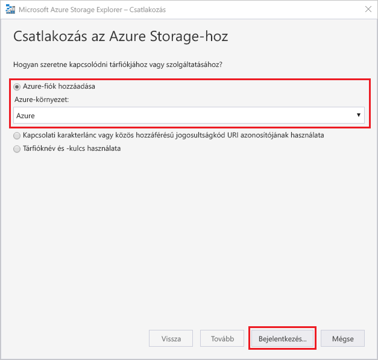
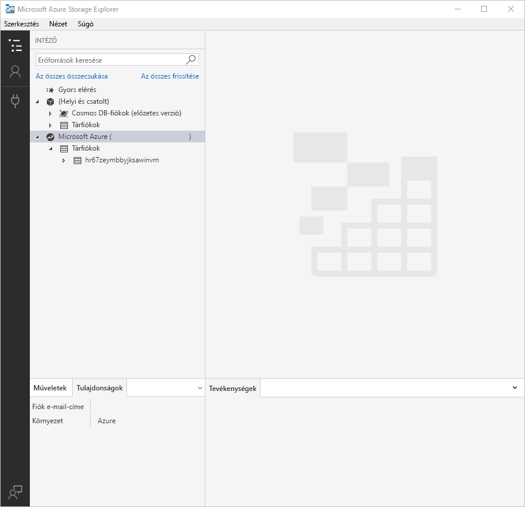

# Útmutató: Azure Storage explorer használatával a fájlok és könyvtárak szintű engedélyek beállítása

Ez a cikk bemutatja, hogyan szintet fájl- és hozzáférés-vezérlési listák keresztül az Azure Storage explorer asztali verzióját.

Ez a cikk a, hogy az Azure Storage Explorer telepítése szükséges. Az Azure Storage Explorer Windows, Macintosh vagy Linux rendszerre való letöltése: [Azure Storage Explorer](https://azure.microsoft.com/features/storage-explorer/).

## Jelentkezzen be a Storage Explorerben

Első indításkor megjelenik a **Microsoft Azure Storage Explorer – Csatlakozás** ablak. A Storage Explorer storage-fiókokhoz való csatlakozással több módot is kínál, miközben csak egy módja jelenleg támogatott hozzáférés-vezérlési listák felügyelete.

|Tevékenység|Cél|
|---|---|
|Azure-fiók hozzáadása | Átirányítja a vállalati bejelentkezési oldalra az Azure-hitelesítéshez. Ezt a műveletet jelenleg az egyetlen hitelesítési módszer, amely lehetővé teszi, hogy a hozzáférés-vezérlési listák a storage explorer használatával kezelheti.|

Válassza ki **Azure-fiók hozzáadása** kattintson **bejelentkezéskor**. A képernyőn megjelenő utasításokat követve jelentkezzen be Azure-fiókjába.

A csatlakozás befejeztével az Azure Storage Explorer betöltést követően megjeleníti az **Explorer** lapot. Ezen a lapon áttekintheti az összes Azure-tárfiókját, valamint az [Azure Storage Emulator](../common/storage-use-emulator.md?toc=%2fazure%2fstorage%2fblobs%2ftoc.json)- és [Cosmos DB](../../cosmos-db/storage-explorer.md?toc=%2fazure%2fstorage%2fblobs%2ftoc.json)-fiókokon, illetve az [Azure Stack](../../azure-stack/user/azure-stack-storage-connect-se.md?toc=%2fazure%2fstorage%2fblobs%2ftoc.json)-környezeteken keresztül konfigurált helyi tárolókat.

## Hozzáférés-kezelés

Beállíthatja, hogy a engedélyeit a fájlrendszer gyökérmappájában. Ehhez kattintson a jobb gombbal a fájlrendszer, és válassza ki **engedélyek kezelése**.

A rendszer úgy viszi, megjelenik a **kezelése engedély** parancssort.

A **hozzáférés kezelése** kérdés lehetővé teszi kezelheti az engedélyeiket tulajdonos és a tulajdonosok csoport, valamint az új felhasználók hozzáadása a hozzáférés-vezérlési lista, amely ezután kezelheti engedélyeket. További információ engedélyeket, az alapértelmezett engedélyek, a hozzáférési engedélyeket és a felhasználók viselkedését, például: a cikk a [hozzáférés-vezérlés a data lake storage gen2](data-lake-storage-access-control.md#access-control-lists-on-files-and-directories). Itt van kijelölve nem állítja be hozzáférés-vezérlési listák a könyvtárán belül található bármelyik jelenleg meglévő elemre.

Ajánlott biztonsági csoportok létrehozása és karbantartása az egyéni felhasználók helyett a csoport engedélyeit. Ez a javaslat és más ajánlott eljárásokról a részletekért lásd: a [ajánlott eljárások a data lake storage gen2](data-lake-storage-best-practices.md) cikk.

Kezelheti az engedélyeket az egyes könyvtárak, valamint az egyes fájlok részletes hozzáférés-vezérlés lehetővé teszi. A fájlok és könyvtárak engedélyeinek kezelésének folyamata megegyezik a fent leírt módon.

## További lépések

Ebben az útmutatóban útmutatóból megtudhatta, hogyan engedélyek beállítása a fájlok és könyvtárak használatával **Azure Storage Explorer**. Hozzáférés-vezérlési listák és engedélyekkel kapcsolatos további információkért folytassa a tárgyban fogalmi című cikkben.

> [!div class="nextstepaction"]
> [Az Azure Data Lake Storage Gen2 HAccess vezérlés](data-lake-storage-access-control.md)