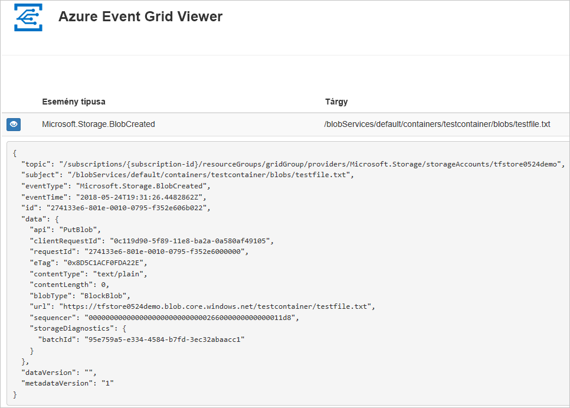
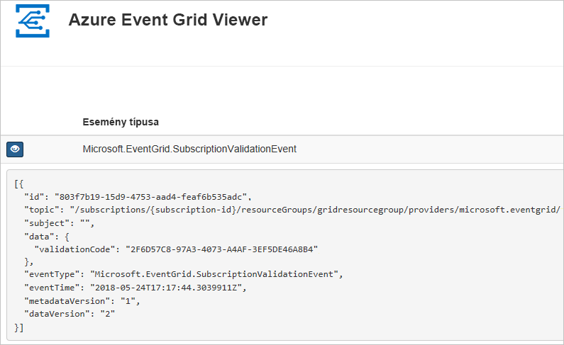

# <a name="route-blob-storage-events-to-a-custom-web-endpoint-with-azure-cli"></a>Azure Blob Storage-események átirányítása egyéni webes végpontra az Azure CLI használatával

Az Azure Event Grid egy felhőalapú eseménykezelési szolgáltatás. Ebben a cikkben előfizetünk a Blob Storage-eseményekre az Azure CLI-vel, majd elindítjuk az eseményt az eredmény megtekintéséhez.

Általában olyan végpontoknak szoktunk eseményeket küldeni, amelyek eseményadatokat dolgoznak fel és műveleteket hajtanak végre. A cikk egyszerűsítése érdekében azonban az eseményeket egy olyan webalkalmazásnak küldjük el, amely az üzenetek gyűjtésével és megjelenítésével foglalkozik.

A cikkben leírt lépések elvégzése után látni fogja, hogy az eseményadatokat a webalkalmazásnak küldte el a rendszer.




[!INCLUDE [quickstarts-free-trial-note.md](../../../includes/quickstarts-free-trial-note.md)]

[!INCLUDE [cloud-shell-try-it.md](../../../includes/cloud-shell-try-it.md)]

Ha a CLI helyi telepítését és használatát választja, akkor ehhez a cikkhez az Azure CLI legújabb verzióját (2.0.24 vagy újabb) kell futtatnia. A verzió megkereséséhez futtassa a következőt: `az --version`. Ha telepíteni vagy frissíteni szeretne: [Az Azure CLI telepítése](/cli/azure/install-azure-cli).

Ha nem a Cloud Shellt használja, először be kell jelentkeznie a(z) `az login` használatával.

## <a name="create-a-resource-group"></a>Hozzon létre egy erőforráscsoportot

Az Event Grid-témakörök Azure-erőforrások, amelyeket egy Azure-erőforráscsoportba kell helyezni. Az erőforráscsoport egy olyan logikai gyűjtemény, amelyben a rendszer üzembe helyezi és kezeli az Azure-erőforrásokat.

Hozzon létre egy erőforráscsoportot az [az group create](/cli/azure/group#az_group_create) paranccsal. 

A következő példában létrehozunk egy `<resource_group_name>` nevű erőforráscsoportot a *westcentralus* helyen.  A `<resource_group_name>` elemet az erőforráscsoport egyedi nevére cserélje le.

```azurecli-interactive
az group create --name <resource_group_name> --location westcentralus
```

## <a name="create-a-storage-account"></a>Tárfiók létrehozása

A Blob Storage-események használatához szüksége lesz vagy egy [Blob Storage-fiókra](../common/storage-create-storage-account.md?toc=%2fazure%2fstorage%2fblobs%2ftoc.json#blob-storage-accounts), vagy egy [General Purpose v2-tárfiókra](../common/storage-account-options.md#general-purpose-v2-accounts). Az általános célú **General Purpose v2- (GPv2-)** fiókok olyan tárfiókok, amelyek a Storage-szolgáltatások összes funkcióját támogatják, beleértve a blobokat, a fájlokat, az üzenetsorokat és a táblákat is. A **Blob Storage-fiók** egy speciális tárfiók a strukturálatlan adatok blobként (objektumként) való tárolására az Azure Storage-ban. A Blob Storage-fiókok olyanok, mint a meglévő általános célú tárfiókjai, és a jelenlegi rendszereivel megegyező szintű tartósságot, rendelkezésre állást, méretezhetőséget és teljesítményt nyújtanak, beleértve a 100%-os API-konzisztenciát a blokkblobokhoz és a hozzáfűző blobokhoz. A csak blokkok és hozzáfűző blobok tárolását igénylő alkalmazásokhoz javasoljuk a Blob Storage-fiókok használatát. 

> [!NOTE]
> A Storage-események rendelkezésre állása az Event Grid [rendelkezésre állásától](../../event-grid/overview.md) függ, a többi régióban pedig az Event Griddel egyszerre válnak majd elérhetővé.

A `<storage_account_name>` elemet cserélje le az erőforráscsoport egyedi nevére, a `<resource_group_name>` elemet pedig a korábban létrehozott erőforráscsoportra.

```azurecli-interactive
az storage account create \
  --name <storage_account_name> \
  --location westcentralus \
  --resource-group <resource_group_name> \
  --sku Standard_LRS \
  --kind BlobStorage \
  --access-tier Hot
```

## <a name="create-a-message-endpoint"></a>Üzenetvégpont létrehozása

A témakörre való feliratkozás előtt hozzuk létre az eseményüzenet végpontját. A végpont általában az eseményadatok alapján hajt végre műveleteket. Az útmutató egyszerűsítése érdekében egy olyan [előre létrehozott webalkalmazást](https://github.com/dbarkol/azure-event-grid-viewer) helyezünk üzembe, amely megjeleníti az esemény üzeneteit. Az üzembe helyezett megoldás egy App Service-csomagot, egy App Service-webalkalmazást és egy, a GitHubról származó forráskódot tartalmaz.

A `<your-site-name>` elemet a webalkalmazás egyedi nevére cserélje le. A webalkalmazás nevének egyedinek kell lennie, mert a DNS-bejegyzés része.

```azurecli-interactive
sitename=<your-site-name>

az group deployment create \
  --resource-group <resource_group_name> \
  --template-uri "https://raw.githubusercontent.com/dbarkol/azure-event-grid-viewer/master/azuredeploy.json" \
  --parameters siteName=$sitename hostingPlanName=viewerhost
```

Az üzembe helyezés befejezése eltarthat néhány percig. A sikeres üzembe helyezést követően tekintse meg a webalkalmazást, hogy meggyőződjön annak működéséről. Egy webböngészőben navigáljon a következő helyre: `https://<your-site-name>.azurewebsites.net`.

A helynek megjelenített üzenetek nélkül kell megjelennie.

[!INCLUDE [event-grid-register-provider-cli.md](../../../includes/event-grid-register-provider-cli.md)]

## <a name="subscribe-to-your-storage-account"></a>Előfizetés a tárfiókra

A témakörre való feliratkozással lehet tudatni az Event Griddel, hogy mely eseményeket kívánja nyomon követni, és hová szeretné küldeni azokat. Az alábbi példa bemutatja a létrehozott tárfiókra való feliratkozást, és átadja a webalkalmazásából származó URL-címet az eseményértesítés végpontjaként. Az `<event_subscription_name>` elemet cserélje le az esemény-előfizetéshez választott névre. A `<resource_group_name>` és `<storage_account_name>` elemnél a korábban létrehozott értékeket adja meg.

A webalkalmazás végpontjának az `/api/updates/` utótagot kell tartalmaznia.

```azurecli-interactive
storageid=$(az storage account show --name <storage_account_name> --resource-group <resource_group_name> --query id --output tsv)
endpoint=https://$sitename.azurewebsites.net/api/updates

az eventgrid event-subscription create \
  --resource-id $storageid \
  --name <event_subscription_name> \
  --endpoint $endpoint
```

Tekints meg újra a webalkalmazást, ahol láthatja, hogy az fogadta az előfizetés érvényesítési eseményét. Az eseményadatok kibontásához kattintson a szem ikonra. Az Event Grid elküldi az érvényesítési eseményt, így a végpont megerősítheti, hogy eseményadatokat akar kapni. A webalkalmazás az előfizetés érvényesítéséhez szükséges kódot tartalmaz.



## <a name="trigger-an-event-from-blob-storage"></a>Esemény kiváltása a Blob Storage-ból

Most aktiváljunk egy eseményt, és lássuk, hogyan küldi el az üzenetet az Event Grid a végpontnak. Először konfiguráljuk a tárfiók nevét és kulcsát, majd hozzunk létre egy tárolót, végül hozzunk létre és töltsünk fel egy fájlt. Ismét a korábban létrehozott `<storage_account_name>` és `<resource_group_name>` értéket használja.

```azurecli-interactive
export AZURE_STORAGE_ACCOUNT=<storage_account_name>
export AZURE_STORAGE_ACCESS_KEY="$(az storage account keys list --account-name <storage_account_name> --resource-group <resource_group_name> --query "[0].value" --output tsv)"

az storage container create --name testcontainer

touch testfile.txt
az storage blob upload --file testfile.txt --container-name testcontainer --name testfile.txt
```

Ön kiváltotta az eseményt, az Event Grid pedig elküldte az üzenetet a feliratkozáskor konfigurált végpontnak. Tekintse meg a webalkalmazást az imént elküldött esemény megtekintéséhez.


```json
[{
  "topic": "/subscriptions/xxxxxxxx-xxxx-xxxx-xxxx-xxxxxxxxxxxx/resourceGroups/myrg/providers/Microsoft.Storage/storageAccounts/myblobstorageaccount",
  "subject": "/blobServices/default/containers/testcontainer/blobs/testfile.txt",
  "eventType": "Microsoft.Storage.BlobCreated",
  "eventTime": "2017-08-16T20:33:51.0595757Z",
  "id": "4d96b1d4-0001-00b3-58ce-16568c064fab",
  "data": {
    "api": "PutBlockList",
    "clientRequestId": "d65ca2e2-a168-4155-b7a4-2c925c18902f",
    "requestId": "4d96b1d4-0001-00b3-58ce-16568c000000",
    "eTag": "0x8D4E4E61AE038AD",
    "contentType": "text/plain",
    "contentLength": 0,
    "blobType": "BlockBlob",
    "url": "https://myblobstorageaccount.blob.core.windows.net/testcontainer/testblob1.txt",
    "sequencer": "00000000000000EB0000000000046199",
    "storageDiagnostics": {
      "batchId": "dffea416-b46e-4613-ac19-0371c0c5e352"
    }
  },
  "dataVersion": "",
  "metadataVersion": "1"
}]

```

## <a name="clean-up-resources"></a>Az erőforrások eltávolítása
Ha azt tervezi, hogy folytatja a tárfiók és az esemény előfizetésének használatát, akkor ne törölje a cikkben létrehozott erőforrásokat. Ha nem folytatja a munkát, akkor a következő paranccsal törölheti a cikkben létrehozott erőforrásokat.

A `<resource_group_name>` elemet cserélje le a fent létrehozott erőforráscsoportra.

```azurecli-interactive
az group delete --name <resource_group_name>
```

## <a name="next-steps"></a>További lépések

Most, hogy megismerkedett vele, hogyan hozhat létre témaköröket és eseményfeliratkozásokat, bővebben is tájékozódhat arról, hogy miben nyújthatnak segítséget a Blob Storage-események és az Event Grid:

- [Reagálás Blob Storage-eseményekre](storage-blob-event-overview.md)
- [Bevezetés az Event Grid használatába](../../event-grid/overview.md)
