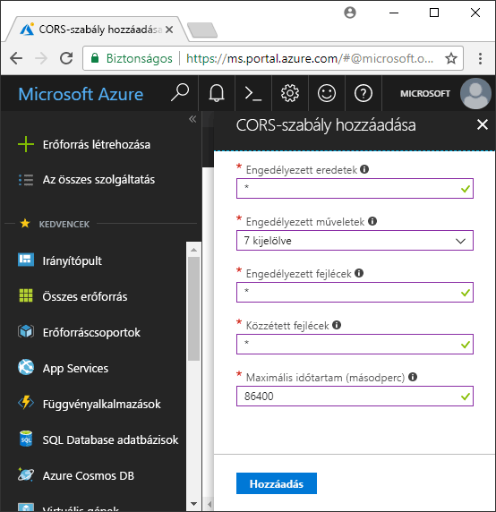

<!-- Customer intent: As a web application developer I want to interface with Azure Blob storage entirely on the client so that I can build a SPA application that is able to upload and delete files on blob storage. -->

# <a name="quickstart-upload-list-and-delete-blobs-using-javascripthtml-in-the-browser"></a>Rövid útmutató: Blobok feltöltése, listázása és törlése a böngészőben JavaScript/HTML használatával
Ebből a rövid útmutatóból megtudhatja, hogy hogyan kezelheti a blobokat böngészőben futó kóddal. Az itt bemutatott megközelítés szemlélteti a megfelelő biztonsági eszközök használatát is a Blob Storage-fiók biztonságos elérése érdekében. A rövid útmutató elvégzéséhez szüksége lesz egy [Azure-előfizetésre](https://azure.microsoft.com/free/?WT.mc_id=A261C142F).

[!INCLUDE [storage-quickstart-tutorial-create-account-portal](../../../includes/storage-quickstart-tutorial-create-account-portal.md)]

## <a name="setting-up-storage-account-cors-rules"></a>Tárfiók CORS-szabályainak beállítása 
Ahhoz, hogy a webalkalmazás hozzáférhessen a Blob Storage-hez az ügyfélről, a fiókot először úgy kell konfigurálni, hogy lehetővé tegye az [eltérő eredetű erőforrások megosztását](https://docs.microsoft.com/rest/api/storageservices/cross-origin-resource-sharing--cors--support-for-the-azure-storage-services), más néven a CORS-t. 

Lépjen vissza az Azure Portalra, és válassza ki a tárfiókot. Új CORS-szabály meghatározásához térjen vissza a **Beállítások** szakaszra, és kattintson a **CORS** hivatkozásra. Ezután kattintson a **Hozzáadás** gombra a **CORS-szabály hozzáadása** ablak megnyitásához. Ebben a rövid útmutatóban egy nyitott CORS-szabályt hozunk létre:



A következő tábla az egyes CORS-beállításokat írja le, és ismerteti a szabály meghatározásához használt értékeket.

|Beállítás  |Érték  | Leírás |
|---------|---------|---------|
| Engedélyezett eredetek | * | Elfogadható eredetekként beállított tartományok vesszővel tagolt listáját fogadja el. A `*` érték beállításakor minden tartomány hozzáfér a tárfiókhoz. |
| Engedélyezett műveletek     | törlés, lekérés, fej, egyesítés, közzététel, beállítások és áthelyezés | A tárfiókon futtatható HTTP-műveleteket listázza. Ebben a rövid útmutatóban válassza ki az összes elérhető beállítást. |
| Engedélyezett fejlécek | * | A tárfiókban engedélyezett kérelemfejlécek listáját határozza meg (beleértve az előtaggal ellátott fejléceket). A `*` érték beállítása minden fejléc hozzáférését engedélyezi. |
| Közzétett fejlécek | * | A fiók által engedélyezett válaszfejléceket listázza. A `*` érték beállítása esetén a fiók bármilyen fejlécet küldhet.  |
| Maximális időtartam (másodperc) | 86400 | A maximális idő, ameddig a böngésző gyorsítótárazza az előzetes OPTIONS kérést. A *86400* érték lehetővé teszi, hogy a gyorsítótár egy teljes napig megmaradjon. |

> [!IMPORTANT]
> Győződjön meg arról, hogy az éles környezetben használt beállítások a tárfiókhoz minimálisan szükséges hozzáférést tegyék elérhetővé a biztonságos hozzáférés fenntartása érdekében. Az itt leírt CORS-beállítások megfelelőek ehhez a rövid útmutatóhoz, mert laza biztonsági szabályzatot határoznak meg. Nem ajánlottak azonban valós környezetekben.

Ezután az Azure Cloud Shell-lel létrehoz egy biztonsági jogkivonatot.

[!INCLUDE [Open the Azure cloud shell](../../../includes/cloud-shell-try-it.md)]

## <a name="create-a-shared-access-signature"></a>Közös hozzáférésű jogosultságkód létrehozása
A böngészőben futó kód a közös hozzáférésű jogosultságkóddal (SAS) engedélyezteti a Blob Storage-ba érkező kéréseket. A SAS használatával az ügyfél a fiók hozzáférési kulcsa vagy kapcsolati sztringje nélkül is elvégezheti a tárolási erőforrásokhoz való hozzáférés engedélyeztetését. Az SAS-sel kapcsolatos további információkat a [közös hozzáférésű jogosultságkód (SAS) használatát ismertető](../common/storage-dotnet-shared-access-signature-part-1.md) cikkben olvashat.

Létrehozhat egy SAS-t az Azure CLI használatával az Azure Cloud Shellen keresztül vagy az Azure Storage Explorerrel. A következő tábla azon paramétereket sorolja fel, amelyek értékét meg kell adnia SAS CLI-vel való létrehozásakor.

| Paraméter      |Leírás  | Helyőrző |
|----------------|-------------|-------------|
| *expiry*       | A hozzáférési jogkivonat lejárati dátuma ÉÉÉÉ-HH-NN formátumban. Írja be a holnapi dátumot ehhez a rövid útmutatóhoz. | *FUTURE_DATE* |
| *account-name* | A tárfiók neve. Használja a korábbi lépésben félretett nevet. | *YOUR_STORAGE_ACCOUNT_NAME* |
| *account-key*  | A tárfiókkulcs. Használja a korábbi lépésben félretett kulcsot. | *YOUR_STORAGE_ACCOUNT_KEY* |

A következő szkript az Azure CLI használatával hozott létre egy SAS-t, amelyet átadhat egy JavaScript Blob szolgáltatásnak.

> [!NOTE]
> A legjobb eredmények eléréséhez távolítsa el az extra szóközöket a paraméterek között, mielőtt beillesztené a parancsot az Azure Cloud Shellbe.

```bash
az storage account generate-sas
                    --permissions racwdl
                    --resource-types sco
                    --services b
                    --expiry FUTURE_DATE
                    --account-name YOUR_STORAGE_ACCOUNT_NAME
                    --account-key YOUR_STORAGE_ACCOUNT_KEY
```
A paraméterek után szereplő értékek nehezen érthetőek lehetnek. Ezek a paraméterértékek a megfelelő engedélyek első betűiből vannak összeállítva. A következő táblázat az értékek eredetét írja le: 

| Paraméter        | Érték   | Leírás  |
|------------------|---------|---------|
| *permissions*    | racwdl  | Ez az SAS *olvasási*, *hozzáfűzési*, *létrehozási*, *írási*, *törlési* és *listázási* képességeket engedélyez. |
| *resource-types* | sco     | Az SAS a *szolgáltatás*, a *tároló* és az *objektum* erőforrásokra van hatással. |
| *services*       | b       | Az SAS a *Blob* szolgáltatásra van hatással. |

Most, hogy létrejött az SAS, másolja a konzolban visszaadott értéket a szövegszerkesztőbe. Ezt az értéket egy következő lépésben fogja használni.

> [!IMPORTANT]
> Éles környezetben mindig SSL használatával adja át az SAS-jogkivonatot. Ezenkívül az SAS-jogkivonatokat a kiszolgálón kell létrehozni, és a HTML-oldalra kell küldeni, hogy a rendszer visszaadja azokat az Azure Blob Storage-ba. Érdemes például kiszolgáló nélküli függvényt használni SAS-jogkivonatok létrehozásához. Az Azure Portal olyan függvénysablonokat tartalmaz, amelyekkel JavaScript-függvény használatával hozható létre SAS.

## <a name="implement-the-html-page"></a>A HTML-oldal implementálása

### <a name="set-up-the-web-application"></a>A webalkalmazás beállítása
Az Azure Storage JavaScript-ügyfélkódtárai nem működnek közvetlenül a fájlrendszerből, és ezeket webkiszolgálónak kell kiszolgálnia. Ezért a következő lépések bemutatják, hogyan használhat egy egyszerű helyi webkiszolgálót Node.js-el.

> [!NOTE]
> Ez a szakasz ismerteti, hogyan hozhat létre olyan helyi webkiszolgálót, amelyhez a Node.js-nek telepítve kell lennie a gépen. Ha nem szeretné telepíteni a Node.js-t, más módon futtathat helyi webkiszolgálót.

Először hozzon létre egy új mappát a projekthez, és adja neki az *azure-blobs-javascript* nevet. Ezután nyisson meg egy parancssort az *azure-blobs-javascript* mappában, és készítse elő az alkalmazást a webkiszolgáló-modul telepítésére a következő parancs beírásával:

```bash
npm init -y
```
Az *init* futtatása a webkiszolgáló-modul telepítését elősegítő fájlokat ad hozzá. A modul telepítéséhez írja be a következő parancsot:

```bash
npm i http-server
```
Ezután szerkessze a *package.json* fájlt, és cserélje le a meglévő *scripts* definíciót a következő kódrészletre:

```javascript
"scripts": {
    "start": "http-server"
}
```
Végül a parancssorba írja be az `npm start` parancsot a webkiszolgáló elindításához:

```bash
npm start
```

### <a name="get-the-blob-storage-client-library"></a>A Blob Storage-ügyfélkódtár beszerzése
[Töltse le a JavaScript-ügyfélkódtárakat](https://aka.ms/downloadazurestoragejs), bontsa ki a zip tartalmát, és helyezze a *bundle* mappában lévő szkriptfájlokat a *scripts* mappába.

### <a name="add-the-client-script-reference-to-the-page"></a>Az ügyfél szkriptreferenciájának hozzáadása az oldalhoz
Hozzon létre egy HTML-oldalt az *azure-blobs-javascript* mappa gyökerében, és adja neki az *index.html* nevet. Az oldal létrehozása után adja hozzá a következő kódot az oldalhoz.

```html
<!DOCTYPE html>
<html>
    <body>
        <button id="create-button">Create Container</button>

        <input type="file" id="fileinput" />
        <button id="upload-button">Upload</button>

        <button id="list-button">List</button>
        
        <button id="delete-button">Delete</button>
    </body>
    <script src="scripts/azure-storage.blob.min.js"></script>
    <script>
        // Blob-related code goes here
    </script>
</html>
```
A kód a következőket adja hozzá az oldalhoz:

- a *scripts/azure-storage.blob.js*-re mutató hivatkozás
- tároló létrehozásához, valamint blobok feltöltéséhez, listázásához és törléséhez használható gombok
- fájlok feltöltéséhez használható *INPUT* elem
- tárolóval kapcsolatos kód helyőrzője

### <a name="create-an-instance-of-blobservice"></a>BlobService-példány létrehozása 
A [Blob szolgáltatás](https://azure.github.io/azure-storage-node/BlobService.html) csatlakozást biztosít az Azure Blob Storage-hoz. A szolgáltatás egy példányának létrehozásához meg kell adnia a tárfiók nevét és a korábbi lépésben létrehozott SAS-t.

```javascript
const account = {
    name: YOUR_STORAGE_ACCOUNT_NAME,
    sas:  YOUR_SAS
};

const blobUri = 'https://' + account.name + '.blob.core.windows.net';
const blobService = AzureStorage.Blob.createBlobServiceWithSas(blobUri, account.sas);
```

### <a name="create-a-blob-container"></a>Blobtároló létrehozása
A létrehozott Blob szolgáltatással most létrehozhat egy új tárolót a feltöltött blobok tárolásához. A [createContainerIfNotExists](https://azure.github.io/azure-storage-node/BlobService.html#createContainerIfNotExists__anchor) módszer létrehoz egy új tárolót, és nem ad vissza hibát, ha a tároló már létezik.

```javascript
document.getElementById('create-button').addEventListener('click', () => {

    blobService.createContainerIfNotExists('mycontainer',  (error, container) => {
        if (error) {
            // Handle create container error
        } else {
            console.log(container.name);
        }
    });

});
```

### <a name="upload-a-blob"></a>Blob feltöltése
Ha HTML-űrlapból kíván blobot feltölteni, be kell szereznie a választott fájl hivatkozását egy *INPUT* elemből. A választott fájl a `files` tömbben érhető el az olyan elemeknél, amelyek *type* tulajdonsága a *file* értékre van állítva.

A szkriptből hivatkozhat a HTML-elemre, és átadhatja a kiválasztott fájlt a Blob szolgáltatásba.

```javascript
document.getElementById('upload-button').addEventListener('click', () => {

    const file = document.getElementById('fileinput').files[0];

    blobService.createBlockBlobFromBrowserFile('mycontainer', 
                                                file.name, 
                                                file, 
                                                (error, result) => {
                                                    if(error) {
                                                        // Handle blob error
                                                    } else {
                                                        console.log('Upload is successful');
                                                    }
                                                });

});
```

A [createBlockBlobFromBrowserFile](https://azure.github.io/azure-storage-node/BlobService.html#createBlockBlobFromBrowserFile__anchor) metódus közvetlenül a böngészőfájl segítségével végez feltöltést a blobtárolóba.

### <a name="list-blobs"></a>Blobok listázása
Miután feltöltött egy fájlt a blobtárolóba, a [listBlobsSegmented](https://azure.github.io/azure-storage-node/BlobService.html#listBlobsSegmented__anchor) metódussal érheti el a tárolóban lévő blobok listáját.

```javascript
document.getElementById('list-button').addEventListener('click', () => {

    blobService.listBlobsSegmented('mycontainer', null, (error, results) => {
        if (error) {
            // Handle list blobs error
        } else {
            results.entries.forEach(blob => {
                console.log(blob.name);
            });
        }
    });
    
});
```

A *listBlobsSegmented* metódus visszaadja a blobok gyűjteményét. A gyűjtemény alapértelmezés szerint 5000 blobot tartalmaz, de ezt az értéket testreszabhatja az igényeinek megfelelően. A [folytatásos mintakód](https://github.com/Azure/azure-storage-node/blob/master/examples/samples/continuationsample.js#L132) bemutatja, hogyan dolgozhat nagyszámú blobbal, és hogy az ügyfélkódtár miként támogatja a lapozást. 


### <a name="delete-blobs"></a>Blobok törlése
A [deleteBlobIfExists](https://azure.github.io/azure-storage-node/BlobService.html#deleteBlobIfExists__anchor) meghívásával törölheti a feltöltött blobot.

```javascript
document.getElementById('delete-button').addEventListener('click', () => {

    var blobName = YOUR_BLOB_NAME;
    blobService.deleteBlobIfExists('mycontainer', blobName, (error, result) => {
        if (error) {
            // Handle delete blob error
        } else {
            console.log('Blob deleted successfully');
        }
    });
    
});
```
> [!WARNING]
> Ahhoz, hogy a kódminta működjön, meg kell adnia egy sztringértéket a *blobName* számára.

## <a name="clean-up-resources"></a>Az erőforrások eltávolítása
A rövid útmutató során létrehozott erőforrások törléséhez térjen vissza az [Azure Portalra](https://portal.azure.com), és válassza ki a tárfiókját. Ha kiválasztotta, az **Áttekintés > Tárfiók törlése** paranccsal törölheti a tárfiókot.

## <a name="next-steps"></a>További lépések
A példákból megtudhatja, hogyan tölthet le blobokat és jelentheti az állapotot a fájlfeltöltések során.

> [!div class="nextstepaction"]
> [Blob Storage-ügyfélkódtárak](https://github.com/Azure/azure-storage-node/tree/master/browser)
