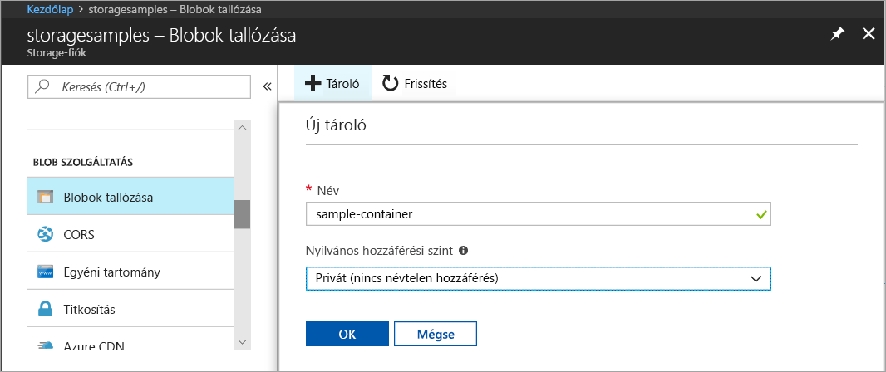
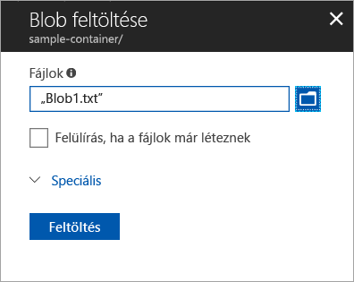
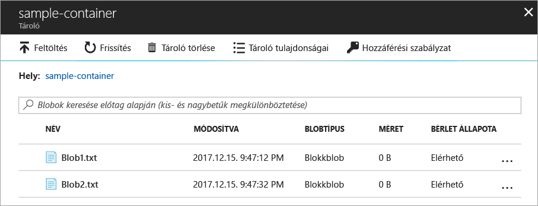
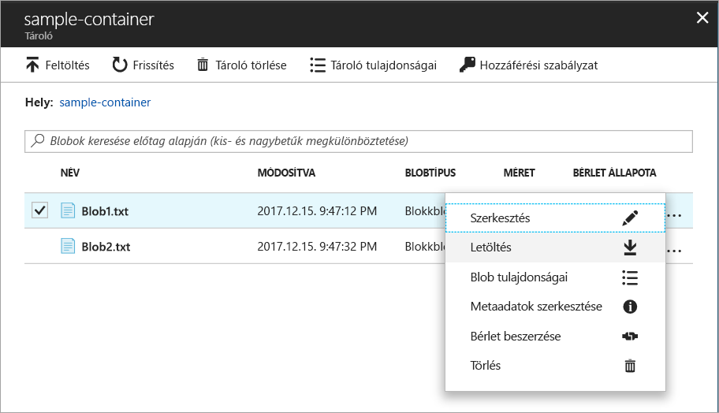
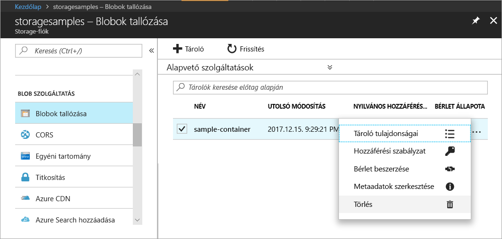

# Objektumok továbbítása Azure Blob-tárolókra és -tárolókról az Azure Portal használatával

Ez a rövid útmutató azt ismerteti, hogyan használható az [Azure Portal](https://portal.azure.com/) egy Azure Storage-tároló létrehozására, valamint blokkblobok fel- és letöltésére a tárolóban.

## Előfeltételek

Ha nem rendelkezik Azure-előfizetéssel, mindössze néhány perc alatt létrehozhat egy [ingyenes fiókot](https://azure.microsoft.com/free/?WT.mc_id=A261C142F) a virtuális gép létrehozásának megkezdése előtt.

[!INCLUDE [storage-quickstart-tutorial-create-account-portal](../../../includes/storage-quickstart-tutorial-create-account-portal.md)]

## Tároló létrehozása

Az Azure Portalon a következő lépések végrehajtásával hozhat létre egy tárolót:

1. Az Azure Portalon lépjen az új tárfiókjára.
2. A tárfiók bal oldali menüjében görgessen a **Blob service** szakaszhoz, majd válassza a **Blobok tallózása** lehetőséget.
3. Kattintson a **Tároló hozzáadása** gombra.
4. Adja meg az új tároló nevét. A tároló neve csak kisbetűket tartalmazhat, betűvel vagy számmal kell kezdődnie, és csak betűket, számokat és kötőjelet (-) tartalmazhat. A tárolók és blobok elnevezésével kapcsolatos részletekért lásd a [tárolók, blobok és metaadatok elnevezésével és hivatkozásával](https://docs.microsoft.com/rest/api/storageservices/naming-and-referencing-containers--blobs--and-metadata) foglalkozó cikket.
5. Adja meg a tároló nyilvános hozzáférési szintjét. Az alapértelmezett szint: **Privát (nincs névtelen hozzáférés)**.
6. A tároló létrehozásához kattintson az **OK** gombra.

    

## Blokkblob feltöltése

A blokkblobok blobokká összefűzött adatblokkokból állnak. A Blob Storage legtöbb használati forgatókönyvében blokkblobokat kell használni. A blokkblobok ideális megoldást kínálnak szöveges és bináris adatok (például fájlok, képek és videók) felhőben történő tárolására. Ez a rövid útmutató a blokkblobok használatát mutatja be. 

Az Azure Portalon a következő lépések végrehajtásával tölthet fel egy blokkblobot az Azure Portalon lévő új tárolóba:

1. Az Azure Portalon lépjen az előző szakaszban létrehozott tárolóhoz.
2. Válassza ki a tárolót a benne lévő blobok listájának megtekintéséhez. Mivel ebben az esetben egy új tárolót hozott létre, még egy blob sem található benne.
3. A **Feltöltés** gombra kattintva tölthet fel egy blobot a tárolóba.
4. A helyi fájlrendszerben keresse meg tallózással a blokkblobként feltölteni kívánt fájlt, és kattintson a **Feltöltés** elemre.
     
    

5. Ezzel a módszerrel tetszőleges számú blobot tölthet fel. Látni fogja, hogy az új blobok már fel vannak sorolva a tárolóban.

    

## Blokkblob letöltése

A blokkblobok letölthetők a böngészőben történő megjelenítéshez vagy a helyi fájlrendszerben történő mentéshez. A blokkblobok letöltéséhez kövesse az alábbi lépéseket:

1. Lépjen az előző szakaszban feltöltött blobok listájához. 
2. Válassza ki a letölteni kívánt blobot.
3. Kattintson a jobb gombbal a **Továbbiak** gombra (**...**), és válassza a **Letöltés** lehetőséget. 

## Az erőforrások eltávolítása

A jelen rövid útmutatóban létrehozott erőforrások eltávolításához egyszerűen törölje a tárolót. Ekkor a rendszer törli az adott tárolóban lévő összes blobot is.

A tároló törlése:

1. Az Azure Portalon lépjen a tárfiókban tárolóinak listájához.
2. Válassza ki a törölni kívánt tárolót.
3. Kattintson a jobb gombbal a **Továbbiak** gombra (**...**), és válassza a **Törlés** lehetőséget.
4. Erősítse meg, hogy törölni kívánja a tárolót.

       

## További lépések

Ennek a rövid útmutatónak a segítségével megtanulta, hogyan vihetők át fájlok egy helyi lemez és az Azure Blob Storage között a .NET használatával. Ha bővebb információra van szüksége a Blob Storage használatával kapcsolatban, lépjen tovább a Blob Storage használati útmutatójára.

> [!div class="nextstepaction"]
> [Blob Storage-műveletek használati útmutatója](storage-dotnet-how-to-use-blobs.md)

