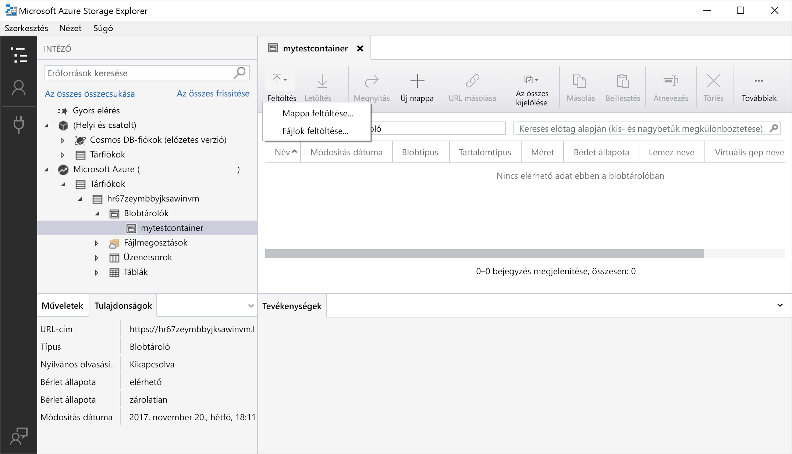
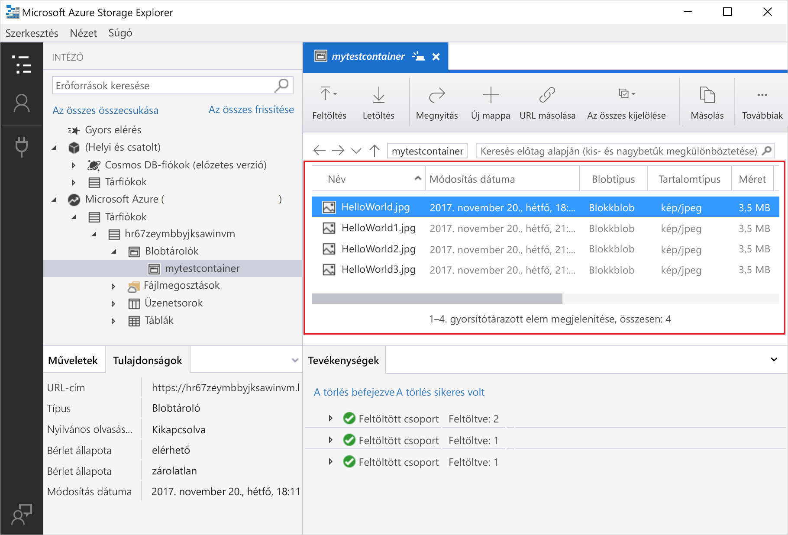
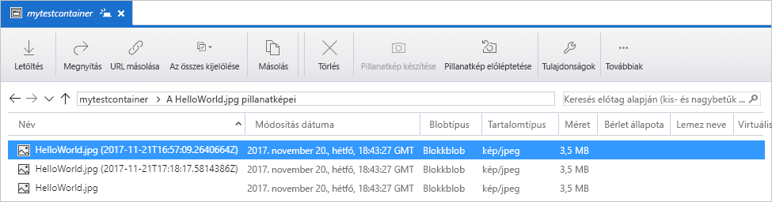
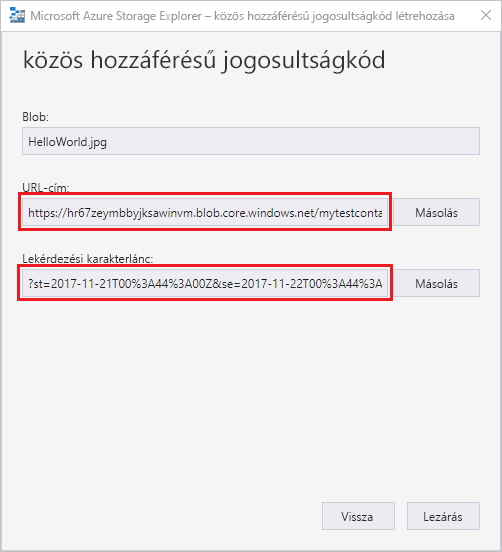

# Objektumok továbbítása az Azure Blob-tárolókra és -tárolókról az Azure Storage Explorer használatával

[Azure Storage Explorer](https://azure.microsoft.com/features/storage-explorer/) egy több platformot is támogató felhasználói felület a tárfiókok tartalmának kezeléséhez. Ez a rövid útmutató részletesen ismerteti, hogyan vihetők át a fájlok egy helyi lemez és az Azure Blob Storage között az Azure Storage Explorer használatával.

Ha nem rendelkezik Azure-előfizetéssel, mindössze néhány perc alatt létrehozhat egy [ingyenes fiókot](https://azure.microsoft.com/free/?WT.mc_id=A261C142F) a virtuális gép létrehozásának megkezdése előtt.

A rövid útmutatóhoz az Azure Storage Explorer telepítése szükséges. Ha még telepítenie kell, akkor az [Azure Storage Explorer](https://azure.microsoft.com/features/storage-explorer/) oldalról töltheti le Windows, Macintosh vagy Linux rendszerre.

[!INCLUDE [storage-quickstart-tutorial-create-account-portal](../../../includes/storage-quickstart-tutorial-create-account-portal.md)]

## Bejelentkezés a Storage Explorerbe

Első indításkor megjelenik a **Microsoft Azure Storage Explorer – Csatlakozás** ablak. A Storage Explorer számos különféle módot kínál a tárfiókokhoz való csatlakozáshoz. A csatlakozási lehetőségeket az alábbi táblázat ismerteti:

|Tevékenység|Cél|
|---|---|
|Azure-fiók hozzáadása | Átirányítja a vállalati bejelentkezési oldalra az Azure-hitelesítéshez. |
|Kapcsolati karakterlánc vagy közös hozzáférésű jogosultságkód URI azonosítójának használata | Egy tároló vagy tárfiók közvetlen elérésére szolgál egy SAS-token vagy egy közös kapcsolati karakterlánc segítségével. |
|Tárfióknév és -kulcs használata| Csatlakozzon az Azure Storage-hoz a tárfiók nevével és kulcsával.|

Válassza az **Azure-fiók hozzáadása** lehetőséget, majd kattintson a **Bejelentkezés** gombra. A képernyőn megjelenő utasításokat követve jelentkezzen be Azure-fiókjába.

A csatlakozás befejeztével az Azure Storage Explorer betöltést követően megjeleníti az **Explorer** lapot. Ezen a lapon áttekintheti az összes Azure-tárfiókját, valamint az [Azure Storage Emulator](../common/storage-use-emulator.md?toc=%2fazure%2fstorage%2fblobs%2ftoc.json)- és [Cosmos DB](../../cosmos-db/storage-explorer.md?toc=%2fazure%2fstorage%2fblobs%2ftoc.json)-fiókokon, illetve az [Azure Stack](../../azure-stack/user/azure-stack-storage-connect-se.md?toc=%2fazure%2fstorage%2fblobs%2ftoc.json)-környezeteken keresztül konfigurált helyi tárolókat.

## Tároló létrehozása

A blobok minden esetben egy tárolóba lesznek feltöltve. Így a blobok csoportjait ugyanúgy rendszerezheti, ahogy a fájlokat a számítógép mappáiban.

Tároló létrehozásához bontsa ki az előző lépésben létrehozott tárfiókot. Válassza a **Blobtárolók** lehetőséget, kattintson a jobb gombbal, majd válassza a **Blobtároló létrehozása** lehetőséget. Adja meg a blobtároló nevét. A blobtárolók elnevezésére vonatkozó szabályokat és korlátozásokat a [tároló elnevezési szabályait](storage-dotnet-how-to-use-blobs.md#create-a-container) ismertető szakaszban találja. Ha végzett, nyomja le az **Enter** billentyűt a blobtároló létrehozásához. A sikeresen létrehozott blobtároló megjelenik a kiválasztott tárfiókhoz tartozó **Blobtárolók** mappában.

## Blobok feltöltése a tárolóba

A Blob Storage támogatja a blokkblobokat, a hozzáfűző blobokat és a lapblobokat. Az IaaS típusú virtuális gépek biztonsági mentéséhez használt VHD-fájlok lapblobok. A hozzáfűző blobok a naplózáshoz használhatók, például amikor egy fájlba szeretne írni, majd folyamatosan újabb információkat szeretne hozzáadni. A blobtárolókban tárolt fájlok a legtöbb esetben blokkblobok.

A tároló menüszalagján válassza a **Feltöltés** lehetőséget. Ez a művelet lehetővé teszi egy mappa vagy fájl feltöltését.

Válassza ki a feltölteni kívánt fájlokat vagy mappát. Válassza ki a **blob típusát**. A választható lehetőségek: **Hozzáfűző**, **Lap** és **Blokk**.

.vhd- vagy .vhdx-fájlok feltöltésekor válassza a **.vhd- vagy .vhdx-fájlok feltöltése lapblobként (ajánlott)** lehetőséget.

A **Feltöltés mappába (nem kötelező)** mezőben adjon meg egy nevet a mappának, amely a fájlokat vagy mappákat tartalmazza a tárolón. Ha nem választ mappát, a fájlok közvetlenül a tároló gyökérkönyvtárába töltődnek fel.

Ha az **OK** gombra kattint, a kiválasztott fájlokat a rendszer sorba állítja a feltöltéshez, majd egyesével feltölti azokat. A feltöltés befejeztével az eredmények megjelennek a **Tevékenységek** ablakban.

## Blobok megtekintése egy tárolón

Az **Azure Storage Explorerben** válasszon ki egy tárfiókhoz tartozó tárolót. A fő panelen a kiválasztott tárolóban található blobok listája látható.

## Blobok letöltése

Blobok az **Azure Storage Explorer** használatával való letöltéséhez jelöljön ki egy blobot, majd válassza a menüszalag **Letöltés** elemét. Megnyílik egy fájl párbeszédpanel, amelyen megadhat egy fájlnevet. Kattintson a **Mentés** lehetőségre a blob letöltéséhez a helyi helyre.

## Pillanatképek kezelése

Az Azure Storage Explorer lehetővé teszi a blobokról készült [pillanatképek](storage-blob-snapshots.md) rögzítését és kezelését. Egy blob pillanatképének elkészítéséhez kattintson a jobb gombbal a blobra, majd válassza a **Pillanatkép készítése** lehetőséget. Egy blob pillanatképének megtekintéséhez kattintson a jobb gombbal a blobra, majd válassza a **Pillanatképek kezelése** lehetőséget. Az aktuális lapon megjelenik a blob pillanatképeinek listája.

## Hozzáférési szabályzatok kezelése

A Storage Explorer felhasználói felületén lehetőség nyílik a tárolók hozzáférési szabályzatainak kezelésére. Kétféle biztonságos hozzáférési szabályzat (SAS) létezik: szolgáltatás- és fiókszintű. A fiókszintű SAS a tárfiókra érvényes, továbbá több szolgáltatásra és erőforrásra is vonatkozhat. A szolgáltatásszintű SAS egy adott szolgáltatás erőforrására érvényes. Egy szolgáltatásszintű SAS létrehozásához kattintson a jobb gombbal egy tárolóra, majd válassza a **Hozzáférési szabályzatok kezelése...** lehetőséget. Egy fiókszintű SAS létrehozásához kattintson a jobb gombbal a tárfiókra.

Válassza a **Hozzáadás** lehetőséget egy új hozzáférési szabályzat hozzáadásához és a szabályzat engedélyeinek megadásához. Ha végzett, kattintson a **Mentés** gombra a hozzáférési szabályzat mentéséhez. A szabályzat innentől kezdve elérhető lesz a közös hozzáférésű jogosultságkódok konfigurálásakor.

## Közös hozzáférésű jogosultságkódok használata

A közös hozzáférésű jogosultságkódok (SAS) a Storage Exploreren keresztül kérhetők le. Kattintson a jobb gombbal a tárfiókra, tárolóra, vagy blobra, majd válassza a **Közös hozzáférésű jogosultságkód igénylése...** lehetőséget. Válassza ki a kezdő és lejárati időpontot, valamint az engedélyeket a SAS URL-hez, majd kattintson a **Létrehozás** gombra. A lekérdezési karakterlánccal ellátott teljes URL-cím, illetve a lekérdezési karakterlánc önmagában is megjelenik a következő képernyőn, ahonnan mindkettő másolható.

## További lépések

Ennek a rövid útmutatónak a segítségével megtanulta, hogyan vihetők át fájlok egy helyi lemez és az Azure Blob Storage között az **Azure Storage Explorer** használatával. Ha bővebb információra van szüksége a Blob Storage használatával kapcsolatban, lépjen tovább a Blob Storage használati útmutatójára.

> [!div class="nextstepaction"]
> [Blob Storage-műveletek használati útmutatója](storage-how-to-use-blobs-powershell.md)
