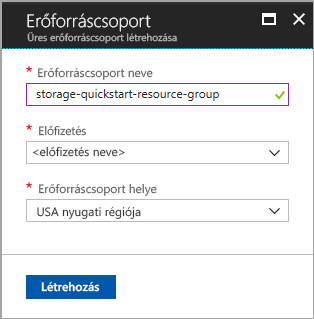
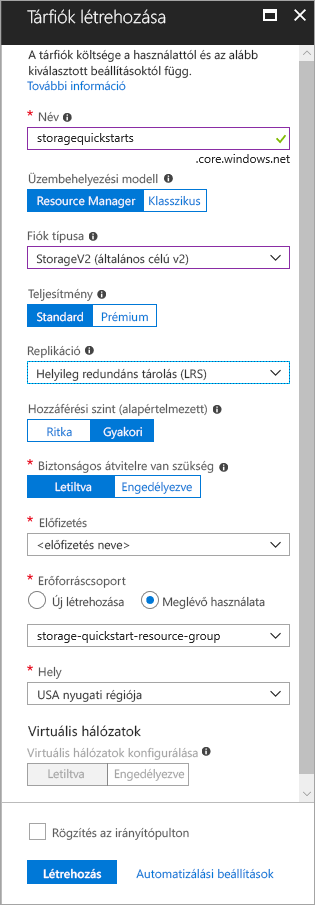

# <a name="create-a-new-storage-account"></a>Új tárfiók létrehozása

Az Azure Storage-fiók egyedi névteret biztosít a felhőben az Azure Storage-adatobjektumok tárolásához és eléréséhez. A tárfiókok bármely olyan blobot, fájlt, üzenetsort, táblát vagy lemezt tartalmazhatnak, amelyeket az adott fiók használata során létrehoz. 

Az Azure Storage használatának megkezdéséhez először létre kell hoznia egy új tárfiókot. Azure Storage-fiókot az [Azure Portal](https://portal.azure.com/), az [Azure PowerShell](https://docs.microsoft.com/powershell/azure/overview) vagy az [Azure CLI](https://docs.microsoft.com/cli/azure/overview?view=azure-cli-latest) használatával hozhat létre. Ez a rövid útmutató azt ismerteti, hogyan használhatók ezek a lehetőségek új tárfiók létrehozására. 


## <a name="prerequisites"></a>Előfeltételek

Ha nem rendelkezik Azure-előfizetéssel, mindössze néhány perc alatt létrehozhat egy [ingyenes fiókot](https://azure.microsoft.com/free/) a virtuális gép létrehozásának megkezdése előtt.

# <a name="portaltabportal"></a>[Portal](#tab/portal)

Nincs.

# <a name="powershelltabpowershell"></a>[PowerShell](#tab/powershell)

Ehhez a rövid útmutatóhoz az Azure PowerShell-modul 3.6-os vagy újabb verziójára lesz szükség. Az aktuális verzió azonosításához futtassa a következőt: `Get-Module -ListAvailable AzureRM`. Ha telepíteni vagy frissíteni szeretne, olvassa el [az Azure PowerShell-modul telepítését](/powershell/azure/install-azurerm-ps) ismertető cikket.

# <a name="azure-clitabazure-cli"></a>[Azure CLI](#tab/azure-cli)

Az Azure-ba történő bejelentkezéshez és az Azure CLI parancsainak futtatásához az alábbi két módszer egyikét használhatja:

- A CLI-parancsok az Azure Portalról, az Azure Cloud Shell felületén futtathatók 
- Telepítheti a parancssori felületet, így helyben is futtathatja a CLI-parancsokat  

### <a name="use-azure-cloud-shell"></a>Az Azure Cloud Shell használata

Az Azure Cloud Shell olyan ingyenes Bash-felület, amelyet közvetlenül futtathat az Azure Portalon. A fiókjával való használat érdekében az Azure CLI már előre telepítve és konfigurálva van rajta. Az Azure Portal jobb felső sarkában található menüben kattintson a **Cloud Shell** gombra:

[](https://portal.azure.com)

A gombra kattintva megjelenik egy interaktív kezelőfelület jelenik, amelyet az ebben a rövid útmutatóban található lépések futtatására használhat:

[](https://portal.azure.com)

### <a name="install-the-cli-locally"></a>A parancssori felület helyi telepítése

Az Azure CLI-t helyben is telepítheti és használhatja. A rövid útmutatóhoz az Azure CLI 2.0.4-es vagy újabb verziójára lesz szükség. A verzió azonosításához futtassa a következőt: `az --version`. Ha telepíteni vagy frissíteni szeretne: [Az Azure CLI 2.0 telepítése](/cli/azure/install-azure-cli). 

---

## <a name="log-in-to-azure"></a>Jelentkezzen be az Azure-ba

# <a name="portaltabportal"></a>[Portal](#tab/portal)

Jelentkezzen be az [Azure portálra](https://portal.azure.com).

# <a name="powershelltabpowershell"></a>[PowerShell](#tab/powershell)

Jelentkezzen be az Azure-előfizetésbe a `Login-AzureRmAccount` paranccsal, és a hitelesítéshez kövesse a képernyőn megjelenő utasításokat.

```powershell
Login-AzureRmAccount
```

# <a name="azure-clitabazure-cli"></a>[Azure CLI](#tab/azure-cli)

Az Azure Cloud Shell indításához jelentkezzen be az [Azure Portalra](https://portal.azure.com).

A parancssori felület helyileg telepített példányára történő bejelentkezéshez futtassa a bejelentkezési parancsot:

```cli
az login
```

---

## <a name="create-a-resource-group"></a>Hozzon létre egy erőforráscsoportot

Az Azure-erőforráscsoport olyan logikai tároló, amelybe a rendszer üzembe helyezi és kezeli az Azure-erőforrásokat. További információ az erőforráscsoportokkal kapcsolatban: [Az Azure Resource Manager áttekintése](../../azure-resource-manager/resource-group-overview.md).

# <a name="portaltabportal"></a>[Portal](#tab/portal)

Az Azure Portalon a következő lépések végrehajtásával hozhat létre egy erőforráscsoportot:

1. Az Azure Portalon bontsa ki a bal oldalon a szolgáltatásmenüt, és válassza az **Erőforráscsoportok** lehetőséget.
2. Új erőforráscsoport hozzáadásához kattintson a **Hozzáadás** gombra.
3. Adja meg az új erőforráscsoport nevét.
4. Válassza ki azt az előfizetést, amelyben létre kívánja hozni az új erőforráscsoportot.
5. Válassza ki az erőforráscsoport helyét.
6. Kattintson a **Létrehozás** gombra.  



# <a name="powershelltabpowershell"></a>[PowerShell](#tab/powershell)

Az új erőforráscsoport PowerShell használatával történő létrehozása a [New-AzureRmResourceGroup](/powershell/module/azurerm.resources/new-azurermresourcegroup) paranccsal történik: 

```powershell
# put resource group in a variable so you can use the same group name going forward,
# without hardcoding it repeatedly
$resourceGroup = "storage-quickstart-resource-group"
New-AzureRmResourceGroup -Name $resourceGroup -Location $location 
```

Ha nem biztos abban, hogy melyik régiót kell megadnia a `-Location` paraméterhez, az előfizetéséhez tartozó támogatott régiók listáját a [Get-AzureRmLocation](/powershell/module/azurerm.resources/get-azurermlocation) paranccsal kérheti le:

```powershell
Get-AzureRmLocation | select Location 
$location = "westus"
```

# <a name="azure-clitabazure-cli"></a>[Azure CLI](#tab/azure-cli)

Ha az Azure CLI használatával kíván új erőforráscsoportot létrehozni, használja az [az group create](/cli/azure/group#create) parancsot. 

```azurecli-interactive
az group create \
    --name storage-quickstart-resource-group \
    --location westus
```

Ha nem biztos abban, hogy melyik régiót kell megadnia a `--location` paraméterhez, az előfizetéséhez tartozó támogatott régiók listáját az [az account list-locations](/cli/azure/account#list) paranccsal kérheti le.

```azurecli-interactive
az account list-locations \
    --query "[].{Region:name}" \
    --out table
```

---

# <a name="create-a-general-purpose-storage-account"></a>Általános célú tárfiók létrehozása

Az általános célú tárfiókok az összes Azure Storage-szolgáltatáshoz (blobokhoz, fájlokhoz, üzenetsorokhoz és táblákhoz) hozzáférést biztosítanak. Az általános célú tárfiókok standard és prémium szinten is létrehozhatók. A jelen cikkben szereplő példák egy általános célú tárfiók (alapértelmezett) standard szinten történő létrehozását mutatják be. További információ a tárfiók-beállításokról: [A Microsoft Azure Storage bemutatása](storage-introduction.md).

Ne feledje ezeket a szabályokat a tárfiók elnevezésekor:

- A tárfiókok neve 3–24 karakter hosszúságú lehet, és csak számokból és kisbetűkből állhat.
- A tárfiók nevének egyedinek kell lennie az Azure rendszerben. Két tárfióknak nem lehet azonos neve.

# <a name="portaltabportal"></a>[Portal](#tab/portal)

Kövesse az alábbi lépéseket egy általános célú tárfiók létrehozásához az Azure Portalon:

1. Az Azure Portalon nyissa ki bal oldalon a szolgáltatásmenüt, és válassza a **További szolgáltatások** lehetőséget. Ezután görgessen le a **Storage** szakaszig, és válassza a **Storage-fiókok** lehetőséget. A megjelenő **Storage-fiókok** ablakban válassza a **Hozzáadás** lehetőséget.
2. Adja meg a tárfiók nevét.
3. Ne módosítsa a következő mezők alapértelmezett értékeit: **Üzemi modell**, **Fiók altípusa**, **Teljesítmény**, **Replikáció**, **Biztonságos átvitelre van szükség**.
4. Válassza ki azt az előfizetést, amelyikben létre kívánja hozni a tárfiókot.
5. Az **Erőforráscsoport** szakaszban válassza a **Meglévő használata** lehetőséget, majd válassza ki az előző szakaszban létrehozott erőforráscsoportot.
6. Válassza ki az új tárfiók helyét.
7. Kattintson a **Létrehozás** parancsra a tárfiók létrehozásához.      



# <a name="powershelltabpowershell"></a>[PowerShell](#tab/powershell)

Az általános célú tárfiók PowerShellből történő létrehozása a [New-AzureRmStorageAccount](/powershell/module/azurerm.storage/New-AzureRmStorageAccount) paranccsal történik: 

```powershell
New-AzureRmStorageAccount -ResourceGroupName $resourceGroup `
  -Name "storagequickstart" `
  -Location $location `
  -SkuName Standard_LRS `
  -Kind Storage 
```

# <a name="azure-clitabazure-cli"></a>[Azure CLI](#tab/azure-cli)

Az [az storage account create](/cli/azure/storage/account#create) paranccsal hozzon létre egy általános célú tárfiókot az Azure CLI-n.

```azurecli-interactive
az storage account create \
    --name storagequickstart \
    --resource-group storage-quickstart-resource-group \
    --location westus \
    --sku Standard_LRS 
```

---

## <a name="clean-up-resources"></a>Az erőforrások eltávolítása

Ha törölni szeretné a jelen rövid útmutató által létrehozott erőforrásokat, akkor egyszerűen törölje az erőforráscsoportot. Az erőforráscsoport törlésekor a kapcsolódó tárfiók, valamint az esetlegesen az erőforráscsoporthoz társított egyéb erőforrások is törlődnek.

# <a name="portaltabportal"></a>[Portal](#tab/portal)

Erőforráscsoport eltávolítása az Azure Portallal:

1. Az Azure Portalon bontsa ki a bal oldalon a szolgáltatásmenüt, és válassza az **Erőforráscsoportok** lehetőséget az erőforráscsoportok listájának megjelenítéséhez.
2. Keresse meg a törölni kívánt erőforráscsoportot, és kattintson a jobb gombbal a lista jobb oldalán lévő **Továbbiak** gombra (**...**).
3. Válassza az **Erőforráscsoport törlése** elemet, és erősítse meg a választását.

# <a name="powershelltabpowershell"></a>[PowerShell](#tab/powershell)

A [Remove-AzureRmResourceGroup](/powershell/module/azurerm.resources/remove-azurermresourcegroup) paranccsal eltávolítható az erőforráscsoport és az összes kapcsolódó erőforrás, beleértve az új tárfiókot is: 

```powershell
Remove-AzureRmResourceGroup -Name $resourceGroup
```

# <a name="azure-clitabazure-cli"></a>[Azure CLI](#tab/azure-cli)

Az [az group delete](/cli/azure/group#delete) paranccsal eltávolítható az erőforráscsoport és az összes kapcsolódó erőforrás, beleértve az új tárfiókot is.

```azurecli-interactive
az group delete --name myResourceGroup
```

---

## <a name="next-steps"></a>További lépések

Ebben a rövid útmutatóban egy általános célú standard szintű tárfiókot hozott létre. Ha szeretne megismerkedni a blobok tárfiókba történő felöltésével és onnan való letöltésével, folytassa a Blob Storage rövid útmutatójával.

# <a name="portaltabportal"></a>[Portal](#tab/portal)

> [!div class="nextstepaction"]
> [Objektumok továbbítása Azure Blob-tárolókra és -tárolókról az Azure Portal használatával](../blobs/storage-quickstart-blobs-portal.md)

# <a name="powershelltabpowershell"></a>[PowerShell](#tab/powershell)

> [!div class="nextstepaction"]
> [Objektumok továbbítása Azure Blob-tárolókra és -tárolókról a PowerShell-lel](../blobs/storage-quickstart-blobs-powershell.md)

# <a name="azure-clitabazure-cli"></a>[Azure CLI](#tab/azure-cli)

> [!div class="nextstepaction"]
> [Objektumok továbbítása Azure Blob-tárolókra és -tárolókról az Azure CLI-vel](../blobs/storage-quickstart-blobs-cli.md)

---