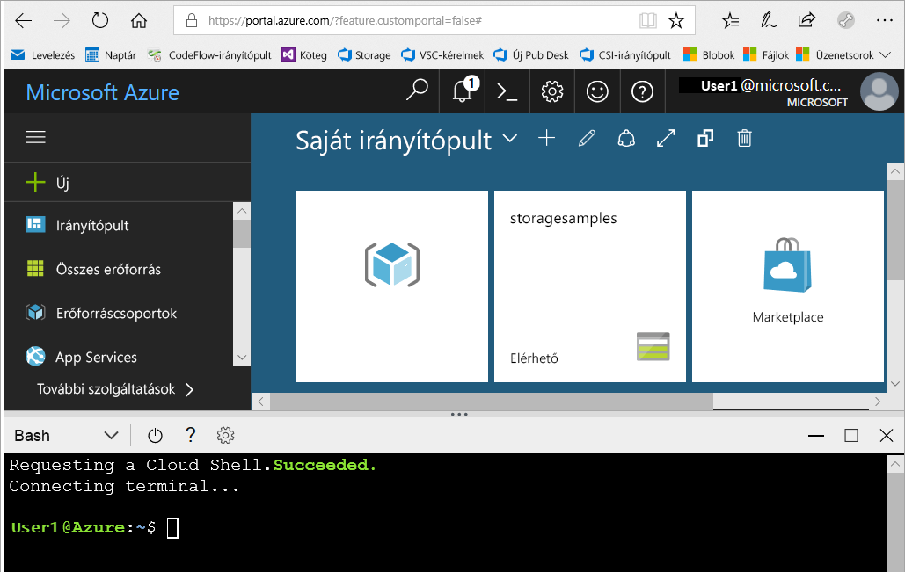

# <a name="create-a-storage-account"></a>Tárfiók létrehozása

Ez a rövid útmutató bemutatja, hogyan hozhat létre tárfiókokat az [Azure Portal](https://portal.azure.com/), az [Azure PowerShell](https://docs.microsoft.com/powershell/azure/overview) vagy az [Azure CLI](https://docs.microsoft.com/cli/azure?view=azure-cli-latest) használatával.  

[!INCLUDE [updated-for-az](../../../includes/updated-for-az.md)]

## <a name="prerequisites"></a>Előfeltételek

Ha nem rendelkezik Azure-előfizetéssel, mindössze néhány perc alatt létrehozhat egy [ingyenes fiókot](https://azure.microsoft.com/free/) a virtuális gép létrehozásának megkezdése előtt.

# <a name="portaltabazure-portal"></a>[Portál](#tab/azure-portal)

Nincs.

# <a name="powershelltabazure-powershell"></a>[PowerShell](#tab/azure-powershell)

Ehhez a rövid útmutatóhoz az Azure PowerShell-modul Az 0,7 vagy újabb verziója. Az aktuális verzió azonosításához futtassa a következőt: `Get-Module -ListAvailable Az`. Ha telepíteni vagy frissíteni szeretne, olvassa el [az Azure PowerShell-modul telepítését](/powershell/azure/install-Az-ps) ismertető cikket.

# <a name="azure-clitabazure-cli"></a>[Azure CLI](#tab/azure-cli)

Az Azure-ba történő bejelentkezéshez és az Azure CLI parancsainak futtatásához az alábbi két módszer egyikét használhatja:

- A CLI-parancsok az Azure Portalról, az Azure Cloud Shell felületén futtathatók 
- Telepítheti a parancssori felületet, így helyben is futtathatja a CLI-parancsokat  

### <a name="use-azure-cloud-shell"></a>Az Azure Cloud Shell használata

Az Azure Cloud Shell olyan ingyenes Bash-felület, amelyet közvetlenül futtathat az Azure Portalon. A fiókjával való használat érdekében az Azure CLI már előre telepítve és konfigurálva van rajta. Az Azure Portal jobb felső sarkában található menüben kattintson a **Cloud Shell** gombra:

[](https://portal.azure.com)

A gombra kattintva megjelenik egy interaktív kezelőfelület jelenik, amelyet az ebben a rövid útmutatóban található lépések futtatására használhat:

[](https://portal.azure.com)

### <a name="install-the-cli-locally"></a>A parancssori felület helyi telepítése

Az Azure CLI-t helyben is telepítheti és használhatja. A rövid útmutatóhoz az Azure CLI 2.0.4-es vagy újabb verziójára lesz szükség. A verzió azonosításához futtassa a következőt: `az --version`. Ha telepíteni vagy frissíteni szeretne, olvassa el [az Azure CLI telepítését](/cli/azure/install-azure-cli) ismertető cikket. 

---

## <a name="log-in-to-azure"></a>Jelentkezzen be az Azure-ba

# <a name="portaltabazure-portal"></a>[Portál](#tab/azure-portal)

Jelentkezzen be az [Azure Portalra](https://portal.azure.com).

# <a name="powershelltabazure-powershell"></a>[PowerShell](#tab/azure-powershell)

Jelentkezzen be az Azure-előfizetésbe a `Connect-AzAccount` paranccsal, és a hitelesítéshez kövesse a képernyőn megjelenő utasításokat.

```powershell
Connect-AzAccount
```

# <a name="azure-clitabazure-cli"></a>[Azure CLI](#tab/azure-cli)

Az Azure Cloud Shell indításához jelentkezzen be az [Azure Portalra](https://portal.azure.com).

A parancssori felület helyileg telepített példányára történő bejelentkezéshez futtassa a bejelentkezési parancsot:

```cli
az login
```

---

## <a name="create-a-storage-account"></a>Tárfiók létrehozása

Ezzel készen áll a tárfiók létrehozására.

Minden tárfióknak egy Azure-erőforráscsoporthoz kell tartoznia. Az erőforráscsoport egy logikai tároló az Azure-szolgáltatások csoportosításához. A tárfiók létrehozásakor lehetősége van létrehozni egy új erőforráscsoportot, vagy választhat egy meglévő erőforráscsoportot. A rövid útmutató bemutatja, hogyan kell létrehozni új erőforráscsoportot. 

Az **általános célú v2**-tárfiókok az összes Azure Storage-szolgáltatáshoz (blobokhoz, fájlokhoz, üzenetsorokhoz, táblákhoz és lemezekhez) hozzáférést biztosítanak. A rövid útmutató egy általános célú v2-tárfiókot hoz létre, de minden típusú tárfiókot hasonló módon hozhat létre.   

# <a name="portaltabazure-portal"></a>[Portál](#tab/azure-portal)

[!INCLUDE [storage-create-account-portal-include](../../../includes/storage-create-account-portal-include.md)]

# <a name="powershelltabazure-powershell"></a>[PowerShell](#tab/azure-powershell)

Először hozzon létre egy új erőforráscsoportot a PowerShell a [New-AzResourceGroup](/powershell/module/az.resources/new-azresourcegroup) parancsot: 

```powershell
# put resource group in a variable so you can use the same group name going forward,
# without hardcoding it repeatedly
$resourceGroup = "storage-quickstart-resource-group"
New-AzResourceGroup -Name $resourceGroup -Location $location 
```

Ha nem biztos abban, hogy melyik régiót kell megadnia a `-Location` paramétert, kérheti a támogatott régiók listáját az előfizetéséhez tartozó a [Get-AzLocation](/powershell/module/az.resources/get-azlocation) parancsot:

```powershell
Get-AzLocation | select Location 
$location = "westus"
```

Ezután hozza létre az általános célú v2-tárfiókot helyileg redundáns tárolással (LRS). Használja a [New-AzStorageAccount](/powershell/module/az.storage/New-azStorageAccount) parancsot: 

```powershell
New-AzStorageAccount -ResourceGroupName $resourceGroup `
  -Name "storagequickstart" `
  -Location $location `
  -SkuName Standard_LRS `
  -Kind StorageV2 
```

Egy zónaredundáns tárolást (ZRS) (előzetes verzió), georedundáns tárolást (GRS) vagy írásvédett georedundáns tárolást (RA-GRS) használó általános célú v2-tárfiók létrehozásához illessze be a kívánt értéket az alábbi táblázatból az **SkuName** paraméternél. 

|Replikációs beállítás  |SkuName paraméter  |
|---------|---------|
|Helyileg redundáns tárolás (LRS)     |Standard_LRS         |
|Zónaredundáns tárolás (ZRS)     |Standard_ZRS         |
|Georedundáns tárolás (GRS)     |Standard_GRS         |
|Írásvédett georedundáns tárolás (GRS)     |Standard_RAGRS         |

# <a name="azure-clitabazure-cli"></a>[Azure CLI](#tab/azure-cli)

Ezután hozza létre az új erőforráscsoportot az Azure CLI használatával, az [az group create](/cli/azure/group#az_group_create) paranccsal. 

```azurecli-interactive
az group create \
    --name storage-quickstart-resource-group \
    --location westus
```

Ha nem biztos abban, hogy melyik régiót kell megadnia a `--location` paraméterhez, az előfizetéséhez tartozó támogatott régiók listáját az [az account list-locations](/cli/azure/account#az_account_list) paranccsal kérheti le.

```azurecli-interactive
az account list-locations \
    --query "[].{Region:name}" \
    --out table
```

Ezután hozza létre az általános célú v2-tárfiókot helyileg redundáns tárolással. Használja az [az storage account create](/cli/azure/storage/account#az_storage_account_create) parancsot:

```azurecli-interactive
az storage account create \
    --name storagequickstart \
    --resource-group storage-quickstart-resource-group \
    --location westus \
    --sku Standard_LRS \
    --kind StorageV2
```

Egy zónaredundáns tárolást (ZRS előzetes verzió), georedundáns tárolást (GRS) vagy írásvédett georedundáns tárolást (RA-GRS) használó általános célú v2-tárfiók létrehozásához illessze be a kívánt értéket az alábbi táblázatból az **sku** paraméternél. 

|Replikációs beállítás  |sku paraméter  |
|---------|---------|
|Helyileg redundáns tárolás (LRS)     |Standard_LRS         |
|Zónaredundáns tárolás (ZRS)     |Standard_ZRS         |
|Georedundáns tárolás (GRS)     |Standard_GRS         |
|Írásvédett georedundáns tárolás (GRS)     |Standard_RAGRS         |

---

Az elérhető replikációs beállításokkal kapcsolatban további információt a [Storage replikálási lehetőségeit](storage-redundancy.md) ismertető szakaszban talál.

## <a name="clean-up-resources"></a>Az erőforrások eltávolítása

Ha törölni szeretné a jelen rövid útmutató által létrehozott erőforrásokat, akkor egyszerűen törölje az erőforráscsoportot. Az erőforráscsoport törlésekor a kapcsolódó tárfiók, valamint az esetlegesen az erőforráscsoporthoz társított egyéb erőforrások is törlődnek.

# <a name="portaltabazure-portal"></a>[Portál](#tab/azure-portal)

Erőforráscsoport eltávolítása az Azure Portallal:

1. Az Azure Portalon bontsa ki a bal oldalon a szolgáltatásmenüt, és válassza az **Erőforráscsoportok** lehetőséget az erőforráscsoportok listájának megjelenítéséhez.
2. Keresse meg a törölni kívánt erőforráscsoportot, és kattintson a jobb gombbal a lista jobb oldalán lévő **Továbbiak** gombra (**...**).
3. Válassza az **Erőforráscsoport törlése** elemet, és erősítse meg a választását.

# <a name="powershelltabazure-powershell"></a>[PowerShell](#tab/azure-powershell)

Eltávolítható az erőforráscsoport és az összes kapcsolódó erőforrás, beleértve az új tárfiókot is a [Remove-AzResourceGroup](/powershell/module/az.resources/remove-azresourcegroup) parancsot: 

```powershell
Remove-AzResourceGroup -Name $resourceGroup
```

# <a name="azure-clitabazure-cli"></a>[Azure CLI](#tab/azure-cli)

Az [az group delete](/cli/azure/group#az_group_delete) paranccsal eltávolítható az erőforráscsoport és az összes kapcsolódó erőforrás, beleértve az új tárfiókot is.

```azurecli-interactive
az group delete --name storage-quickstart-resource-group
```

---

## <a name="next-steps"></a>További lépések

Ez a rövid útmutatóban létrehozott egy általános célú v2 standard szintű tárfiókot. Ha szeretne megismerkedni a blobok tárfiókba történő felöltésével és onnan való letöltésével, folytassa a Blob Storage rövid útmutatójával.

# <a name="portaltabazure-portal"></a>[Portál](#tab/azure-portal)

> [!div class="nextstepaction"]
> [Blobok használata az Azure Portal segítségével](../blobs/storage-quickstart-blobs-portal.md)

# <a name="powershelltabazure-powershell"></a>[PowerShell](#tab/azure-powershell)

> [!div class="nextstepaction"]
> [Blobok használata a PowerShell segítségével](../blobs/storage-quickstart-blobs-powershell.md)

# <a name="azure-clitabazure-cli"></a>[Azure CLI](#tab/azure-cli)

> [!div class="nextstepaction"]
> [Az Azure CLI-vel blobok használata](../blobs/storage-quickstart-blobs-cli.md)

---
