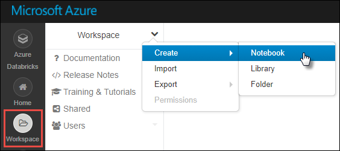
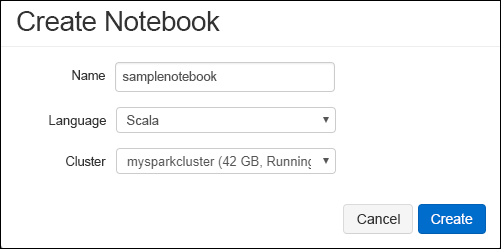

# <a name="tutorial-extract-transform-and-load-data-using-azure-databricks"></a>Oktatóanyag: Adatok kinyerése, átalakítása és betöltése az Azure Databricks használatával

Ebben az oktatóanyagban egy ETL-művelet (kinyerés, átalakítás és adatbetöltés) végrehajtásával adatokat fog áthelyezni egy Azure Data Lake Storage Gen2-kompatibilis Azure Storage-fiókból az Azure SQL Data Warehouse-ba az Azure Databricks használatával.

Az alábbi ábrán az alkalmazásfolyam látható:


Ez az oktatóanyag a következő feladatokat mutatja be:

> [!div class="checklist"]
> * Azure Databricks-munkaterület létrehozása
> * Spark-fürt létrehozása az Azure Databricksben
> * 2. generációs Azure Data Lake Storage-kompatibilis fiók létrehozása
> * Adatok feltöltése a 2. generációs Azure Data Lake Storage-be
> * Jegyzetfüzet létrehozása az Azure Databricksben
> * Adatok kinyerése a 2. generációs Data Lake Storage-ből
> * Adatok átalakítása az Azure Databricksben
> * Adatok betöltése az Azure SQL Data Warehouse-ba

Ha nem rendelkezik Azure-előfizetéssel, [hozzon létre egy ingyenes fiókot](https://azure.microsoft.com/free/) a feladatok megkezdése előtt.

## <a name="prerequisites"></a>Előfeltételek

Az oktatóanyag elvégzéséhez:

* Hozzon létre egy Azure SQL Data Warehouse-t, hozzon létre egy kiszolgálószintű tűzfalszabályt, majd csatlakozzon a kiszolgálóhoz kiszolgáló-rendszergazdaként. Kövesse az [Azure SQL Data Warehouse létrehozásáról szóló rövid útmutató](../../sql-data-warehouse/create-data-warehouse-portal.md) utasításait
* Hozzon létre egy fő adatbáziskulcsot az Azure SQL Data Warehouse számára. Kövesse a [Fő adatbázisfőkulcs létrehozását](https://docs.microsoft.com/sql/relational-databases/security/encryption/create-a-database-master-key) ismertető dokumentum utasításait.
* [2. generációs Azure Data Lake Storage-fiók létrehozása](quickstart-create-account.md)

## <a name="sign-in-to-the-azure-portal"></a>Bejelentkezés az Azure Portalra

Jelentkezzen be az [Azure Portalra](https://portal.azure.com/).

## <a name="create-an-azure-databricks-workspace"></a>Azure Databricks-munkaterület létrehozása

Ebben a szakaszban egy Azure Databricks-munkaterületet fog létrehozni az Azure Portal használatával.

1. Az Azure Portalon válassza az **Erőforrás létrehozása** > **Elemzés** > **Azure Databricks** elemet.

    

2. Az **Azure Databricks szolgáltatás** pontban adja meg az értékeket Databricks-munkaterület létrehozásához.

    

    Adja meg a következő értékeket:

    |Tulajdonság  |Leírás  |
    |---------|---------|
    |**Munkaterület neve**     | Adja meg a Databricks-munkaterület nevét.        |
    |**Előfizetés**     | Válassza ki a legördülő menüből a saját Azure-előfizetését.        |
    |**Erőforráscsoport**     | Adja meg, hogy új erőforráscsoportot kíván-e létrehozni, vagy egy meglévőt szeretne használni. Az erőforráscsoport egy tároló, amely Azure-megoldásokhoz kapcsolódó erőforrásokat tárol. További információért olvassa el az [Azure-erőforráscsoportok áttekintését](../../azure-resource-manager/resource-group-overview.md). |
    |**Hely**     | Válassza az **USA 2. nyugati régióját**. A további elérhető régiókért tekintse meg az [elérhető Azure-szolgáltatások régiók szerinti bontását](https://azure.microsoft.com/regions/services/).        |
    |**Tarifacsomag**     |  Válassza a **Standard** vagy a **Prémium** előfizetést. További információkért a csomagokkal kapcsolatban tekintse meg a [Databricks díjszabását ismertető oldalt](https://azure.microsoft.com/pricing/details/databricks/).       |

    Válassza a **Rögzítés az irányítópulton**, majd a **Létrehozás** lehetőséget.

3. A fiók létrehozása eltarthat néhány percig. A fiók létrehozása során a portál jobb oldalán megjelenik az **Üzembe helyezés beküldése a következőhöz: Azure Databricks** csempe. Lehetséges, hogy jobbra kell görgetnie az irányítópulton, hogy megjelenjen a csempe. Megjelenik egy folyamatjelző is a képernyő tetejéhez közel. Mindkét területen nyomon követheti a folyamat előrehaladását.

    

## <a name="create-a-spark-cluster-in-databricks"></a>Spark-fürt létrehozása a Databricks használatával

1. Az Azure Portalon lépjen a létrehozott Databricks-munkaterülethez, majd válassza a **Munkaterület indítása** elemet.

2. A rendszer átirányítja az Azure Databricks portáljára. A portálon válassza a **Fürt** elemet.

    

3. Az **Új fürt** lapon adja meg a fürt létrehozásához szükséges értékeket.

    

    Adjon meg értékeket a következő mezőkben, és fogadja el az alapértelmezett értékeket a többi mezőben:

    * Adjon egy nevet a fürtnek.
    * Ehhez a cikkhez a **4.2** futtatókörnyezetben hozzon létre fürtöt.
    * Mindenképpen jelölje be a **Leállítás \_\_ percnyi tétlenség után** jelölőnégyzetet. Adja meg az időtartamot (percben), amelynek elteltével le kell állítani a fürtöt, amennyiben az használaton kívül van.

    Válassza a **Fürt létrehozása** lehetőséget. Ha a fürt már fut, notebookokat csatlakoztathat hozzá, illetve Spark-feladatokat futtathat.

## <a name="create-storage-account-file-system"></a>Tárfiók fájlrendszerének létrehozása

Ebben a szakaszban létrehoz egy jegyzetfüzetet az Azure Databricks-munkaterületen, majd kódrészleteket futtat a tárfiók konfigurálásához.

1. Az [Azure Portalon](https://portal.azure.com) lépjen a létrehozott Azure Databricks-munkaterülethez, majd válassza a **Munkaterület indítása** elemet.

2. A bal oldali panelen válassza a **Munkaterület** elemet. A **Munkaterület** legördülő menüből válassza a **Létrehozás** > **Jegyzetfüzet** lehetőséget.

    

3. A **Jegyzetfüzet létrehozása** párbeszédpanelen adja meg a jegyzetfüzet nevét. Válassza a **Scala** nyelvet, majd válassza ki a korábban létrehozott Spark-fürtöt.

    

    Kattintson a **Létrehozás** gombra.

4. Írja be a következő kódot az első cellába, majd hajtsa végre a kódot:

    ```scala
    spark.conf.set("fs.azure.account.key.<ACCOUNT_NAME>.dfs.core.windows.net", "<ACCOUNT_KEY>") 
    spark.conf.set("fs.azure.createRemoteFileSystemDuringInitialization", "true")
    dbutils.fs.ls("abfs://<FILE_SYSTEM_NAME>@<ACCOUNT_NAME>.dfs.core.windows.net/")
    spark.conf.set("fs.azure.createRemoteFileSystemDuringInitialization", "false") 
    ```

    A kódcella futtatásához nyomja le a **SHIFT + ENTER** billentyűparancsot.

    Létrejön a fájlrendszer a tárfiókhoz.

## <a name="upload-data-to-the-storage-account"></a>Adatok feltöltése a tárfiókba

A következő lépés egy mintaadatfájl feltöltése a tárfiókba későbbi átalakítás céljából az Azure Databricksben. 

> [!NOTE]
> Ha még nem készített a 2. generációt támogató Azure Data Lake Storage-fiókot, kövesse a [gyors útmutatót a fiók létrehozásához](./quickstart-create-account.md).

1. Töltse le a (**small_radio_json.json**) fájlt a [U-SQL példákat és problémakövetést ](https://github.com/Azure/usql/blob/master/Examples/Samples/Data/json/radiowebsite/small_radio_json.json) tartalmazó adattárból, és jegyezze fel az elérési utat, ahová a fájlt menti.

2. Ezután töltse fel a mintaadatokat a tárfiókba. Az adatok tárfiókba történő feltöltésének módja eltérő attól függően, hogy a hierarchikus névtér-szolgáltatás engedélyezve van-e.

    Ha a hierarchikus névtér engedélyezve van az Azure Storage-fiókban, a feltöltéshez használhatja az Azure Data Factoryt, a terjesztési pontokat vagy az AzCopyt (10-es verzió). Az AzCopy 10-es verziója jelenleg csak előzetes verzióként érhető el. Az AzCopy használatához illessze be a következő kódot egy parancssori ablakba:

    ```bash
    set ACCOUNT_NAME=<ACCOUNT_NAME>
    set ACCOUNT_KEY=<ACCOUNT_KEY>
    azcopy cp "<DOWNLOAD_PATH>\small_radio_json.json" https://<ACCOUNT_NAME>.dfs.core.windows.net/data --recursive 
    ```
    
## <a name="extract-data-from-azure-storage"></a>Adatok kinyerése az Azure Storage-ból

Térjen vissza a Databricks-jegyzetfüzethez, majd írja be a következő kódot egy új cellába:

1. Illessze be az alábbi kódrészletet egy üres kódcellába, és cserélje le a helyőrző értékeket a tárfiókból korábban mentett értékekkel.

    ```scala
    dbutils.widgets.text("storage_account_name", "STORAGE_ACCOUNT_NAME", "<YOUR_STORAGE_ACCOUNT_NAME>")
    dbutils.widgets.text("storage_account_access_key", "YOUR_ACCESS_KEY", "<YOUR_STORAGE_ACCOUNT_SHARED_KEY>")
    ```

    A kódcella futtatásához nyomja le a **SHIFT + ENTER** billentyűparancsot.

2. Most már betöltheti a JSON-mintafájlt az Azure Databricks adathalmazaként. Illessze be az alábbi kódot egy új cellába, majd nyomja le a **SHIFT + ENTER** billentyűparancsot (győződjön meg arról, hogy lecserélte a helyőrző értékeket):

    ```scala
    val df = spark.read.json("abfs://<FILE_SYSTEM_NAME>@<ACCOUNT_NAME>.dfs.core.windows.net/data/small_radio_json.json")
    ```

3. Futtassa az alábbi kódot az adathalmaz tartalmának megtekintéséhez.

    ```scala
    df.show()
    ```

    Az alábbi kódrészlethez hasonló kimenet jelenik meg:

    ```bash
    +---------------------+---------+---------+------+-------------+----------+---------+-------+--------------------+------+--------+-------------+---------+--------------------+------+-------------+------+
    |               artist|     auth|firstName|gender|itemInSession|  lastName|   length|  level|            location|method|    page| registration|sessionId|                song|status|           ts|userId|
    +---------------------+---------+---------+------+-------------+----------+---------+-------+--------------------+------+--------+-------------+---------+--------------------+------+-------------+------+
    | El Arrebato         |Logged In| Annalyse|     F|            2|Montgomery|234.57914| free  |  Killeen-Temple, TX|   PUT|NextSong|1384448062332|     1879|Quiero Quererte Q...|   200|1409318650332|   309|
    | Creedence Clearwa...|Logged In|   Dylann|     M|            9|    Thomas|340.87138| paid  |       Anchorage, AK|   PUT|NextSong|1400723739332|       10|        Born To Move|   200|1409318653332|    11|
    | Gorillaz            |Logged In|     Liam|     M|           11|     Watts|246.17751| paid  |New York-Newark-J...|   PUT|NextSong|1406279422332|     2047|                DARE|   200|1409318685332|   201|
    ...
    ...
    ```

Ezzel kinyerte az adatokat a 2. generációs Azure Data Lake Storage-ből az Azure Databricksbe.

## <a name="transform-data-in-azure-databricks"></a>Adatok átalakítása az Azure Databricksben

A nyers **small_radio_json.json** mintaadat egy rádióállomás hallgatóit rögzíti, és számos oszloppal rendelkezik. Ebben a szakaszban átalakítja az adatokat, hogy a rendszer csak bizonyos oszlopokat kérjen le az adatkészletből.

1. Első lépésként kérje le csak a *firstName*, *lastName*, *gender*, *location*, és *level* oszlopokat a már létrehozott adathalmazból.

    ```scala
    val specificColumnsDf = df.select("firstname", "lastname", "gender", "location", "level")
    ```

    Az alábbi kódrészletben látható kimenetet fogja kapni:

    ```bash
    +---------+----------+------+--------------------+-----+
    |firstname|  lastname|gender|            location|level|
    +---------+----------+------+--------------------+-----+
    | Annalyse|Montgomery|     F|  Killeen-Temple, TX| free|
    |   Dylann|    Thomas|     M|       Anchorage, AK| paid|
    |     Liam|     Watts|     M|New York-Newark-J...| paid|
    |     Tess|  Townsend|     F|Nashville-Davidso...| free|
    |  Margaux|     Smith|     F|Atlanta-Sandy Spr...| free|
    |     Alan|     Morse|     M|Chicago-Napervill...| paid|
    |Gabriella|   Shelton|     F|San Jose-Sunnyval...| free|
    |   Elijah|  Williams|     M|Detroit-Warren-De...| paid|
    |  Margaux|     Smith|     F|Atlanta-Sandy Spr...| free|
    |     Tess|  Townsend|     F|Nashville-Davidso...| free|
    |     Alan|     Morse|     M|Chicago-Napervill...| paid|
    |     Liam|     Watts|     M|New York-Newark-J...| paid|
    |     Liam|     Watts|     M|New York-Newark-J...| paid|
    |   Dylann|    Thomas|     M|       Anchorage, AK| paid|
    |     Alan|     Morse|     M|Chicago-Napervill...| paid|
    |   Elijah|  Williams|     M|Detroit-Warren-De...| paid|
    |  Margaux|     Smith|     F|Atlanta-Sandy Spr...| free|
    |     Alan|     Morse|     M|Chicago-Napervill...| paid|
    |   Dylann|    Thomas|     M|       Anchorage, AK| paid|
    |  Margaux|     Smith|     F|Atlanta-Sandy Spr...| free|
    +---------+----------+------+--------------------+-----+
    ```

2.  Az adatok további átalakításához nevezze át a **level** oszlopot a következőre: **subscription_type**.

    ```scala
    val renamedColumnsDF = specificColumnsDf.withColumnRenamed("level", "subscription_type")
    renamedColumnsDF.show()
    ```

    Az alábbi kódrészletben látható kimenetet fogja kapni.

    ```bash
    +---------+----------+------+--------------------+-----------------+
    |firstname|  lastname|gender|            location|subscription_type|
    +---------+----------+------+--------------------+-----------------+
    | Annalyse|Montgomery|     F|  Killeen-Temple, TX|             free|
    |   Dylann|    Thomas|     M|       Anchorage, AK|             paid|
    |     Liam|     Watts|     M|New York-Newark-J...|             paid|
    |     Tess|  Townsend|     F|Nashville-Davidso...|             free|
    |  Margaux|     Smith|     F|Atlanta-Sandy Spr...|             free|
    |     Alan|     Morse|     M|Chicago-Napervill...|             paid|
    |Gabriella|   Shelton|     F|San Jose-Sunnyval...|             free|
    |   Elijah|  Williams|     M|Detroit-Warren-De...|             paid|
    |  Margaux|     Smith|     F|Atlanta-Sandy Spr...|             free|
    |     Tess|  Townsend|     F|Nashville-Davidso...|             free|
    |     Alan|     Morse|     M|Chicago-Napervill...|             paid|
    |     Liam|     Watts|     M|New York-Newark-J...|             paid|
    |     Liam|     Watts|     M|New York-Newark-J...|             paid|
    |   Dylann|    Thomas|     M|       Anchorage, AK|             paid|
    |     Alan|     Morse|     M|Chicago-Napervill...|             paid|
    |   Elijah|  Williams|     M|Detroit-Warren-De...|             paid|
    |  Margaux|     Smith|     F|Atlanta-Sandy Spr...|             free|
    |     Alan|     Morse|     M|Chicago-Napervill...|             paid|
    |   Dylann|    Thomas|     M|       Anchorage, AK|             paid|
    |  Margaux|     Smith|     F|Atlanta-Sandy Spr...|             free|
    +---------+----------+------+--------------------+-----------------+
    ```

## <a name="load-data-into-azure-sql-data-warehouse"></a>Adatok betöltése az Azure SQL Data Warehouse-ba

Ebben a szakaszban feltölti az átalakított adatokat az Azure SQL Data Warehouse-ba. Az Azure Databricks Azure SQL Data Warehouse-összekötőjével közvetlenül feltölthet egy adathalmazt SQL Data Warehouse-táblaként.

Amint korábban említettük, az SQL Data Warehouse-összekötő az Azure Blob Storage-ot használja ideiglenes tárolóként, amelybe feltölti az Azure Databricks és az Azure SQL Data Warehouse között áthelyezett adatokat. Ezért első lépésként adja meg a tárfiókhoz való csatlakozáshoz szükséges konfigurációt. A cikk előfeltételeinek részeként korábban már létre kellett hoznia a fiókot.

1. Adja meg az Azure Storage-fiók Azure Databricksből való eléréséhez szükséges konfigurációt.

    ```scala
    val storageURI = "<STORAGE_ACCOUNT_NAME>.dfs.core.windows.net"
    val fileSystemName = "<FILE_SYSTEM_NAME>"
    val accessKey =  "<ACCESS_KEY>"
    ```

2. Adjon meg egy ideiglenes mappát, amelyet a rendszer az adatok Azure Databricks és Azure SQL Data Warehouse közötti áthelyezésekor fog használni.

    ```scala
    val tempDir = "abfs://" + fileSystemName + "@" + storageURI +"/tempDirs"
    ```

3. Futtassa az alábbi kódrészletet az Azure Blob Storage hozzáférési kulcsainak a konfigurációban való tárolásához. Így nem kell egyszerű szövegként tárolnia a hozzáférési kulcsot a jegyzetfüzetben.

    ```scala
    val acntInfo = "fs.azure.account.key."+ storageURI
    sc.hadoopConfiguration.set(acntInfo, accessKey)
    ```

4. Adja meg az Azure SQL Data Warehouse-példányhoz való csatlakozáshoz szükséges értékeket. Az előfeltételek részeként már létre kellett hoznia egy SQL Data Warehouse-t.

    ```scala
    //SQL Data Warehouse related settings
    val dwDatabase = "<DATABASE NAME>"
    val dwServer = "<DATABASE SERVER NAME>" 
    val dwUser = "<USER NAME>"
    val dwPass = "<PASSWORD>"
    val dwJdbcPort =  "1433"
    val dwJdbcExtraOptions = "encrypt=true;trustServerCertificate=true;hostNameInCertificate=*.database.windows.net;loginTimeout=30;"
    val sqlDwUrl = "jdbc:sqlserver://" + dwServer + ".database.windows.net:" + dwJdbcPort + ";database=" + dwDatabase + ";user=" + dwUser+";password=" + dwPass + ";$dwJdbcExtraOptions"
    val sqlDwUrlSmall = "jdbc:sqlserver://" + dwServer + ".database.windows.net:" + dwJdbcPort + ";database=" + dwDatabase + ";user=" + dwUser+";password=" + dwPass
    ```

5. Futtassa az alábbi kódrészletet a **renamedColumnsDF** nevű átalakított adathalmaz SQL Data Warehouse-táblaként való betöltéséhez. Ez a kódrészlet létrehoz egy **SampleTable** nevű táblát az SQL-adatbázisban.

    ```scala
    spark.conf.set(
        "spark.sql.parquet.writeLegacyFormat",
        "true")
    
    renamedColumnsDF.write
        .format("com.databricks.spark.sqldw")
        .option("url", sqlDwUrlSmall) 
        .option("dbtable", "SampleTable")
        .option( "forward_spark_azure_storage_credentials","True")
        .option("tempdir", tempDir)
        .mode("overwrite")
        .save()
    ```

6. Csatlakozzon az SQL-adatbázishoz, és ellenőrizze, hogy látja-e a **SampleTable** nevű táblát.

    

7. Futtasson egy választó lekérdezést a tábla tartalmának ellenőrzéséhez. Ugyanazokat az adatokat kell tartalmaznia, mint a **renamedColumnsDF** adathalmaznak.

    

## <a name="clean-up-resources"></a>Az erőforrások eltávolítása

Az oktatóanyag befejezése után leállíthatja a fürtöt. Ehhez az Azure Databricks-munkaterület bal oldali panelén kattintson a **Fürtök** elemre. A leállítani kívánt fürtnél vigye az egérmutatót a **Műveletek** oszlopban található három pont fölé, majd kattintson a **Leállítás** ikonra.


Ha nem állítja le manuálisan a fürtöt, az automatikusan le fog állni, amennyiben a fürt létrehozásakor bejelölte a **Leállítás ___ percnyi tétlenség után** jelölőnégyzetet. Ebben az esetben a fürt automatikusan leáll, ha a megadott ideig inaktív volt.

## <a name="next-steps"></a>További lépések

Ez az oktatóanyag bemutatta, hogyan végezheti el az alábbi műveleteket:

> [!div class="checklist"]
> * Azure Databricks-munkaterület létrehozása
> * Spark-fürt létrehozása az Azure Databricksben
> * 2. generációs Azure Data Lake Storage-kompatibilis fiók létrehozása
> * Adatok feltöltése a 2. generációs Azure Data Lake Storage-be
> * Jegyzetfüzet létrehozása az Azure Databricksben
> * Adatok kinyerése a 2. generációs Data Lake Storage-ből
> * Adatok átalakítása az Azure Databricksben
> * Adatok betöltése az Azure SQL Data Warehouse-ba

Folytassa a következő oktatóanyaggal, amely azt ismerteti, hogyan streamelhetők valós időben az adatok az Azure Databricksbe az Azure Event Hubs használatával.

> [!div class="nextstepaction"]
>[Adatok streamelése az Azure Databricksbe az Event Hubs használatával](../../azure-databricks/databricks-stream-from-eventhubs.md)
