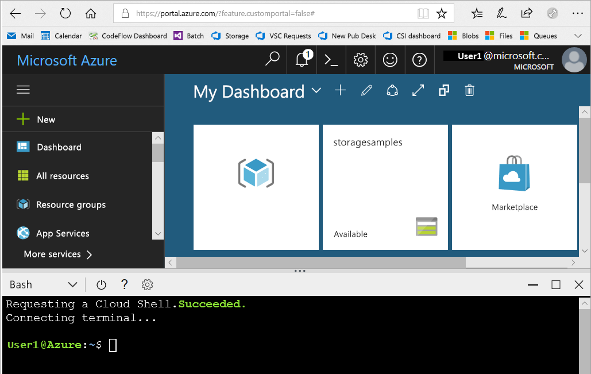
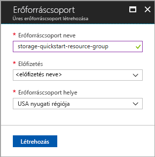
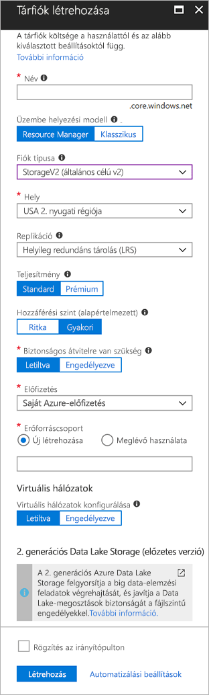

# <a name="quickstart-create-an-azure-data-lake-storage-gen2-preview-storage-account"></a>Rövid útmutató: Előzetes verziójú, 2. generációs Azure Data Lake Storage-tárfiók létrehozása

Az előzetes verziójú, 2. generációs Azure Data Lake Storage-fiókok [támogatnak egy HNS-t (Hierarchical Namespace Service – hierarchikus névtérszolgáltatás)](introduction.md), amely egy, a Hadoop elosztott fájlrendszerrel (HDFS) való együttműködésre kialakított natív könyvtáralapú fájlrendszert biztosít. A 2. generációs Data Lake Storage-adatok a HDFS-ből az [ABFS illesztőprogramon](abfs-driver.md) keresztül érhetők el.

Ha engedélyezni szeretné a 2. generációs Data Lake Storage funkcióit a tárfiókon, [töltse ki az előzetes verzió használatára vonatkozó felmérést hozzáférés igényléséhez](https://aka.ms/adlsgen2signup). Miután jóvá lett hagyva, létrehozhat egy új, 2. generációs Data Lake Storage-fiókot. Ez a rövid útmutató bemutatja, hogyan hozhat létre fiókot az [Azure Portal](https://portal.azure.com/), az [Azure PowerShell](https://docs.microsoft.com/powershell/azure/overview) vagy az [Azure CLI](https://docs.microsoft.com/cli/azure?view=azure-cli-latest) használatával.

> [!NOTE]
> A 2. generációs Data Lake Storage-fiók létrehozásának jóváhagyása után az Azure Portal fióklétrehozási felülete módosul. Ugyanígy a 2. generációs Data Lake Storage-hez kapcsolódó PowerShell- és parancssori felületi argumentumok is csak azután működnek, hogy az előzetes verzió használatára vonatkozó igénye jóvá lett hagyva.

## <a name="prerequisites"></a>Előfeltételek

Ha nem rendelkezik Azure-előfizetéssel, mindössze néhány perc alatt létrehozhat egy [ingyenes fiókot](https://azure.microsoft.com/free/) a virtuális gép létrehozásának megkezdése előtt.

|           | Előfeltétel |
|-----------|--------------|
|Portál     | None         |
|PowerShell | Ehhez a rövid útmutatóhoz az Azure PowerShell-modul **5.0.4-preview** vagy újabb verziójára lesz szükség. Az aktuális verzió azonosításához futtassa a következőt: `Get-Module -ListAvailable AzureRM`. Ha telepíteni vagy frissíteni szeretne, olvassa el [az Azure PowerShell-modul telepítését](/powershell/azure/install-azurerm-ps) ismertető cikket. |
|parancssori felület        | Az Azure-ba történő bejelentkezéshez és az Azure CLI parancsainak futtatásához az alábbi két módszer egyikét használhatja: <ul><li>A CLI-parancsok az Azure Portalról, az Azure Cloud Shell felületén futtathatók </li><li>Telepítheti a parancssori felületet, így helyben is futtathatja a CLI-parancsokat</li></ul>|

Ha a parancssori felületet használja, futtathatja az Azure Cloud Shellt vagy telepítheti a parancssori felületet helyileg.

### <a name="use-azure-cloud-shell"></a>Az Azure Cloud Shell használata

Az Azure Cloud Shell olyan ingyenes Bash-felület, amelyet közvetlenül futtathat az Azure Portalon. A fiókjával való használat érdekében az Azure CLI már előre telepítve és konfigurálva van rajta. Az Azure Portal jobb felső sarkában található menüben kattintson a **Cloud Shell** gombra:

[](https://portal.azure.com)

A gombra kattintva megjelenik egy interaktív kezelőfelület jelenik, amelyet az ebben a rövid útmutatóban található lépések futtatására használhat:

[](https://portal.azure.com)

### <a name="install-the-cli-locally"></a>A parancssori felület helyi telepítése

Az Azure CLI-t helyben is telepítheti és használhatja. A rövid útmutatóhoz az Azure CLI 2.0.38-as vagy újabb verziójára van szükség. A verzió azonosításához futtassa a következőt: `az --version`. Ha telepíteni vagy frissíteni szeretne: [Az Azure CLI 2.0 telepítése](/cli/azure/install-azure-cli).

## <a name="overview-of-creating-an-azure-data-lake-storage-gen2-account"></a>2. generációs Azure Data Lake Storage-fiókok létrehozása – áttekintés

Mielőtt létrehozna egy fiókot, először létre kell hoznia egy erőforráscsoportot, amely logikai tárolóként szolgál majd a tárfiókok és bármely egyéb létrehozott Azure-erőforrás számára. Ha törölni szeretné a jelen rövid útmutató által létrehozott erőforrásokat, akkor egyszerűen törölje az erőforráscsoportot. Az erőforráscsoport törlésekor a kapcsolódó tárfiók, valamint az esetlegesen az erőforráscsoporthoz társított egyéb erőforrások is törlődnek. További információt az erőforráscsoportokkal kapcsolatban [az Azure Resource Manager áttekintésében](../../azure-resource-manager/resource-group-overview.md) találhat.

> [!NOTE]
> A 2. generációs Data Lake Store funkcióinak használatához az új tárfiókokat **StorageV2 (általános célú V2)** típusúként kell létrehoznia.  

További információt a tárfiókok típusairól [az Azure Storage-fiók beállításait](../common/storage-account-options.md) ismertető szakaszban talál.

Ne feledje ezeket a szabályokat a tárfiók elnevezésekor:

- A tárfiókok neve 3–24 karakter hosszúságú lehet, és csak számokból és kisbetűkből állhat.
- A tárfiók nevének egyedinek kell lennie az Azure rendszerben. Két tárfióknak nem lehet azonos neve.

## <a name="create-an-account-using-the-azure-portal"></a>Fiókok létrehozása az Azure Portalon

Jelentkezzen be az [Azure Portalra](https://portal.azure.com).

### <a name="create-a-resource-group"></a>Hozzon létre egy erőforráscsoportot

Az Azure Portalon a következő lépések végrehajtásával hozhat létre egy erőforráscsoportot:

1. Az Azure Portalon bontsa ki a bal oldalon a szolgáltatásmenüt, és válassza az **Erőforráscsoportok** lehetőséget.
2. Új erőforráscsoport hozzáadásához kattintson a **Hozzáadás** gombra.
3. Adja meg az új erőforráscsoport nevét.
4. Válassza ki azt az előfizetést, amelyben létre kívánja hozni az új erőforráscsoportot.
5. Válassza ki az erőforráscsoport helyét.
6. Kattintson a **Létrehozás** gombra.  



### <a name="create-a-general-purpose-v2-storage-account"></a>Általános célú 2-es verziójú tárfiók létrehozása

Kövesse az alábbi lépéseket egy általános célú v2-tárfiók létrehozásához az Azure Portalon:

> [!NOTE]
> A hierarchikus névtér csak az USA 2. nyugati régiójában és az USA nyugati középső régiójában támogatott. A tárfiók létrehozásakor ügyeljen arra, hogy a két régió valamelyikét adja meg.

1. Az Azure Portalon nyissa ki bal oldalon a szolgáltatásmenüt, és válassza a **Minden szolgáltatás** lehetőséget. Ezután görgessen le a **Storage** szakaszig, és válassza a **Storage-fiókok** lehetőséget. A megjelenő **Storage-fiókok** ablakban válassza a **Hozzáadás** lehetőséget.
2. Adja meg a tárfiók nevét.
3. Az **Üzemi modell** beállítását hagyja az alapértelmezett értéken.
4. Állítsa be a **Fiók típusa** mezőben a **StorageV2 (általános célú v2)** értéket.
5. A **Hely** mezőben adja meg az **USA 2. nyugati régiója** értéket.
6. A **Replikáció** mezőben hagyja meg a **Helyileg redundáns tárolás (LRS)** értéket.
7. Ne módosítsa a következő mezők alapértelmezett értékeit: **Replikáció**, **Teljesítmény**, **Hozzáférési szint**.
8. Válassza ki azt az előfizetést, amelyikben létre kívánja hozni a tárfiókot.
9. Az **Erőforráscsoport** szakaszban válassza a **Meglévő használata** lehetőséget, majd válassza ki az előző szakaszban létrehozott erőforráscsoportot.
10. Tartsa meg a **Virtuális hálózatok** beállítás alapértelmezett értékét.
11. A **2. generációs Data Lake Storage (előzetes verzió)** szakaszban állítsa a **Hierarchikus névtér** beállítást **Engedélyezve** értékre.
12. Kattintson a **Létrehozás** parancsra a tárfiók létrehozásához.



Ezzel a tárfiók létrejött a portálon.

### <a name="clean-up-resources"></a>Az erőforrások eltávolítása

Erőforráscsoport eltávolítása az Azure Portallal:

1. Az Azure Portalon bontsa ki a bal oldalon a szolgáltatásmenüt, és válassza az **Erőforráscsoportok** lehetőséget az erőforráscsoportok listájának megjelenítéséhez.
2. Keresse meg a törölni kívánt erőforráscsoportot, és kattintson a jobb gombbal a lista jobb oldalán lévő **Továbbiak** gombra (**...**).
3. Válassza az **Erőforráscsoport törlése** elemet, és erősítse meg a választását.


## <a name="upgrade-your-powershell-module"></a>A PowerShell-modul frissítése

A 2. generációs Data Lake Storage PowerShell-lel történő használatához frissítenie kell a modult az előzetes verzióra.

Ehhez nyisson meg egy emelt szintű PowerShell-munkamenetet, és írja be a következő parancsot: `Install-Module AzureRM.Storage –Repository PSGallery -RequiredVersion 5.0.4-preview –AllowPrerelease –AllowClobber –Force `

Ezután indítsa újra a felületet.

## <a name="create-an-account-using-powershell"></a>Fiók létrehozása a PowerShell használatával

Jelentkezzen be az Azure-előfizetésbe a `Login-AzureRmAccount` paranccsal, és a hitelesítéshez kövesse a képernyőn megjelenő utasításokat.

```powershell
Login-AzureRmAccount
```

### <a name="create-a-resource-group"></a>Hozzon létre egy erőforráscsoportot

Az új erőforráscsoport PowerShell használatával történő létrehozása a [New-AzureRmResourceGroup](/powershell/module/azurerm.resources/new-azurermresourcegroup) paranccsal történik: 

> [!NOTE]
> A hierarchikus névtér csak az USA 2. nyugati régiójában és az USA nyugati középső régiójában támogatott. A tárfiók létrehozásakor ügyeljen arra, hogy a két régió valamelyikét adja meg.

```powershell
# put resource group in a variable so you can use the same group name going forward,
# without hardcoding it repeatedly
$resourceGroup = "storage-quickstart-resource-group"
$location = "westus2"
New-AzureRmResourceGroup -Name $resourceGroup -Location $location
```

### <a name="create-a-general-purpose-v2-storage-account"></a>Általános célú 2-es verziójú tárfiók létrehozása

Egy helyileg redundáns tárolást (LRS) használó általános célú v2-tárfiók létrehozásához a PowerShellben használja a [New-AzureRmStorageAccount](/powershell/module/azurerm.storage/New-AzureRmStorageAccount) parancsot:

```powershell
Get-AzureRmLocation | select Location 
$location = "westus2"

New-AzureRmStorageAccount -ResourceGroupName $resourceGroup `
  -Name "storagequickstart" `
  -Location $location `
  -SkuName Standard_LRS `
  -Kind StorageV2 
  -EnableHierarchicalNamespace $True
```

### <a name="clean-up-resources"></a>Az erőforrások eltávolítása

A [Remove-AzureRmResourceGroup](/powershell/module/azurerm.resources/remove-azurermresourcegroup) paranccsal eltávolítható az erőforráscsoport és az összes kapcsolódó erőforrás, beleértve az új tárfiókot is: 

```powershell
Remove-AzureRmResourceGroup -Name $resourceGroup
```

## <a name="upgrade-your-cli-module"></a>A CLI-modul frissítése

A 2. generációs Data Lake Storage CLI-vel történő használatához hozzá kell adnia a bővítményt a felülethez.

Ehhez a Cloud Shell vagy a helyi felület használatával írja be a következő parancsot: `az extension add --name storage-preview`

## <a name="create-an-account-using-azure-cli"></a>Fiók létrehozása az Azure CLI használatával 

Az Azure Cloud Shell indításához jelentkezzen be az [Azure Portalra](https://portal.azure.com).

A parancssori felület helyileg telepített példányára történő bejelentkezéshez futtassa a bejelentkezési parancsot:

```cli
az login
```

### <a name="create-a-resource-group"></a>Hozzon létre egy erőforráscsoportot

Ha az Azure CLI használatával kíván új erőforráscsoportot létrehozni, használja az [az group create](/cli/azure/group#az_group_create) parancsot. 

```azurecli-interactive
az group create \
    --name storage-quickstart-resource-group \
    --location westus2
```

> [!NOTE]
> A hierarchikus névtér csak az USA 2. nyugati régiójában és az USA nyugati középső régiójában támogatott. A tárfiók létrehozásakor ügyeljen arra, hogy a két régió valamelyikét adja meg.

### <a name="create-a-general-purpose-v2-storage-account"></a>Általános célú 2-es verziójú tárfiók létrehozása

Egy helyileg redundáns tárolást (LRS) használó általános célú v2-tárfiók létrehozásához az Azure CLI-ben használja az [az storage account create](/cli/azure/storage/account#az_storage_account_create) parancsot.

```azurecli-interactive
az storage account create \
    --name storagequickstart \
    --resource-group storage-quickstart-resource-group \
    --location westus2 \
    --sku Standard_LRS \
    --kind StorageV2 \
    --Enable-hierarchical-namespace true
```

### <a name="clean-up-resources"></a>Az erőforrások eltávolítása

Az [az group delete](/cli/azure/group#az_group_delete) paranccsal eltávolítható az erőforráscsoport és az összes kapcsolódó erőforrás, beleértve az új tárfiókot is.

```azurecli-interactive
az group delete --name myResourceGroup
```

## <a name="next-steps"></a>További lépések

Ebben a rövid útmutatóban egy 2. generációs Data Lake Storage-tárfiókot hozott létre. Ha szeretne megismerkedni a blobok tárfiókba történő felöltésével és onnan való letöltésével, folytassa a Blob Storage rövid útmutatójával.

* [Adatok áthelyezése az Azure Blob Storage-be vagy onnan máshová az AzCopy használatával](https://docs.microsoft.com/en-us/azure/machine-learning/team-data-science-process/move-data-to-azure-blob-using-azcopy)