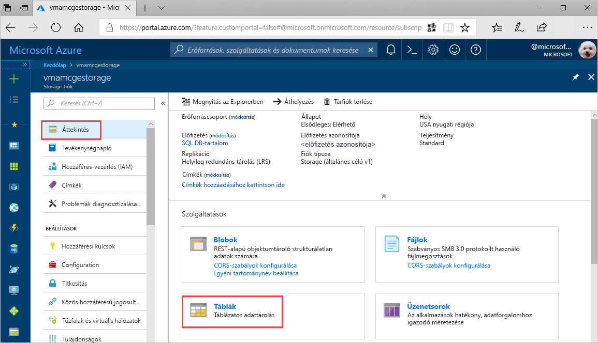
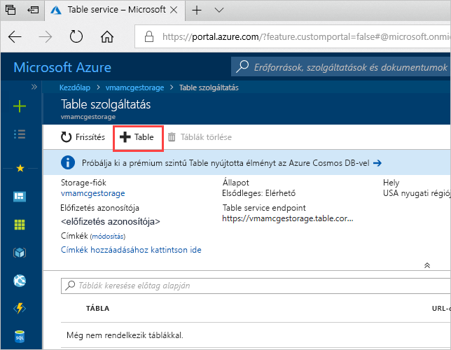
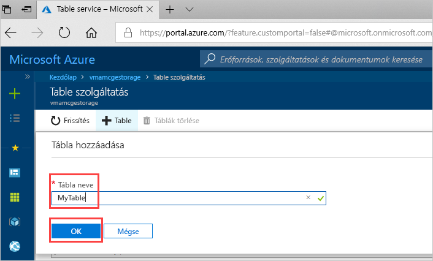

# Rövid útmutató: Azure Storage-tábla létrehozása az Azure Portalon 

Ez a rövid útmutató ismerteti, hogyan hozhat létre táblákat és entitásokat a webes alapú Azure Portalon. Ez a rövid útmutató azt is bemutatja, hogyan hozhat létre Azure Storage-fiókot.

[!INCLUDE [quickstarts-free-trial-note](../../../includes/quickstarts-free-trial-note.md)]

## Előfeltételek

A rövid útmutató elvégzéséhez előbb hozzon létre egy Azure-tárfiókot az [Azure Portalon](https://portal.azure.com/#create/Microsoft.StorageAccount-ARM). A fiók létrehozásával kapcsolatos útmutatóért lásd a [tárfiók létrehozását](../common/storage-quickstart-create-account.md) ismertető szakaszt.

## Tábla hozzáadása

Az Azure Portal Table Service már táblák létrehozására is használható.

1. Kattintson az Áttekintés > Táblák elemre.

   

2. Kattintson a **+ Tábla** elemre.

   

3. Adjon nevet a táblának a **Tábla neve** mezőben, majd kattintson az **OK** gombra. 

   

## További lépések

- [Irányelvek táblatervezéshez](table-storage-design-guidelines.md)