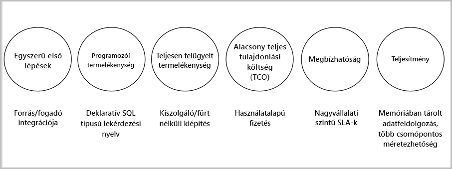

# Mi a Stream Analytics?

Az Azure Stream Analytics egy eseményfeldolgozó motor, amely lehetővé teszi az eszközökről streamelt nagy mennyiségű adat vizsgálatát. A bejövő adatok származhatnak egyebek között eszközöktől, érzékelőktől, webhelyektől, közösségi hírcsatornákról vagy alkalmazásoktól. A szolgáltatás emellett támogatja az információk adatfolyamokból való kinyerését, illetve a mintázatok és kapcsolatok azonosítását. Ezután ezen mintázatok használatával aktiválhat más műveleteket, például riasztásokat, információt adhat át jelentéskészítő eszközöknek, vagy tárolhatja az adatokat későbbi használatra.

Az alábbiak az Azure Stream Analytics használatának lehetséges példái: 

* Az eszközök internetes hálózata (IoT) érzékelőinek egyesítése és eszközök telemetriai adatain végzett valós idejű elemzés
* Webnaplók és kattintássorozatok elemzése
* Térinformatikai elemzés flottakezeléshez és vezető nélküli járművekhez
* A nagy értékű eszközök távoli figyelése és prediktív karbantartása
* A pénztári adatok valós idejű elemzése készletszabályozáshoz és anomáliadetektáláshoz

## Hogyan működik a Stream Analytics?

Az Azure Stream Analytics egy streamelési adatforrásból indul ki, amelyet beolvas az Azure Event Hubs vagy az Azure IoT Hub szolgáltatásba, vagy pedig egy olyan adattárból, mint például az Azure Blob Storage. A streamek vizsgálatához egy Stream Analytics-feladatot kell létrehozni, amely meghatározza az adatokat streamelő bemeneti forrást. A feladat emellett megad egy transzformációs lekérdezést, amely meghatározza az adatok, minták és kapcsolatok keresésének módját. A transzformációs lekérdezés egy SQL-szerű lekérdező nyelvet használ, amellyel szűrhetők, rendezhetők, összesíthetők és összekapcsolhatók a streamelési adatok egy adott időszakra vonatkozóan. A feladat végrehajtásakor módosíthatja az eseményrendezési beállításokat és az összesítési műveletek végrehajtásakor használt időtartományok hosszát.

A bejövő adatok elemzését követően meg kell adnia az átalakított adatok kimenetét, és azt is megadhatja, hogy a rendszer hogyan reagáljon az elemzett információkra. Például a következőkhöz hasonló műveleteket hajthat végre:

* Az adatok elküldése egy figyelt várólistába lefelé irányuló egyéni munkafolyamatok aktiválásához.
* Az adatok elküldése egy Power BI-irányítópultra valós idejű vizualizáció céljából.
* Az adatok archiválása más Azure-beli társzolgáltatásokban.

Az alábbi ábra a Stream Analytics feldolgozási folyamatát szemlélteti. A Stream Analytics-feladat felhasználhatja az összes bemenetet és kimenetet, vagy azok egy kiválasztott készletét. Az ábra azt mutatja be, hogyan küldi el a rendszer az adatokat a Stream Analytics szolgáltatásba, és az hogyan elemzi, majd továbbítja azokat más műveletek, például tárolás vagy megjelenítés céljából:

## Főbb képességek és előnyök

Az Azure Stream Analytics szolgáltatást könnyen használhatónak, rugalmasnak, megbízhatónak és bármely feladathoz méretezhetőnek tervezték. Több adatközpontban és szuverén felhőkben is elérhető. Az alábbi ábra az Azure Stream Analytics főbb képességeit mutatja be:

## Könnyű első lépések

Az Azure Stream Analytics használatát könnyű megkezdeni. Mindössze néhány kattintással csatlakoztathat több forrást, fogadót, és létrehozhat egy teljes körű folyamatot. A Stream Analytics képes csatlakozni az [Azure Event Hubs](https://docs.microsoft.com/azure/event-hubs/) és az [Azure IoT Hub](https://docs.microsoft.com/azure/iot-hub/) szolgáltatáshoz streamelési adatok betöltése céljából. Emellett az [Azure Blob Storage](https://docs.microsoft.com/azure/storage/storage-introduction) szolgáltatáshoz is csatlakoztatható előzményadatok betöltéséhez. Képes kombinálni az eseményközpontokból származó adatokat más adatforrásokkal és feldolgozó motorokkal. A feladatok bemenetei között szerepelhetnek statikus vagy lassan változó referenciaadatok is, és ezek a referenciaadatok összekapcsolhatók streamelési adatokkal keresési műveletek végrehajtásához.

A Stream Analytics számos olyan tárolási rendszerbe tudja irányítani a feladatok kimenetét, mint például az [Azure Blob](https://docs.microsoft.com/azure/storage/storage-introduction), az [Azure SQL Database](https://docs.microsoft.com/azure/sql-database/), az [Azure Data Lake Store-tárolók](https://docs.microsoft.com/azure/data-lake-store/) vagy az [Azure Cosmos DB](https://docs.microsoft.com/azure/cosmos-db/introduction). Rendezést követően futtathat kötegelt elemzést az Azure HDInsight szolgáltatással, vagy elküldheti a kimenetet felhasználásra más szolgáltatásokba, például az Event Hubsba, vagy valós idejű vizualizáció céljából a [Power BI](https://docs.microsoft.com/power-bi/) szolgáltatásba a Power BI streamelési API-jával.

## Programozói hatékonyság

Az Azure Stream Analytics egy egyszerű SQL-alapú lekérdező nyelvet használ, amely hatékony historikus korlátozásokkal lett bővítve a mozgásban lévő adatok elemzéséhez. A feladattranszformációk a [Stream Analytics egyszerű, deklaratív lekérdező nyelvével](https://msdn.microsoft.com/library/azure/dn834998.aspx) definiálhatók, amely lehetővé teszi, hogy egyszerű SQL-szerkezetekkel hozzon létre összetett historikus lekérdezéseket. A Stream Analytics lekérdező nyelve konzisztens az SQL nyelvvel, így az SQL nyelv ismerete elegendő a feladatok létrehozásának megkezdéséhez. Olyan fejlesztői eszközökkel is létrehozhatók feladatok, mint például az Azure PowerShell, [a Stream Analytics Visual Studio-hoz készült eszközei](stream-analytics-tools-for-visual-studio-install.md) vagy az Azure Resource Manager-sablonok. A fejlesztői eszközök használatával offline módon fejleszthet transzformációs lekérdezéseket és a [folyamatos integrációs és folyamatos teljesítési folyamattal](stream-analytics-tools-for-visual-studio-cicd.md) küldhet be feladatokat az Azure-ba. 

A Stream Analytics lekérdező nyelve számos funkciót biztosít a streamelési adatok elemzéséhez és feldolgozásához. A lekérdező nyelv az egyszerű adatkezeléstől és összesítő függvényektől az összetett térinformatikai funkciókig támogat műveleteket. A lekérdezéseket szerkesztheti a portálon, és az élő streamből kinyert mintaadatokkal tesztelheti őket.

A lekérdező nyelv lehetőségei függvények definiálásával és meghívásával tovább bővíthetők. Definiálhat függvényhívásokat az Azure Machine Learning szolgáltatásban Azure Machine Learning-megoldások használatához és JavaScript nyelvű felhasználó által definiált függvények (UDF-ek) integrálásához, vagy felhasználó által definiált összesítéseket összetett számítások Stream Analytics-lekérdezések részeként való elvégzéséhez.

## Teljes körű felügyelet 

Az Azure Stream Analytics egy teljes körűen felügyelt Azure-beli kiszolgáló nélküli (PaaS-) ajánlat. Ez azt jelenti, hogy nem kell hardvert kiépítenie vagy fürtöket kezelnie a feladatok futtatásához. Az Azure Stream Analytics teljes körűen felügyeli a feladatot, gondoskodva az összetett számítási fürtök felhőben való beállításáról és a teljesítményhangolásról, mely a feladat futtatásához szükséges. Az Azure Event Hubs- és Azure IoT Hubs-integrációnak köszönhetően a feladatok másodpercenként több millió eseményt képesek feldolgozni a csatlakoztatott eszközökről, kattintássorozatokból és naplófájlokból, hogy csak néhányat említsünk. Az eseményközpontok particionáló funkciójával a számítások logikai lépésekre bonthatók, melyek mindegyike tovább bontható lehet a jobb méretezhetőség érdekében.

## Alacsony teljes bekerülési költség

Felhőszolgáltatásként a Stream Analytics költségoptimalizált. Nincsenek előzetes költségek, csak [a felhasznált streamelési egységekért](stream-analytics-streaming-unit-consumption.md) és a feldolgozott adatmennyiségért kell fizetnie. Nem szükséges kötelezettségvállalás vagy fürtlétesítés. A streamelési feladatok az üzleti igényeknek megfelelően fel- és leskálázhatók. 

## Megbízhatóság 

Felügyelt szolgáltatásként a Stream Analytics 99,9 %-os rendelkezésre állással biztosítja az események feldolgozását, segít megakadályozni az adatvesztést, és üzleti folytonosságot biztosít. További részleteket a [Stream Analytics SLA-ját ismertető oldalon](https://azure.microsoft.com/support/legal/sla/stream-analytics/v1_0/) találhat. A Stream Analytics másodpercenként több millió eseményt képes feldolgozni, és alacsony késleltetéssel képes kézbesíteni az eredményeket.
A Stream Analytics garantáltan pontosan egyszer dolgozza fel az eseményeket, és legalább egyszer kézbesíti az eseményeket. Beépített helyreállítási képességekkel rendelkezik arra az esetre, ha az eseményeket nem sikerül kézbesíteni. A Stream Analytics belsőleg képes fenntartani a feladat állapotát, képes elindítani feladatokat a legutóbbi kimeneti időponttól kezdve, és megismételhető eredményeket biztosít, mivel mindig ugyanazokat az eredményeket adja. A Stream Analytics ezen funkciójával visszamehet az időben, és megvizsgálhatja a számításokat az alapvető okok elemzése során. 

## Teljesítmény

Az Azure Stream Analytics nagy teljesítményre van optimalizálva; streamelési adatokat képes feldolgozni és memóriabeli számításokat képes végrehajtani. Fel- és leskálázást tesz lehetővé a valós idejű és összetett eseményfeldolgozó alkalmazások kezeléséhez. A Stream Analytics particionálással támogatja a teljesítményt. Az összetett lekérdezések párhuzamosíthatók és végrehajthatók több streamelési csomóponton. 

## További lépések

A cikk az Azure Stream Analytics szolgáltatásról nyújtott áttekintést. Ezután megismerheti a részleteket, és létrehozhatja első Stream Analytics-feladatát:

* [Stream Analytics-feladat létrehozása az Azure Portalon](stream-analytics-quick-create-portal.md).
* [Stream Analytics-feladat létrehozása az Azure PowerShell használatával](stream-analytics-quick-create-powershell.md).
