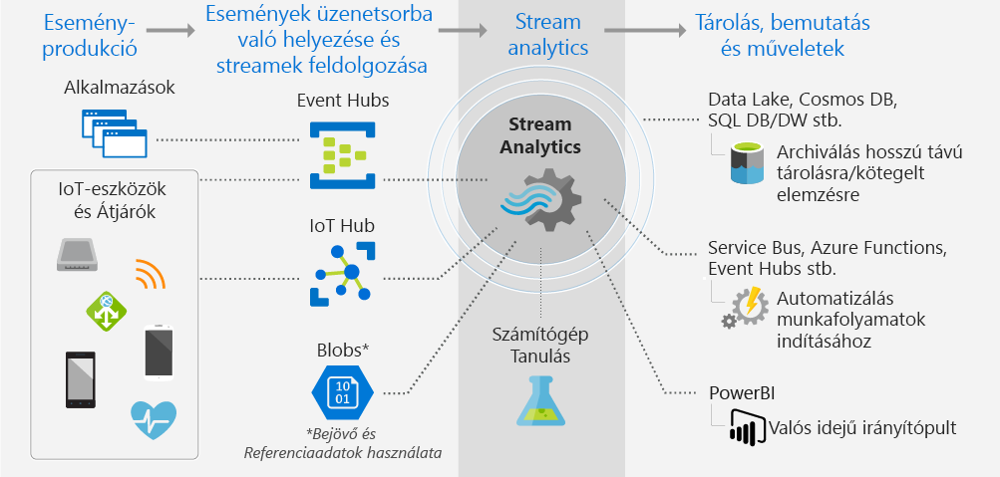

# Mi a Stream Analytics?

Az Azure Stream Analytics egy felügyelt eseményfeldolgozó motor, amellyel valós idejű elemző számítások állíthatók be streamelt adatokon. Az adatok származhatnak egyebek között eszközöktől, érzékelőktől, webhelyektől, közösségi hírcsatornákról, alkalmazásoktól vagy infrastruktúra-rendszerektől. 

A Stream Analytics használatával az eszközöktől vagy folyamatoktól származó nagy mennyiségű adat vizsgálható át, továbbá mintázatokat, trendeket és összefüggéseket azonosíthat, illetve információkat vonhat ki a streamből. A mintázatok használatával aktiválhat más folyamatokat vagy műveleteket, például riasztásokat vagy automatizált munkafolyamatokat, információt adhat át jelentéskészítő eszközöknek, vagy tárolhatja az adatokat későbbi vizsgálat céljára. 

Néhány példa:

* Tőzsdeelemzések és riasztások.
* Csalások észlelése, adatok és személyazonosság védelme. 
* Beágyazott érzékelők és működtetők elemzése.
* Webes kattintássorozat-elemzés.

## Hogyan működik a Stream Analytics?

Az alábbi ábra a Stream Analytics-folyamatot ismerteti, bemutatva az adatok feldolgozását, elemzését, valamint a bemutatás vagy a műveletek végrehajtása céljából történő továbbküldését. 

A Stream Analytics egy adatfolyam-forrásból indul ki. Az adatok egy Azure-eseményközpontot vagy IoT Hubot használó eszközön át olvasódnak be az Azure-ba. Az adatok származhatnak olyan adattárból is, mint az Azure Blob Storage. 

A stream vizsgálatához létrehoz egy Stream Analytics-*feladatot*, amely meghatározza az adatok forrását. A feladat megad egy *transzformációt* az adatok, minták és kapcsolatok keresési módjához. Ebben a feladatban a Stream Analytics támogat egy SQL-szerű lekérdezési nyelvet, amely lehetővé teszi a streamelési adatok adott időtartamon belüli szűrését, rendezését, összesítését és egyesítését.

A feladat megad végül egy kimenetet is a transzformált adatok számára. Eldöntheti, mi a teendő az elemzett információra adott válaszként. Megteheti például, hogy az elemzés eredményeként:

* Parancsot küld egy eszköz beállításainak módosítására. 
* Adatokat küld egy felügyelt üzenetsorba további műveletek végrehajtása céljából az eredmények alapján. 
* Adatokat küld egy Power BI-irányítópultnak.
* Adatokat küld egy adattárba, amilyen például a Data Lake Store, az Azure SQL Database vagy az Azure Blob Storage.

Módosíthatja a másodpercenként feldolgozott események számát a feladat futtatása közben. Diagnosztikai naplókat is előállíthat a hibaelhárításhoz.

## Főbb képességek és előnyök

A Stream Analytics-et könnyen használhatónak, rugalmasnak és bármely feladathoz méretezhetőnek tervezték.

### Bemenetek és kimenetek csatlakoztatása

A Stream Analytics a közvetlen [Azure Event Hubs-](https://azure.microsoft.com/services/event-hubs/) és [Azure IoT Hub](https://azure.microsoft.com/services/iot-hub/)-kapcsolaton keresztül fogadja a streameket, az [Azure Blob Storage szolgáltatás](https://docs.microsoft.com/azure/storage/storage-introduction#blob-storage-accounts) pedig előzményadatokat biztosít a számára. A Stream Analytics-szel rendelkező eseményközpontokból származó adatok más adatforrásokkal és feldolgozó motorokkal is kombinálhatók. A feladat bemenete referenciaadatokat (statikus vagy lassan változó adatokat) is tartalmazhat. Az adatfolyamot ezekhez a referenciaadatokhoz társítva ugyanúgy végezhet keresési műveleteket, mint egy adatbázis-lekérdezés esetén.

A Stream Analytics-feladat kimenetét különböző célok felé továbbíthatja. Kiírhatja olyan tárhelyekre, mint amilyen az Azure Blob, az Azure SQL Database, az Azure Data Lake Store vagy az Azure Cosmos DB. A tárhelyről már futtathat Batch-elemzést az Azure HDInsight segítségével. A kimenet egy másik szolgáltatásnak is átadható, például eseményközpontnak, Azure Service Busnak vagy egy feldolgozási sornak, hogy egy másik eljárás dolgozza fel, illetve a Power BI felé is továbbítható képi megjelenítés céljából.

### Könnyen használható

Transzformációk definiálására egy egyszerű, deklaratív [Stream Analytics lekérdező nyelv](https://msdn.microsoft.com/library/azure/dn834998.aspx) szolgál, amellyel programozás nélkül hozhat létre kifinomult elemzéseket. A lekérdező nyelv egy adatfolyamot fogad bemenetként. Az adatok szűrhetők, rendezhetők és összegezhetők, végezhet velük számításokat, társíthatja őket (az adatfolyamon belül vagy a referenciaadatokkal) és földrajzi függvényekhez is használhatók. A lekérdezések a portálon szerkeszthetők IntelliSense használatával és szintaktikai ellenőrzés mellett. A lekérdezések tesztelhetők is az élő adatfolyamból kiemelt mintaadatokon.

### Bővíthető lekérdező nyelv

A lekérdező nyelv lehetőségei függvények definiálásával és meghívásával tovább bővíthetők. Az Azure Machine Learning megoldásokat az Azure Machine Learning szolgáltatásban definiált függvényhívásokkal használhatja ki. Stream Analytics lekérdezés részeként felhasználó által definiált JavaScript-függvények (UDF-ek) is integrálhatók komplex számítások elvégzésére.

### Méretezhetőség

A Stream Analytics akár másodpercenként 1 GB bejövő adat kezelésére is képes. Az [Azure Event Hubs](https://azure.microsoft.com/services/event-hubs/)- és [Azure IoT Hubs](https://azure.microsoft.com/services/iot-hub/)-integrációnak köszönhetően a feladatok másodpercenként több millió eseményt képesek feldolgozni a csatlakoztatott eszközökből, kattintássorozatokból és naplófájlokból, hogy csak néhányat említsünk. Az eseményközpontok particionáló funkciójával a számítások logikai lépésekre bonthatók, melyek mindegyike tovább bontható lehet a jobb méretezhetőség érdekében.

### Alacsony költség

Felhőszolgáltatásként a Stream Analytics alacsony költségű működtetésre van optimalizálva. A szolgáltatás használatalapú fizetést tesz lehetővé, ami a Streaming Unit-használaton és a rendszer által feldolgozott adatmennyiségen alapul. A használat számítása a feldolgozott események mennyisége, illetve a Stream Analytics-feladatok kezelésére a fürtben felhasznált számítási teljesítmény mérőszáma alapján történik.

### Megbízhatóság, gyors helyreállítás és ismételhetőség

A Stream Analytics felügyelt felhőbeli szolgáltatás segít megakadályozni az adatvesztést, és biztosítani az üzletmenet folytonosságát. A szolgáltatás beépített helyreállítási képességekkel bír hibák esetére. Mivel a szolgáltatás képes az állapot belső fenntartására, ismételhető eredményekkel biztosít lehetőséget az események archiválására és a feldolgozás jövőbeli újraalkalmazására, ami mindig ugyanazokkal az eredményekkel jár. Így visszamehet az időben, és megvizsgálhatja a számításokat a kiváltó okokat kereső elemzések, lehetőségelemzések stb. során.

## Következő lépések

* Első lépések: [kísérletezés IoT-eszközöktől származó bemenetekkel és lekérdezésekkel](stream-analytics-get-started-with-azure-stream-analytics-to-process-data-from-iot-devices.md).
* Létrehozhat egy [teljes körű Stream Analytics-megoldást](stream-analytics-real-time-fraud-detection.md), amely megvizsgálja a telefonok metaadatait a rosszindulatú hívások megkereséséhez.
* Ismerje meg a Stream Analytics SQL-re hasonlító lekérdező nyelvét és az olyan egyedi fogalmakat, mint az [ablakfüggvények](stream-analytics-window-functions.md).
* A Stream Analyticsszel kapcsolatos kérdéseire az [Azure Stream Analytics-fórumon](https://social.msdn.microsoft.com/Forums/en-US/home?forum=AzureStreamAnalytics) kaphat választ.

