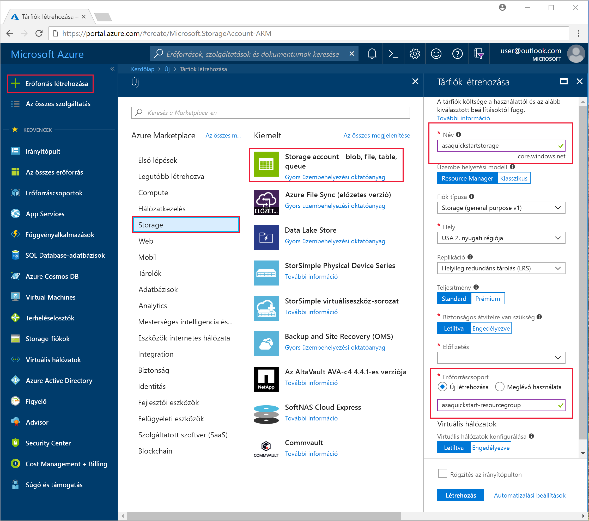
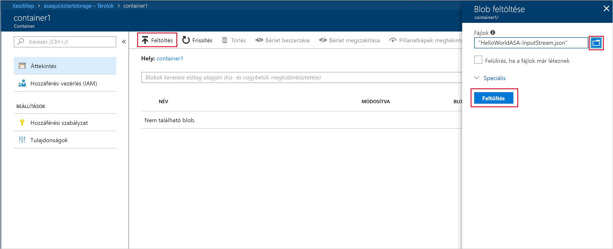
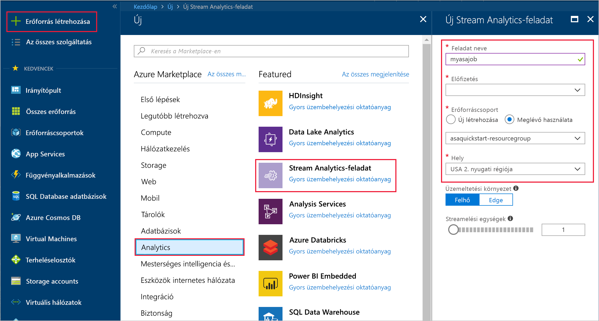
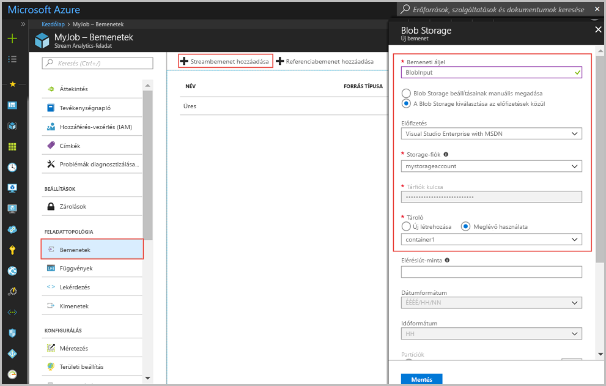
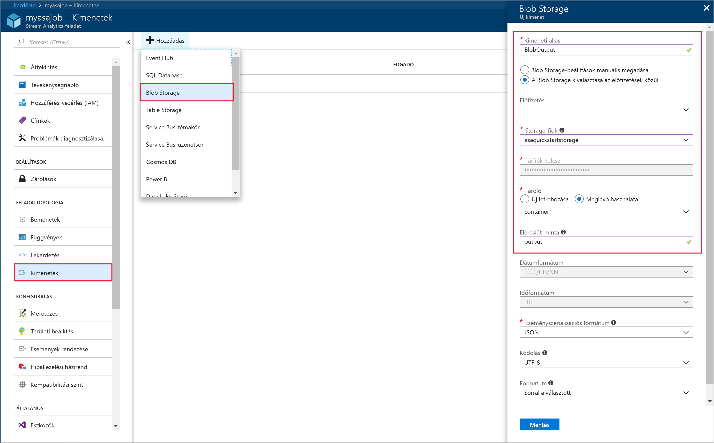
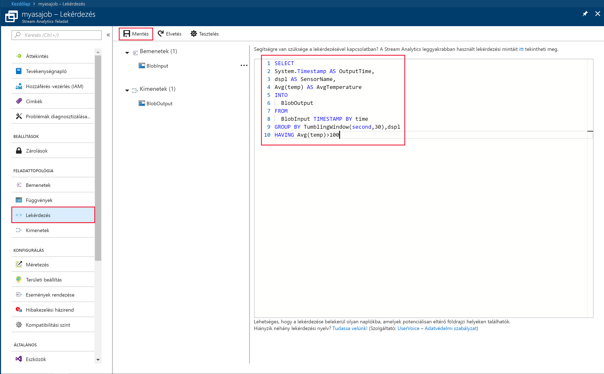
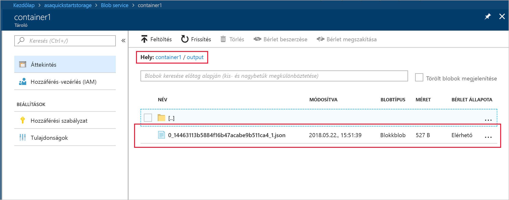

# <a name="quickstart-create-a-stream-analytics-job-by-using-the-azure-portal"></a>Útmutató: Stream Analytics-feladat létrehozása az Azure Portal használatával

Az útmutató azt mutatja be, hogy hogyan kezdhet hozzá egy Stream Analytics-feladat létrehozásához. Az útmutatóban létrehozunk egy Stream Analytics-feladatot, amely beolvassa a mintaként használt érzékelői adatokat, és 30 másodpercenként kiszűri azokat az adatsorokat, amelyeknél az átlaghőmérséklet meghaladja a 100 fokot. A cikkben egy blobtárolóból fogunk adatokat kiolvasni, majd transzformáljuk az adatokat, és visszaírjuk őket egy másik tárolóba ugyanezen a blobtárolón belül.

## <a name="before-you-begin"></a>Előkészületek

* Ha nem rendelkezik Azure-előfizetéssel, hozzon létre egy [ingyenes fiókot.](https://azure.microsoft.com/free/).

* Jelentkezzen be az [Azure Portalra](https://portal.azure.com/).

## <a name="prepare-the-input-data"></a>A bemeneti adatok előkészítése

A Stream Analytics-feladat létrehozása előtt érdemes beállítani azokat az adatokat, amelyek majd a feladat bemenetét fogják képezni. Végezze el a következő lépéseket a feladat bemeneti adatainak előkészítéséhez:

1. Töltse le az [érzékelői mintaadatokat](https://github.com/Azure/azure-stream-analytics/blob/master/Samples/GettingStarted/HelloWorldASA-InputStream.json) a GitHubról. A mintaadatok érzékelők adatait tartalmazzák a következő JSON formátumban:  

   ```json
   {
     "time": "2016-01-26T21:18:52.0000000",
     "dspl": "sensorC",
     "temp": 87,
     "hmdt": 44
   }
   ```
2. Jelentkezzen be az Azure Portalra  

3. Az Azure Portal bal felső sarkában válassza az **Erőforrás létrehozása** > **Storage** > **Tárfiók** lehetőséget. A tárfiók feladat paneljén a **Név** mezőhöz írja be azt, hogy "myasastorageaccount," a **Hely** mezőhöz azt, hogy "West US 2," az **Erőforráscsoport** mezőhöz pedig azt, hogy "MyRG" (a jobb teljesítmény érdekében a tárfiókot és a folyamatos átviteli feladatot érdemes ugyanabban az erőforráscsoportban létrehozni). A fennmaradó beállításokat alapértelmezett értéken hagyhatja.  

   

4. Az **Összes erőforrás** panelen keresse meg az előző lépésnél beállított tárfiókot. Nyissa meg az **Áttekintés** panelt, utána pedig a **Blobok** csempét.  

5. A **Blob service** panelen válassza a **Tároló** lehetőséget, a **Név** mezőben adja meg a tároló nevét (például *container1*), ezután a **Nyilvános hozzáférés szintje** beállítást állítsa Blob értékre (anonim olvasási hozzáférés blobok számára), majd válassza az **OK** lehetőséget.  

   

6. Keresse meg az előző lépésnél létrehozott tárolót, válassza a **Feltöltés** lehetőséget, és töltse fel az útmutató első lépésénél letöltött érzékelői adatokat.  

   

## <a name="create-a-stream-analytics-job"></a>Stream Analytics-feladat létrehozása

1. Jelentkezzen be az Azure Portalra  

2. Kattintson az Azure Portal bal felső sarkában található **Erőforrás létrehozása** gombra.  

3. A megjelenő listában válassza az **Adatok + analitika** > **Stream Analytics-feladat** lehetőséget.  

4. Töltse ki a Stream Analytics-feladat paneljét a következő információkkal:

   |**Beállítás**  |**Ajánlott érték**  |**Leírás**  |
   |---------|---------|---------|
   |Feladat neve   |  myJob   |   Adjon meg egy nevet a Stream Analytics-feladat azonosításához. A Stream Analytics-feladat neve csak alfanumerikus karaktereket, kötőjeleket és aláhúzásjeleket tartalmazhat, és legalább 3, de legfeljebb 63 karakter hosszúságú lehet. |
   |Előfizetés  | \<Az Ön előfizetése\> |  Válassza ki a feladathoz használni kívánt Azure-előfizetést. |
   |Erőforráscsoport   |   myResourceGroup  |   Válassza az **Új létrehozása** lehetőséget, és adjon hozzá egy új erőforráscsoport-nevet a fiókhoz. |
   |Hely  |  \<Válassza ki a felhasználóihoz legközelebb eső régiót\> | Válassza ki azt a földrajzi helyet, ahol a Stream Analytics-feladatot üzemeltetni szeretné. A nagyobb teljesítmény és az adatátviteli díjak csökkentése érdekében válassza a felhasználóihoz legközelebb eső helyet. |
   |Streamelési egységek  | 1  |   A Streamelési egységek azoknak a számítási erőforrásoknak felelnek meg, amelyek a feladat futtatásához szükségesek. Ez az érték alapértelmezés szerint 1. A streamelési egységek skálázásával kapcsolatos további tudnivalókért olvassa el a [Skálázás streamelési egységekkel](stream-analytics-streaming-unit-consumption.md) című cikket.   |
   |Üzemeltetési környezet  |  Felhő  |   A Stream Analytics-feladatokat a felhőbe vagy peremhálózatra (Edge) telepítheti. Felhőbe történő telepítéskor az Azure Cloudba telepítheti a feladatot, Edge esetén pedig egy IoT Edge-eszközre. |

   

5. Ha a feladatot egy irányítópulton szeretné elhelyezni, válassza ki a **Rögzítés az irányítópulton** jelölőnégyzetet, ezután pedig válassza a **Létrehozás** lehetőséget.  

6. A böngésző ablakának jobb felső részén a „Telepítés folyamatban...” üzenetnek kell megjelennie. 

## <a name="configure-input-to-the-job"></a>A feladat bemenetének konfigurálása

Ebben a szakaszban beállítjuk a blobtárolót a Stream Analytics-feladat bemeneteként. Mielőtt konfigurálná a bemenetet, hozzon létre egy Blob Storage-fiókot.  

### <a name="add-the-input"></a>A bemenet hozzáadása 

1. Keresse meg a Stream Analytics-feladatot.  

2. Válassza a **Bemenetek** > **Streambemenet hozzáadása** > **Blobtároló** lehetőséget.  

3. A **Blobtároló** paneljén adja meg a következő információkat:

   |**Beállítás**  |**Ajánlott érték**  |**Leírás**  |
   |---------|---------|---------|
   |Bemeneti alias  |  BlobInput   |  Adja meg a feladat bemenetének azonosító nevét.   |
   |Előfizetés   |  \<Az Ön előfizetése\> |  Válassza ki azt az Azure-előfizetést, amelyhez a létrehozott tárfiók tartozik. A tárfiók tartozhat ugyanahhoz az előfizetéshez, de akár egy másik előfizetéshez is. A példa azt feltételezi, hogy a tárfiók ugyanahhoz az előfizetéshez tartozik. |
   |Tárfiók  |  myasastorageaccount |  Válassza ki vagy adja meg a tárfiók nevét. Ha a tárfiókok ugyanahhoz az előfizetéshez tartoznak, a rendszer automatikusan észleli a nevüket. |
   |Tároló  | container1 | Válassza ki azt a tárolót, amelyik a mintaadatokat tartalmazza. Ha a tárolók ugyanahhoz az előfizetéshez tartoznak, nevüket a rendszer automatikusan észleli. |

4. Az egyéb beállításokat hagyja alapértelmezett értéken, és válassza a**Mentés** lehetőséget a beállítások mentéséhez.  

   
 
## <a name="configure-output-to-the-job"></a>A feladat kimenetének konfigurálása

1. Keresse meg a korábban létrehozott Stream Analytics-feladatot.  

2. Válassza a **Kimenetek -> Hozzáadás -> Tárolóblob** lehetőséget.  

3. A **Blobtároló** paneljén adja meg a következő információkat:

   |**Beállítás**  |**Ajánlott érték**  |**Leírás**  |
   |---------|---------|---------|
   |Kimeneti alias |   BlobOutput   |   Adja meg a feladat kimenetének azonosító nevét. |
   |Előfizetés  |  \<Az Ön előfizetése\>  |  Válassza ki azt az Azure-előfizetést, amelyhez a létrehozott tárfiók tartozik. A tárfiók tartozhat ugyanahhoz az előfizetéshez, de akár egy másik előfizetéshez is. A példa azt feltételezi, hogy a tárfiók ugyanahhoz az előfizetéshez tartozik. |
   |Tárfiók |  myasastorageaccount |   Válassza ki vagy adja meg a tárfiók nevét. Ha a tárfiókok ugyanahhoz az előfizetéshez tartoznak, a rendszer automatikusan észleli a nevüket.       |
   |Tároló |   container2  |  Hozzon létre egy új tárolót ugyanabban a tárfiókban, amelyet a bemenethez használt.   |

4. Az egyéb beállításokat hagyja alapértelmezett értéken, és válassza a**Mentés** lehetőséget a beállítások mentéséhez.  

   
 
## <a name="define-the-transformation-query"></a>A transzformációs lekérdezés definiálása

1. Keresse meg a korábban létrehozott Stream Analytics-feladatot.  

2. Válassza ki a **Lekérdezés** lehetőséget, és frissítse a lekérdezés adatait a következő módon:  

   ```sql
   SELECT 
   System.Timestamp AS OutputTime,
   dspl AS SensorName,
   Avg(temp) AS AvgTemperature
   INTO
     MyBlobOutput
   FROM
     MyBlobInput TIMESTAMP BY time
   GROUP BY TumblingWindow(second,30),dspl
   HAVING Avg(temp)>100
   ```

3. Ebben a példában a lekérdezés adatokat fog beolvasni a blobból, és azokat egy új fájlba másolja a blobon belül. Válassza a **Mentés** lehetőséget.  

   

## <a name="start-the-stream-analytics-job-and-check-the-output"></a>A Stream Analytics-feladat indítása és a kimenet ellenőrzése

1. Térjen vissza a feladat áttekintése panelre, és válassza az **Indítás** lehetőséget.  

2. A **Feladat indítása** panelen válassza az **Egyéni** lehetőséget, hogy megjelenjen a **Kezdés ideje** mező. A fájl blobtárolóba való feltöltésének időpontját megelőző napot kell kiválasztania, mert a fájlt a jelen időponthoz képest már korábban feltöltötte. Amikor elkészült, válassza ki az **Indítás** lehetőséget.  

   

3. Néhány perc elteltével keresse meg a portálon azt a tárfiókot és tárolót, amelyet a feladat kimeneténél beállított. Mostanra a kimeneti fájl megjelent a tárolóban. Az első indítás után pár percbe telhet, amíg a feladat elindul, de ezt követően mindig futni fog, amint adatok érkeznek.  

   

## <a name="clean-up-resources"></a>Az erőforrások eltávolítása

Ha már nincs szükség rá, törölheti az erőforráscsoportot, a folyamatos átviteli feladatot és az összes kapcsolódó erőforrást. A feladat törlésével megakadályozhatja, hogy a feladat által felhasznált streamelési egységek kiszámlázásra kerüljenek. Ha a feladatot a jövőben is szeretné használni, leállíthatja, és később újraindíthatja amikor ismét szükség van rá. Ha már nem használja a feladatot, akkor a következő lépésekkel az útmutatóban létrehozott összes erőforrást törölheti:

1. Az Azure Portal bal oldali menüjében válassza az **Erőforráscsoportok** menüpontot, majd válassza ki a létrehozott erőforrás nevét.  

2. Az erőforráscsoport lapján válassza a **Törlés** elemet, írja be a törölni kívánt erőforrás nevét a szövegmezőbe, majd válassza a **Törlés** lehetőséget.

## <a name="next-steps"></a>További lépések

Az útmutató segítségével létrehozott és telepített egy egyszerű Stream Analytics-feladatot. A más típusú bemenetek beállításával és a valós idejű észleléssel kapcsolatban információt a következő cikkben talál:

> [!div class="nextstepaction"]
> [Valós idejű csalásészlelés az Azure Stream Analytics használatával](stream-analytics-real-time-fraud-detection.md)

