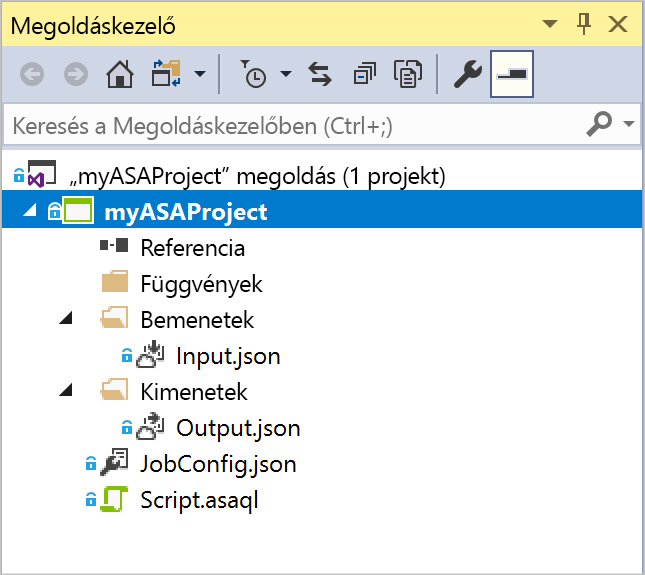
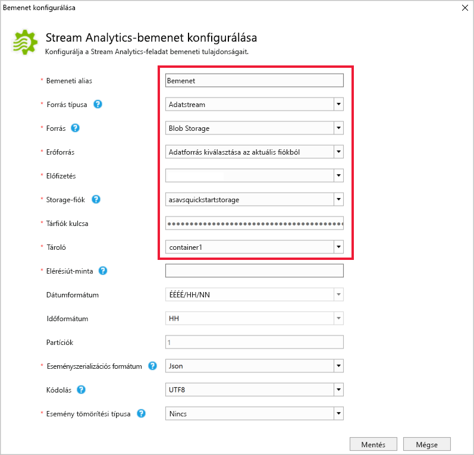
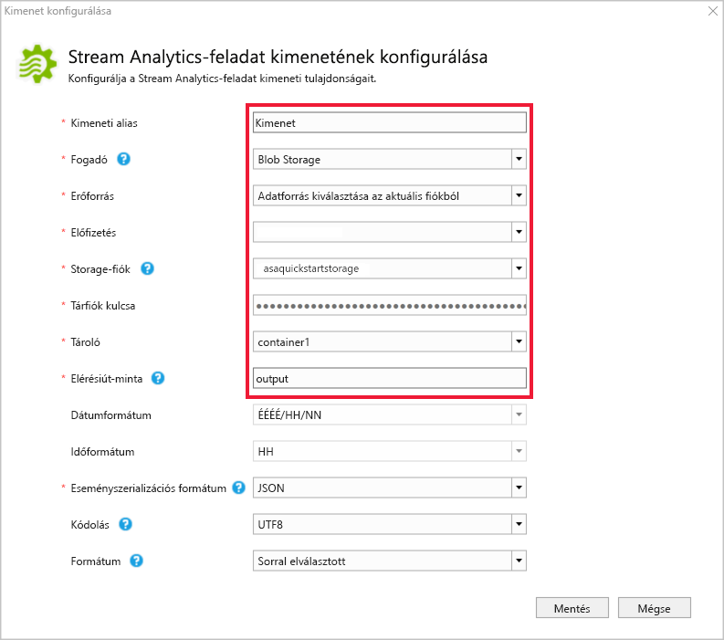
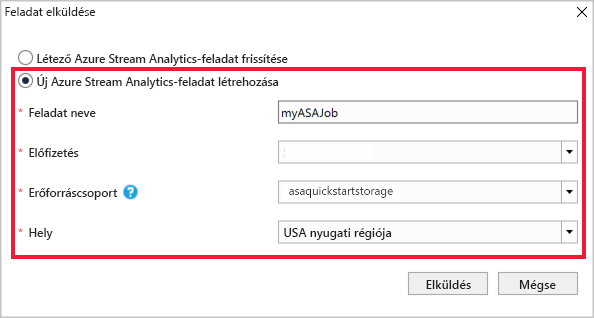
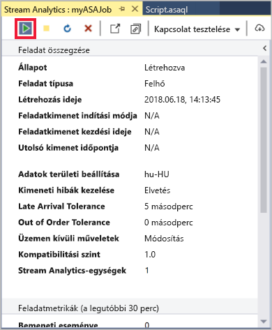
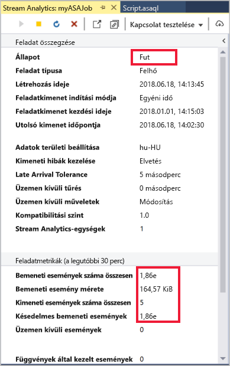
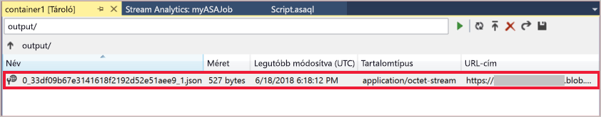

# <a name="quickstart-create-a-stream-analytics-job-by-using-the-azure-stream-analytics-tools-for-visual-studio"></a>Gyors útmutató: Stream Analytics-feladat létrehozása az Azure Stream Analytics tools for Visual Studio használatával

Ez a rövid útmutató bemutatja, hogyan hozhat létre és futtathat egy Stream Analytics-feladatot a Visual Studio Azure Stream Analytics-eszközeivel. A példa feladat streamelési adatokat olvas be egy IoT Hub-eszköz. Megadhat egy feladatot, amely kiszámítja az átlaghőmérséklet, ha több mint 27° és a létrejövő kimenet egy új fájlba, az események írása a blob storage.

## <a name="before-you-begin"></a>Előkészületek

* Ha nem rendelkezik Azure-előfizetéssel, hozzon létre egy [ingyenes fiókot](https://azure.microsoft.com/free/).

* Jelentkezzen be az [Azure Portalra](https://portal.azure.com/).

* Telepítse a Visual Studio 2017-et, a Visual Studio 2015-öt vagy a Visual Studio 2013 4. frissítését. Az Enterprise (Ultimate/Premium), Professional és Community kiadások mind támogatottak. Az Express kiadás nem támogatott.

* A Visual Studio Stream Analytics eszközeinek telepítéséhez kövesse a [telepítési utasításokat](https://docs.microsoft.com/azure/stream-analytics/stream-analytics-tools-for-visual-studio-install).

## <a name="prepare-the-input-data"></a>A bemeneti adatok előkészítése

Mielőtt meghatározná a Stream Analytics-feladat, készítse elő az adatokat, amelyeket később a feladat bemeneti van konfigurálva. A feladat bemeneti adatainak előkészítéséhez, hajtsa végre az alábbi lépéseket:

1. Jelentkezzen be az [Azure Portalra](https://portal.azure.com/).

2. Válassza az **Erőforrás létrehozása** > **Eszközök internetes hálózata** > **IoT Hub** elemet.

3. Az a **az IoT Hub** panelen adja meg a következőket:
   
   |**Beállítás**  |**Ajánlott érték**  |**Leírás**  |
   |---------|---------|---------|
   |Előfizetés  | \<Az Ön előfizetése\> |  Válassza ki a használni kívánt Azure-előfizetést. |
   |Erőforráscsoport   |   asaquickstart-resourcegroup  |   Válassza az **Új létrehozása** elemet, majd adja meg a fiók új erőforráscsoport-nevét. |
   |Régió  |  \<Válassza ki a felhasználóihoz legközelebb eső régiót\> | Válasszon egy földrajzi hely, ahol az IoT hubot üzemeltetni. A felhasználókhoz legközelebb eső helyet használja. |
   |Iot Hub-példány neve  | MyASAIoTHub  |   Válassza ki az IoT Hub nevét.   |

   

4. Válassza ki **tovább: Állítsa be, mérete és méretezése**.

5. Válasszon **tarifacsomag és méretet**. Ez a rövid útmutatóhoz válassza a **F1 – ingyenes** réteg, ha továbbra is elérhető az előfizetésén. Ha az ingyenes szint nem érhető el, válassza ki az elérhető legalacsonyabb szintű. További információkért lásd: [IoT Hub díjszabása](https://azure.microsoft.com/pricing/details/iot-hub/).

   

6. Válassza az **Áttekintés + létrehozás** lehetőséget. Az IoT Hub adatait, és kattintson a **létrehozás**. Az IoT Hub létrehozása néhány percet is igénybe vehet. A létrehozás folyamatát az **Értesítések** panelen követheti nyomon.

7. Az IoT Hub navigációs menüben kattintson a **Hozzáadás** alatt **IoT-eszközök**. Adjon hozzá egy **Eszközazonosító** kattintson **mentése**.

   

8. Az eszköz létrehozása után nyissa meg az eszköz regisztrációját az **IoT-eszközök** listája. Másolás a **kapcsolati karakterlánc – elsődleges kulcs** , és mentse a Jegyzettömbben későbbi használat céljából.

   

## <a name="create-blob-storage"></a>Blob-tároló létrehozása

1. Az Azure Portal bal felső sarkában válassza az **Erőforrás létrehozása** > **Storage** > **Tárfiók** lehetőséget.

2. Az a **storage-fiók létrehozása** panelen adjon meg egy fiók nevét, helyen és erőforráscsoportban csoportjához. Az IoT Hub létrehozott, válassza az ugyanazon a helyen és erőforráscsoportban. Kattintson a **felülvizsgálat + létrehozása** a fiók létrehozásához.

   

3. A tárfiók létrehozása után válassza ki a **Blobok** csempét a **áttekintése** ablaktáblán.

   

4. Az a **Blob Service** lapon jelölje be **tároló** és adja meg például a tároló nevét *container1*. Hagyja a **nyilvános hozzáférés szintje** , **privát (nincs névtelen hozzáférés)** válassza **OK**.

   

## <a name="create-a-stream-analytics-project"></a>Stream Analytics-projekt létrehozása

1. Indítsa el a Visual Studiót.

2. Válassza a **File > New Project** (Fájl > Új projekt) lehetőséget.  

3. A bal oldali sablonlistában válassza ki a **Stream Analytics**, majd az **Azure Stream Analytics Application** (Azure Stream Analytics-alkalmazás) elemet.  

4. Adja meg az alkalmazás **nevét**, **helyét** és a **megoldás nevét**, majd kattintson az **OK** gombra.

   

Figyelje meg az Azure Stream Analytics-projektben szereplő elemeket.

   


## <a name="choose-the-required-subscription"></a>A kívánt előfizetés kiválasztása

1. A Visual Studio **View** (Nézet) menüjében válassza a **Server Explorer** (Kiszolgálókezelő) lehetőséget.

2. Kattintson a jobb gombbal az **Azure** elemre, válassza a **Connect to Microsoft Azure Subscription** (Csatlakozás egy Microsoft Azure-előfizetéshez) lehetőséget, majd jelentkezzen be Azure-fiókjával.

## <a name="define-input"></a>Bemenet meghatározása

1. A **Solution Explorerben** (Megoldáskezelő) bontsa ki az **Inputs** (Bemenetek) csomópontot, majd kattintson duplán az **Input.json** fájlra.

2. Töltse ki a **Stream Analytics Input Configuration** (Stream Analytics bemeneti konfigurációja) panel mezőit a következő értékekkel:

   |**Beállítás**  |**Ajánlott érték**  |**Leírás**   |
   |---------|---------|---------|
   |Input Alias (Bemeneti alias)  |  Input (Bemenet)   |  Adja meg a feladat bemenetének azonosító nevét.   |
   |Source Type (Forrás típusa)   |  Data Stream (Adatstream) |  Válassza ki a megfelelő bemeneti forrás: Stream Data vagy hivatkozási adatokkal.   |
   |Forrás  |  IoT Hub |  Válassza ki a megfelelő bemeneti forrást.   |
   |Erőforrás  | Choose data source from current account (Adatforrás kiválasztása az aktuális fiókból) | Válassza a manuális adatbevitelt, vagy válasszon ki egy meglévő fiókot.   |
   |Előfizetés  |  \<Az Ön előfizetése\>   | Válassza ki az Azure-előfizetést, amely az IoT Hub létrehozott rendelkezik.   |
   |IoT Hub  |  MyASAIoTHub   |  Válassza ki vagy adja meg az IoT Hub nevét. Az IoT Hub nevét a rendszer automatikusan észleli, ha ugyanabban az előfizetésben.   |
   
3. Az egyéb beállításokat hagyja alapértelmezett értéken, és válassza a**Mentés** lehetőséget a beállítások mentéséhez.  

   

## <a name="define-output"></a>Kimenet meghatározása

1. A **Solution Explorerben** (Megoldáskezelő) bontsa ki az **Outputs** (Kimenetek) csomópontot, majd kattintson duplán az **Output.json** fájlra.

2. Töltse ki a **Stream Analytics Output Configuration** (Stream Analytics kimeneti konfigurációja) panel mezőit a következő értékekkel:

   |**Beállítás**  |**Ajánlott érték**  |**Leírás**   |
   |---------|---------|---------|
   |Output Alias (Kimeneti alias)  |  Kimenet   |  Adja meg a feladat kimenetének azonosító nevét.   |
   |Sink (Fogadó)   |  Blob Storage |  Válassza ki a megfelelő fogadót.    |
   |Erőforrás  |  Provide data source settings manually (Az adatforrás-beállítások manuális megadása) |  Válassza a manuális adatbevitelt, vagy válasszon ki egy meglévő fiókot.   |
   |Előfizetés  |  \<Az Ön előfizetése\>   | Válassza ki azt az Azure-előfizetést, amelyhez a létrehozott tárfiók tartozik. A tárfiók tartozhat ugyanahhoz az előfizetéshez, de akár egy másik előfizetéshez is. A példa azt feltételezi, hogy a tárfiók ugyanahhoz az előfizetéshez tartozik.   |
   |Tárfiók  |  asaquickstartstorage   |  Válassza ki vagy adja meg a tárfiók nevét. Ha a tárfiókok ugyanahhoz az előfizetéshez tartoznak, a rendszer automatikusan észleli a nevüket.   |
   |Tároló  |  container1   |  Válassza ki a tárfiókjában létrehozott meglévő tárolót.   |
   |Path Pattern (Elérésiút-minta)  |  output   |  Adja meg a tárolón belül létrehozni kívánt elérési út nevét.   |
   
3. Az egyéb beállításokat hagyja alapértelmezett értéken, és válassza a**Mentés** lehetőséget a beállítások mentéséhez.  

   

## <a name="define-the-transformation-query"></a>A transzformációs lekérdezés definiálása

1. Nyissa meg a **Script.asaql** fájlt a Visual Studio **Solution Explorerében** (Megoldáskezelő).

2. Adja hozzá az alábbi lekérdezést:

   ```sql
   SELECT *
   INTO BlobOutput
   FROM IoTHubInput
   HAVING Temperature > 27
   ```

## <a name="submit-a-stream-analytics-query-to-azure"></a>Stream Analytics-lekérdezés elküldése az Azure-ba

1. A **Query Editor** (Lekérdezésszerkesztő) szkriptszerkesztőjében válassza a **Submit To Azure** (Küldés az Azure-ba) lehetőséget.

2. Válassza a **Create a New Azure Stream Analytics job** (Új Azure Stream Analytics-feladat létrehozása) lehetőséget, majd adja meg a **feladat nevét**. Válassza ki a rövid útmutató elején használt **Előfizetés**, **Erőforráscsoport** és **Hely** elemeket.

   

## <a name="run-the-iot-simulator"></a>Az IoT-szimulátor futtatásához

1. Nyissa meg a [Raspberry Pi Azure IoT Online szimulátor](https://azure-samples.github.io/raspberry-pi-web-simulator/) egy új böngészőlapon vagy ablakban.

2. A sor 15 a helyőrzőt cserélje le az Azure IoT Hub eszköz kapcsolati karakterláncát az egyik előző szakaszban mentett.

3. Kattintson a **Run** (Futtatás) parancsra. A kimenet az érzékelő adatokat és az IoT hubnak küldött üzenetek kell megjelennie.

   

## <a name="start-the-stream-analytics-job-and-check-output"></a>A Stream Analytics-feladat indítása és a kimenet ellenőrzése

1. A feladat létrehozása után automatikusan megnyílik a feladatnézet. A feladat indításához kattintson a zöld nyílra.

   

2. Módosítsa a **feladat kimenetének indítási mód** való **JobStartTime** , és válassza ki **Start**.

   

3. Vegye figyelembe, hogy a feladat állapota **Running** (Fut) állapotra módosult, és bemeneti/kimeneti események váltak elérhetővé. Ez eltarthat néhány percig.

   

4. Az eredmények megtekintéséhez válassza a **View** (Nézet) menü **Cloud Explorer** (Felhőkezelő) pontját, majd keresse meg a tárfiókot a saját erőforráscsoportjában. A **Blob Containers** (Blobtárolók) területen kattintson duplán a **container1** elemre, majd a **kimeneti** fájl elérési útjára.

   

## <a name="clean-up-resources"></a>Az erőforrások eltávolítása

Ha már nincs rá szükség, törölje az erőforráscsoportot, a streamelési feladatot és az összes kapcsolódó erőforrást. A feladat törlésével megakadályozhatja, hogy a feladat által felhasznált streamelési egységek kiszámlázásra kerüljenek. Ha a feladatot a jövőben is szeretné használni, leállíthatja, és később újraindíthatja amikor ismét szükség van rá. Ha már nem használja a feladatot, akkor a következő lépésekkel az útmutatóban létrehozott összes erőforrást törölheti:

1. Az Azure Portal bal oldali menüjében válassza az **Erőforráscsoportok** menüpontot, majd válassza ki a létrehozott erőforrás nevét.  

2. Az erőforráscsoport lapján válassza a **Törlés** elemet, írja be a törölni kívánt erőforrás nevét a szövegmezőbe, majd válassza a **Törlés** lehetőséget.

## <a name="next-steps"></a>További lépések

Ebben a rövid útmutatóban egy egyszerű Stream Analytics-feladatot helyezett üzembe a Visual Studióval. A Stream Analytics-feladatokat az [Azure Portal](stream-analytics-quick-create-portal.md) és a [PowerShell](stream-analytics-quick-create-powershell.md) használatával is üzembe helyezheti. 

További információ az Azure Stream Analytics tools for Visual Studio, folytassa a következő cikket:

> [!div class="nextstepaction"]
> [A Visual Studio használata az Azure Stream Analytics-feladatok megtekintése](stream-analytics-vs-tools.md)
