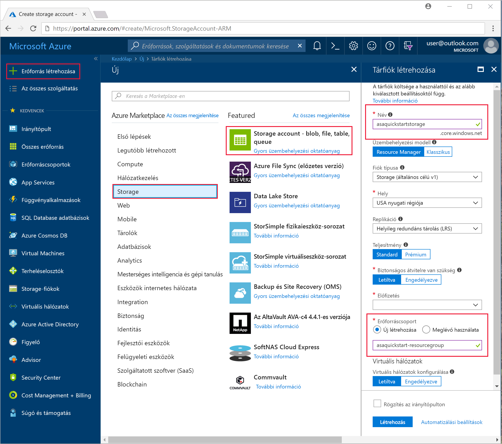
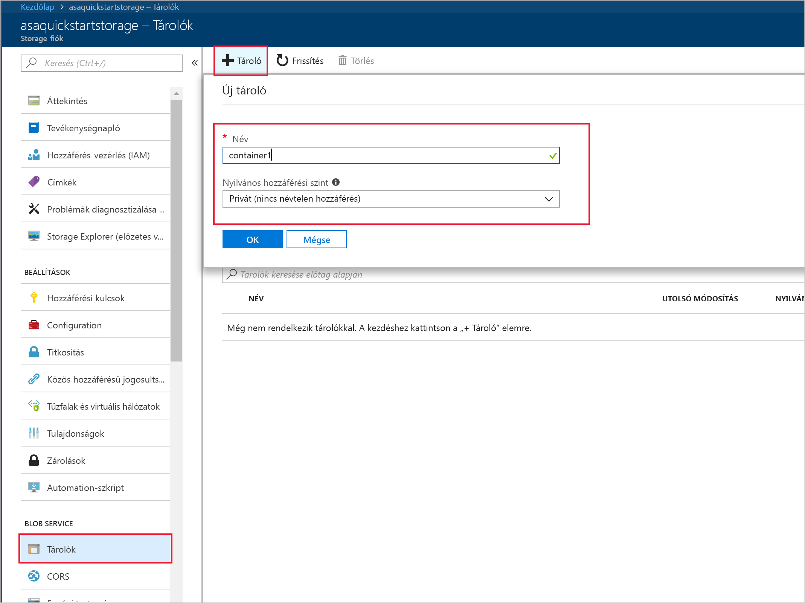
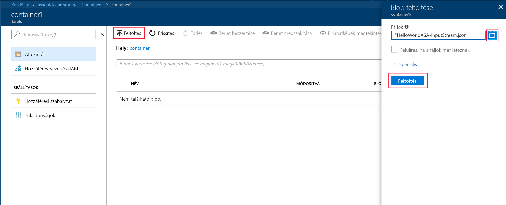

# <a name="quickstart-create-a-stream-analytics-job-by-using-the-azure-stream-analytics-tools-for-visual-studio"></a>Gyors útmutató: Stream Analytics-feladat létrehozása a Visual Studio Azure Stream Analytics eszközeinek használatával

Ez a rövid útmutató bemutatja, hogyan hozhat létre és futtathat egy Stream Analytics-feladatot a Visual Studio Azure Stream Analytics-eszközeivel. A példafeladat streamadatokat olvas az Azure Blob Storage szolgáltatásból. Az ebben az útmutatóban használt bemeneti adatfájl statikus adatokat tartalmaz, illusztrációs céllal. Egy valós forgatókönyvben a Stream Analytics-feladathoz streamelt bemeneti adatokat használnánk. Ebben a rövid útmutatóban egy feladatot fog létrehozni, amely kiszámítja a 100° feletti átlagos hőmérsékleti adatokat, és az eredményül kapott kimeneti eseményeket egy fájlba írja.

## <a name="before-you-begin"></a>Előkészületek

* Ha nem rendelkezik Azure-előfizetéssel, hozzon létre egy [ingyenes fiókot](https://azure.microsoft.com/free/).

* Jelentkezzen be az [Azure Portalra](https://portal.azure.com/).

* Telepítse a Visual Studio 2017-et, a Visual Studio 2015-öt vagy a Visual Studio 2013 4. frissítését. Az Enterprise (Ultimate/Premium), Professional és Community kiadások mind támogatottak. Az Express kiadás nem támogatott.

* A Visual Studio Stream Analytics eszközeinek telepítéséhez kövesse a [telepítési utasításokat](https://docs.microsoft.com/azure/stream-analytics/stream-analytics-tools-for-visual-studio-install).

## <a name="prepare-the-input-data"></a>A bemeneti adatok előkészítése

A Stream Analytics-feladat létrehozása előtt érdemes beállítani azokat az adatokat, amelyek majd a feladat bemenetét fogják képezni. Végezze el a következő lépéseket a feladat bemeneti adatainak előkészítéséhez:

1. Töltse le az [érzékelői mintaadatokat](https://raw.githubusercontent.com/Azure/azure-stream-analytics/master/Samples/GettingStarted/HelloWorldASA-InputStream.json) a GitHubról. A mintaadatok érzékelők adatait tartalmazzák a következő JSON formátumban:  

   ```json
   {
     "time": "2018-01-26T21:18:52.0000000",
     "dspl": "sensorC",
     "temp": 87,
     "hmdt": 44
   }
   ```
2. Jelentkezzen be az [Azure Portalra](https://portal.azure.com/).

3. Az Azure Portal bal felső sarkában válassza az **Erőforrás létrehozása** > **Storage** > **Tárfiók** lehetőséget. A Tárfiók feladatának paneljén a **Név** mezőbe írja be az asaquickstartstorage sztringet, a **Hely** mezőbe az USA nyugati régiója sztringet, az **Erőforráscsoport** mezőbe pedig az asaquickstart-resourcegroup sztringet (a jobb teljesítmény érdekében a tárfiókot és a streamelt feladatot érdemes ugyanabban az erőforráscsoportban tárolni). A fennmaradó beállításokat alapértelmezett értéken hagyhatja.  

   

4. Az **Összes erőforrás** oldalon keresse meg az előző lépésnél beállított tárfiókot. Nyissa meg az **Áttekintés** oldalt, utána pedig a **Blobok** csempét.  

5. A **Blob szolgáltatás** oldalon válassza a **Tároló** lehetőséget, a **Név** mezőben adja meg a tároló nevét (például *container1*), majd válassza az **OK** lehetőséget.  

   

6. Lépjen az előző szakaszban létrehozott tárolóhoz. Válassza a **Feltöltés** lehetőséget, és töltse fel az előző szakaszban lekért érzékelőadatokat.  

   

## <a name="create-a-stream-analytics-project"></a>Stream Analytics-projekt létrehozása

1. Indítsa el a Visual Studiót.

2. Válassza a **File > New Project** (Fájl > Új projekt) lehetőséget.  

3. A bal oldali sablonlistában válassza ki a **Stream Analytics**, majd az **Azure Stream Analytics Application** (Azure Stream Analytics-alkalmazás) elemet.  

4. Adja meg az alkalmazás **nevét**, **helyét** és a **megoldás nevét**, majd kattintson az **OK** gombra.

   

## <a name="choose-the-required-subscription"></a>A kívánt előfizetés kiválasztása

1. A Visual Studio **View** (Nézet) menüjében válassza a **Server Explorer** (Kiszolgálókezelő) lehetőséget.

2. Kattintson a jobb gombbal az **Azure** elemre, válassza a **Connect to Microsoft Azure Subscription** (Csatlakozás egy Microsoft Azure-előfizetéshez) lehetőséget, majd jelentkezzen be Azure-fiókjával.

## <a name="define-input"></a>Bemenet meghatározása

1. A **Solution Explorerben** (Megoldáskezelő) bontsa ki az **Inputs** (Bemenetek) csomópontot, majd kattintson duplán az **Input.json** fájlra.

2. Töltse ki a **Stream Analytics Input Configuration** (Stream Analytics bemeneti konfigurációja) panel mezőit a következő értékekkel:

   |**Beállítás**  |**Ajánlott érték**  |**Leírás**   |
   |---------|---------|---------|
   |Input Alias (Bemeneti alias)  |  Input (Bemenet)   |  Adja meg a feladat bemenetének azonosító nevét.   |
   |Source Type (Forrás típusa)   |  Data Stream (Adatstream) |  Válassza ki a megfelelő bemeneti forrást: adatstream vagy referenciaadat.   |
   |Forrás  |  Blob Storage |  Válassza ki a megfelelő bemeneti forrást.   |
   |Erőforrás  | Choose data source from current account (Adatforrás kiválasztása az aktuális fiókból) | Válassza a manuális adatbevitelt, vagy válasszon ki egy meglévő fiókot.   |
   |Előfizetés  |  \<Az Ön előfizetése\>   | Válassza ki azt az Azure-előfizetést, amelyhez a létrehozott tárfiók tartozik. A tárfiók tartozhat ugyanahhoz az előfizetéshez, de akár egy másik előfizetéshez is. A példa azt feltételezi, hogy a tárfiók ugyanahhoz az előfizetéshez tartozik.   |
   |Tárfiók  |  asaquickstartstorage   |  Válassza ki vagy adja meg a tárfiók nevét. Ha a tárfiókok ugyanahhoz az előfizetéshez tartoznak, a rendszer automatikusan észleli a nevüket.   |
   |Tároló  |  container1   |  Válassza ki a tárfiókjában létrehozott meglévő tárolót.   |
   
3. Az egyéb beállításokat hagyja alapértelmezett értéken, és válassza a**Mentés** lehetőséget a beállítások mentéséhez.  

   

## <a name="define-output"></a>Kimenet meghatározása

1. A **Solution Explorerben** (Megoldáskezelő) bontsa ki az **Outputs** (Kimenetek) csomópontot, majd kattintson duplán az **Output.json** fájlra.

2. Töltse ki a **Stream Analytics Output Configuration** (Stream Analytics kimeneti konfigurációja) panel mezőit a következő értékekkel:

   |**Beállítás**  |**Ajánlott érték**  |**Leírás**   |
   |---------|---------|---------|
   |Output Alias (Kimeneti alias)  |  Kimenet   |  Adja meg a feladat kimenetének azonosító nevét.   |
   |Sink (Fogadó)   |  Blob Storage |  Válassza ki a megfelelő fogadót.    |
   |Erőforrás  |  Provide data source settings manually (Az adatforrás-beállítások manuális megadása) |  Válassza a manuális adatbevitelt, vagy válasszon ki egy meglévő fiókot.   |
   |Előfizetés  |  \<Az Ön előfizetése\>   | Válassza ki azt az Azure-előfizetést, amelyhez a létrehozott tárfiók tartozik. A tárfiók tartozhat ugyanahhoz az előfizetéshez, de akár egy másik előfizetéshez is. A példa azt feltételezi, hogy a tárfiók ugyanahhoz az előfizetéshez tartozik.   |
   |Tárfiók  |  asaquickstartstorage   |  Válassza ki vagy adja meg a tárfiók nevét. Ha a tárfiókok ugyanahhoz az előfizetéshez tartoznak, a rendszer automatikusan észleli a nevüket.   |
   |Tároló  |  container1   |  Válassza ki a tárfiókjában létrehozott meglévő tárolót.   |
   |Path Pattern (Elérésiút-minta)  |  output   |  Adja meg a tárolón belül létrehozni kívánt elérési út nevét.   |
   
3. Az egyéb beállításokat hagyja alapértelmezett értéken, és válassza a**Mentés** lehetőséget a beállítások mentéséhez.  

   

## <a name="define-the-transformation-query"></a>A transzformációs lekérdezés definiálása

1. Nyissa meg a **Script.asaql** fájlt a Visual Studio **Solution Explorerében** (Megoldáskezelő).

2. Adja hozzá az alábbi lekérdezést:

   ```sql
   SELECT 
   System.Timestamp AS OutputTime,
   dspl AS SensorName,
   Avg(temp) AS AvgTemperature
   INTO
     Output
   FROM
     Input TIMESTAMP BY time
   GROUP BY TumblingWindow(second,30),dspl
   HAVING Avg(temp)>100
   ```

## <a name="submit-a-stream-analytics-query-to-azure"></a>Stream Analytics-lekérdezés elküldése az Azure-ba

1. A **Query Editor** (Lekérdezésszerkesztő) szkriptszerkesztőjében válassza a **Submit To Azure** (Küldés az Azure-ba) lehetőséget.

2. Válassza a **Create a New Azure Stream Analytics job** (Új Azure Stream Analytics-feladat létrehozása) lehetőséget, majd adja meg a **feladat nevét**. Válassza ki a rövid útmutató elején használt **Előfizetés**, **Erőforráscsoport** és **Hely** elemeket.

   

## <a name="start-the-stream-analytics-job-and-check-output"></a>A Stream Analytics-feladat indítása és a kimenet ellenőrzése

1. A feladat létrehozása után automatikusan megnyílik a feladatnézet. A feladat indításához kattintson a zöld nyílra.

   

2. Módosítsa a **Custom Time** (Egyéni időpont) mező dátumát `2018-01-01` értékre, majd kattintson a **Start** (Indítás) gombra.

   

3. Vegye figyelembe, hogy a feladat állapota **Running** (Fut) állapotra módosult, és bemeneti/kimeneti események váltak elérhetővé. Ez eltarthat néhány percig.

   

4. Az eredmények megtekintéséhez válassza a **View** (Nézet) menü **Cloud Explorer** (Felhőkezelő) pontját, majd keresse meg a tárfiókot a saját erőforráscsoportjában. A **Blob Containers** (Blobtárolók) területen kattintson duplán a **container1** elemre, majd a **kimeneti** fájl elérési útjára.

   

## <a name="clean-up-resources"></a>Az erőforrások eltávolítása

Ha már nincs rá szükség, törölje az erőforráscsoportot, a streamelési feladatot és az összes kapcsolódó erőforrást. A feladat törlésével megakadályozhatja, hogy a feladat által felhasznált streamelési egységek kiszámlázásra kerüljenek. Ha a feladatot a jövőben is szeretné használni, leállíthatja, és később újraindíthatja amikor ismét szükség van rá. Ha már nem használja a feladatot, akkor a következő lépésekkel az útmutatóban létrehozott összes erőforrást törölheti:

1. Az Azure Portal bal oldali menüjében válassza az **Erőforráscsoportok** menüpontot, majd válassza ki a létrehozott erőforrás nevét.  

2. Az erőforráscsoport lapján válassza a **Törlés** elemet, írja be a törölni kívánt erőforrás nevét a szövegmezőbe, majd válassza a **Törlés** lehetőséget.

## <a name="next-steps"></a>További lépések

Ebben a rövid útmutatóban egy egyszerű Stream Analytics-feladatot helyezett üzembe. Az egyéb bemeneti források beállításával és a valós idejű észlelés végrehajtásával kapcsolatos információkért olvassa el az alábbi cikkeket:

> [!div class="nextstepaction"]
> [Valós idejű csalásészlelés az Azure Stream Analytics használatával](stream-analytics-real-time-fraud-detection.md)
