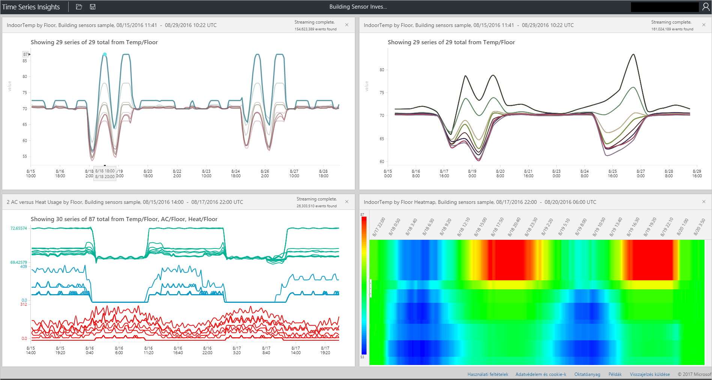

# Az Azure idő adatsorozat Insights explorer
Ez a cikk ismerteti a különböző szolgáltatások és az idő adatsorozat Insights explorer web App lehetőségeket. Képi megjelenítéseket készíthet az adatok idő adatsorozat Insights explorer használja a böngészőben.
 
Az Azure Time Series Insights egy teljes körűen felügyelt elemző, tároló és megjelenítő szolgáltatás, amely megkönnyíti IoT-események milliárdjainak párhuzamos felderítését és elemzését. Ez lehetővé teszi az adatokat, ami lehetővé teszi, hogy az IoT-megoldásból gyorsan érvényesítése és elkerülheti a kritikus fontosságú eszközökre költséges állásidőt globális nézetét. Rejtett trendeket, helyszíni rendellenességek észlelését, felderítését és a kiváltó okának közel valós idejű elemzést. Az idő adatsorozat Insights explorer jelenleg nyilvános előzetes verziójához.

## Előfeltételek

Idő adatsorozat Insights explorer használata előtt a következőket kell tennie:
- Egy alkalommal adatsorozat Insights környezet létrehozása
- Adja meg a hozzáfér a fiókjához a környezetben
- Egy betöltik az adatokat, és tárolja a forrás hozzáadása

## Vizsgálatát, és az adatok lekérdezése
Az az idő adatsorozat Insights-környezethez való csatlakozását az eseményforrás percen belül vizsgálatát, és az idő adatsorok lekérdezése.

1. Elindításához nyissa meg a [idő adatsorozat Insights explorer](https://insights.timeseries.azure.com/) a webböngésző, és válassza ki az ablak bal oldalán környezetben. Minden olyan környezetben, amely rendelkezik hozzáféréssel betűrendben találhatók.

2. Amikor kiválaszt egy olyan környezetben, vagy használja a **FROM** és **TO** konfiguráció az oldal tetején, vagy kattintson és húzza a mutatót a kívánt időtartama.  Kattintson a jobb felső sarokban, Nagyító, vagy kattintson a jobb gombbal a kijelölt timespan keresztül, és válasszon **keresési**.  

3. Is frissítheti rendelkezésre állási automatikusan percenként, kiválasztásával a **automatikus a** gombra.  Vegye figyelembe, hogy az "Auto-On" gomb csak a rendelkezésre állási diagram, a fő képi megjelenítés tartalma nem vonatkozik.

4. Figyelje meg, hogy az Azure-felhőbe ikon megnyitná a környezet az Azure portálon.

   

5. Ezután tekintse meg a diagram, amely a kijelölt timespan során az összes esemény számát tartalmazza.  Itt számos olyan rendszabály rendelkezik:

    **Licencfeltétel-szerkesztő Panel**: A kifejezés lemezterület mérete, ha lekérdezést hajt végre a környezetben.  Lehetővé teszi, hogy a képernyő bal oldalán található 
      - **Mérték**: A legördülő listán látható összes numerikus oszlopot (megduplázódik)
      - **Vegyes által**: A legördülő lista kategorikus oszlopokat (karakterlánc) jelenít meg.
      - Engedélyezze a lépés köztes, minimális és maximális megjelenítése, és állítsa be a következő rendszerrel méri a Vezérlőpult y tengely.  Emellett beállíthatja, hogy megjelenített adatok a száma, átlagos vagy összesített.
      - Ugyanazt az x tengelyen megtekintéséhez legfeljebb öt feltételeket adhat hozzá.  Használja a **másolási-le nyilas** gombra kattintva adja hozzá a további elemet, vagy kattintson a **Hozzáadás** gombra kattintva adja hozzá egy friss kifejezés.
     
        

      - **Predikátum**: A predikátum lehetővé teszi, hogy az alább felsorolt operandusok használatával az események szűrését. Ha keresés végrehajtása kiválasztásával/gombra kattintva, a predikátum fog automatikusan frissítés alapján, hogy a keresés.      Az operandus támogatott típusok a következők:

         |Művelet  |Támogatott típusok  |Megjegyzések  |
         |---------|---------|---------|
         |<, >, <=, >=     |  Kettős, DateTime, TimeSpan       |         |
         |=, !=, <>     | String, Bool, Double, DateTime, TimeSpan, NULL értékű        |         |
         |IN     | String, Bool, Double, DateTime, TimeSpan, NULL értékű        |  Minden operandusok kell azonos típusú és NULL állandó.        |
         |RENDELKEZIK     | Karakterlánc        |  Csak állandó karakterlánc-literálnak jobb oldalán használhatók. Üres karakterlánc, és a NULL nem engedélyezettek.       |

      - **Lekérdezések példák**
      
         

6. A **intervallumának mérete** csúszkát eszköz lehetővé teszi a azonos timespan keresztül mindkét intervallumok nagyítás.  Ez a mozgás közötti idő szeletek le zökkenőmentes trendek mérete legyen a ezredmásodperces, lehetővé téve, tekintse meg a részletes, nagy felbontású darabok az adatok megjelenítése nagy szeletek pontosabb felügyeletét biztosítja. Kiindulási pontjaként a csúszkát az alapértelmezett érték az adatok a legoptimálisabb nézetként választ a kijelölt; terheléselosztási megoldás, a lekérdezés sebesség és a granularitási.

7. A **ecset idő** eszköz segítségével egyszerűen egy időtartam a másikra, intuitív UX elöl és középen idő tartományok közötti zökkenőmentes mozgását üzembe lépjen.

8. A **mentése** parancs lehetővé teszi az aktuális lekérdezés mentéséhez, és engedélyezi azt megosztása más felhasználókkal a környezet. Használatával **nyitott**, megtekintheti az összes a lekérdezések és más felhasználók környezetekben, hogy hozzáfér a megosztott lekérdezések. 

   

9. A **perspektíva nézet** eszköz legfeljebb négy egyedi lekérdezések egyidejű nézetét jeleníti meg. A perspektíva megtekintése gombra a diagram jobb felső sarkában található.  

   

10. A **diagram** lehetővé teszi, hogy vizuálisan feltérképezheti az adatokat. A diagram eszközök a következők:

   - Válassza ki vagy kattintással, amely lehetővé teszi, hogy a megadott timespan érték vagy egyetlen adatsort kijelölés.  
   - Időn belül span kijelölés, nagyítás vagy események vizsgálatát.  
   - Adatsorok feloszthatja az adatsorozat egy másik oszlop, adja hozzá az adatsorozat új kifejezést, csak a kijelölt adatsor megjelenítése, kizárja a kijelölt adatsor, adatsor pingelni, és események megismerkedhet a kijelölt sorozatból.
   - A szűrő található a diagram bal is tekintse meg az összes megjelenített adatsor és érték- vagy átrendezheti, megtekintheti az összes adatsor vagy kifejezetten rögzített vagy rögzítése adatsorozat.  Meg is egyetlen adatsor kijelölése és a szétosztás egy másik oszlop, az adatsorozat hozzáadása egy új kifejezés, csak a kijelölt adatsor megjelenítése, kizárja a kijelölt adatsor, PIN-kód adatsor, vagy események megismerkedhet a kijelölt sorozatból.
   - Amikor megtekintik egyidejűleg több feltételek, a verem, halomszétszedési beállítások, adatsor kapcsolatos további adatok megtekintéséhez, és azonos tengely használata az összes kifejezést a diagram jobb felső sarkában található gombokkal.
 
    

11. A **heatmap** segítségével gyorsan direkt rendellenes vagy egyedi adatsorozatban egy adott lekérdezésben. Csak egy keresési kifejezés is ábrázolt, mint egy heatmap.    

   

12. **Események**: Ha úgy dönt, megismerkedhet események lehetőséget választva, vagy kattintson a jobb gombbal fent, az események panel szeretné elérhetővé tenni.  Itt láthat minden, a nyers események és az események exportálását, JSON vagy CSV-fájlként. Vegye figyelembe, hogy idő adatsorozat Insights tárolja az összes nyers adatok.

   

13. Kattintson a **statisztikák** után felfedezése fel tudja tárni mintázatok és oszlop statisztikák események fülre.  

   - **Minták**: Ez a szolgáltatás proaktív felfedi a legtöbb statisztikailag jelentős minták a kijelölt adatterületen. Meg kell tudni, melyik minták legtöbb szavatolja idő- és események ezer tekintse meg a mentesíti. További idő adatsorozat Insights lehetővé teszi a közvetlenül ezek statisztikailag jelentős minták elemzését végző folytatja ugráshoz. Ez azért is hasznos a levágást előzményadatokra vizsgálatát. 

   - **Oszlop statisztikák**: oszlop statisztikák diagramkészítési és a táblázatot, amely a kijelölt időtartamának keresztül minden oszlopa kijelölt adatsorozat lebontva biztosítanak.  
 
       

Most láthatta a különböző szolgáltatások és az idő adatsorozat Insights explorer web App lehetőségeket. 

## További lépések
> [!div class="nextstepaction"]
>[Hibáinak diagnosztizálásához és elhárításához idő adatsorozat Insights környezetében](time-series-insights-diagnose-and-solve-problems.md)
