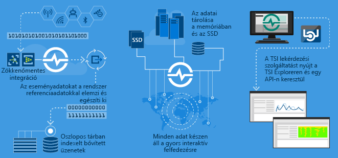

# Mi az Azure Time Series Insights?

A Time Series Insights feladata nagy mennyiségű (például az IoT-eszközök által létrehozott) idősorozat-adat tárolása, vizualizálása és lekérdezése.  Ha idősorozat-adatokat szeretne a felhőben tárolni, kezelni, lekérdezni vagy vizualizálni, a Time Series Insights valószínűleg jó választás.  

A Time Series Insights négy fő feladata:

- Az első, hogy teljesen integrálható az olyan felhőátjárókkal, mint az Azure IoT Hub vagy az Azure Event Hubs. Könnyedén csatlakozik ezekhez az eseményforrásokhoz, és elemzi az adatokat egyszerű sorokban és oszlopokban tároló üzenetekből és struktúrákból származó JSON-t. A metaadatokat összeköti a telemetriával, és egy oszlopos tárban indexálja az adatait.
- A második, hogy a Time Series Insights felügyeli az adatai tárolását. Annak érdekében, hogy az adatok mindig könnyen hozzáférhetők legyenek, az adatokat a memóriában és SSD-n tárolja akár 400 napig. Interaktívan kérdezheti le események milliárdjait másodpercek alatt – amikor szükséges.
- A harmadik, hogy a Time Series Insights a TSI Explorer révén azonnali vizualizációt biztosít.  
- A negyedik pedig, hogy a Time Series Insights lekérdezési szolgáltatást biztosít a TSI Explorerben, valamint az idősorozat-adatok egyéni alkalmazásokba való beágyazásához könnyen integrálható API-k használatával is.  

Ha létrehoz egy alkalmazást akár belső használatra, akár külső ügyfeleknek, a Time Series Insights használható a háttérben az idősorozat-adatok indexálására, tárolására és összesítésére. Így egyéni vizualizációt és felhasználói élményt hozhat létre.  A Time Series Insights lekérdezési API-kat tesz elérhetővé ennek a forgatókönyvnek az engedélyezéséhez.  

Ha nem biztos abban, hogy az adatai idősorozatok-e, a következőket kell tudnia.  Az idősorozat-adatok mutatják be, hogy hogyan változik az idők során egy adategység vagy folyamat.  Ez abban egyedi, hogy időbélyeggel rendelkezik, és az idő tengelyként a legértelmezhetőbb.  Az idősorozat-adatok általában időrendben érkeznek, és rendszerint inkább beszúrásként vannak kezelve, mint adatbázis-frissítésként.  Mivel a Time Series Insights sorként rögzít és tárol minden új eseményt, a változások mérése idő alapján történik, így lehetőség van visszanézni és megjósolni a jövőbeli változásokat.  Az idősorozat-adatok tárolása, indexelése, lekérdezése, elemzése és vizualizálása nagy mennyiségben kihívást jelenthet.  

## Elsődleges forgatókönyvek

- Skálázható módon tárolhat idősorozat-adatokat.  
  - A Time Series Insights lényegében egy idősorozat-adatokra tervezett adatbázis.  A Time Series Insights, mivel skálázható és teljes mértékben felügyelt, kezeli az események tárolásának és felügyeletének feladatát.

- Közel valós idejű adatfeltárás.  
  - A Time Series Insights biztosít egy Explorer eszközt, amely megjelenít egy adott környezetbe streamelt minden adatot.  Egy eseményforrás csatlakoztatása után nem sokkal az eseményadatok megtekinthetők, feltárhatók és lekérdezhetők a Time Series Insightson belül.  Ezek az adatok hasznosak, akár azt kell értékelni, hogy egy eszköz az elvárt módon hoz-e létre adatokat, vagy monitorozni kell egy IoT-objektum állapotát, eredményességét és általános hatékonyságát.  

- Kiváltó okokat kereső elemzések és rendellenesség-észlelés.
  - A Time Series Insights olyan eszközökkel visz végbe és ment többlépéses kiváltóok-kereső elemzést, mint a minták és a perspektívanézetek.  Ezen felül a Time Series Insights együttműködik olyan riasztási szolgáltatásokkal, mint az Azure Stream Analytics, így a riasztások és az észlelt rendellenességek közel valós időben tekinthetők meg a Time Series Insights Explorerben.  

- Különböző helyekről streamelt idősorozat-adatok globális nézete több objektum/hely összehasonlításához.
  - Egy Time Series Insights környezethez több eseményforrás is csatlakoztatható.  Ez azt jelenti, hogy a több, különböző helyről streamelt adatok egyszerre tekinthetők meg közel valós időben.  A felhasználók kihasználhatják ezt a láthatóságot, és megoszthatják az adatokat a vezetőkkel, hatékonyabb együttműködést alakíthatnak ki tartományszakértőkkel, akik a szakértelmükkel segíthetnek a problémák megoldásában, az ajánlott eljárások alkalmazásában és az eredmények megosztásában.

- Ügyfélalkalmazás létrehozása a Time Series Insightson. 
  - A Time Series Insights REST lekérdezési API-kat tesz elérhetővé annak érdekében, hogy idősorozat-adatokat használó alkalmazásokat hozhasson létre.

## Funkciók

- **Gyorsan használatba vehető**: Az Azure Time Series Insights használatához nem szükséges az adatok előzetes előkészítése. Percek alatt csatlakozhat több millió Azure IoT Hub- vagy Event Hub-eseményhez. A csatlakozás után megjelenítheti és kezelheti az érzékelők adatait, így gyorsan ellenőrizheti IoT-megoldásait. Az adatok kezeléséhez egyáltalán nem szükséges kódolás.
Nem kell megtanulnia egy új programozási nyelvet; a Time Series Insights részletes, szabad szöveges lekérdezési felületet biztosít a tapasztalt felhasználóknak, illetve egy néhány kattintással felfedezhető felületet kínál.
- **Közel valós idejű elemzés**: A Time Series Insights több millió érzékelőeseményt képes egy perces késéssel feldolgozni naponta. A Time Series Insights segítségével betekintést nyerhet az érzékelőadatokba, mivel lehetővé teszi a trendek és rendellenességek észlelését, a kiváltó okokat kereső elemzések elvégzését és a költséges leállási idő elkerülését. A valós idejű és az előzményadatok összevetésének biztosításával a Time Series Insights segít felderíteni az adataiban észlelhető rejtett trendeket.
- **Egyéni megoldások készítése**: Az Azure Time Series Insights-adatokat beágyazhatja meglévő alkalmazásaiba, vagy új egyéni megoldásokat hozhat létre a Time Series Insights REST API-jaival. Személyre szabott nézeteket hozhat létre, hogy mások is megtekinthessék a felfedezett összefüggéseket.
- **Méretezhetőség:** A Time Series Insights támogatja a nagy mennyiségű IoT-adat kezelését. Napi 1–100 millió bejövő eseményt képes kezelni, és alapértelmezés szerint 31 napig őrzi meg ezeket. Közel valós időben jelenítheti meg és elemezheti az élő adatstreameket és az előzményadatokat. A későbbi verziókban a bejövőadat-kezelési és adatmegőrzési kapacitást növelni fogjuk a nagyvállalati igényeknek megfelelően.

## Első lépések
Az első lépések 5 percnél kevesebb időt vesznek igénybe. 

1.  Első lépésként építsen ki egy Time Series Insights-környezetet az Azure Portalon. 
2.  Csatlakoztasson egy olyan eseményforrást, mint az Azure IoT Hub vagy Event Hub.  
3.  Töltsön fel referenciaadatokat (ez nem egy további szolgáltatás).
4.  A Time Series Insights Explorerrel néhány percen belül megtekintheti az adatait.

## Time Series Insights Explorer
Ez az ábra az Exploreren keresztül megtekintett Time Series Insights-adatokra mutat példát: 

## További lépések
 - [Adatok feltárása a Time Series Insights Explorerrel egy bemutató környezetben](./time-series-quickstart.md)
 - [Saját Time Series Insights-környezet tervezése](time-series-insights-environment-planning.md)

