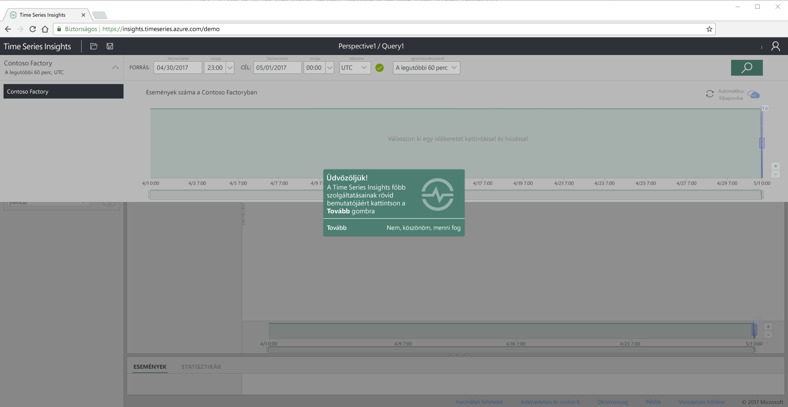
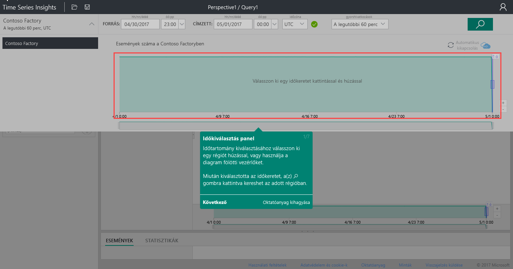
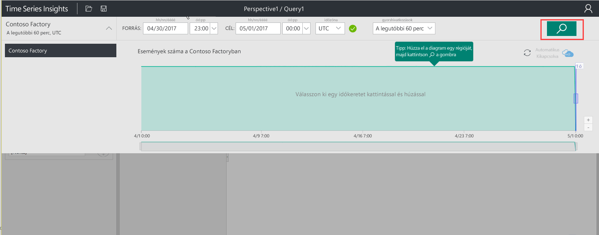
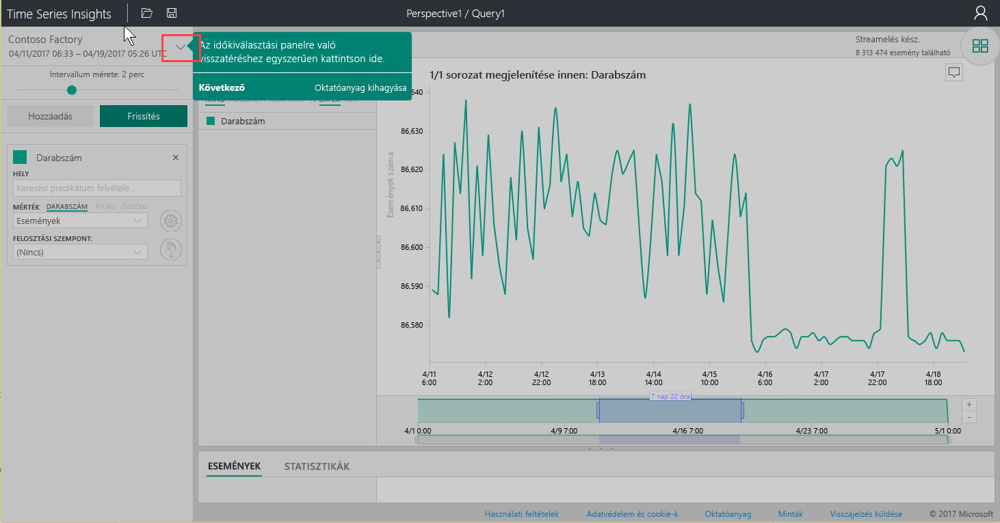
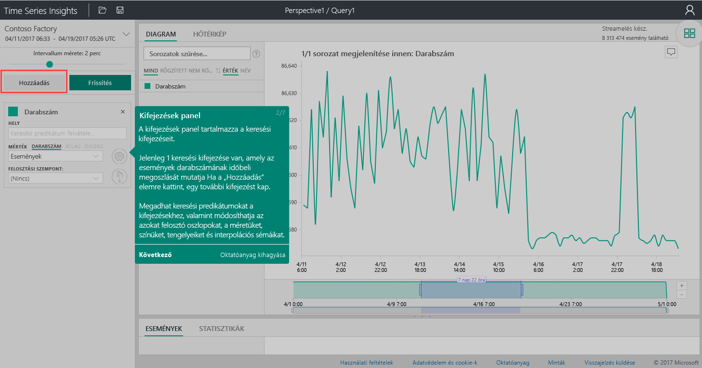
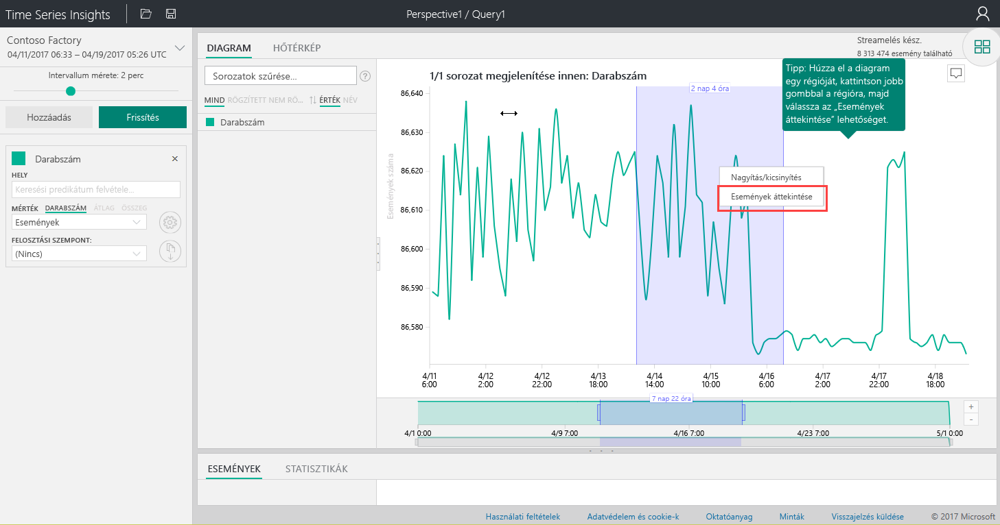
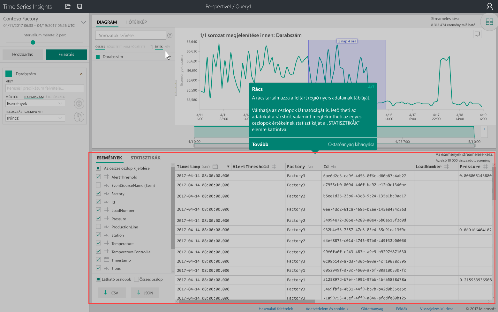
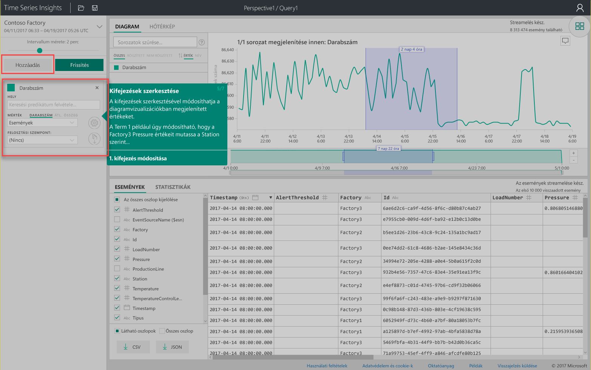
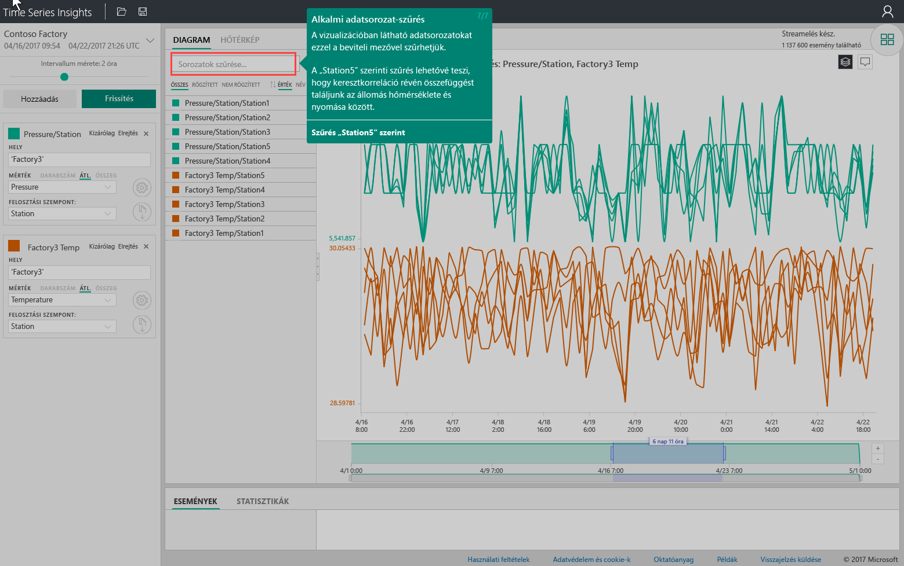

# Rövid útmutató: Ismerkedés az Azure Time Series Insightsszal
Ez a rövid útmutató egy ingyenes bemutató környezetben ismerteti az Azure Time Series Insights Explorer használatának első lépéseit. Megtudhatja, hogyan jeleníthet meg nagy mennyiségű IoT-adatot a webböngészőjében, és megismerkedhet a Time Series Insights Explorer főbb jellemzőivel. 

Az Azure Time Series Insights egy teljes körűen felügyelt elemző, tároló és megjelenítő szolgáltatás, amely megkönnyíti IoT-események milliárdjainak párhuzamos felderítését és elemzését. Globális áttekintést nyújt az adatokról, így gyorsan ellenőrizheti IoT-megoldásait, és elkerülheti az üzletmenet szempontjából kritikus fontosságú eszközök költséges leállását, mivel a rendszer segít felderíteni a rejtett tendenciákat és rendellenességeket, majd elemezni a problémák kiváltó okait majdnem valós időben.  Ha olyan alkalmazást épít ki, amelynek idősorozat-adatokat kell tárolnia vagy lekérdeznie, a fejlesztéshez használhatja a Time Series Insights REST API-jait.

Ha nem rendelkezik Azure-előfizetéssel, mindössze néhány perc alatt létrehozhat egy [ingyenes Azure-fiókot](https://azure.microsoft.com/free/?ref=microsoft.com&utm_source=microsoft.com&utm_medium=docs&utm_campaign=visualstudio) a virtuális gép létrehozásának megkezdése előtt.

## Ismerkedés a Time Series Insights Explorerrel egy bemutató környezetben

1. A böngészőjében lépjen a [https://insights.timeseries.azure.com/demo](https://insights.timeseries.azure.com/demo) helyre. 

2. Ha a rendszer kéri, jelentkezzen be a Time Series Insights Explorerbe az Azure-fiókja hitelesítő adataival. 
 
3. Megjelenik a Time Series Insights gyors bemutató oldala. A gyors bemutató indításához kattintson a **Next** (Tovább) gombra.

   

4. Megjelenik a **Time selection panel** (Időkiválasztás panel). Ezen a panelen választhatja ki a megjeleníteni kívánt időkeretet.

   

5. Kattintson és húzzon a területen, majd kattintson a **Keresés** gombra.
 
    

   A Time Series Insights megjelenít egy diagramot a megadott időkerethez. A vonaldiagramokon belül számos műveletre van lehetősége, például szűrhet, rögzíthet, rendezhet és rétegezhet. 

   Az **Időkiválasztás panelre** való visszatéréshez kattintson a lefelé nyílra, ahogy az ábrán is látható:

   

6. Új keresési kifejezés felvételéhez kattintson a **Terms panel** (Kifejezések panel) **Add** (Hozzáadás) elemére.

   

7. A diagramon válasszon ki egy régiót, kattintson rá a jobb gombbal, majd válassza az **Explore Events** (Események áttekintése) elemet.
 
   

   Megjelenik egy nyers adatokat tartalmazó, a vizsgált régióra vonatkozó rács:

   

8. A kifejezéseket szerkesztve módosíthatja a diagram értékeit, és fel is vehet egy újabb kifejezést a különböző típusú értékek összevetéséhez:

   

9. Adjon meg egy szűrőkifejezést a **Filter series...** (Sorozatok szűrése...) mezőben az alkalmi sorozatszűréshez. A rövid útmutatóhoz adja meg a **Station5** értéket az állomásra jellemző hőmérséklet és nyomás összevetéséhez.
 
   

A rövid útmutató befejezése után a mintaadatokkal kísérletezve különböző vizualizációkat hozhat létre. 

### További lépések
Készen áll a saját Time Series Insights-környezete létrehozására.
> [!div class="nextstepaction"]
> [Time Series Insights-környezet tervezése](time-series-insights-environment-planning.md)
