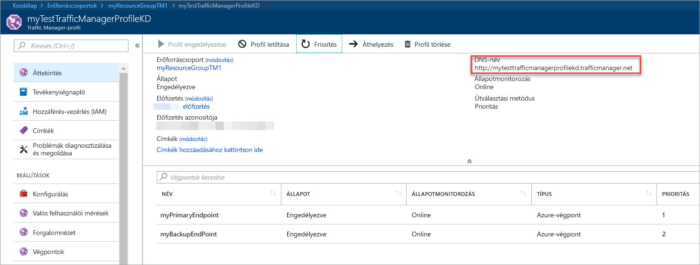

# Rövid útmutató: Traffic Manager-profil létrehozása magas rendelkezésre állású webalkalmazásokhoz

Ebben a rövid útmutató egy Traffic Manager-profilt, amely a webalkalmazás magas rendelkezésre állást nyújt.

Ebben a rövid útmutatóban egy webalkalmazás két példánya lesz beolvasva. Azok a fut egy másik Azure-régióban. Traffic Manager-profil alapján fog létrehozni [végpontprioritás](traffic-manager-routing-methods.md#priority). A profil arra utasítja a felhasználói adatforgalmat a webalkalmazás fut az elsődleges hely. A TRAFFIC Manager folyamatosan figyeli a webalkalmazást. Ha az elsődleges hely nem érhető el, a helykiszolgáló biztonsági mentése automatikus feladatátvételt biztosít.

Ha nem rendelkezik Azure-előfizetéssel, hozzon létre egy [ingyenes fiókot](https://azure.microsoft.com/free/?WT.mc_id=A261C142F).

## Bejelentkezés az Azure-ba

Jelentkezzen be az [Azure Portalra](https://portal.azure.com).

## Előfeltételek

Ebben a rövid útmutatóban két különböző Azure-régióban üzembe helyezett webalkalmazás két példányát kell (*USA keleti Régiójában* és *Nyugat-Európa*). Minden egyes erre a célra elsődleges és feladatátvételi végpontok Traffic Manager esetében.

1. A képernyő bal felső oldalán válassza **erőforrás létrehozása** > **webes** > **webalkalmazás**.
2. A **webalkalmazás**, adja meg vagy válassza ki ezeket a beállításokat:

    | Beállítás | Érték |
    | ------- | ----- |
    | App neve | Adjon meg egy egyedi nevet a webalkalmazás számára.  |
    | Előfizetés | A webalkalmazás a alkalmazni kívánt előfizetés kiválasztásához. |
    | Erőforráscsoport | Válassza ki **új létrehozása**, és adja meg *myResourceGroupTM1*. |
    | Operációs rendszer | Válassza ki **Windows** az operációs rendszer. |
    | Közzététel | Válassza ki **kód** a közzétenni kívánt formátumban. |

3. Válassza ki **App Service-csomag/hely**.
4. A **App Service-csomag**válassza **új létrehozása**.
5. A **új App Service-csomag**, adja meg vagy válassza ki ezeket a beállításokat:

    | Beállítás | Érték |
    | ------- | ----- |
    | App Service-csomag | Adja meg *myAppServicePlanEastUS*. |
    | Hely | USA keleti régiója |
    | Tarifacsomag | S1 – Standard |

6. Kattintson az **OK** gombra.

7. A **webalkalmazás**válassza **létrehozás**. Ha a webalkalmazás sikeresen üzembe helyezte, egy alapértelmezett webhelyet hoz létre.

8. Hozzon létre egy második webhelyen egy másik Azure-régióban, ismételje meg a lépéseket 1-7 ezekkel a beállításokkal:

    | Beállítás | Érték |
    | --------| ----- |
    | Name (Név) | Adjon meg egy egyedi nevet a webalkalmazás számára. |
    | Előfizetés | A webalkalmazás a alkalmazni kívánt előfizetés kiválasztásához. |
    | Erőforráscsoport | Válassza ki **új létrehozása**, majd adja meg *myResourceGroupTM2*. |
    | Operációs rendszer | Válassza ki **Windows** az operációs rendszer. |
    | Közzététel | Válassza ki **kód** a közzétenni kívánt formátumban. |
    | App Service-csomag/hely | Adja meg *myAppServicePlanWestEurope*. |
    | Hely | Nyugat-Európa |
    | Tarifacsomag | S1 – Standard |

## Traffic Manager-profil létrehozása

Hozzon létre egy Traffic Manager-profilt, amely a felhasználói adatforgalmat a végpont prioritás alapján irányítja.

1. A képernyő bal felső oldalán válassza **erőforrás létrehozása** > **hálózatkezelés** > **Traffic Manager-profil**.
2. Az a **Traffic Manager-profil létrehozása**, adja meg vagy válassza ki ezeket a beállításokat:

    | Beállítás | Érték |
    | --------| ----- |
    | Name (Név) | Adja meg a Traffic Manager-profil egyedi nevét.|
    | Útválasztási metódus | Válassza ki **prioritású**.|
    | Előfizetés | A traffic manager-profilt a alkalmazni kívánt előfizetés kiválasztásához. |
    | Erőforráscsoport | Válassza ki *myResourceGroupTM1*.|
    | Hely |Ez a beállítás az erőforráscsoport helyére vonatkozik. Ez nem befolyásolja a globálisan üzembe helyezendő Traffic Manager-profil.|

3. Kattintson a **Létrehozás** gombra.

## Traffic Manager-végpontok hozzáadása

Adja hozzá az *USA keleti régiójában* lévő webhelyt elsődleges végpontként, amelyre az összes felhasználói forgalom át lesz irányítva. Adja hozzá a webhelyhez *Nyugat-Európa* feladatátvételi-végpontként. Az elsődleges végpont nem érhető el, ha forgalom automatikusan a feladatátvétel végpontra irányítja.

1. A portál keresősávjában adja meg a Traffic Manager-profil neve, amely az előző szakaszban létrehozott.
2. A keresési eredmények közül válassza ki a profilt.
3. A **Traffic Manager-profil**, a a **beállítások** szakaszban jelölje be **végpontok**, majd válassza ki **Hozzáadás**.
4. Adja meg, vagy válassza ki, ezeket a beállításokat:

    | Beállítás | Érték |
    | ------- | ------|
    | Típus | Válassza ki **Azure-végpont**. |
    | Name (Név) | Adja meg *myPrimaryEndpoint*. |
    | Célerőforrás típusa | Válassza ki **App Service-ben**. |
    | Célerőforrás | Válassza ki **alkalmazásszolgáltatás kiválasztása** > **USA keleti Régiójában**. |
    | Prioritás | Válassza az **1** lehetőséget. Összes forgalom megfelelő esetén ez a végpont kerül. |

    

5. Kattintson az **OK** gombra.
6. Hozzon létre egy feladatátvételi végpontot a második Azure-régióban, ismételje meg a 3. és 4 ezekkel a beállításokkal:

    | Beállítás | Érték |
    | ------- | ------|
    | Típus | Válassza ki **Azure-végpont**. |
    | Name (Név) | Adja meg *myFailoverEndpoint*. |
    | Célerőforrás típusa | Válassza ki **App Service-ben**. |
    | Célerőforrás | Válassza ki **alkalmazásszolgáltatás kiválasztása** > **Nyugat-Európa**. |
    | Prioritás | Válassza ki **2**. Teljes forgalom halad végponti feladatátvétel, ha az elsődleges végpont állapota nem kifogástalan. |

7. Kattintson az **OK** gombra.

Ha befejezte a két végpontok felvétele, jelennek meg a **Traffic Manager-profil**. Figyelje meg, hogy a monitorozási állapot **Online** most.

## Traffic Manager-profil tesztelése

Ebben a szakaszban be fogja a tartományneve a Traffic Manager-profil. Is konfigurálja az elsődleges végpont nem érhető el. Végül, kérje meg, hogy a webalkalmazás továbbra is elérhető. Mivel a Traffic Manager küldi el a forgalmat a feladatátvételi végpont van.

### Ellenőrizze a DNS-név

1. A portál keresősávjában keressen rá az előző szakaszban létrehozott **Traffic Manager-profil** nevére.
2. Válassza ki a traffic manager-profilt. A **áttekintése** jelenik meg.
3. A **Traffic Manager-profil** mezőben megjelenik az újonnan létrehozott Traffic Manager-profil DNS-neve.
  
   

### A Traffic Manager megtekintése működés közben

1. Egy webböngészőben adja meg a Traffic Manager-profil megtekintéséhez a webalkalmazás alapértelmezett webhely DNS-nevét.

    > [!NOTE]
    > Ebben a rövid útmutató forgatókönyvben összes kérelem átirányítása az elsődleges végpontot. A változó értéke **prioritása 1**.

    

2. A Traffic Manager feladatátvételi megtekintése működés közben, tiltsa le az elsődleges hely:
    1. A Traffic Manager-profil oldalon, a **áttekintése** szakaszban jelölje be **myPrimaryEndpoint**.
    2. A *myPrimaryEndpoint*válassza **letiltott** > **mentése**.
    3. Bezárás **myPrimaryEndpoint**. Figyelje meg, hogy az állapot **letiltott** most.
3. Másolja az előző lépést, megtekintheti a webhelyét az új webes böngésző-munkamenetet a Traffic Manager-profil DNS-nevét.
4. Ellenőrizze, hogy a webalkalmazás továbbra is elérhető.

Az elsődleges végpont nem érhető el, így a feladatátvételi végpont, lettek irányítva.

## Az erőforrások eltávolítása

Amikor végzett, törölje az erőforráscsoportok, a webes alkalmazások és az összes kapcsolódó erőforrás. Ehhez válassza az irányítópulton, majd válassza az egyes elemekre **törlése** minden egyes oldalának tetején.

## További lépések

Ebben a rövid útmutatóban létrehozott Traffic Manager-profil. Lehetővé teszi a felhasználói adatforgalmat, magas rendelkezésre állású webes alkalmazásokhoz. Forgalom szabályozásával kapcsolatos további információkért folytassa a Traffic Manager oktatóanyagok.

> [!div class="nextstepaction"]
> [Traffic Manager-oktatóanyagok](tutorial-traffic-manager-improve-website-response.md)