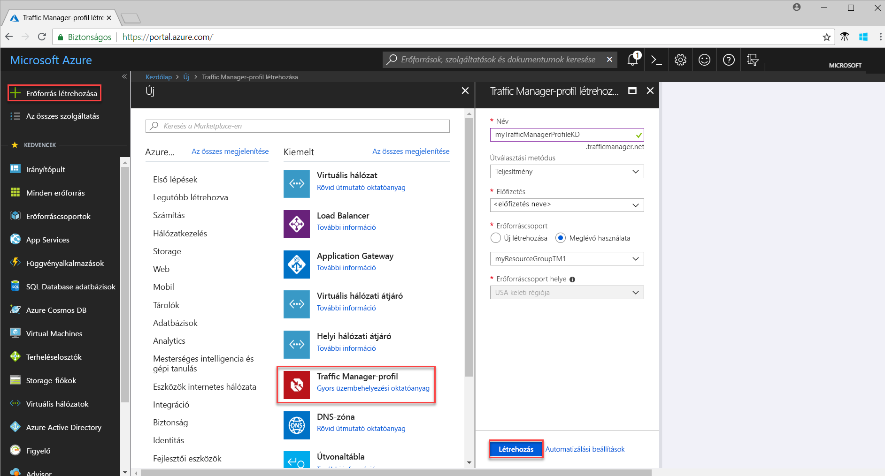
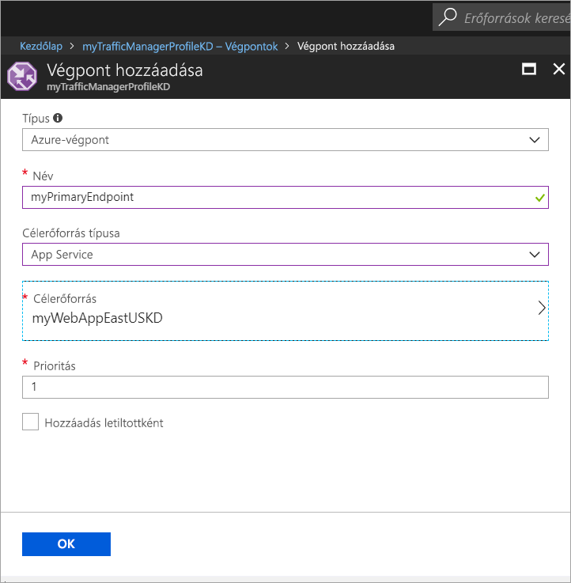

# Rövid útmutató: Traffic Manager-profil létrehozása magas rendelkezésre állású webalkalmazásokhoz

A rövid útmutató bemutatja, hogyan hozhat létre Traffic Manager-profilokat, amelyek biztosítják a webalkalmazások magas rendelkezésre állását. 

A rövid útmutatóban ismertetett forgatókönyvben egy adott webalkalmazás különböző Azure-régiókban futó két példányát használjuk. Létrehozunk egy [végpontprioritás](traffic-manager-routing-methods.md#priority)-alapú Traffic Manager-profilt, amellyel a felhasználói adatforgalmat az alkalmazást futtató elsődleges helyre irányítjuk. A Traffic Manager folyamatosan monitorozza a webalkalmazást, és automatikus feladatátvételt biztosít a tartalék helyre, ha az elsődleges hely elérhetetlenné válna.

Ha nem rendelkezik Azure-előfizetéssel, mindössze néhány perc alatt létrehozhat egy [ingyenes fiókot](https://azure.microsoft.com/free/?WT.mc_id=A261C142F) a virtuális gép létrehozásának megkezdése előtt.

## Bejelentkezés az Azure-ba 
Jelentkezzen be az Azure Portalra a https://portal.azure.com webhelyen.

## Előfeltételek
A rövid útmutatóhoz egy webalkalmazás két példányának eltérő Azure-régiókban kell lennie (*USA keleti régiója* és *Nyugat-Európa*). A webalkalmazás két példánya szolgál a Traffic Manager elsődleges és tartalék végpontjaként.

1. A képernyő bal felső részén válassza az **Erőforrás létrehozása** > **Web** > **Webalkalmazás** > **Létrehozás** elemet.
2. A **Webalkalmazás** mezőben adja meg vagy válassza ki a következő adatokat, illetve az alapértelmezett beállításokat, ahol nem adtunk meg másik lehetőséget:

     | Beállítás         | Érték     |
     | ---              | ---  |
     | Name (Név)           | Adja meg a webalkalmazás egyedi nevét.  |
     | Erőforráscsoport          | Válassza az **Új** lehetőséget, majd írja be a *myResourceGroupTM1* nevet. |
     | App Service-csomag/hely         | Válassza az **Új** lehetőséget.  Az App Service-csomag mezőben adja meg a *myAppServicePlanEastUS* nevet, majd kattintson az **OK** gombra. 
     |      Hely  |   USA keleti régiója        |
    |||

3. Kattintson a **Létrehozás** gombra.
4. Az alapértelmezett webhely létrejön a Web App-alkalmazás sikeres üzembe helyezésekor.
5. Az 1–3. lépés ismételt végrehajtásával hozzon létre egy második webhelyet egy másik Azure-régióban a következő beállításokkal:

     | Beállítás         | Érték     |
     | ---              | ---  |
     | Name (Név)           | Adja meg a webalkalmazás egyedi nevét.  |
     | Erőforráscsoport          | Válassza az **Új** lehetőséget, majd írja be a *myResourceGroupTM2* nevet. |
     | App Service-csomag/hely         | Válassza az **Új** lehetőséget.  Az App Service-csomag mezőben adja meg a *myAppServicePlanWestEurope* nevet, majd kattintson az **OK** gombra. 
     |      Hely  |   Nyugat-Európa      |
    |||

## Traffic Manager-profil létrehozása
Létrehozunk egy Traffic Manager-profilt, amely a felhasználói forgalmat a végpontprioritás alapján irányítja.

1. A képernyő bal felső részén válassza az **Erőforrás létrehozása** > **Hálózat** > **Traffic Manager-profil** > **Létrehozás** elemet.
2. A **Traffic Manager-profil létrehozása** területen adja meg vagy válassza ki az alábbi adatokat, a többi beállítás esetében fogadja el az alapértelmezett értéket, majd válassza a **Létrehozás** elemet:
    
    | Beállítás                 | Érték                                              |
    | ---                     | ---                                                |
    | Name (Név)                   | Ennek a névnek egyedinek kell lennie a trafficmanager.net zónában, és eredményül a **trafficmanager.net** DNS-nevet adja vissza, amellyel a Traffic Manager-profil elérhető.|
    | Útválasztási metódus          | Válassza a **Prioritás** útválasztási metódust.|
    | Előfizetés            | Válassza ki előfizetését.|
    | Erőforráscsoport          | Válassza a **Meglévő**, majd a *myResourceGroupTM1* lehetőséget.|
    |Hely |Ez a beállítás az erőforráscsoport helyére vonatkozik, és nincs hatással a globálisan üzembe helyezendő Traffic Manager-profilra.|
    |||
    
    
   

## Traffic Manager-végpontok hozzáadása

Adja hozzá az *USA keleti régiójában* lévő webhelyt elsődleges végpontként, amelyre az összes felhasználói forgalom át lesz irányítva. Adja hozzá a *Nyugat-Európában* lévő webhelyet tartalékvégpontként. Ha az elsődleges végpont nem érhető el, a rendszer automatikusan a másodlagos végpontra irányítja a forgalmat.

1. A portál keresősávjában keressen rá az előző szakaszban létrehozott Traffic Manager-profil nevére, majd válassza ki a profilt a megjelenített eredmények között.
2. A **Traffic Manager-profil** panel **Beállítások** szakaszában kattintson a **Végpontok**, majd a **Hozzáadás** elemre.
3. Adja meg vagy válassza ki az alábbi adatokat, a többi beállítás esetében fogadja el az alapértelmezett értéket, majd válassza az **OK** elemet:

    | Beállítás                 | Érték                                              |
    | ---                     | ---                                                |
    | Típus                    | Azure-végpont                                   |
    | Name (Név)           | myPrimaryEndpoint                                        |
    | Célerőforrás típusa           | App Service                          |
    | Célerőforrás          | **Válasszon ki egy alkalmazásszolgáltatást** az egy előfizetéshez tartozó Web Apps-alkalmazások listájának megjelenítéséhez. Az **Erőforrás** panelen válassza ki az első végpontként hozzáadni kívánt alkalmazásszolgáltatást. |
    | Prioritás               | Válassza az **1** lehetőséget. Ennek eredményeképpen a teljes forgalom erre a végpontra irányul, ha ez nem befolyásolja a rendszer megfelelő működését.    |
    
4. Hajtsa ismét végre a 2. és a 3. lépést a következő Web Apps-végponton. Ennek a **Prioritása** mindenképpen **2-es** legyen.
5.  Miután mindkét végpontot hozzáadta, azok megjelennek a **Traffic Manager-profil** panelen, **Online** figyelési állapottal.

    

## Traffic Manager-profil tesztelése
Ebben a szakaszban először meghatározzuk a Traffic Manager-profil tartománynevét, majd megnézzük, hogyan adja át a Traffic Manager a feladatokat a másodlagos végpontnak, ha az elsődleges végpont nem érhető el.
### A DNS-név meghatározása
1.  A portál keresősávjában keressen rá az előző szakaszban létrehozott **Traffic Manager-profil** nevére. Kattintson a Traffic Manager-profilra a megjelenített eredmények között.
2. Kattintson az **Áttekintés** elemre.
3. A **Traffic Manager-profil** mezőben megjelenik az újonnan létrehozott Traffic Manager-profil DNS-neve.
  
   

### A Traffic Manager megtekintése működés közben

1. Egy böngészőben adja meg a Traffic Manager-profil DNS-nevét a Web Apps-alkalmazás alapértelmezett webhelyének megtekintéséhez. A jelen rövid útmutató forgatókönyvében az összes kérés az **1-es prioritásúként** megadott elsődleges végpontra irányul.

2. A Traffic Manager-feladatátvétel működés közbeni megtekintéséhez tiltsa le az elsődleges helyet az alábbiak szerint:
    1. A Traffic Manager-profil lapon válassza a **Beállítások**>**Végpontok**>*MyPrimaryEndpoint* elemet.
    2. A *MyPrimaryEndpoint* területen válassza a **Letiltva** elemet. 
    3. A *MyPrimaryEndpoint* elsődleges végpont állapota most **Letiltva** értékű.
3. Másolja a Traffic Manager-profil DNS-nevét az előző lépésből a vágólapra a webhely böngészőben való sikeres megtekintéséhez. Ha az elsődleges végpont le van tiltva, a felhasználói forgalom a másodlagos végpontra irányul.

## Az erőforrások eltávolítása
Ha már nincs rájuk szüksége, törölje az erőforráscsoportokat, a webalkalmazásokat és az összes kapcsolódó erőforrást. Ehhez jelölje ki az erőforráscsoportokat (*myResourceGroupTM1* és *myResourceGroupTM2*), majd kattintson a **Törlés** elemre.

## További lépések
Ebben a rövid útmutatóban egy Traffic Manager-profilt hoztunk létre, amelynek segítségével irányíthattuk egy magas rendelkezésre állású webalkalmazás forgalmát. Ha bővebb információra van szüksége a forgalom irányításával kapcsolatban, folytassa a Traffic Manager oktatóanyagaival.

> [!div class="nextstepaction"]
> [Traffic Manager-oktatóanyagok](tutorial-traffic-manager-improve-website-response.md)

