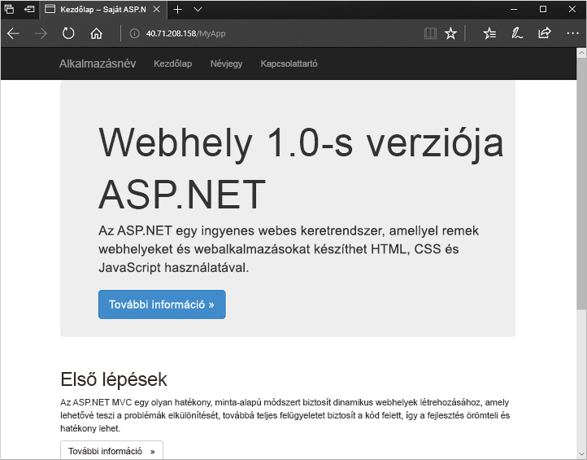

# <a name="quickstart-create-a-virtual-machine-scale-set-with-azure-powershell"></a>Rövid útmutató: Virtuálisgép-méretezési csoport létrehozása az Azure PowerShell használatával
A virtuálisgép-méretezési csoportok segítségével azonos, automatikus skálázású virtuális gépek csoportját hozhatja létre és kezelheti. A méretezési csoportban lévő virtuális gépek számát beállíthatja manuálisan, de automatikus méretezési szabályokat is megadhat az erőforrás-használat (például processzorhasználat, memóriaigény vagy hálózati forgalom) alapján. Egy Azure-terheléselosztó ezután elosztja a forgalmat a méretezési csoportban lévő virtuálisgép-példányok között. Ebben a rövid útmutatóban egy virtuálisgép-méretezési csoportot hozunk létre, és üzembe helyezünk egy mintaalkalmazást az Azure PowerShell-lel.

Ha nem rendelkezik Azure-előfizetéssel, mindössze néhány perc alatt létrehozhat egy [ingyenes fiókot](https://azure.microsoft.com/free/?WT.mc_id=A261C142F) a virtuális gép létrehozásának megkezdése előtt.

[!INCLUDE [cloud-shell-powershell.md](../../includes/cloud-shell-powershell.md)]

Ha a PowerShell helyi telepítése és használata mellett dönt, az oktatóanyaghoz az Azure PowerShell-modul 5.6.0-s vagy újabb verziójára lesz szükség. A verzió azonosításához futtassa a következőt: `Get-Module -ListAvailable AzureRM`. Ha frissíteni szeretne, olvassa el [az Azure PowerShell-modul telepítését](/powershell/azure/install-azurerm-ps) ismertető cikket. Ha helyileg futtatja a PowerShellt, akkor emellett a `Connect-AzureRmAccount` futtatásával kapcsolatot kell teremtenie az Azure-ral.


## <a name="create-a-scale-set"></a>Méretezési csoport létrehozása
Hozzon létre egy virtuálisgép-méretezési csoportot a [New-AzureRmVmss](/powershell/module/azurerm.compute/new-azurermvmss) paranccsal. A következő példa létrehoz egy *myScaleSet* nevű méretezési csoportot, amely a *Windows Server 2016 Datacenter* platformrendszerképet használja. A rendszer automatikusan létrehozza az Azure-beli hálózati erőforrásokat a virtuális hálózathoz, a nyilvános IP-címhez és a terheléselosztóhoz. Amikor a rendszer erre kéri, adja meg használni kívánt rendszergazdai hitelesítő adatait a méretezési csoportban lévő virtuálisgép-példányokhoz:

```azurepowershell-interactive
New-AzureRmVmss `
  -ResourceGroupName "myResourceGroup" `
  -Location "EastUS" `
  -VMScaleSetName "myScaleSet" `
  -VirtualNetworkName "myVnet" `
  -SubnetName "mySubnet" `
  -PublicIpAddressName "myPublicIPAddress" `
  -LoadBalancerName "myLoadBalancer" `
  -UpgradePolicy "Automatic"
```

A méretezési csoport erőforrásainak és virtuális gépeinek létrehozása és konfigurálása néhány percet vesz igénybe.


## <a name="deploy-sample-application"></a>Mintaalkalmazás üzembe helyezése
A méretezési csoport teszteléséhez telepítsen egy alapszintű webalkalmazást. Az egyéni Azure-szkriptbővítménnyel egy olyan szkriptet tölthet le és futtathat, amely az IIS-t telepíti a virtuálisgép-példányokon. A bővítmény az üzembe helyezést követő konfiguráció, szoftvertelepítés, illetve bármely konfigurációs/felügyeleti feladat végrehajtása során hasznos. További információ: [Az egyéni szkriptbővítmény áttekintése](../virtual-machines/windows/extensions-customscript.md).

Telepítsen egy alapszintű IIS-webkiszolgálót az egyéni szkriptbővítménnyel. Alkalmazza az IIS-t telepítő egyéni szkriptbővítményt a következő módon:

```azurepowershell-interactive
# Define the script for your Custom Script Extension to run
$publicSettings = @{
    "fileUris" = (,"https://raw.githubusercontent.com/Azure-Samples/compute-automation-configurations/master/automate-iis.ps1");
    "commandToExecute" = "powershell -ExecutionPolicy Unrestricted -File automate-iis.ps1"
}

# Get information about the scale set
$vmss = Get-AzureRmVmss `
            -ResourceGroupName "myResourceGroup" `
            -VMScaleSetName "myScaleSet"

# Use Custom Script Extension to install IIS and configure basic website
Add-AzureRmVmssExtension -VirtualMachineScaleSet $vmss `
    -Name "customScript" `
    -Publisher "Microsoft.Compute" `
    -Type "CustomScriptExtension" `
    -TypeHandlerVersion 1.8 `
    -Setting $publicSettings

# Update the scale set and apply the Custom Script Extension to the VM instances
Update-AzureRmVmss `
    -ResourceGroupName "myResourceGroup" `
    -Name "myScaleSet" `
    -VirtualMachineScaleSet $vmss
```


## <a name="test-your-scale-set"></a>Méretezési csoport tesztelése
Ha ellenőrizni szeretné, hogyan működik a méretezési csoport, lépjen egy böngészőben a mintául szolgáló webalkalmazáshoz. Kérje le a terheléselosztó nyilvános IP-címét a [Get-AzureRmPublicIpAddress](/powershell/module/azurerm.network/get-azurermpublicipaddress) paranccsal. A következő példa a *myResourceGroup* erőforráscsoportban létrehozott IP-címet kéri le:

```azurepowershell-interactive
Get-AzureRmPublicIpAddress -ResourceGroupName "myResourceGroup" | Select IpAddress
```

Adja meg a terheléselosztó nyilvános IP-címét egy webböngészőben. A terheléselosztó az egyik virtuálisgép-példányra terjeszti a forgalmat, ahogy az a következő példában látható:




## <a name="clean-up-resources"></a>Az erőforrások eltávolítása
Ha már nincs rájuk szükség, a [Remove-AzureRmResourceGroup](/powershell/module/azurerm.resources/remove-azurermresourcegroup) paranccsal eltávolítható az erőforráscsoport, a méretezési csoport és az összes kapcsolódó erőforrás. A `-Force` paraméter megerősíti, hogy további kérdés nélkül szeretné törölni az erőforrásokat. A `-AsJob` paraméter visszaadja a vezérlést a parancssornak, és nem várja meg a művelet befejeztét.

```azurepowershell-interactive
Remove-AzureRmResourceGroup -Name "myResourceGroup" -Force -AsJob
```


## <a name="next-steps"></a>További lépések
Ebben a rövid útmutatóban egy alapszintű méretezési csoportot hoztunk létre, valamint az egyéni szkriptbővítménnyel egy alapszintű IIS-webkiszolgálót telepítettünk a VM-példányokon. Ha bővebb információra van szüksége, lépjen tovább az Azure-beli virtuálisgép-méretezési csoportok létrehozásáról és kezeléséről szóló oktatóanyagra.

> [!div class="nextstepaction"]
> [Azure-beli virtuálisgép-méretezési csoportok létrehozása és kezelése](tutorial-create-and-manage-powershell.md)
