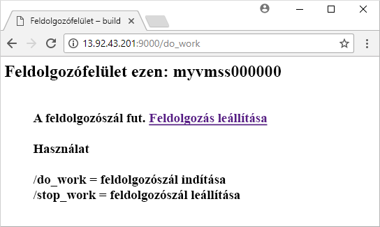

# <a name="quickstart-create-a-linux-virtual-machine-scale-set-with-an-azure-template"></a>Gyors útmutató: Linux virtuálisgép-méretezési csoport létrehozása Azure-sablonnal
A virtuálisgép-méretezési csoportok segítségével azonos, automatikus skálázású virtuális gépek csoportját hozhatja létre és kezelheti. A méretezési csoportban lévő virtuális gépek számát beállíthatja manuálisan, de automatikus méretezési szabályokat is megadhat az erőforrás-használat (például processzorhasználat, memóriaigény vagy hálózati forgalom) alapján. Egy Azure-terheléselosztó ezután elosztja a forgalmat a méretezési csoportban lévő virtuálisgép-példányok között. Ebben a rövid útmutatóban egy virtuálisgép-méretezési csoportot hozunk létre, és üzembe helyezünk egy mintaalkalmazást egy Azure Resource Manager-sablon használatával.

Ha nem rendelkezik Azure-előfizetéssel, mindössze néhány perc alatt létrehozhat egy [ingyenes fiókot](https://azure.microsoft.com/free/?WT.mc_id=A261C142F) a virtuális gép létrehozásának megkezdése előtt.

[!INCLUDE [cloud-shell-try-it.md](../../includes/cloud-shell-try-it.md)]

Ha a parancssori felület helyi telepítését és használatát választja, akkor ehhez az oktatóanyaghoz az Azure CLI 2.0.29-es vagy újabb verziójára lesz szükség. A verzió azonosításához futtassa a következőt: `az --version`. Ha telepíteni vagy frissíteni szeretne: [Az Azure CLI telepítése]( /cli/azure/install-azure-cli).


## <a name="define-a-scale-set-in-a-template"></a>Méretezési csoport meghatározása sablonban
Az Azure Resource Manager-sablonok segítségével egymáshoz kapcsolódó erőforráscsoportokat helyezhet üzembe. A sablonok a JavaScript Object Notation (JSON) formátumban vannak megírva, továbbá az alkalmazás teljes Azure-infrastruktúra környezetét meghatározzák. Egyetlen sablonban hozhatja létre a virtuálisgép-méretezési csoportot, telepítheti az alkalmazásokat és konfigurálhatja az automatikus méretezési szabályokat. Különféle változók és paraméterek segítségével a sablon többször is felhasználható meglévő méretezési csoportok frissítésére vagy újabbak létrehozására. A sablonokat az Azure Portal, az Azure CLI vagy az Azure PowerShell használatával, illetve folyamatos integrációs (CI) / folyamatos továbbítási (CD) folyamatokkal helyezheti üzembe.

A sablonok további információkért lásd: [Azure Resource Manager áttekintése](https://docs.microsoft.com/azure/azure-resource-manager/resource-group-overview#template-deployment). JSON-szintaxist és a Tulajdonságok [Microsoft.Compute/virtualMachineScaleSets](/azure/templates/microsoft.compute/virtualmachinescalesets) tárfióksablonok referenciáját.

Méretezési csoport sablon alapján való létrehozásához definiálnia kell a megfelelő erőforrásokat. A virtuálisgép-méretezési csoport erőforrástípus alapvető elemei a következők:

| Tulajdonság                     | A tulajdonság leírása                                  | Példa sablonérték                    |
|------------------------------|----------------------------------------------------------|-------------------------------------------|
| type                         | A létrehozandó Azure-erőforrástípus                            | Microsoft.Compute/virtualMachineScaleSets |
| név                         | A méretezési csoport neve                                       | myScaleSet                                |
| location                     | A méretezési csoport létrehozásának helye                     | USA keleti régiója                                   |
| sku.name                     | A méretezési csoport egyes példányainak virtuálisgép-mérete                  | Standard_A1                               |
| sku.capacity                 | Az először létrehozandó virtuálisgép-példányok száma           | 2                                         |
| upgradePolicy.mode           | A virtuálisgép-példányok frissítésének módja módosítás esetén              | Automatikus                                 |
| imageReference               | A virtuálisgép-példányokhoz használandó platform vagy egyéni rendszerkép | Canonical Ubuntu Server 16.04-LTS         |
| osProfile.computerNamePrefix | Az egyes virtuálisgép-példányokhoz tartozó név előtagja                     | myvmss                                    |
| osProfile.adminUsername      | Az egyes virtuálisgép-példányokhoz tartozó felhasználónév                        | azureuser                                 |
| osProfile.adminPassword      | Az egyes virtuálisgép-példányokhoz tartozó jelszó                        | P@ssw0rd!                                 |

 Az alábbi példa az alapvető méretezésicsoport-erőforrás definícióját mutatja be. A méretezési csoport sablonjának testreszabásához módosíthatja a virtuális gépek méretét vagy kezdeti kapacitását, illetve használhat egy másik platformot vagy egy egyedi rendszerképet.

```json
{
  "type": "Microsoft.Compute/virtualMachineScaleSets",
  "name": "myScaleSet",
  "location": "East US",
  "apiVersion": "2017-12-01",
  "sku": {
    "name": "Standard_A1",
    "capacity": "2"
  },
  "properties": {
    "upgradePolicy": {
      "mode": "Automatic"
    },
    "virtualMachineProfile": {
      "storageProfile": {
        "osDisk": {
          "caching": "ReadWrite",
          "createOption": "FromImage"
        },
        "imageReference":  {
          "publisher": "Canonical",
          "offer": "UbuntuServer",
          "sku": "16.04-LTS",
          "version": "latest"
        }
      },
      "osProfile": {
        "computerNamePrefix": "myvmss",
        "adminUsername": "azureuser",
        "adminPassword": "P@ssw0rd!"
      }
    }
  }
}
```

 A minta rövidségének megőrzése érdekében a virtuális hálózati kártya (NIC) konfigurációját lehagytuk a képről. A további összetevők, például a terheléselosztók szintén nem láthatók. [A cikk végén](#deploy-the-template) egy teljes méretezésicsoport-sablon található.


## <a name="add-a-sample-application"></a>Mintaalkalmazás hozzáadása
A méretezési csoport teszteléséhez telepítsen egy alapszintű webalkalmazást. A méretezési csoportok üzembe helyezésekor a virtuálisgép-bővítményekkel biztosíthatóak az üzembe helyezést követő konfigurációs és automatizálási feladatok, például az alkalmazások telepítése. A szkriptek az Azure Storage-ből vagy a GitHubról tölthetők le, illetve megadhatók az Azure Portalon a bővítmény futásidejében. Ha alkalmazni szeretné valamelyik bővítményt a méretezési csoportra, egészítse ki az erőforrás előző példáját az *extensionProfile* szakasszal. A bővítményprofil általában az alábbi tulajdonságokat határozza meg:

- Bővítmény típusa
- Bővítmény kiadója
- Bővítmény verziója
- A konfigurációs vagy telepítési szkriptek helye
- A virtuálisgép-példányokon végrehajtandó parancsok

A [Linux rendszeren futó Python HTTP-kiszolgáló](https://github.com/Azure/azure-quickstart-templates/tree/master/201-vmss-bottle-autoscale) sablon az egyéni szkriptbővítmény segítségével telepíti a [Bottle](https://bottlepy.org/docs/dev/) Python webes keretrendszert és egy egyszerű HTTP-kiszolgálót. 

A **fileUris**alatt két szkript van meghatározva - az *installserver.sh* és a *workserver.py*. A rendszer letölti a fájlokat a GitHubról, majd a *commandToExecute* a `bash installserver.sh` fájlt futtatja az alkalmazás letöltéséhez és telepítéséhez:

```json
"extensionProfile": {
  "extensions": [
    {
      "name": "AppInstall",
      "properties": {
        "publisher": "Microsoft.Azure.Extensions",
        "type": "CustomScript",
        "typeHandlerVersion": "2.0",
        "autoUpgradeMinorVersion": true,
        "settings": {
          "fileUris": [
            "https://raw.githubusercontent.com/Azure/azure-quickstart-templates/master/201-vmss-bottle-autoscale/installserver.sh",
            "https://raw.githubusercontent.com/Azure/azure-quickstart-templates/master/201-vmss-bottle-autoscale/workserver.py"
          ],
          "commandToExecute": "bash installserver.sh"
        }
      }
    }
  ]
}
```


## <a name="deploy-the-template"></a>A sablon üzembe helyezése
A [Linux rendszeren futó Python HTTP-kiszolgáló](https://github.com/Azure/azure-quickstart-templates/tree/master/201-vmss-bottle-autoscale) sablont a következő **Üzembe helyezés az Azure-ban** gombbal helyezheti üzembe. A gomb megnyomására megnyílik az Azure Portal, betöltődik a teljes sablon, és a rendszer néhány paraméter megadását kéri (például a méretezési csomag neve, a példányok száma és a rendszergazdai hitelesítő adatok).

[](https://portal.azure.com/#create/Microsoft.Template/uri/https%3A%2F%2Fraw.githubusercontent.com%2FAzure%2Fazure-quickstart-templates%2Fmaster%2F201-vmss-bottle-autoscale%2Fazuredeploy.json)

Az Azure CLI használatával is telepítheti a Linux rendszeren futó Python HTTP-kiszolgálót az [az group deployment create](/cli/azure/group/deployment) paranccsal a következőképpen:

```azurecli-interactive
# Create a resource group
az group create --name myResourceGroup --location EastUS

# Deploy template into resource group
az group deployment create \
    --resource-group myResourceGroup \
    --template-uri https://raw.githubusercontent.com/Azure/azure-quickstart-templates/master/201-vmss-bottle-autoscale/azuredeploy.json
```

A kérések megválaszolásával adja meg a méretezési csoport nevét, a példányok számát és a virtuálisgép-példányok rendszergazdai hitelesítő adatait. A méretezési csoport és a támogató erőforrások létrehozása eltarthat néhány percig.


## <a name="test-your-scale-set"></a>Méretezési csoport tesztelése
Ha ellenőrizni szeretné, hogyan működik a méretezési csoport, lépjen egy böngészőben a mintául szolgáló webalkalmazáshoz. Kérje le a terheléselosztó nyilvános IP-címét az [az network public-ip list](/cli/azure/network/public-ip) paranccsal a következők szerint:

```azurecli-interactive
az network public-ip list \
    --resource-group myResourceGroup \
    --query [*].ipAddress -o tsv
```

Adja meg a terheléselosztó nyilvános IP-címét egy böngészőben a következő formátumban: *http://publicIpAddress:9000/do_work*. A terheléselosztó az egyik virtuálisgép-példányra terjeszti a forgalmat, ahogy az a következő példában látható:




## <a name="clean-up-resources"></a>Az erőforrások eltávolítása
Ha már nincs rájuk szükség, az [az group delete](/cli/azure/group) paranccsal eltávolítható az erőforráscsoport, a méretezési csoport és az összes kapcsolódó erőforrás. A `--no-wait` paraméter visszaadja a vezérlést a parancssornak, és nem várja meg a művelet befejeztét. A `--yes` paraméter megerősíti, hogy további kérdés nélkül szeretné törölni az erőforrásokat.

```azurecli-interactive
az group delete --name myResourceGroup --yes --no-wait
```


## <a name="next-steps"></a>További lépések
Ebben a rövid útbemutatóban egy Linux rendszerű méretezési csoportot hoztunk létre egy Azure-sablonnal, valamint az egyéni szkriptbővítménnyel egy alapszintű Python-webkiszolgálót telepítettünk a VM-példányokon. Ha bővebb információra van szüksége, lépjen tovább az Azure-beli virtuálisgép-méretezési csoportok létrehozásáról és kezeléséről szóló oktatóanyagra.

> [!div class="nextstepaction"]
> [Azure-beli virtuálisgép-méretezési csoportok létrehozása és kezelése](tutorial-create-and-manage-cli.md)
