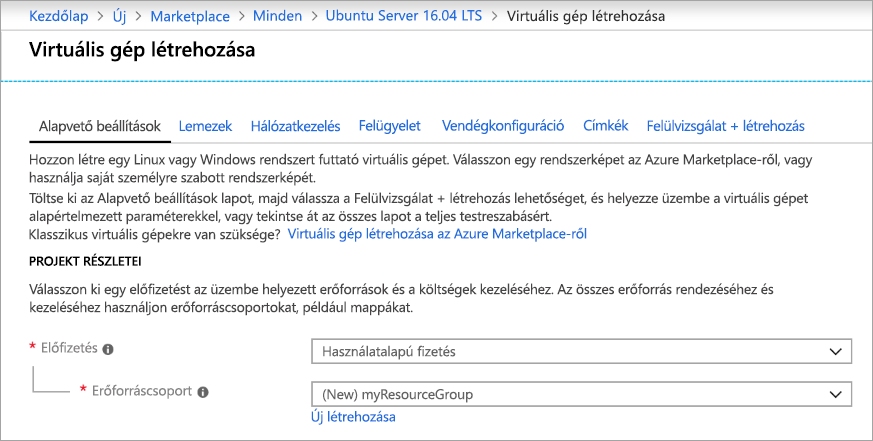
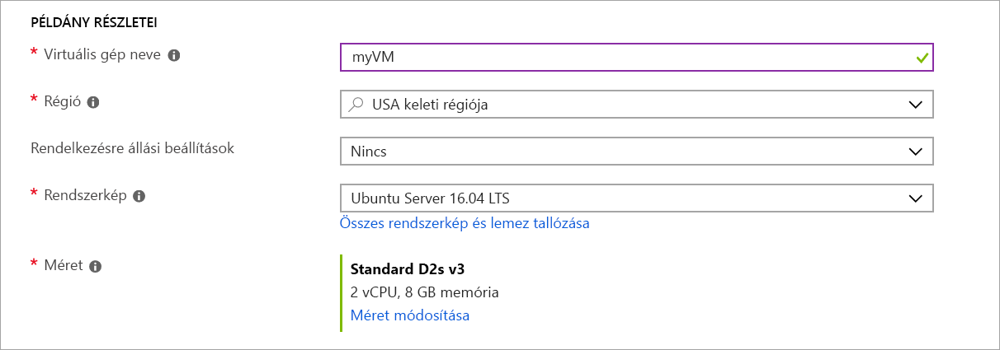
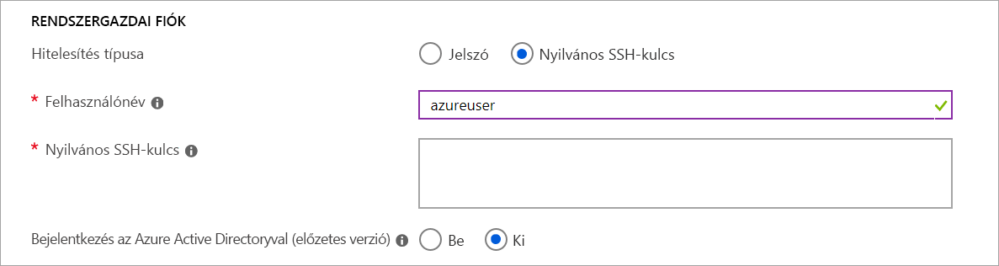
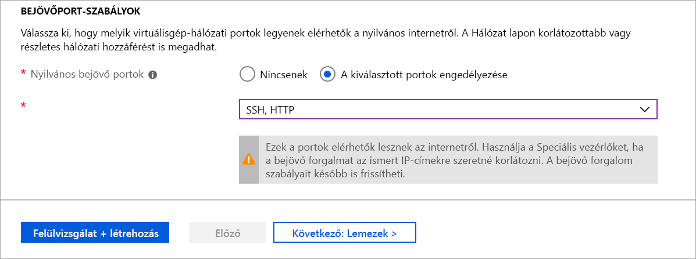

# <a name="quickstart-create-a-linux-virtual-machine-in-the-azure-portal"></a>Rövid útmutató: Linux rendszerű virtuális gép létrehozása az Azure Portalon

Az Azure-beli virtuális gépek (VM-ek) létrehozhatók az Azure Portal segítségével. Az Azure Portal egy böngészőalapú felhasználói felület a virtuális gépek és a társított erőforrások létrehozására. Ez a rövid útmutató bemutatja, hogyan helyezhet üzembe az Azure Portal segítségével Ubuntu 16.04 LTS-en futó Linux rendszerű virtuális gépeket (VM-eket). A virtuális gép működésének megtekintéséhez hozzon létre SSH-kapcsolatot a virtuális géppel, és telepítse az NGINX-webkiszolgálót.

Ha nem rendelkezik Azure-előfizetéssel, mindössze néhány perc alatt létrehozhat egy [ingyenes fiókot](https://azure.microsoft.com/free/?WT.mc_id=A261C142F) a virtuális gép létrehozásának megkezdése előtt.

## <a name="create-ssh-key-pair"></a>SSH-kulcspár létrehozása

A rövid útmutató elvégzéséhez egy SSH-kulcspárra lesz szüksége. Ha már rendelkezésére áll egy SSH-kulcspár, kihagyhatja ezt a lépést.

SSH-kulcspár létrehozásához nyissa meg a Bash-felületet, és használja az [ssh-keygen](https://www.ssh.com/ssh/keygen/) eszközt. Ha nincs Bash-felület a helyi számítógépén, használhatja az [Azure Cloud Shellt](https://shell.azure.com/bash) is.  

```bash
ssh-keygen -t rsa -b 2048
```

A fenti parancs nyilvános és titkos kulcsokat hoz létre `id_rsa` alapértelmezett névvel a `~/.ssh directory` helyen. A parancs visszaadja a nyilvános kulcs teljes útvonalát. A nyilvános kulcs útvonalának használatával megjelenítheti annak tartalmát a következővel: `cat`.

```bash 
cat ~/.ssh/id_rsa.pub
```

Mentse a parancs kimenetét. Szüksége lesz rá, amikor konfigurálja a rendszergazdai fiókot a virtuális gépbe történő bejelentkezéshez.

Az SSH-kulcspárok létrehozásáról, többek között a PuTTy használatáról az [SSH-kulcsok Windowsban való használatát](ssh-from-windows.md) ismertető cikkben talál részletesebb információt.

Ha a Cloud Shell használatával hozza létre az SSH-kulcspárt, az Azure File Share, amely [automatikusan csatlakozik a Cloud Shellhez](https://docs.microsoft.com/azure/cloud-shell/persisting-shell-storage), eltárolja azt. Ne törölje ezt a fájlmegosztást vagy tárfiókot, amíg le nem kérte a kulcsokat, ellenkező esetben elveszíti a hozzáférést a virtuális géphez. 

## <a name="sign-in-to-azure"></a>Bejelentkezés az Azure-ba

Jelentkezzen be az [Azure Portalra](https://portal.azure.com).

## <a name="create-virtual-machine"></a>Virtuális gép létrehozása

1. Kattintson az Azure Portal bal felső sarkában az **Erőforrás létrehozása** gombra.

1. Az Azure Marketplace-erőforrások fölött lévő keresőmezőben keressen az **Ubuntu Server 16.04 LTS** (Canonical) elemre, és válassza ki, majd válassza a **Létrehozás** lehetőséget.

1. Az **Alapok** lap **Projektadatok** részén győződjön meg arról, hogy a megfelelő előfizetés van kiválasztva, és válassza az **Új létrehozása** lehetőséget az **Erőforráscsoport** részen. Az előugró ablakban adja meg a *myResourceGroup* sztringet az erőforráscsoport neveként, majd kattintson az **OK** gombra. 

    

1. Alatt **Példány részletei** szakaszban írja be a *myVM* nevet a **Virtuális gép neve** mezőbe, és válassza *USA keleti régiója* lehetőséget a **Régió** részen. Hagyja meg a többi alapértelmezett értéket.

    

1. A **Rendszergazdai fiók** részen válassza a **Nyilvános SSH-kulcs**, lehetőséget, írja be a felhasználónevét, majd illessze be a nyilvános kulcsát a szövegmezőbe. Távolítsa el a kezdő vagy záró szóközöket a nyilvános kulcsból.

    

1. A **Bejövőport-szabályok** > **Nyilvános bejövő portok** részen válassza a **Kijelölt portok engedélyezése** lehetőséget, majd az **SSH (22)** és a **HTTP (80)** elemet a legördülő listából. 

    

1. Hagyja változatlanul a többi alapértelmezett beállítást, és kattintson a **Áttekintés + létrehozás** gombra a lap alján.

1. A **Virtuális gép létrehozása** lapon láthatja a létrehozandó virtuális gép részleteit. Ha készen áll, kattintson a **Létrehozás** gombra.

A virtuális gép üzembe helyezése eltarthat néhány percig. Az üzembe helyezés végeztével lépjen tovább a következő szakaszra.

    
## <a name="connect-to-virtual-machine"></a>Csatlakozás virtuális géphez

Hozzon léte egy SSH-kapcsolatot a virtuális géppel.

1. A virtuális gép áttekintő oldalán kattintson a **Csatlakozás** gombra. 

    

2. A **Csatlakozás a virtuális géphez** oldalon tartsa meg az alapértelmezett beállításokat az IP-címmel való csatlakozáshoz a 22-es porton keresztül. A **Bejelentkezés a virtuális gép helyi fiókjával** területen egy csatlakozási parancs jelenik meg. Kattintson a gombra a parancs kimásolásához. Az SSH-kapcsolat parancsa az alábbi példához hasonlóan néz ki:

    ```bash
    ssh azureuser@10.111.12.123
    ```

3. SSH-munkamenet létrehozásához az SSH-kulcspár létrehozásakor használt Bash-felület (például [Azure Cloud Shell](https://shell.azure.com/bash) vagy helyi Bash-felület) használatával illessze be az SSH-kapcsolat parancsát a felületre. 

## <a name="install-web-server"></a>Webkiszolgáló telepítése

A virtuális gép működésének ellenőrzéséhez telepítse az NGINX-webkiszolgálót. Frissítse a csomag forrásait, majd telepítse a legújabb NGINX-csomagot az SSH-munkamenetből.

```bash
sudo apt-get -y update
sudo apt-get -y install nginx
```

Ha elkészült, az SSH-munkamenetből való kilépéshez írja be a következőt: `exit`.


## <a name="view-the-web-server-in-action"></a>A webkiszolgáló működésének ellenőrzése

Egy tetszőleges böngésző használatával megtekintheti az alapértelmezett NGINX-kezdőlapot. Webcímként adja meg a virtuális gép nyilvános IP-címét. A nyilvános IP-cím a virtuális gép áttekintő oldalán található, vagy a korábban használt SSH-kapcsolati sztring részeként.


## <a name="clean-up-resources"></a>Az erőforrások eltávolítása

Ha már nincs rájuk szükség, törölheti az erőforráscsoportot, a virtuális gépet és az összes kapcsolódó erőforrást. Ehhez válassza ki a virtuális gép erőforráscsoportját, kattintson a **Törlés** elemre, majd erősítse meg a törölni kívánt erőforráscsoport nevét.

## <a name="next-steps"></a>További lépések

Ebben a rövid útmutatóban üzembe helyezett egy egyszerű virtuális gépet, létrehozott egy hálózati biztonsági csoportot és szabályt, valamint telepített egy alapszintű webkiszolgálót. Ha bővebb információra van szüksége az Azure-beli virtuális gépekkel kapcsolatban, lépjen tovább a Linux rendszerű virtuális gépekről szóló oktatóanyagra.

> [!div class="nextstepaction"]
> [Azure-beli Linux rendszerű virtuális gépek – oktatóanyag](./tutorial-manage-vm.md)
