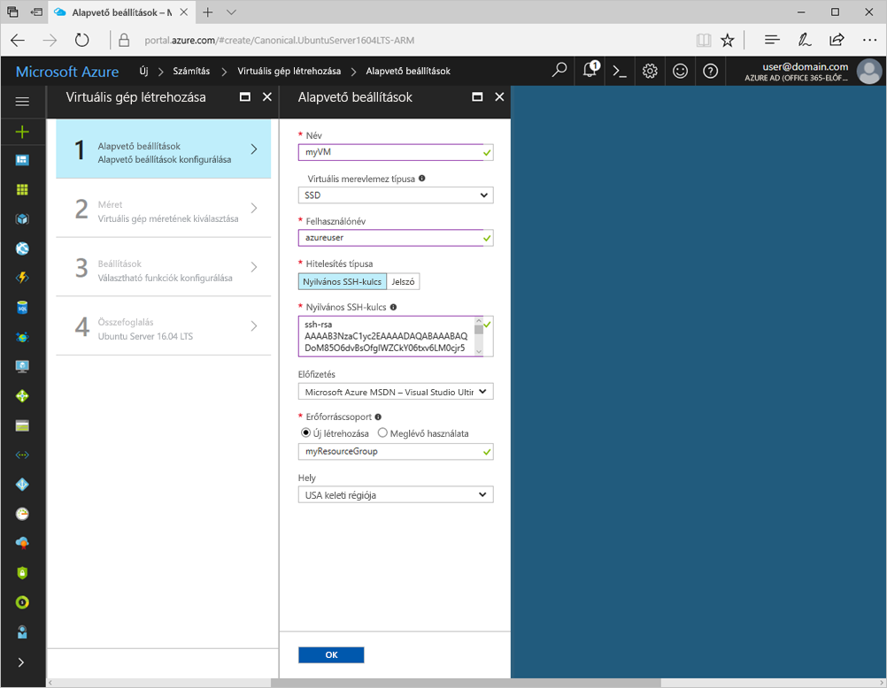
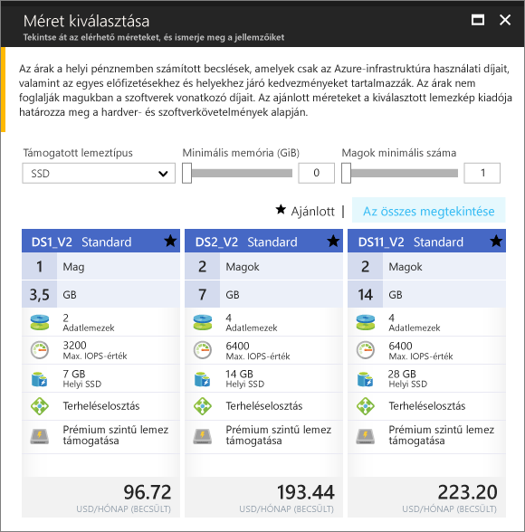

# <a name="quickstart-create-a-linux-virtual-machine-in-the-azure-portal"></a>Rövid útmutató: Linux rendszerű virtuális gép létrehozása az Azure Portalon

Az Azure-beli virtuális gépek (VM-ek) létrehozhatók az Azure Portal segítségével. Ez a módszer egy böngészőalapú felhasználói felületet biztosít a virtuális gépek és a társított erőforrások létrehozásához. Ez a rövid útmutató bemutatja, hogyan helyezhet üzembe az Azure Portal segítségével Ubuntu Linux rendszerű virtuális gépeket (VM-eket) az Azure-ban. A virtuális gép működésének ellenőrzéséhez ezután SSH-kapcsolaton keresztül csatlakozzon a géphez, és telepítse az NGINX-webkiszolgálót.

Ha nem rendelkezik Azure-előfizetéssel, mindössze néhány perc alatt létrehozhat egy [ingyenes fiókot](https://azure.microsoft.com/free/?WT.mc_id=A261C142F) a virtuális gép létrehozásának megkezdése előtt.

## <a name="create-ssh-key-pair"></a>SSH-kulcspár létrehozása

A rövid útmutató elvégzéséhez egy SSH-kulcspárra lesz szüksége. Ha már rendelkezik SSH-kulcspárral, kihagyhatja ezt a lépést.

A Linux rendszerű virtuális gépekre történő bejelentkezéshez szükséges SSH-kulcspárt az alábbi, a Bash rendszerhéjból futtatható paranccsal hozhatja létre. A futtatást követően kövesse a képernyőn megjelenő utasításokat. Például használhatja az [Azure Cloud Shellt](../../cloud-shell/overview.md) vagy a [Windows linuxos alrendszerét](/windows/wsl/install-win10). A parancs kimenete tartalmazza a nyilvános kulcsfájl fájlnevét. Másolja a nyilvános kulcsfájl (`cat ~/.ssh/id_rsa.pub`) tartalmát a vágólapra:

```bash
ssh-keygen -t rsa -b 2048
```

Az SSH-kulcspárok létrehozásáról, többek között a PuTTy használatáról az [SSH-kulcsok Windowsban való használatát](ssh-from-windows.md) ismertető cikkben talál részletesebb információt.

## <a name="log-in-to-azure"></a>Jelentkezzen be az Azure-ba

Jelentkezzen be az Azure Portalra a http://portal.azure.com címen.

## <a name="create-virtual-machine"></a>Virtuális gép létrehozása

1. Válassza az Azure Portal bal felső sarkában az **Erőforrás létrehozása** lehetőséget.

2. Az Azure Marketplace-erőforrások fölött lévő keresőmezőben keressen az **Ubuntu Server 16.04 LTS** (Canonical) elemre, és válassza ki, majd válassza a **Létrehozás** lehetőséget.

3. Adja meg a virtuális gép nevét (például *myVM*), a lemez típusát hagyja az *SSD* értéken, majd adjon meg egy felhasználónevet (például *azureuser*).

4. . A **Hitelesítés típusa** résznél válassza az **Nyilvános SSH-kulcs** lehetőséget, majd illessze be a nyilvános kulcsot a szövegmezőbe. Ügyeljen rá, hogy eltávolítsa a kezdő vagy záró térközöket a nyilvános kulcsból.

    

5. Válassza az **Új létrehozása** lehetőséget egy erőforráscsoport létrehozásához, majd adjon meg egy nevet (például *myResourceGroup*). Válassza ki a kívánt **Helyet**, majd kattintson az **OK** gombra.

4. Válasszon méretet a virtuális gép számára. Szűrhet például *számítási típus* vagy *lemeztípus* alapján. A virtuális gép ajánlott mérete a *D2s_v3*.

    

5. A **Beállítások** menüpont alatt tartsa meg az alapértelmezett beállításokat, majd kattintson az **OK** gombra.

6. Az Összefoglalás lapon válassza a **Létrehozás** lehetőséget a virtuális gép üzembe helyezésének megkezdéséhez.

7. A virtuális gép rögzítve lesz az Azure Portal irányítópultján. Az üzembe helyezés befejeztével a virtuális gép összefoglalás panelje automatikusan megnyílik.

## <a name="connect-to-virtual-machine"></a>Csatlakozás virtuális géphez

Hozzon léte egy SSH-kapcsolatot a virtuális géppel.

1. A virtuális gép áttekintő oldalán kattintson a **Csatlakozás** gombra. 

    

2. A **Csatlakozás virtuális géphez** oldalon tartsa meg az alapértelmezett beállításokat a DNS-név alapján a 22-es porton keresztül való csatlakozáshoz. A **Bejelentkezés a virtuális gép helyi fiókjával** területen egy csatlakozási parancs jelenik meg. Kattintson a gombra a parancs kimásolásához. Az SSH-kapcsolat parancsa az alábbi példához hasonlóan néz ki:

    ```bash
    ssh azureuser@myvm-123abc.eastus.cloudapp.azure.com
    ```

3. Illessze be az SSH-kapcsolat parancsát a rendszerhéjba, például az Azure Cloud Shell vagy a Bash rendszerhéjba a Windows alatt futó Ubuntu rendszeren a kapcsolat létrehozásához. 

## <a name="install-web-server"></a>Webkiszolgáló telepítése

A virtuális gép működésének ellenőrzéséhez telepítse az NGINX-webkiszolgálót. A csomagforrások frissítéséhez és a legújabb NGINX-csomag telepítéséhez futtassa a következő parancsokat az SSH-munkamenetből:

```bash
# update packages
sudo apt-get -y update

# install NGINX
sudo apt-get -y install nginx
```

Ha ezzel elkészült, az `exit` paranccsal lépjen ki az SSH-munkamenetből, és térjen vissza a virtuális gép tulajdonságaihoz az Azure Portalon.

## <a name="open-port-80-for-web-traffic"></a>A 80-as port megnyitása a webes adatforgalom számára

A hálózati biztonsági csoport (NSG) feladata a bejövő és kimenő forgalom védelme. Ha létrehoz egy virtuális gépet az Azure Portalon, a 22-es porton létrejön egy bejövő szabály az SSH-kapcsolatok számára. Mivel ezen a virtuális gépen egy webkiszolgáló üzemel, a 80-as porthoz létre kell hoznia egy NSG-szabályt.

1. A virtuális gép áttekintő oldalán válassza a **Hálózat** elemet.
2. Megjelenik a meglévő bejövő vagy kimenő szabályok listája. Válassza a **Bejövő-portszabály hozzáadása** lehetőséget.
3. Válassza felül az **Alapszintű** lehetőséget, majd válassza a *HTTP* szolgáltatást az elérhető szolgáltatások listájából. A rendszer automatikusan megadja a 80-as portot, a prioritást és egy nevet.
4. A szabály létrehozásához kattintson a **Hozzáadás** parancsra.

## <a name="view-the-web-server-in-action"></a>A webkiszolgáló működésének ellenőrzése

Most, hogy az NGINX telepítve van, és a 80-as port meg van nyitva a virtuális gép felé, a webkiszolgáló elérhető az internetről. Nyisson meg egy webböngészőt, és adja meg a virtuális gép nyilvános IP-címét. A nyilvános IP-cím a virtuális gép áttekintő oldalán található, vagy a *Hálózat* oldal tetején, ahol a bejövő portszabályt felveszi.


## <a name="clean-up-resources"></a>Az erőforrások eltávolítása

Ha már nincs rájuk szükség, törölheti az erőforráscsoportot, a virtuális gépet és az összes kapcsolódó erőforrást. Ehhez válassza ki a virtuális gép erőforráscsoportját, kattintson a **Törlés** elemre, majd erősítse meg a törölni kívánt erőforráscsoport nevét.

## <a name="next-steps"></a>További lépések

Ebben a rövid útmutatóban üzembe helyezett egy egyszerű virtuális gépet, létrehozott egy hálózati biztonsági csoportot és szabályt, valamint telepített egy alapszintű webkiszolgálót. Ha bővebb információra van szüksége az Azure-beli virtuális gépekkel kapcsolatban, lépjen tovább a Linux rendszerű virtuális gépekről szóló oktatóanyagra.

> [!div class="nextstepaction"]
> [Azure-beli Linux rendszerű virtuális gépek – oktatóanyag](./tutorial-manage-vm.md)
