<properties
    pageTitle="Az első Windows rendszerű virtuális gép létrehozása | Microsoft Azure"
    description="Megtudhatja, hogyan hozhatja létre az első Windows rendszerű virtuális gépet az Azure portál használatával."
    keywords="Windows virtual machine,create a virtual machine,virtual computer,setting up a virtual machine"
    services="virtual-machines-windows"
    documentationCenter=""
    authors="cynthn"
    manager="timlt"
    editor=""
    tags="azure-resource-manager"/>
<tags
    ms.service="virtual-machines-windows"
    ms.workload="infrastructure-services"
    ms.tgt_pltfrm="vm-windows"
    ms.devlang="na"
    ms.topic="hero-article"
    ms.date="05/05/2016"
    ms.author="cynthn"/>

# Az első Windows rendszerű virtuális gép létrehozása az Azure portálon

Ez az oktatóanyag bemutatja, milyen könnyű akár néhány perc alatt létrehozni egy Windows virtuális gépet az Azure portál használatával.  

Ha nem rendelkezik Azure-előfizetéssel, mindössze néhány perc alatt létrehozhat egy [ingyenes fiókot](https://azure.microsoft.com/free/).

Erről az oktatóanyagról egy [útmutató videót](https://channel9.msdn.com/Blogs/Azure-Documentation-Shorts/Create-A-Virtual-Machine-Running-Windows-In-The-Azure-Preview-Portal) is megtekinthet. 

## A virtuális gép rendszerképének kiválasztása a piactérről

Példaként egy Windows Server 2012 R2 Datacenter rendszerképet használunk, de ez csak egyike az Azure által kínált számos rendszerképnek. Az elérhető rendszerképek az előfizetéstől függenek. Asztali rendszerképek például az [MSDN-előfizetők](https://azure.microsoft.com/pricing/member-offers/msdn-benefits-details/?WT.mc_id=A261C142F) számára állhatnak rendelkezésre.

1. Jelentkezzen be az [Azure portálra](https://portal.azure.com).

2. A központi menüben kattintson az **Új** > **Virtual Machines** > **Windows Server 2012 R2 Datacenter** elemre.

    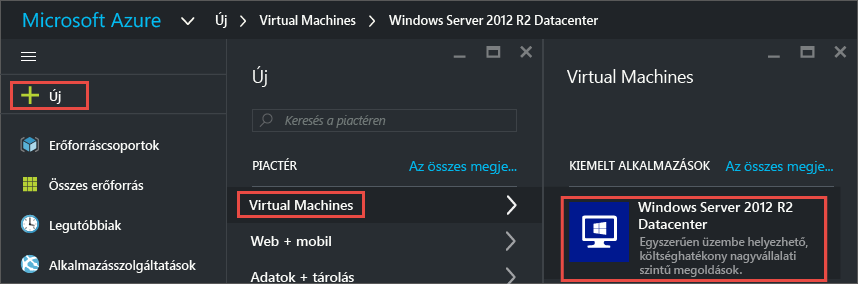

3. Ellenőrizze, hogy a **Windows Server 2012 R2 Datacenter** lapon a **Telepítési modell kiválasztása** alatt az **Erőforrás-kezelő** van-e kiválasztva. Kattintson a **Létrehozás** gombra.

    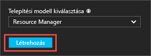

## A Windows rendszerű virtuális gép létrehozása

A rendszerkép kiválasztása után a konfigurációs lehetőségek többségénél használhatja az Azure alapértelmezett beállításait, és gyorsan létrehozhatja a virtuális gépet.

1. Az **Alapvető beállítások** panelen adjon meg egy **nevet** a virtuális gép számára. A névnek 1–15 karakter hosszúnak kell lennie, és nem tartalmazhat különleges karaktereket.

2. Adjon meg egy **felhasználónevet** és egy erős **jelszót**, amelyeket a helyi fióknak a virtuális gépen való létrehozásához használ a szolgáltatás. A helyi fiókkal jelentkezhet be a virtuális gépre és kezelheti azt. 

    A jelszónak 8–123 karakter hosszúnak kell lennie, és tartalmaznia kell legalább hármat a következők közül: egy kisbetű, egy nagybetű, egy szám és egy különleges karakter. 

3. Válasszon ki egy létező [Erőforráscsoportot](../resource-group-overview.md#resource-groups), vagy adja meg egy új csoport nevét. Adja meg egy Azure-adatközpont **helyét**, például az **USA nyugati régiója**. 

4. Ha végzett, kattintson az **OK** gombra a következő szakaszra való továbblépéshez. 

    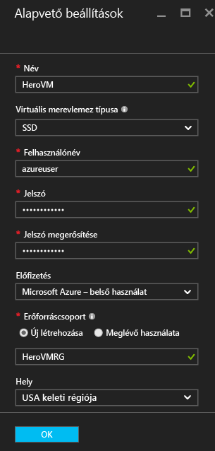

    
5. Válassza ki a virtuális gép [méretét](virtual-machines-windows-sizes.md), majd kattintson a **Kijelölés** elemre. 

    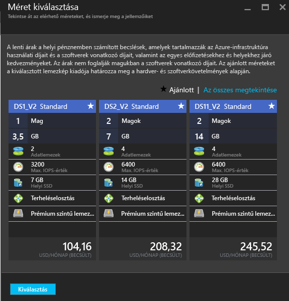

6. A **Beállítások** panelen módosíthatja a tárolási és hálózati beállításokat. Egy első virtuális gép esetében általában elfogadhatja az alapértelmezett beállításokat. Ha a virtuális gépnek olyan méretet választott, amely támogatja a Premium Storage tárolást, kipróbálhatja ezt – ehhez válassza a **Prémium (SSD)** elemet a **Lemez típusa** részen. A módosítások végrehajtását követően kattintson az **OK** gombra.

    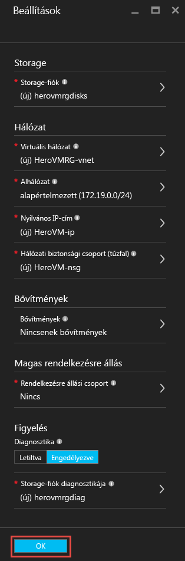

7. A választott beállítások áttekintéséhez kattintson az **Összefoglalás** elemre. Ha végzett, kattintson az **OK** gombra.

    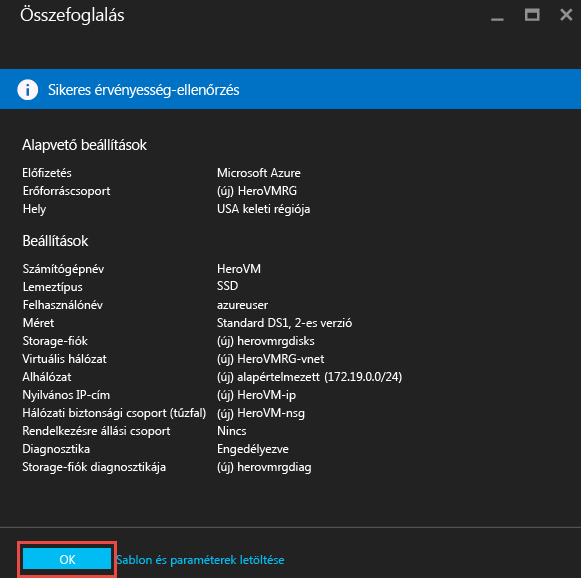

8. Amíg az Azure létrehozza a virtuális gépet, a központ menü **Virtual Machines** részén nyomon követheti a folyamat állapotát. 

## Csatlakozás a virtuális géphez és bejelentkezés

1.  A központi menüben kattintson a **Virtual Machines** elemre.

2.  Válassza ki a virtuális gépet a listából.

3. A virtuális gép paneljén kattintson a **Csatlakozás** elemre. Ez létrehoz és letölt egy RDP-fájlt, amely mintegy parancsikonként használható a géphez való csatlakozáshoz. Az egyszerű elérés érdekében érdemes ezt a fájlt az asztalra menteni. **Nyissa meg** ezt a fájlt a virtuális géphez való csatlakozáshoz.

    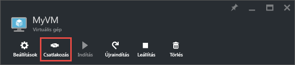

4. Egy figyelmeztetés fog megjelenni arról, hogy az RDP-fájl közzétevője ismeretlen. Ez nem jelent problémát. A Távoli asztal ablakában kattintson a **Csatlakozás** gombra a folytatáshoz.

    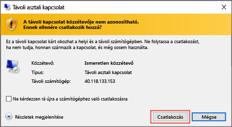

5. A Windows rendszerbiztonsági ablakban írja be a virtuális gép létrehozásakor létrehozott helyi fiók felhasználónevét és jelszavát. A felhasználónevet a következőképpen írja be: *vmname*&#92;*felhasználónév*, majd kattintson az **OK** gombra.

    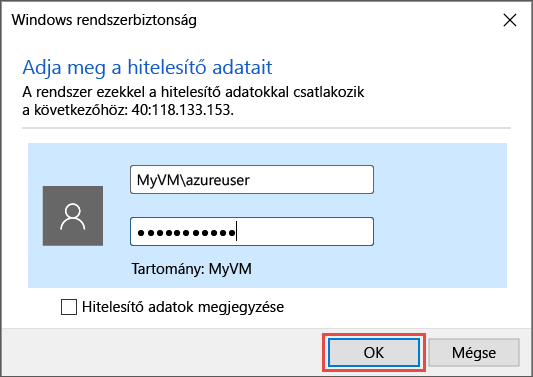
    
6.  Egy figyelmeztetés fog megjelenni arról, hogy a tanúsítványt nem lehetett ellenőrizni. Ez nem jelent problémát. Kattintson az **Igen** gombra a virtuális gép identitásának ellenőrzéséhez és a bejelentkezés befejezéséhez.

    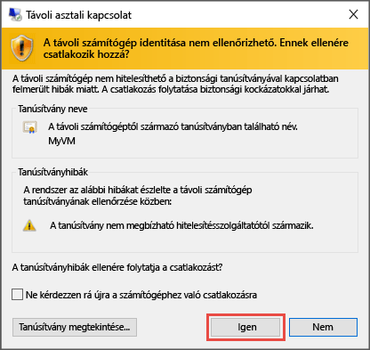

A csatlakozásra tett kísérlet során felmerülő hibákkal kapcsolatban tekintse meg [Windows-alapú Azure virtuális gépek távoli asztali kapcsolatainak hibaelhárítása](virtual-machines-windows-troubleshoot-rdp-connection.md) című témakört.

Mostantól ugyanúgy használhatja a virtuális gépet, mint bármilyen más kiszolgálót.

## A virtuális gép leállítása

Amikor nem használja a virtuális gépet, érdemes leállítani azt, a költségek csökkentése érdekében. Ehhez egyszerűen kattintson a **Leállítás** gombra, majd az **Igen** válaszra.

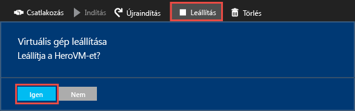
    
Ha újra használni kívánja a virtuális gépet, az **Indítás** gombra kattintva egyszerűen újraindíthatja.

## További lépések

* Azzal is kísérletezhet, hogy [adatlemezt csatol](virtual-machines-windows-attach-disk-portal.md) a virtuális géphez. Az adatlemezek nagyobb tárterületet biztosítanak a virtuális gép számára.

* [Létrehozhat Windows rendszerű virtuális gépet a PowerShell használatával](virtual-machines-windows-ps-create.md), vagy [Linux rendszerű virtuális gépet](virtual-machines-linux-quick-create-cli.md) az Azure parancssori felület használatával.

<!--HONumber=Jun16_HO2-->

