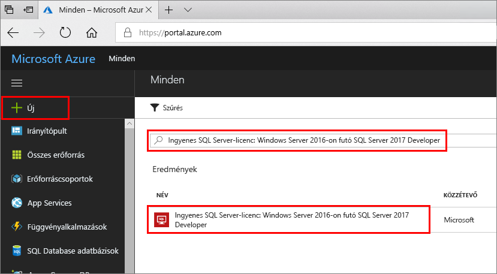
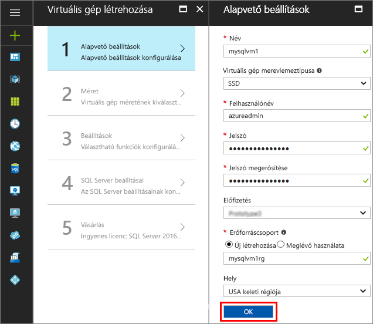
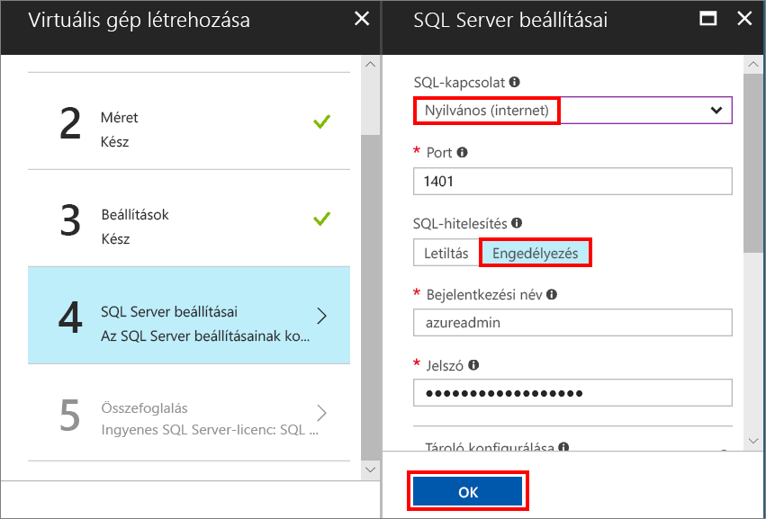
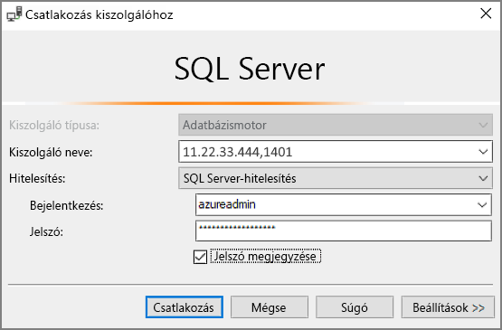

# SQL Server 2017-et futtató, Windows rendszerű virtuális gép létrehozása az Azure Portalon

> [!div class="op_single_selector"]
> * [Windows](quickstart-sql-vm-create-portal.md)
> * [Linux](../../linux/sql/provision-sql-server-linux-virtual-machine.md)

Ez a rövid útmutató részletesen bemutatja egy SQL Servert futtató virtuális gép létrehozását az Azure Portalon.

Ha nem rendelkezik Azure-előfizetéssel, mindössze néhány perc alatt létrehozhat egy [ingyenes fiókot](https://azure.microsoft.com/free/?WT.mc_id=A261C142F) a virtuális gép létrehozásának megkezdése előtt.

##  SQL Server virtuálisgép-rendszerkép kiválasztása

1. Jelentkezzen be az [Azure Portalra](https://portal.azure.com) a saját fiókjával.

1. Az Azure Portalon kattintson az **Új** elemre. A portál megnyitja az **Új** ablakot.

1. A keresőmezőbe írja be az **Windows Server 2016-on futó SQL Server 2017 Developer** kifejezést, majd nyomja le az ENTER billentyűt.

1. Válassza az **Ingyenes SQL Server-licenc: Windows Server 2016-on futó SQL Server 2017 Developer** nevű rendszerképet.

   

   > [!TIP]
   > Ez az oktatóanyag azért a Developer kiadást alkalmazza, mert az az SQL Server teljes körű verziója, amely fejlesztési-tesztelési célokra ingyenesen használható. Csak a virtuális gép futtatásával járó költségeket kell kifizetni. A díjszabással kapcsolatos teljes körű információkért tekintse meg [az SQL Server Azure virtuális gépek díjszabási útmutatóját](virtual-machines-windows-sql-server-pricing-guidance.md).

1. Kattintson a **Create** (Létrehozás) gombra.

##  Az alapvető adatok megadása

Az **Alapvető beállítások** ablakban adja meg a következő információkat:

1. A **Név** mezőben adjon meg egy egyedi nevet a virtuális gép számára. 

1. A **Felhasználónév** mezőben adjon meg egy felhasználónevet a virtuális gép helyi rendszergazdai fiókja számára.

1. Adjon meg egy erős **jelszót**.

1. Adjon meg egy új nevet az **Erőforráscsoport** számára. Ezen a csoporton keresztül felügyelheti a virtuális géppel társított összes erőforrást.

1. Ellenőrizze az egyéb alapértelmezett beállításokat, majd kattintson az **OK** gombra a folytatáshoz.

   

## A virtuális gép méretének kiválasztása

A **Méret** lépésben válassza ki a virtuális gép méretét a **Méret kiválasztása** ablakban. Az ablak kezdetben a választott rendszerkép alapján jeleníti meg az ajánlott gépméreteket. 

1. **Az összes megtekintése** gombra kattintva megtekintheti az összes elérhető gépméretet.

1. Ehhez a rövid útmutatóhoz válassza a **D2S_V3** lehetőséget. A portálon megjelennek a gép folyamatos használatára vonatkozó becsült havi költségek (az SQL Server licencköltségei nélkül). Megjegyzés: a Developer Edition esetében az SQL Servernek nincsenek külön licencelési költségei. Az egyes díjtételekkel kapcsolatos további tájékoztatás a [díjszabási lapon](https://azure.microsoft.com/pricing/details/virtual-machines/windows/) olvasható.

   > [!TIP]
   > A **D2S_V3** gépmérettel költségek takaríthatók meg a tesztelés során. Az éles számítási feladatok esetében ajánlott gépméretekért és -konfigurációkért azonban tekintse meg [az SQL Server teljesítményének Azure Virtual Machines szolgáltatásbeli növelésével kapcsolatos ajánlott eljárásokat](virtual-machines-windows-sql-performance.md).

1. Kattintson a **Kijelölés** elemre a folytatáshoz.

## Választható funkciók konfigurálása

A **Beállítások** ablakban kattintson az **OK** gombra az alapértelmezett beállítások kiválasztásához.

## SQL Server beállításai

Az **SQL Server beállításai** ablakban konfigurálja az alábbi beállításokat.

1. Az **SQL-kapcsolatok** legördülő menüben válassza a **Nyilvános (internet)** lehetőséget. Ez engedélyezi az interneten keresztüli SQL Server-kapcsolatokat.

1. Módosítsa a **Port** beállítást a **1401**-es portra, hogy a nyilvános forgatókönyvben ne egy jól ismert portot alkalmazzon.

1. Az **SQL-hitelesítés** területen kattintson az **Engedélyezés** lehetőségre. Az SQL-bejelentkezés ugyanarra a felhasználónévre és jelszóra van állítva, amelyet a virtuális géphez konfigurált.

1. Szükség szerint módosítsa az egyéb beállításokat, majd kattintson az **OK** gombra az SQL Servert futtató virtuális gép konfigurálásának befejezéséhez.

   

## Az SQL Servert futtató virtuális gép létrehozása

Az **Összefoglalás** ablakban tekintse át az összefoglalást, majd kattintson a **Vásárlás** gombra a virtuális géphez megadott SQL Server, erőforráscsoport és erőforrások létrehozásához.

Az üzemelő példány az Azure Portalról monitorozható. A képernyő felső részén látható **Értesítések** gomb megjeleníti az üzemelő példány állapotának alapvető információit.

> [!TIP]
> A Windows SQL Servert futtató virtuális gép üzembe helyezése percekig is eltarthat.

## Csatlakozás az SQL Serverhez

1. A portálon keresse meg a virtuális gép **Nyilvános IP-címét** a virtuális gép tulajdonságainak **Áttekintés** szakaszában.

1. Nyissa meg az SQL Server Management Studio (SSMS) alkalmazást egy másik, az internethez csatlakozó számítógépen.

   > [!TIP]
   > Ha még nem rendelkezik az SQL Server Management Studio alkalmazással, [innen](https://docs.microsoft.com/sql/ssms/download-sql-server-management-studio-ssms) letöltheti.

1. A **Kapcsolódás a kiszolgálóhoz** vagy a **Kapcsolódás az adatbázismotorhoz** párbeszédpanelen szerkessze a **Kiszolgáló neve** értéket. Adja meg a virtuális gép nyilvános IP-címét. A név után írjon egy vesszőt, és adja meg az egyéni portot (**1401**), amelyet korábban az új virtuális gép konfigurálásakor beállítottunk. Például: `11.22.33.444,1401`.

1. A **Hitelesítés** mezőben válassza az **SQL Server-hitelesítés** lehetőséget.

1. A **Bejelentkezés** szövegmezőbe írjon be egy érvényes SQL-bejelentkezési nevet.

1. A **Jelszó** szövegmezőbe írja be a bejelentkezési jelszót.

1. Kattintson a **Connect** (Csatlakozás) gombra.

    

##  Távoli bejelentkezés a virtuális gépre

A következő lépésekkel csatlakozzon az SQL Server virtuális géphez a távoli asztalról:

[!INCLUDE [Connect to SQL Server VM with remote desktop](../../../../includes/virtual-machines-sql-server-remote-desktop-connect.md)]

Az SQL Server virtuális géphez való csatlakozás után elindíthatja az SQL Server Management Studiót, és a helyi rendszergazdai hitelesítő adataival csatlakozhat Windows-hitelesítés használatával. Ha engedélyezte az SQL Server-hitelesítést, akkor az SQL-hitelesítésen keresztül is csatlakozhat a kiépítés során megadott SQL bejelentkezési azonosítójával és jelszavával.

A géphez való hozzáférés lehetővé teszi, hogy igény szerint közvetlenül módosítsa a gép és az SQL Server beállításait. Például konfigurálhatja a tűzfal beállításait, vagy módosíthatja az SQL Server-konfiguráció beállításait.

## Az erőforrások eltávolítása

Ha nem szükséges, hogy az SQL virtuális gép folyamatosan fusson, a szükségtelen költségeket elkerülendő leállíthatja az épp használaton kívüli gépet. Emellett véglegesen törölheti a virtuális géppel társított erőforrásokat, ha törli a társított erőforráscsoportot a portálon. Ez véglegesen törli magát a virtuális gépet is, ezért ezt a parancsot körültekintően alkalmazza. További információk: [Azure-erőforrások kezelése a portálon keresztül](../../../azure-resource-manager/resource-group-portal.md).

## Következő lépések

Ebben a rövid útmutatóban egy SQL Server 2017-et futtató virtuális gépet hozott létre az Azure Portalon. Az adatok az új SQL Serverre való migrálásával kapcsolatos további információkért lásd a következő cikket.

> [!div class="nextstepaction"]
> [Adatbázisok migrálása SQL virtuális gépekre](virtual-machines-windows-migrate-sql.md)
