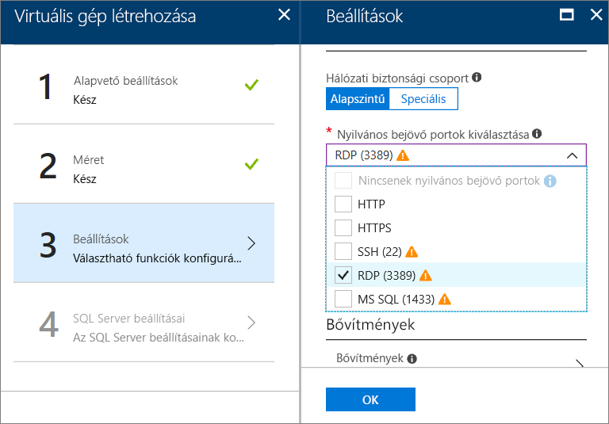

# Az Azure Portalon Windows SQL Server virtuális gép kiépítése

Ez az útmutató részletesen a rendelkezésre álló különböző lehetőségeket az Azure Portalon Windows SQL Server virtuális gép létrehozásakor. Ez a cikk ismerteti a további konfigurációs lehetőségeket, mint a [SQL Server rendszerű virtuális gép rövid](quickstart-sql-vm-create-portal.md), amely további keresztül egy lehetséges kiépítés feladat kerül. 

Ez az útmutató segítségével saját SQL Server virtuális gép létrehozása. Vagy használhatja referenciaként az Azure Portalon elérhető beállítások.

> [!TIP]
> Ha kérdése van az SQL Servert futtató virtuális gépek használatával kapcsolatban, tekintse meg a [gyakori kérdéseket](virtual-machines-windows-sql-server-iaas-faq.md).

Ha nem rendelkezik Azure-előfizetéssel, mindössze néhány perc alatt létrehozhat egy [ingyenes fiókot](https://azure.microsoft.com/free/?WT.mc_id=A261C142F) a virtuális gép létrehozásának megkezdése előtt.

##  Az SQL Server virtuálisgép-katalógus rendszerképek

Az SQL Server virtuális gép létrehozásakor több előre konfigurált lemezképek közül választhat a virtuálisgép-katalógus. A következő lépések bemutatják, hogyan lehet az SQL Server 2017-rendszerképek egyikét választhatja ki.

1. Jelentkezzen be az [Azure Portalra](https://portal.azure.com) a saját fiókjával.

1. Az Azure Portalon kattintson az **Erőforrás létrehozása** gombra. A portál megnyitja az **Új** ablakot.

1. Az **Új** ablakban kattintson a **Számítás**, majd az **Összes megjelenítése** elemre.

   

1. A keresőmezőbe írja be az **SQL Server 2017** kifejezést, majd nyomja le az ENTER billentyűt.

1. Ezután kattintson a **Szűrő** ikonra.

1. A Szűrő ablakban jelölje be a **Windows-alapú** alkategóriát, és válassza a **Microsoft** lehetőséget a közzétevő megadásánál. Ezután kattintson a **Kész** gombra, hogy az eredményeket a Microsoft által közzétett Windows SQL Server-rendszerképekre szűkítése.

   

1. Tekintse át az elérhető SQL Server-rendszerképeket. Minden rendszerkép egy SQL Server-verziót és egy operációs rendszert azonosít.

1. Válassza ki a rendszerkép **ingyenes SQL Server-licenc: SQL Server 2017 Developer Windows Server 2016 rendszeren**.

   > [!TIP]
   > A Developer edition egy teljes körű funkciókkal bíró, ingyenes SQL Server kiadása fejlesztési-tesztelési, mert ez az útmutató szolgál. Csak a virtuális gép futtatásával járó költségeket kell kifizetni. Azonban Ön bármelyik, a forgatókönyv rendszerképet választhatja. Az elérhető rendszerképek, olvassa el a [SQL Server Windows Virtual Machines – áttekintés](virtual-machines-windows-sql-server-iaas-overview.md#payasyougo).

   > [!TIP]
   > Az SQL Server licencelési költségeit is részét képezik a virtuális gép létrehozása és a változó díjszabása másodpercalapú edition és a magok. Azonban az SQL Server Developer edition díjmentes, használható fejlesztési-tesztelési (éles környezetben nem), és az SQL Express pedig ingyenesen használható (kisebb, mint 1 GB memóriával, kevesebb mint 10 GB tárterület) számítási feladatokhoz. Emellett bring-your-saját licenc (használata BYOL) és a fizetés csak a virtuális gép számára. Az ilyen rendszerképek nevei {BYOL} előtagot kapnak. 
   >
   > A lehetőségekkel kapcsolatos további információkért tekintse meg [az SQL Server Azure virtuális gépek díjszabási útmutatóját](virtual-machines-windows-sql-server-pricing-guidance.md).

1. Ellenőrizze, hogy a **Telepítési modell kiválasztása** alatt a **Resource Manager** van-e kiválasztva. Az új virtuális gépek esetén az ajánlott üzemi modell a Resource Manager. 

1. Kattintson a **Create** (Létrehozás) gombra.

    

##  Konfigurációs beállítások
Az SQL Server rendszerű virtuális gépek konfigurálására öt ablak szolgál.

| Lépés | Leírás |
| --- | --- |
| **Alapvető beállítások** |[Az alapvető beállítások konfigurálása](#1-configure-basic-settings) |
| **Méret** |[A virtuális gép méretének kiválasztása](#2-choose-virtual-machine-size) |
| **Beállítások** |[Választható funkciók konfigurálása](#3-configure-optional-features) |
| **Az SQL Server beállításai** |[Az SQL Server beállításainak konfigurálása](#4-configure-sql-server-settings) |
| **Összefoglalás** |[Az összefoglalás áttekintése](#5-review-the-summary) |

## 1. Az alapvető beállítások konfigurálása

Az **Alapvető beállítások** ablakban adja meg a következő információkat:

* Adjon meg egy egyedi **nevet** a virtuális gép számára.

* A virtuális gép lemeztípusaként válassza az **SSD** beállítást az optimális teljesítmény érdekében.

* Adjon meg egy **felhasználónevet** a virtuális gép helyi rendszergazdai fiókja számára. Ezt a fiókot a szolgáltatás hozzáadja az SQL Server **sysadmin** rögzített kiszolgálói szerepköréhez.

* Adjon meg egy erős **jelszót**.

* Ha több előfizetéssel is rendelkezik, ellenőrizze, hogy az új virtuális géphez a helyes előfizetést adta-e meg.

* Az **Erőforráscsoport** szövegmezőjében adja meg egy új erőforráscsoport nevét. Meglévő erőforráscsoport használatához kattintson a **Meglévő használata** lehetőségre. Az erőforráscsoportok az Azure-ban egymáshoz kapcsolódó erőforrásokból (virtuális gépekből, tárfiókokból, virtuális hálózatokból stb.) álló gyűjtemények.

  > [!NOTE]
  > Az Azure szolgáltatásban futó SQL Server üzemelő példányok tesztelésekor vagy a velük való megismerkedéskor érdemes egy új erőforráscsoportot használni. A tesztelés befejezése után törölje az erőforráscsoportot a virtuális gép és az erőforráscsoporthoz társított összes erőforrás automatikus törléséhez. További információ az erőforráscsoportokkal kapcsolatban: [Azure Resource Manager Overview](../../../azure-resource-manager/resource-group-overview.md) (Az Azure Resource Manager áttekintése).

* Válassza ki a **hely** az üzemelő példányt futtató, Azure-régióban.

* Kattintson az **OK** gombra a beállítások mentéséhez.

    

## 2. A virtuális gép méretének kiválasztása

A **Méret** lépésben válassza ki a virtuális gép méretét a **Méret kiválasztása** ablakban. Az ablak kezdetben a választott rendszerkép alapján jeleníti meg az ajánlott gépméreteket.

> [!IMPORTANT]
> A **Méret kiválasztása** ablakban megjelenő, becsült havi költségek nem tartalmazzák az SQL Server licencelési költségeit. Ez a becslés a önálló virtuális gép költségét. SQL Server Express és Developer kiadásai esetében ez a becslés a teljes becsült költség. Más kiadások esetében tekintse meg a [Windows rendszerű virtuális gépek árképzését ismertető oldalt](https://azure.microsoft.com/pricing/details/virtual-machines/windows/), és válassza ki az SQL Server megfelelő kiadását. Lásd még [az SQL Server Azure virtuális gépek díjszabási útmutatóját](virtual-machines-windows-sql-server-pricing-guidance.md).

Az éles számítási feladatok esetében ajánlott gépméretekért és -konfigurációkért tekintse meg [az SQL Server teljesítményének Azure Virtual Machines szolgáltatásbeli növelésével kapcsolatos ajánlott eljárásokat](virtual-machines-windows-sql-performance.md).

> [!NOTE]
> További információ a virtuális gépek méretével kapcsolatban: [Virtuális gépek méretei](../sizes.md?toc=%2fazure%2fvirtual-machines%2fwindows%2ftoc.json).

Válassza ki a virtuális gép méretét, majd kattintson a **Kijelölés** elemre.

## 3. Választható funkciók konfigurálása

A **Beállítások** ablakban konfigurálhatja az Azure-tárolót, a hálózatot és a virtuális gép monitorozását.

* A **Tároló** területen válassza az **Igen** lehetőséget a **Felügyelt lemezek használata** beállítás alatt.

   > [!NOTE]
   > A Microsoft a Managed Disks használatát javasolja az SQL Server esetében. A Managed Disks szolgáltatás a háttérben kezeli a tárterületet. Emellett ha ugyanabban a rendelkezésre állási csoportban több, a Managed Diskset használó virtuális gép található, az Azure elosztja a tárolási erőforrásokat, hogy megfelelő redundanciát biztosítson. További információkért lásd: [az Azure Managed Disks – áttekintés] [... / felügyelt lemezek – overview.md). A felügyelt lemezek a rendelkezésre állási csoportokban való használatával kapcsolatos részletekért lásd: [Felügyelt lemezek használata rendelkezésre állási csoporthoz tartozó virtuális gépekkel](../manage-availability.md).

* A **hálózati**, minden bejövő válassza ki, hogy a portok a **nyilvános bejövő portok kiválasztása** listája. Ha szeretné a távoli asztal a virtuális géppel, jelölje be például a **RDP (3389-es)** port.

   

   > [!NOTE]
   > Az **MS SQL (1433)** portot kiválasztva távolról érheti el az SQL Servert. Azonban ez nem szükséges itt, mert a **SQL Server-beállítások** lépés itt is ezt a beállítást. Ha ebben a lépésben kiválasztja a 1433-as portot, az az **SQL Server beállításai** lépésben kiválasztott lehetőségektől függetlenül mindenképp megnyílik.

   Hálózati beállítások egyéb módosításokat, vagy használja az alapértelmezett értékeket.

* Alapértelmezés szerint az Azure ugyanazzal a tárfiókkal engedélyezi a **Figyelést**, amely a virtuális géphez ki lett jelölve. Ezeket a beállításokat itt módosíthatja.

* A **rendelkezésre állási csoport**, hagyhatja, hogy a rendszer az alapértelmezett **nincs** ebben a bemutatóban. Ha SQL AlwaysOn rendelkezésre állási csoportok beállítását tervezi, konfigurálja a rendelkezésre állást, hogy később ne kelljen újra létrehoznia a virtuális gépet.  További információk: [Manage the Availability of Virtual Machines](../manage-availability.md?toc=%2fazure%2fvirtual-machines%2fwindows%2ftoc.json) (Virtuális gépek rendelkezésre állásának kezelése).

Ha végzett a beállítások konfigurálásával, kattintson az **OK** gombra.

## 4. Az SQL Server beállításainak konfigurálása
Az **SQL Server beállításai** ablakban konfigurálhatja az SQL Server adott beállításait és optimalizálási lehetőségeit. Az SQL Server konfigurálható beállításai közé az alábbiak tartoznak.

| Beállítás |
| --- |
| [Kapcsolatok](#connectivity) |
| [Hitelesítés](#authentication) |
| [Tároló konfigurálása](#storage-configuration) |
| [Automatikus javítás](#automated-patching) |
| [Automatikus biztonsági mentés](#automated-backup) |
| [Azure Key Vault-integráció](#azure-key-vault-integration) |
| [SQL Server Machine Learning-szolgáltatások](#sql-server-machine-learning-services) |

### Kapcsolatok

Az **SQL kapcsolatok** alatt adja meg, milyen típusú hozzáférést szeretne az ezen a virtuális gépen futó SQL Server-példányhoz. Ez a bemutató céljából, jelölje be a **nyilvános (internet)** kapcsolatok engedélyezéséhez az SQL Server a gépek és szolgáltatások az interneten. Ha ezt a lehetőséget választja, az Azure automatikusan úgy konfigurálja a tűzfalat és a hálózati biztonsági csoportot, hogy az 1433-as porton engedélyezve legyen a forgalom.

> [!TIP]
> Alapértelmezés szerint az SQL Server a jól ismert **1433-as** portot figyeli. A nagyobb biztonság érdekében az előző párbeszédpanelen módosítsa a portot egy nem alapértelmezett, például az 1401-es portra. Ha módosítja a port, csatlakoznia kell az összes ügyféleszközzel, például az SSMS porthoz.

Ahhoz, hogy az SQL Serverhez az interneten keresztül csatlakozni lehessen, engedélyeznie kell az SQL Server-hitelesítést is, aminek ismertetését a következő szakaszban olvashatja.

Ha nem szeretné engedélyezni az adatbázis-alrendszerhez az interneten keresztül való csatlakozást, válassza az alábbi lehetőségek valamelyikét:

* A **Helyi (csak virtuális gépen belül)** beállítással az SQL Serverhez csak a virtuális gépen belülről lehet csatlakozni.
* A **Magánjellegű (virtuális hálózaton belül)** beállítással az SQL Serverhez az azonos virtuális hálózaton található gépek és szolgáltatások csatlakozhatnak.

Általánosságban elmondható, hogy a forgatókönyv által lehetővé tett legszigorúbb kapcsolódási korlátozás kiválasztásával növelhető a biztonság. Hálózati biztonsági csoportszabályok és SQL-/Windows-hitelesítés használatával azonban mindegyik lehetőség biztosítható. A hálózati biztonsági csoportot a virtuális gép létrehozása után szerkesztheti. További információkért lásd [az SQL Server Azure-beli virtuális gépeken történő futtatásának biztonsági szempontjait](virtual-machines-windows-sql-security.md).

### Hitelesítés

Ha SQL Server-hitelesítésre van szüksége, kattintson az **Engedélyezés** lehetőségre az **SQL-hitelesítés** alatt.

> [!NOTE]
> Ha azt tervezi, SQL Server elérését az interneten (a nyilvános kapcsolódási beállítást választja), engedélyeznie kell az SQL-hitelesítés itt. Az SQL Serverhez való nyilvános hozzáféréshez SQL-hitelesítésre van szükség.

Ha engedélyezi az SQL Server-hitelesítést, adjon meg egy **bejelentkezési nevet** és egy **jelszót**. Ez a felhasználónevet SQL Server-hitelesítési bejelentkezési névként, és egyben a **sysadmin** rögzített kiszolgálói szerepkör egy tagjaként is konfigurálja a szolgáltatás. További információkat a hitelesítési módokról [a hitelesítési mód kiválasztását leíró](https://docs.microsoft.com/sql/relational-databases/security/choose-an-authentication-mode) cikkben talál.

Ha nem engedélyezi az SQL Server-hitelesítést, akkor a helyi virtuális gépen lévő rendszergazdai fiók használatával is csatlakozhat az SQL Server-példányhoz.

### Tároló konfigurálása

Kattintson a **Tároló konfigurációja** elemre a tárolási követelmények megadásához.

> [!NOTE]
> Ha manuálisan konfigurálta a virtuális gépet a Standard szintű tárolás használatára, ez a beállítás nem érhető el. Az automatikus tárolóoptimalizálás csak a prémium szintű Storage esetében érhető el.

> [!TIP]
> Az egyes csúszkák lépéseinek száma és felső határértéke a kiválasztott virtuális gép méretétől függ. A nagyobb méretű és teljesítményű virtuális gépeken nagyobb mértékű vertikális felskálázás végezhető.

Megadhat különböző követelményeket, például a kimeneti/bemeneti műveletek másodpercenkénti számát (IOPS), a MB/másodpercben megadott átviteli sebességet, illetve a tárterület teljes méretét. Ezeket az értékeket a csúszkákkal állíthatja be. Ezek a tárolóbeállítások a számítási feladatok mennyiségéhez igazodva módosíthatók. A portál ezen követelmények alapján automatikusan kiszámítja a csatlakoztatandó és konfigurálandó lemezek számát.

A **Storage optimized for** (Tároló optimalizálási módja) területen válasszon az alábbi lehetőségek közül:

* A **General** (Általános) az alapértelmezett beállítás, amely a legtöbb számítási feladatot támogatja.
* A **Transactional** (Tranzakciós) feldolgozás a tárolót az adatbázisok hagyományos OLTP számítási feladataira optimalizálja.
* A **Data warehousing** (Adatraktározás) beállítás elemzési és jelentéskészítési számítási feladatokra optimalizálja a tárolót.

### Automatikus javítás

Az **Automatikus javítás** alapértelmezés szerint engedélyezve van. Az automatizált javítás lehetővé teszi, hogy az Azure automatikus javításokat alkalmazzon az SQL Serveren és az operációs rendszeren. A karbantartási időszak beállításához adja meg a hét egy napját, egy időpontot és egy időtartamot. Az Azure ebben a karbantartási időszakban végzi el a javításokat. A karbantartási időszak ütemezése a virtuális gép területi beállítása szerinti időt használja. Ha nem szeretné, hogy az Azure automatikusan alkalmazza a javításokat az SQL Serveren és az operációs rendszeren, kattintson a **Letiltás** elemre.  

További információk: [Automated Patching for SQL Server in Azure Virtual Machines](virtual-machines-windows-sql-automated-patching.md) (Az SQL Server automatikus javítása Azure virtuális gépeken).

### Automatikus biztonsági mentés

Az **Automatikus biztonsági mentés** területen engedélyezheti az összes adatbázis automatikus mentését. Az automatikus biztonsági mentés alapértelmezés szerint le van tiltva.

Az SQL automatikus biztonsági mentésének engedélyezésekor konfigurálhatja a következő beállításokat:

* Biztonsági mentések megőrzési ideje (napokban)
* A biztonsági mentésekhez használt tárfiók
* Titkosítási beállítás és a biztonsági mentések jelszavas védelme
* Rendszeradatbázisok biztonsági mentése
* Biztonsági mentések ütemezésének konfigurálása

A biztonsági mentés titkosításához kattintson az **Engedélyezés** elemre. Ezután adja meg a **Jelszót**. Az Azure a biztonsági mentések titkosításához létrehoz egy tanúsítványt, amelyet a megadott jelszóval véd.

 További információk: [Automated Backup for SQL Server in Azure Virtual Machines](virtual-machines-windows-sql-automated-backup.md) (Az SQL Server automatikus biztonsági mentése Azure virtuális gépeken).

### Azure Key Vault-integráció

Ha biztonsági titkokat az Azure-ban szeretne titkosítva tárolni, kattintson az **Azure key vault integration** (Azure Key Vault-integráció) elemre, majd az **Enable** (Engedélyezés) elemre.

A következő táblázat tartalmazza az Azure Key Vault-integráció konfigurálásához szükséges paramétereket.

| PARAMÉTER | LEÍRÁS | PÉLDA |
| --- | --- | --- |
| **Key Vault URL** |A Key Vault helye. |https://contosokeyvault.vault.azure.net/ |
| **Egyszerű név** |Az Azure Active Directory szolgáltatás egyszerű neve. Ezt a nevet ügyfél-azonosítónak is hívják. |fde2b411-33d5-4e11-af04eb07b669ccf2 |
| **Egyszerű titok** |Az Azure Active Directory szolgáltatás egyszerű titka. Ezt a titkot ügyféltitoknak is hívják. |9VTJSQwzlFepD8XODnzy8n2V01Jd8dAjwm/azF1XDKM= |
| **Hitelesítő adat neve** |**Hitelesítő adat neve**: AKV-integráció az SQL Serverrel, így a virtuális Géphez a key vault eléréséhez hitelesítő adatot hoz létre. Válasszon egy nevet ennek a hitelesítő adatnak. |mycred1 |

További információkért lásd: [Configure Azure Key Vault Integration for SQL Server on Azure VMs](virtual-machines-windows-ps-sql-keyvault.md) Az Azure Key Vault-integráció konfigurálása az SQL Serverhez Azure virtuális gépeken.

### SQL Server Machine Learning-szolgáltatások

Dönthet úgy, hogy engedélyezi az [SQL Server Machine Learning-szolgáltatásokat](https://msdn.microsoft.com/library/mt604845.aspx). Ez a beállítás lehetővé teszi, hogy az SQL Server 2017 továbbfejlesztett elemzéseinek használatára. Kattintson az **Engedélyezés** elemre az **SQL Server beállításai** ablakban.

Amikor végzett az SQL Server beállításainak konfigurálásával, kattintson az **OK** gombra.

## 5. Összegzés áttekintése

Az **Összefoglalás** ablakban tekintse át az összefoglalást, majd kattintson a **Vásárlás** gombra a virtuális géphez megadott SQL Server, erőforráscsoport és erőforrások létrehozásához.

Az üzemelő példány az Azure Portalról monitorozható. A képernyő felső részén látható **Értesítések** gomb megjeleníti az üzemelő példány állapotának alapvető információit.

> [!NOTE]
> Az üzembe helyezési idők szemléltetéséhez üzembe helyeztem egy SQL virtuális gépet az USA keleti régiójában az alapértelmezett beállításokkal. Ez az üzembe helyezési teszt hozzávetőlegesen 12 percet vett igénybe. A régiótól és a kiválasztott beállításoktól függően Ön ennél rövidebb vagy hosszabb üzembe helyezési időt is tapasztalhat.

##  A virtuális gép megnyitása a távoli asztallal

A következő lépésekkel csatlakozzon az SQL Server virtuális géphez a távoli asztalról:

[!INCLUDE [Connect to SQL Server VM with remote desktop](../../../../includes/virtual-machines-sql-server-remote-desktop-connect.md)]

Az SQL Server virtuális géphez való csatlakozás után elindíthatja az SQL Server Management Studiót, és a helyi rendszergazdai hitelesítő adataival csatlakozhat Windows-hitelesítés használatával. Ha engedélyezte az SQL Server-hitelesítést, akkor az SQL-hitelesítésen keresztül is csatlakozhat a kiépítés során megadott SQL bejelentkezési azonosítójával és jelszavával.

A géphez való hozzáférés lehetővé teszi, hogy igény szerint közvetlenül módosítsa a gép és az SQL Server beállításait. Például konfigurálhatja a tűzfal beállításait, vagy módosíthatja az SQL Server-konfiguráció beállításait.

##  Távoli csatlakozás az SQL Serverhez

Ez az útmutató kiválasztott **nyilvános** hozzáférés a virtuális gép és **SQL Server-hitelesítés**. Ezek a beállítások automatikusan úgy konfigurálták a virtuális gépet, hogy az az internetről bármely ügyfél számára engedélyezi az SQL Serverhez való csatlakozást (feltéve, hogy helyes SQL-bejelentkezési névvel rendelkeznek).

> [!NOTE]
> Ha az üzembe helyezés során nem a nyilvános hozzáférést választotta, akkor az üzembe helyezés után a portálon keresztül módosíthatja az SQL csatlakozási beállításait. További információ: [Az SQL csatlakozási beállításainak módosítása](virtual-machines-windows-sql-connect.md#change).

A következő szakaszok bemutatják, hogyan csatlakozhat az SQL Server Virtuálisgép-példányhoz az interneten keresztül.

[!INCLUDE [Connect to SQL Server in a VM Resource Manager](../../../../includes/virtual-machines-sql-server-connection-steps-resource-manager.md)]

## További lépések

További információ az SQL Server használatáról az Azure-ban: [SQL Server on Azure Virtual Machines](virtual-machines-windows-sql-server-iaas-overview.md) (SQL Server az Azure virtuális gépeken) és [Frequently Asked Questions](virtual-machines-windows-sql-server-iaas-faq.md) (Gyakran ismételt kérdések).