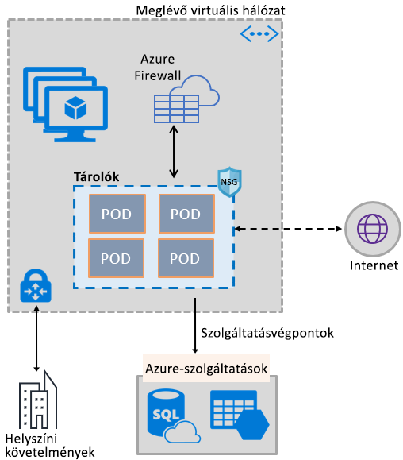
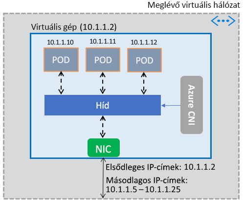

# Azure Virtual Network-képességek használatának engedélyezése a tárolók számára

Az Azure hálózati képességeinek széles választékát a tárolókban is használhatja, ha ugyanazt a szoftveralapú hálózatkezelési vermet alkalmazza, amely a virtuális gépeket is működteti. Az Azure Virtual Network tárolóalapú hálózati adapterének (CNI) beépülő modulja egy Azure-beli virtuális gépen települ. A beépülő modul egy virtuális hálózatról származó IP-címeket rendel a virtuális gépen megjelenő tárolókhoz, majd a virtuális hálózathoz csatolja, és közvetlenül más tárolókhoz és virtuális hálózati erőforrásokhoz csatlakoztatja őket. A beépülő modul nem függ a felettes hálózatoktól vagy útvonalaktól a csatlakozás tekintetében, és ugyanolyan teljesítményt nyújt, mint a virtuális gépek. Magas szinten a beépülő modul a következő képességeket nyújtja:

- Virtuális hálózati IP-cím van rendelve minden podhoz, amelyek egy vagy több tárolóból állhatnak.
- A podok virtuális társhálózatokhoz és helyszíni erőforrásokhoz csatlakozhatnak ExpressRoute-on vagy helyek közötti VPN-kapcsolaton keresztül. A podok társított és helyszíni hálózatokról is elérhetők.
- A podok olyan szolgáltatásokat érhetnek el (például az Azure Storage és az Azure SQL Database szolgáltatásokat), amelyeket virtuális hálózat szolgáltatásvégpontjai védenek.
- A hálózati biztonsági csoportok és útvonalak közvetlenül alkalmazhatók a podokra.
- A podok közvetlenül egy belső vagy nyilvános, Azure-beli terheléselosztó mögé helyezhetők, akárcsak a virtuális gépek.
- A podokhoz nyilvános IP-cím is rendelhető, így közvetlenül elérhetőek lesznek az internetről. A podok maguk is elérhetik az internetet.
- Zökkenőmentesen működik a Kubernetes-erőforrásokkal, például a szolgáltatásokkal, a bejövőforgalom-vezérlőkkel és a Kube DNS-sel. A Kubernetes-szolgáltatások belsőleg vagy külsőleg is elérhetővé tehetők az Azure Load Balanceren keresztül.

Az alábbi képen láthatja, hogyan biztosít a beépülő modul Azure Virtual Network-képességeket a podoknak:

A beépülő modul a Linux és Windows platformok használatát egyaránt támogatja.

## Podok csatlakoztatása virtuális hálózathoz

A podok egy virtuális hálózat részét képező virtuális gépeken jelennek meg. A podokhoz másodlagos címekként IP-címek egy készlete van konfigurálva a virtuális gép hálózati adapterén. Az Azure CNI beállítja a podok alapszintű hálózati kapcsolatát, és felügyeli az IP-címek használatát a készletben. Amikor egy pod megjelenik a virtuális gépen, az Azure CNI hozzárendel a készletből egy elérhető IP-címet, és a podot egy szoftveres hídhoz csatlakoztatja a virtuális gépen. Amikor a pod befejeződik, az IP-cím visszakerül a készletbe. A következő kép bemutatja, hogyan csatlakoznak a podok a virtuális hálózatokhoz:

## Internetelérés

Ahhoz, hogy a podok elérhessék az internetet, a beépülő modul *iptables* szabályokat konfigurál, hogy lefordítsa a hálózati címeket (NAT) a podoktól az internet felé irányuló forgalomban. A rendszer a csomag forrás IP-címét a virtuális gép hálózati adapterén lévő elsődleges IP-címre fordítja le. A Windows rendszerű virtuális gépek automatikusan elvégzik a virtuális gép alhálózatán kívüli IP-címekre tartó forgalom forráshálózati címfordítását (SNAT). A rendszer általában a virtuális hálózat IP-címtartományán kívüli IP-címekre tartó összes forgalmat lefordítja.

## Korlátok

A beépülő modul virtuális gépenként legfeljebb 250 podot, és virtuális hálózatonként legfeljebb 16 000 podot támogat. Ezek a korlátok az [Azure Kubernetes Service](../azure-subscription-service-limits.md?toc=%2fazure%2fvirtual-network%2ftoc.json#kubernetes-service-limits) esetében eltérőek.

## A beépülő modul használata

A beépülő modul a következő módokon használható a podok vagy Docker-tárolók alapszintű virtuális hálózati csatolásához:

- **Azure Kubernetes Service**: A beépülő modul az Azure Kubernetes Service-be (AKS) van integrálva, és a *Speciális hálózatkezelés* lehetőség kiválasztásával használható. A speciális hálózatkezeléssel Kubernetes-fürtöt helyezhet üzembe egy meglévő vagy új virtuális hálózaton. A speciális hálózatkezeléssel és annak beállítási lépéseivel kapcsolatos további információért lásd: [Hálózati konfiguráció az AKS-ben](../aks/networking-overview.md?toc=%2fazure%2fvirtual-network%2ftoc.json).
- **ACS-motor**: Az ACS-motor egy eszköz, amely létrehoz egy Azure Resource Manager-sablont egy Kubernetes-fürt az Azure-ban való üzembe helyezéséhez. Részletes információ: [ACS-motorral üzembe helyezett Kubernetes-fürt beépülő moduljának üzembe helyezése](deploy-container-networking.md#deploy-plug-in-for-acs-engine-kubernetes-cluster).
- **Saját Kubernetes-fürt létrehozása az Azure-ban**: A beépülő modullal beállítható a podok alapvető hálózatkezelése az Ön által üzembe helyezett Kubernetes-fürtökön, anélkül, hogy az AKS-re vagy például az ACS-motorra kellene támaszkodnia. Ebben az esetben a beépülő modul egy fürt összes virtuális gépén telepítve és engedélyezve lesz. Részletes információ: [A beépülő modul üzembe helyezése saját kezűleg üzembe helyezett Kubernetes-fürthöz](deploy-container-networking.md#deploy-plug-in-for-a-kubernetes-cluster).
- **Virtuális hálózat csatlakoztatása Docker-tárolókhoz az Azure-ban**: A beépülő modul olyan esetekben is használható, amikor nem Kubernetes-fürtöt, hanem inkább Docker-tárolókat szeretne létrehozni a virtuális gépeken virtuális hálózat csatlakoztatásával. Részletes információ: [Docker beépülő moduljának üzembe helyezése](deploy-container-networking.md#deploy-plug-in-for-docker-containers).

## További lépések

[A beépülő modul üzembe helyezése](deploy-container-networking.md) Kubernetes-fürtökhöz vagy Docker-tárolókhoz