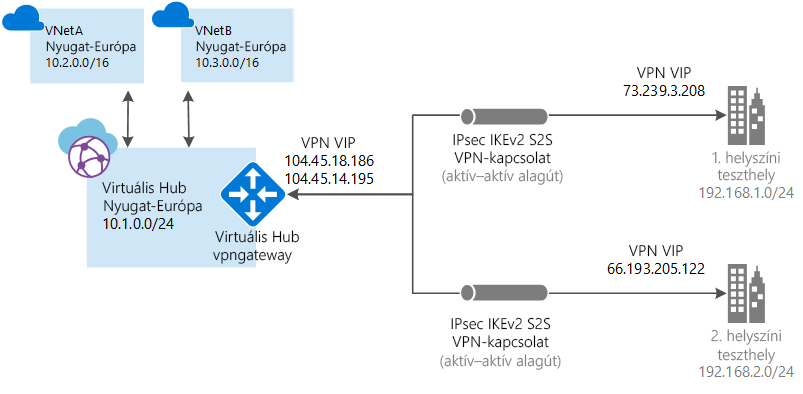

# Mi az Azure Virtual WAN?

Az Azure Virtual WAN egy olyan hálózati szolgáltatás, amely optimalizált és automatizált ágak közötti kapcsolódást biztosít az Azure-on keresztül. A Virtual WAN segítségével ágeszközöket csatlakoztathat és konfigurálhat az Azure-ral való kommunikációra. Ez végrehajtható manuálisan vagy a választott partner eszközeivel valamelyik Virtual WAN-partneren keresztül. A részletekért tekintse meg a [választott partnerekről](https://go.microsoft.com/fwlink/p/?linkid=2019615) szóló cikket. A választott partner eszközeivel könnyen használható a rendszer, és egyszerűvé válik a csatlakozás és a konfiguráció kezelése. Az Azure WAN beépített irányítópultjával azonnali hibaelhárítási segítséget kaphat, amelynek köszönhetően időt takaríthat meg, valamint könnyen áttekintheti a nagy kiterjedésű kapcsolatokat.

A cikk gyors betekintést biztosít az Azure-beli és nem Azure-beli számítási feladatok hálózati kapcsolataiba. A Virtual WAN a következő előnyöket biztosítja:

* **Integrált csatlakozási megoldások a küllős topológiákban:** Automatizált helyek közötti konfiguráció és kapcsolódás a helyszíni helyek és egy Azure-elosztó között.
* **Automatikus küllőbeállítás és -konfiguráció:** A virtuális hálózatok és a számítási feladatok zökkenőmentes csatlakoztatása az Azure-elosztóhoz.
* **Intuitív hibaelhárítás:** Az Azure-beli, végpontok közötti folyamat megtekinthető, és ezeknek az információknak az alapján megtehetők a szükséges intézkedések.

## Helyek közötti kapcsolatok

Ha helyek közötti kapcsolatot szeretne létrehozni a Virtual WAN használatával, ezt megteheti egy [Virtual WAN-partneren](https://go.microsoft.com/fwlink/p/?linkid=2019615) keresztül vagy manuálisan is.

### Együttműködés a Virtual WAN-partnerekkel

Ha Virtual WAN-partnerekkel működik együtt, a folyamat a következőképpen néz ki:

1. Az ágeszköz (VPN/SDWAN) vezérlője hitelesítve van, hogy a helyközpontú adatokat az Azure-ba egy [Azure-szolgáltatásnéven](../azure-resource-manager/resource-group-create-service-principal-portal.md) keresztül exportálja.
2. Az ágeszköz (VPN/SDWAN) vezérlője kéri le az Azure-kapcsolat konfigurációját, és frissíti a helyi eszközt. Ez automatizálja a konfiguráció letöltését, szerkesztését és frissítését a helyszíni VPN-eszközön.
3. Miután az eszköz a megfelelő Azure-konfigurációval rendelkezik, a helyek közötti kapcsolat (két aktív alagút) felépül az Azure WAN irányába. Az Azure az IKEv1 és az IKEv2 támogatására is képes. A BGP használata nem kötelező.

Ha nem szeretne választott partnert használni, manuálisan is konfigurálhatja a kapcsolatot, ehhez lásd [a helyek közötti kapcsolatok a Virtual WAN használatával való létrehozását](virtual-wan-site-to-site-portal.md) ismertető cikket.

## Pont–hely kapcsolatok (előzetes verzió)

A kapcsolat manuális létrehozásával kapcsolatban lásd [a pont–hely kapcsolatok a Virtual WAN használatával való létrehozását](https://go.microsoft.com/fwlink/p/?linkid=2020051&clcid) ismertető cikket.

## ExpressRoute-kapcsolatok (előzetes verzió)

A kapcsolat manuális létrehozásával kapcsolatban lásd [az ExpressRoute-kapcsolatok a Virtual WAN használatával való létrehozását](https://go.microsoft.com/fwlink/p/?linkid=2020148&clcid) ismertető cikket.

## Virtual WAN-erőforrások

Végpontok közötti virtuális WAN konfigurálásához a következő erőforrásokat kell létrehozni:

* **virtualWAN:** A virtualWAN erőforrás az Azure-hálózat egy virtuális átfedését jelképezi, amely különféle erőforrások gyűjteménye. Hivatkozást tartalmaz az összes virtuális elosztóra, amelyet bele szeretne foglalni a virtuális WAN-hálózatba. A Virtual WAN-erőforrások elkülönülnek egymástól, és nem tartalmazhatnak közös elosztót. A Virtual WAN virtuális elosztói nem kommunikálnak egymással. Az „ág és ág közötti adatforgalom engedélyezése” tulajdonság engedélyezi a VPN-helyek közötti, illetve a VPN és az ExpressRoute-kompatibilis helyek közötti adatforgalmat. Ne feledje, hogy az Azure Virtual WAN-ban található ExpressRoute jelenleg előzetes verzióban érhető el.

* **Hely:** A vpnsite néven is ismert helyerőforrás a helyszíni VPN-eszközt és annak beállításait jelöli. A Virtual WAN-partnerekkel együttműködve olyan beépített megoldásokhoz fér hozzá, amelyekkel automatikusan exportálhatók ezek az adatok az Azure-ba.

* **Elosztó:** A virtuális elosztó egy, a Microsoft által felügyelt virtuális hálózat. Az elosztó különféle szolgáltatásvégpontokat tartalmaz a helyszíni hálózatból (vpnsite) induló kapcsolatok biztosításához. Az elosztó a hálózat központja egy adott régióban. Azure-régiónként csak egy elosztó létezhet. Amikor az Azure Portalon létrehoz egy elosztót, ezzel létrehoz egy hozzá tartozó virtuális hálózatot és egy VPN Gateway-átjárót is.

  Az elosztó átjárója nem ugyanaz a virtuális hálózati átjáró, amelyet az ExpressRoute és a VPN Gateway esetében használ. Például a Virtual WAN használata esetén a helyszíni helyről nem közvetlenül a virtuális hálózatára hoz létre helyek közötti kapcsolatot. Ehelyett az elosztóra hozza létre a helyek közötti kapcsolatot. A forgalom minden esetben az elosztó átjáróján halad keresztül. Ez azt jelenti, hogy a virtuális hálózatoknak nincs szükségük saját virtuális hálózati átjáróra. A Virtual WAN segítségével a virtuális hálózatok könnyen méretezhetők a virtuális elosztón és annak átjáróján keresztül. 

* **Elosztó virtuális hálózati kapcsolata:** Az elosztó virtuális hálózati kapcsolata erőforrás az elosztó a virtuális hálózathoz való zökkenőmentes kapcsolódását biztosítja. Jelenleg csak olyan virtuális hálózatokhoz kapcsolódhat, amelyekkel egy elosztórégióban van.

* **Elosztó útválasztási táblázata:** Létrehozhat egy virtuális elosztási útvonalat, és alkalmazhatja az útvonalat a virtuális elosztó útválasztási táblázatára. A virtuális központ útválasztási táblázatán több útvonalat is alkalmazhat.

## GYIK

[!INCLUDE [Virtual WAN FAQ](../../includes/virtual-wan-faq-include.md)]

## További lépések

* A [Virtual WAN-partnerek és helyek](https://aka.ms/virtualwan) megtekintése