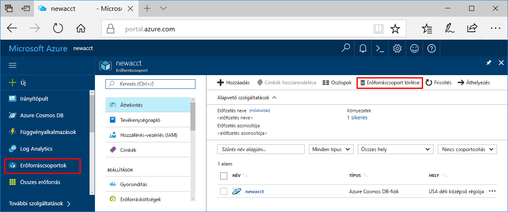

>[!IMPORTANT]
>A létrehozott erőforrások előfeltételként is használhatók az Azure Machine Learning szolgáltatás más oktatóanyagaiban vagy útmutatóiban. 

Ha nem tervezi használni az itt létrehozott erőforrásokat, törölje őket, nehogy többletköltségekkel kelljen számolnia.

1. Az Azure Portalon válassza az **Erőforráscsoportok** lehetőséget a bal szélen.
 
   

1. Válassza ki a listában az Ön által létrehozott erőforráscsoportot.

1. Válassza az **Erőforráscsoport törlése** elemet.

1. Írja be az erőforráscsoport nevét, majd válassza a **Törlés** elemet.
