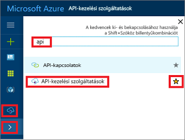

## Keresse meg a APIM példányát

Keresse meg a APIM példányát, kövesse az alábbi lépéseket:

1. Jelentkezzen be az [Azure Portalra](https://portal.azure.com). 
2. Válassza ezt: .
3. A keresőmezőbe írja be a "api".
4. Kattintson a **API Management-szolgáltatások**.

    

5. Válassza ki a APIM szolgáltatáspéldány.

>[!TIP]
>API-felügyeleti (APIM) felvétele a Kedvencek közé, az Azure-portálon a csillag gombra kattintva.  Ez biztosítja a APIM ikon a portál bal oldali menüben. A APIM szolgáltatások megtekintéséhez kattintson az ikonra ().
 

