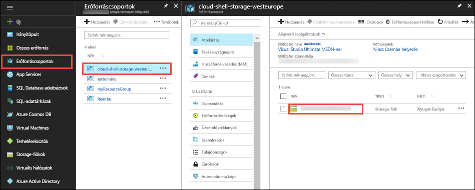
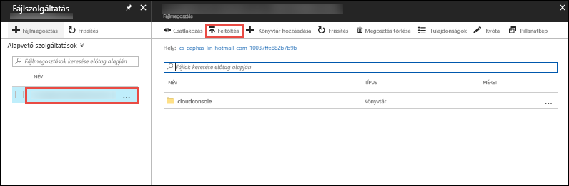

Az a [Azure-portálon](https://portal.azure.com), kattintson a **erőforráscsoportok** > **felhő-rendszerhéj-storage -\<your_region >**  >   **\<storage_account_name >**.



Az a **áttekintése** a storage-fiók esetén válassza a lap **fájlok**.

Válassza ki az automatikusan létrehozott fájlmegosztást, majd **feltöltése**. Ezt a fájlmegosztást csatlakoztatva van, a felhő rendszerhéj `clouddrive`.



Kattintson a fájl választó, és válassza ki a ZIP-fájlt, majd **feltöltése**. 

A felhő rendszerhéj használata `ls` ellenőrzése, hogy megjelenik a feltöltött ZIP-fájl az alapértelmezett `clouddrive` megosztani.

```azurecli-interactive
ls clouddrive
```
