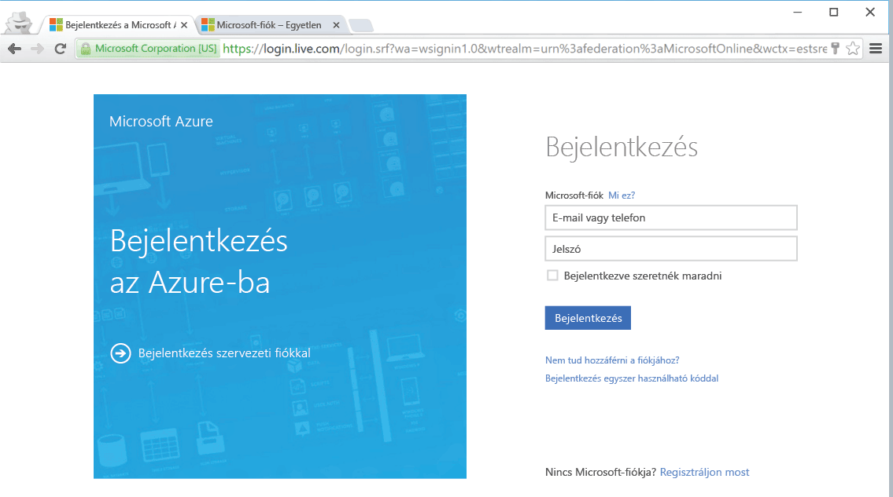

<!--
includes/azure-include-getting-started-v12portal-gettings-an-account.md

Latest Freshness check:  2016-04-11 , carlrab.

As of circa 2016-04-11, the following topics might include this include:
articles/sql-database/sql-database-get-started-tutorial.md

-->
## Csatlakozás a Microsoft Azure portálhoz előfizetéssel

A Microsoft Azure portálhoz történő csatlakozáshoz előfizetéssel kell rendelkeznie. 

### Új fiók létrehozása

Ha még nem rendelkezik Microsoft Azure-fiókkal, az alábbi hivatkozások egyikére kattintva hozhat létre egyet:

- [Ingyenes fiók](https://azure.microsoft.com/get-started/) létrehozása
- [MSDN-előfizetés](https://azure.microsoft.com/pricing/member-offers/msdn-benefits/) használata

###Bejelentkezés meglévő fiókkal

[Meglévő előfizetés]( https://account.windowsazure.com/Home/Index) használata esetén kövesse az alábbi lépéseket az Azure portál megnyitásához. 

1. Nyisson meg egy tetszőleges böngészőt, és csatlakozzon az [Azure portálhoz](https://portal.azure.com/).

1. Jelentkezzen be az [Azure portálra](https://portal.azure.com/).

1. A bejelentkezési oldal megjelenése után adja meg az előfizetése hitelesítő adatait.

   
   

<!--HONumber=Jun16_HO2-->

