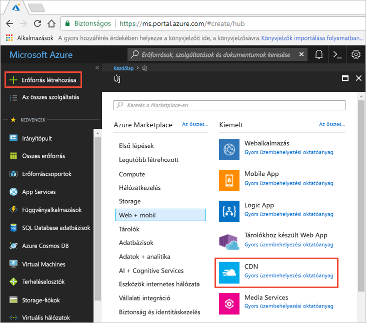
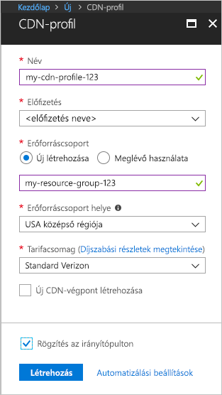

## Új CDN-profil létrehozása

A CDN-profil CDN-végpontok tárolója, és adja meg a tarifacsomagot.

1. Az Azure portálon a bal felső sarokban válassza **hozzon létre egy erőforrást**.
    
    A **új** ablaktáblán jelenik meg.
   
2. Válassza ki **Web + mobil**, majd **CDN**.
   
    

    A **CDN-profil** ablaktáblán jelenik meg.

    A kép a következő táblázatban megadott beállítások használatát.
   
    

    | Beállítás  | Érték |
    | -------- | ----- |
    | **Name (Név)** | Adja meg *my-cdn-profil – 123* a profil neve. Ez a név nem globálisan egyedi; Ha már van használatban, megadhat egy másik. |
    | **Előfizetés** | A legördülő listából válassza ki az Azure-előfizetésre.|
    | **Erőforráscsoport** | Válassza ki **hozzon létre új** , és írja be *saját – erőforrás-csoport – 123* a az erőforráscsoport neve. Ez a név nem globálisan egyedi; Ha már van használatban, megadhat egy másik. | 
    | **Erőforráscsoport helye** | Válassza ki **USA középső RÉGIÓJA** a legördülő listából. |
    | **Tarifacsomag** | Válassza ki **Standard Verizon** a legördülő listából. |
    | **Most hozzon létre egy új CDN-végpont** | Hagyja bejelölve. |  
   
3. Válassza ki **rögzítés az irányítópulton** a profil mentéséhez az irányítópulton való létrehozás után.
    
4. Válassza ki **létrehozása** a profil létrehozásához. 

