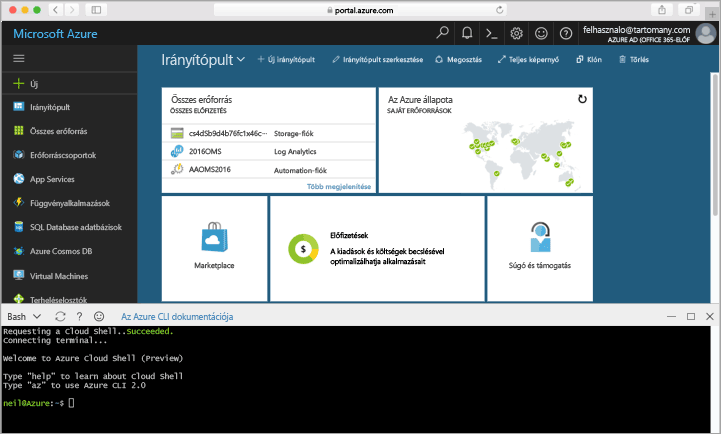

## Az Azure Cloud Shell indítása

Az Azure Cloud Shell olyan ingyenes Bash-felület, amelyet közvetlenül futtathat az Azure Portalon. A fiókjával való használat érdekében az Azure CLI már előre telepítve és konfigurálva van rajta. Az [Azure Portal](https://portal.azure.com) jobb felső sarkában található menüben kattintson a **Cloud Shell** gombra.

A gombra kattintva interaktív kezelőfelület jelenik meg, amelyet az ebben a témakörben található valamennyi lépés futtatására használhat:

