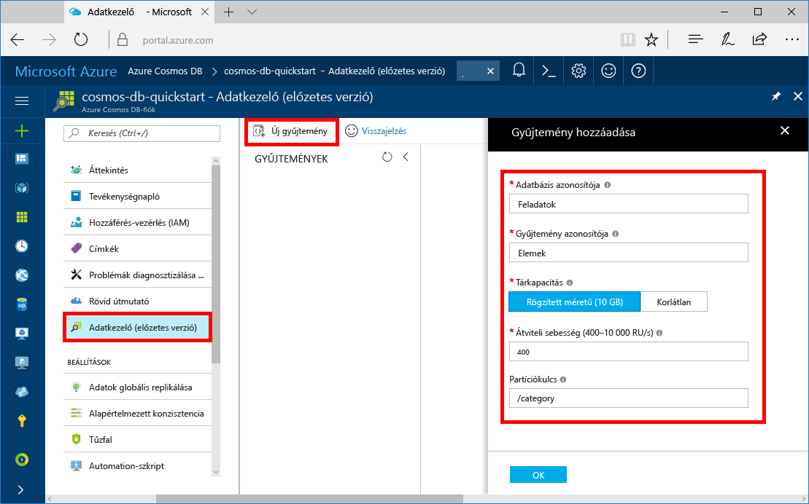

Az Azure Portal Adatkezelő eszközét mostantól adatbázis és gyűjtemény létrehozására is használhatja. 

1. Az Azure Portalon kattintson a bal oldali navigációs menü **Adatkezelő (előzetes verzió)** elemére. 

2. Az **Adatkezelő (előzetes verzió)** panelen kattintson az **Új gyűjtemény** elemre, majd töltse ki a lapot az alábbi információk alapján:

    

    Beállítás|Ajánlott érték|Leírás
    ---|---|---
    Adatbázis azonosítója|Feladatok|Az új adatbázis neve. Az adatbázis neve 1–255 karakter hosszúságú lehet, és nem tartalmazhat /, \\, #, ? karaktereket vagy záró szóközt.
    Gyűjtemény azonosítója|Elemek|Az új gyűjtemény neve. A gyűjtemények nevére ugyanazok a korlátozások vonatkoznak, mint az adatbázis-azonosítókra.
    Tárkapacitás| Rögzített méretű (10 GB)|Használja az alapértelmezett értéket. Ez az érték az adatbázis tárkapacitása.
    Teljesítmény|400 kérelemegység|Használja az alapértelmezett értéket. Később lehetősége lesz növelni az átviteli sebességet a késés csökkentése érdekében.
    kérelemegység/m|Ki|Ne módosítsa az alapértelmezett értéket.
    Partíciókulcs|/kategória|Az egyes partíciók között az adatokat egyenletesen elosztó partíciókulcs. A megfelelő partíciókulcs kiválasztása fontos a nagy teljesítményű gyűjtemények létrehozásához. Erről bővebben a [Particionálásra tervezés](../articles/cosmos-db/partition-data.md#designing-for-partitioning) részben olvashat.    
3. Miután végzett az űrlappal, kattintson az **OK** gombra.

Az Adatkezelő megjeleníti az új adatbázist és gyűjteményt. 