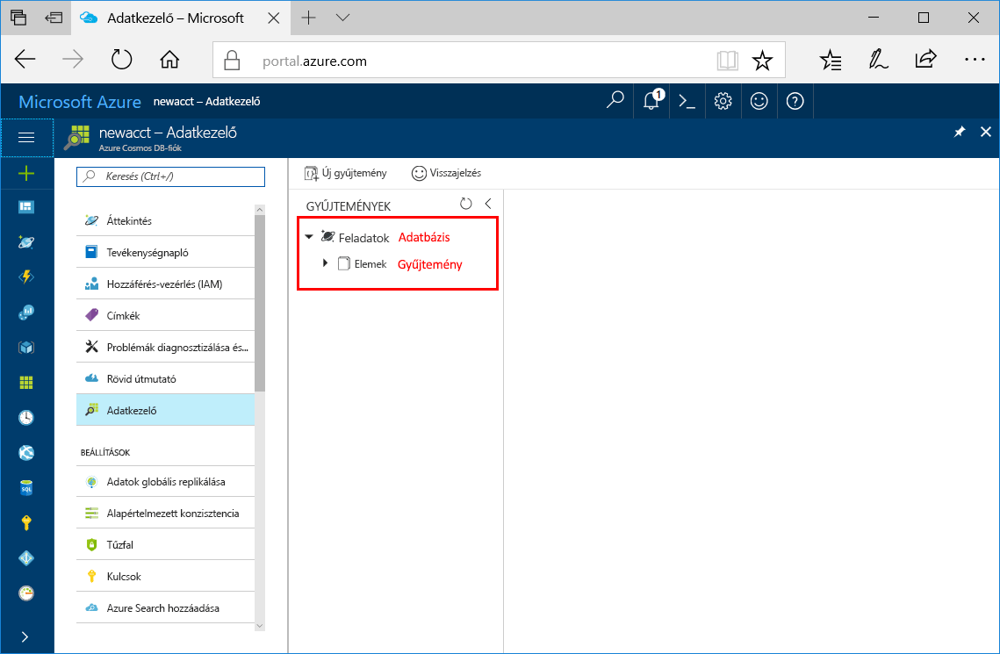

Az Azure Portal Adatkezelő eszközét mostantól adatbázis és gyűjtemény létrehozására is használhatja. 

1. Kattintson az **Adatkezelő** > **Új gyűjtemény** elemre. 
    
    A jobb szélen megjelenik a **Gyűjtemény hozzáadása** terület. Előfordulhat, hogy jobbra kell görgetnie, hogy lássa.

    

2. A **Gyűjtemény hozzáadása** oldalon adja meg az új gyűjtemény beállításait.

    Beállítás|Ajánlott érték|Leírás
    ---|---|---
    Adatbázis azonosítója|Feladatok|Az új adatbázisnak adja a *Feladatok* nevet. Az adatbázis neve 1–255 karakter hosszúságú lehet, és nem tartalmazhat /, \\, #, ? karaktereket vagy záró szóközt.
    Katalógus azonosítója|Elemek|Az új gyűjteménynek adja az *Elemek* nevet. A gyűjteményazonosítók nevére ugyanazok a karakterkorlátozások vonatkoznak, mint az adatbázisnevekre.
    Tárkapacitás| Rögzített méretű (10 GB)|Használja az alapértelmezett **Rögzített méretű (10 GB)** értéket. Ez az érték az adatbázis tárkapacitása.
    Teljesítmény|400 kérelemegység|Módosítsa a teljesítményt másodpercenként 400 kérelemegységre (RU/s). A tárolási kapacitást **Rögzített méretű (10 GB)** értékre kell állítania, hogy másodpercenként 400 kérelemegység (RU/s) értékű átviteli teljesítményt tudjon megadni. Később lehetősége lesz növelni az átviteli sebességet a késés csökkentése érdekében. 
    
    Az előző beállításokon túl azt is megteheti, hogy **egyedi kulcsokat** ad a gyűjteményhez. Ebben a példában az erre szolgáló mezőt hagyja üresen. Az egyedi kulcsok lehetőséget nyújtanak a fejlesztők számára, hogy adatintegritási réteget adjanak az adatbázishoz. Ha egy gyűjtemény létrehozása során egyedi kulcsszabályzatot állít fel, azzal gondoskodhat róla, hogy egy vagy több érték egyedi legyen egy partíciókulcson belül. További információt az [Azure Cosmos DB-ben egyedi kulcsaival](../articles/cosmos-db/unique-keys.md) kapcsolatos cikkben talál.
    
    Kattintson az **OK** gombra.

    Az Adatkezelő megjeleníti az új adatbázist és gyűjteményt.

    