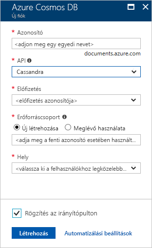

1. Egy új böngészőablakban jelentkezzen be az [Azure Portalra](https://portal.azure.com/).

2. A bal oldali menüben válassza **az Erőforrás létrehozása parancsot.**
   
   
   
3. Az **Új** lapon válassza az Adatbázisok Azure **Cosmos** > **DB**lehetőséget.
   
   
   
3. Az **Azure Cosmos DB-fiók létrehozása** lapon adja meg az új Azure Cosmos DB-fiók beállításait. 
 
    Beállítás|Érték|Leírás
    ---|---|---
    Előfizetés|Az Ön előfizetése|Válassza ki az Azure Cosmos DB-fiókhoz használni kívánt Azure-előfizetést. 
    Erőforráscsoport|Új létrehozása  Ezután adja meg ugyanazt a nevet, mint a fiókneve|Válassza az **Új létrehozása** lehetőséget. Ezután adjon meg egy új erőforráscsoport nevet a fiókjához. Az egyszerűség kedvéért használja ugyanazt a nevet, mint az Azure Cosmos-fiók neve. 
    Fiók neve|Adjon meg egy egyedi nevet|Adjon meg egy egyedi nevet az Azure Cosmos DB-fiók azonosításához. A fiók URI-cassandra.cosmos.azure.com *hozzá* fűzünk az egyedi fióknevéhez.  A fióknév csak kisbetűket, számokat és kötőjeleket (-) használhat, és 3 és 31 karakter közötti nek kell lennie.
    API|Cassandra|A létrehozni kívánt fiók típusát az API határozza meg. Az Azure Cosmos DB öt API-t biztosít: Core (SQL) a dokumentum-adatbázisok, Gremlin a gráf adatbázisok, MongoDB dokumentum adatbázisok, Azure Table és Cassandra. Minden API-hoz külön fiókot kell létrehoznia.   Válassza a **Cassandra**lehetőséget, mert ebben a rövid útmutatóban olyan táblát hoz létre, amely együttműködik a Cassandra API-val.   [További információ a Cassandra API-ról](../articles/cosmos-db/cassandra-introduction.md).|
    Hely|Válassza ki a felhasználóihoz legközelebb eső régiót|Válassza ki az Azure Cosmos DB-fiókot üzemeltetéséhez használni kívánt földrajzi helyet. Használja a felhasználókhoz legközelebb lévő helyet, hogy a lehető leggyorsabb hozzáférést biztosítsa az adatokhoz.

    Válassza **a Véleményezés+Létrehozás lehetőséget.** Kihagyhatja a **Hálózat** és **címkék szakaszt.** 

    

4. A fiók létrehozása eltarthat néhány percig. Várja meg, amíg a portál megjeleníti az oldalt mondván **Gratulálunk! Az Azure Cosmos DB-fiókja létrejött.**

