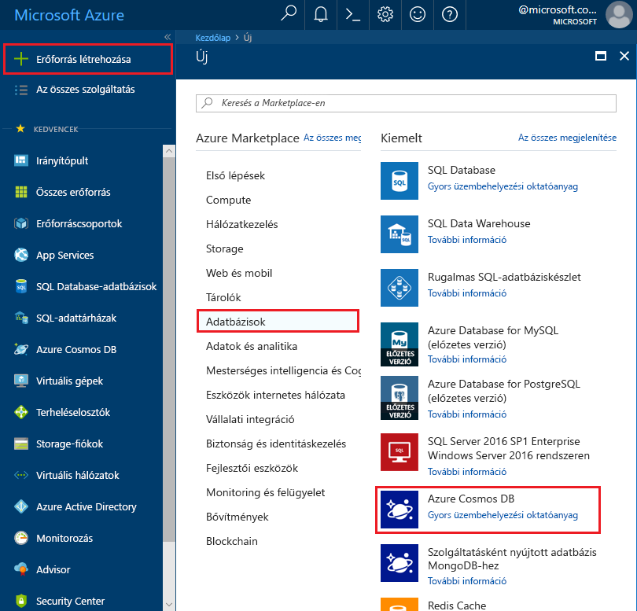
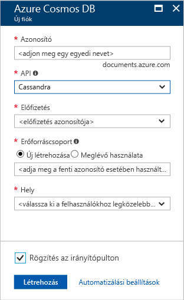
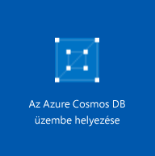

1. Egy új böngészőablakban jelentkezzen be az [Azure Portalra](https://portal.azure.com/).
2. Kattintson az **Erőforrás létrehozása** > **Adatbázisok** > **Azure Cosmos DB** lehetőségre.
   
   

3. Az **Új fiók** oldalon adja meg az új Azure Cosmos DB-fiók beállításait. 
 
    Beállítás|Ajánlott érték|Leírás
    ---|---|---
    ID (Azonosító)|*Adjon meg egy egyedi nevet*|Adjon meg egy egyedi nevet az Azure Cosmos DB-fiók azonosításához. A rendszer a *documents.azure.com* utótaggal egészíti ki a megadott azonosítót a kapcsolódási pont létrehozásához, ezért válasszon egyedi, de felismerhető azonosítót.  Az azonosító csak kisbetűket, számokat és a kötőjel (-) karaktert tartalmazhatja, valamint 3–50 karakter hosszúságúnak kell lennie.
    API|Cassandra|A létrehozni kívánt fiók típusát az API határozza meg. Az adott alkalmazás igényei szerint az Azure Cosmos DB a következő öt API-t biztosítja: SQL (dokumentum-adatbázis), Gremlin (gráfadatbázis), MongoDB (dokumentum-adatbázis), Azure-tábla, Cassandra. Jelenleg mindegyikhez külön fiókra van szükség.   Válassza a **Cassandra** lehetőséget, mivel ebben a rövid útmutatóban olyan széles oszlopú adatbázist fog létrehozni, amely CQL szintaxis használatával kérdezhető le.  Ha a Cassandra (széles oszlopú) lehetőség nem jelenik meg a listában, akkor [csatlakozási kérelmet kell küldenie](../articles/cosmos-db/cassandra-introduction.md#sign-up-now) a Cassandra API előzetes programjához.   [További információk a Cassandra API-ról](../articles/cosmos-db/cassandra-introduction.md)|
    Előfizetés|*Az Ön előfizetése*|Válassza ki az Azure Cosmos DB-fiókhoz használni kívánt Azure-előfizetést. 
    Erőforráscsoport|*Adja meg a fenti azonosító esetében használt egyedi nevet*|Adja meg a fiók új erőforráscsoport-nevét. Az egyszerűség kedvéért használhat az azonosítójával megegyező nevet. 
    Hely|*Válassza ki a felhasználóihoz legközelebb eső régiót*|Válassza ki azt a földrajzi helyet, ahol az Azure Cosmos DB-fiókot üzemeltetni fogja. Használja a felhasználókhoz legközelebb lévő helyet, hogy a lehető leggyorsabb hozzáférést biztosítsa az adatokhoz.
    Rögzítés az irányítópulton | Válassza ezt: | Jelölje be ezt a jelölőnégyzetet, így az új adatbázisfiók a könnyű hozzáférés érdekében megtalálható lesz a portál irányítópultján.

    Ezt követően kattintson a **Create** (Létrehozás) gombra.

    

4. A fiók létrehozása eltarthat néhány percig. A fiók létrehozása alatt a portál irányítópultján **Az Azure Cosmos DB üzembe helyezése** csempe látható.

    

    Ha a fiók létrehozása megtörtént, a **Gratulálunk! Azure Cosmos DB-fiókja létrejött** lap jelenik meg. 

