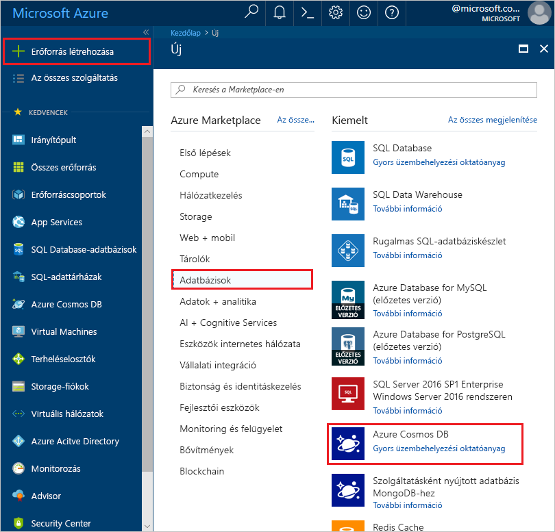
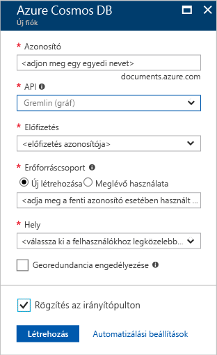
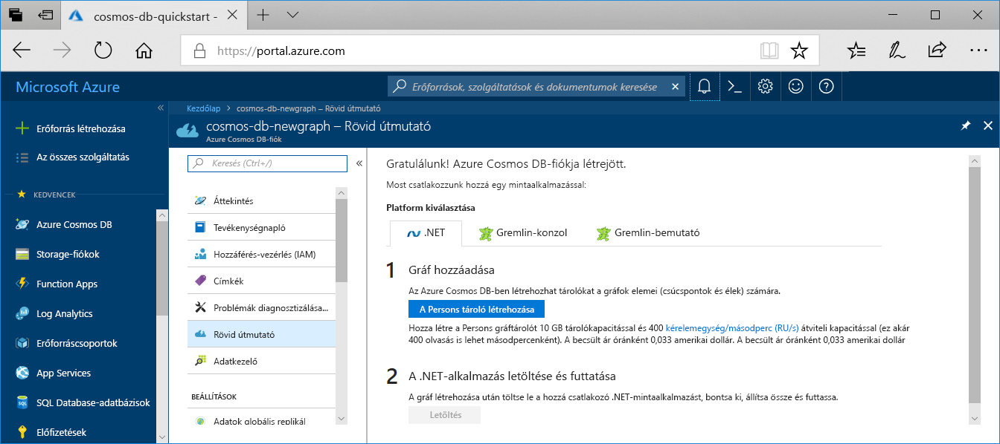

1. Egy új böngészőablakban jelentkezzen be az [Azure Portalra](https://portal.azure.com/).

2. Kattintson az **Erőforrás létrehozása** > **Adatbázisok** > **Azure Cosmos DB** lehetőségre.
   
   

3. Az a **létrehozása az Azure Cosmos DB-fiók** lap, adja meg az új Azure Cosmos DB-fiók beállításait. 

    Beállítás|Érték|Leírás
    ---|---|---
    Előfizetés|Az Ön előfizetése|Válassza ki az Azure Cosmos DB-fiókhoz használni kívánt Azure-előfizetést. 
    Erőforráscsoport|Új létrehozása  A használt egyedi nevet majd adja meg a azonosítója|Válassza az **Új létrehozása** lehetőséget. Majd adja meg a fiók új erőforráscsoport nevét. Az egyszerűség kedvéért használja ugyanazt a nevet, az azonosítóját. 
    Fiók neve|Adjon meg egy egyedi nevet|Adjon meg egy egyedi nevet az Azure Cosmos DB-fiók azonosításához. A rendszer a *documents.azure.com* utótaggal egészíti ki a megadott azonosítót az URI létrehozásához, ezért válasszon egyedi azonosítót.  Az azonosító csak kisbetűket, számokat és a kötőjel (-) karaktert használhat. 3. és 31 karakter hosszúságúnak kell lennie.
    API|Gremlin (gráf)|A létrehozni kívánt fiók típusát az API határozza meg. Az Azure Cosmos DB öt API-kat biztosít: A dokumentum-adatbázis Core(SQL) a Gremlin gráf típusú adatbázisokat, a MongoDB, a dokumentum-adatbázis, az Azure Table és a Cassandra. Jelenleg minden API egy külön fiókot kell létrehoznia.   Válassza ki **Gremlin (gráf)** mivel ebben a rövid útmutatóban egy táblát, amely együttműködik a Gremlin API-t hoz létre.   [További információ a Graph API](../articles/cosmos-db/graph-introduction.md).|
    Hely|Válassza ki a felhasználóihoz legközelebb eső régiót|Válassza ki az Azure Cosmos DB-fiókot üzemeltetéséhez használni kívánt földrajzi helyet. Használja a felhasználókhoz legközelebb lévő helyet, hogy a lehető leggyorsabb hozzáférést biztosítsa az adatokhoz.

    Válassza ki **felülvizsgálat + létrehozás**. Folytassa a **hálózati** és **címkék** szakaszban. 

    

4. A fiók létrehozása eltarthat néhány percig. Várja meg, hogy a portálon megjelenjen a **Gratulálunk! Azure Cosmos DB-fiókja létrejött** lap.

    